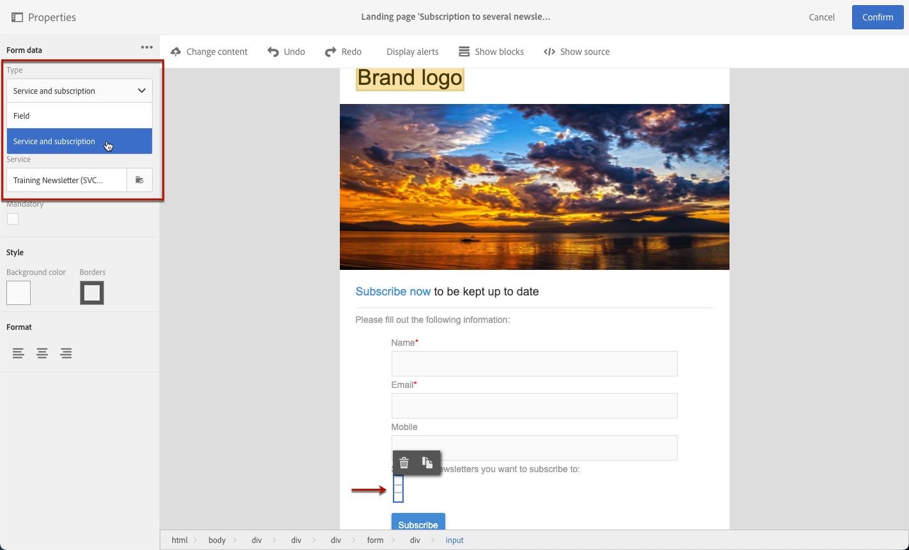

# ランディングページフォームデータの管理{#managing-landing-page-form-data}

ランディングページのコンテンツでは、入力フィールドを使用して、Campaign データベースからのデータを保存または更新します。

そのためには、これらのフィールドをデータベースフィールドにマッピングする必要があります。

左側のパレットの「**[!UICONTROL Form data]**」セクションを使用して、マッピングを定義および管理できます。

## フォームフィールドのマッピング {#mapping-form-fields}

必要に応じて Campaign データベースを更新するには、関連するデータベースフィールドをランディングページの入力ゾーン、ラジオボタン、チェックボックスタイプブロックにリンクします。

これを行うには、次の手順に従います。

1. ランディングページのコンテンツのブロックを選択します。

   >[!NOTE]
   >
   >組み込みランディングページのデフォルトのフィールドは事前に設定されています。必要に応じて変更できます。

1. 左側のパレットの「**[!UICONTROL Form data]**」セクションにアクセスします。

1. フィールドタイプを変更するには、「**[!UICONTROL HTML type of the field]**」ドロップダウンリストから値を選択します。

   

   >[!NOTE]
   >
   >ランディングページでのチェックボックスタイプの使用について詳しくは、[&#x200B; 複数のサービス購読の更新 &#x200B;](#multiple-subscriptions) および [&#x200B; 契約チェックボックス &#x200B;](#agreement-checkbox) の節を参照してください。

1. **[!UICONTROL Field]** ゾーンで現在選択されているデータベース フィールドと互換性のないフィールド タイプを選択すると、警告メッセージが表示されます。 最適なマッピングを行うには、適切な値を選択します。

   

1. **[!UICONTROL Field]** ゾーンを使用して、フォームフィールドにリンクするデータベースフィールドを選択します。

   

   >[!NOTE]
   >
   >ランディングページは、**[!UICONTROL Profiles]** または **[!UICONTROL Service]** リソースでのみマッピングできます。

   この例では、ランディングページの **名前** フィールドを **[!UICONTROL Profiles]** リソースの **[!UICONTROL Last name]** フィールドにマッピングします。

   

1. 必要に応じて、「**[!UICONTROL Mandatory]**」オプションを選択します。その場合、ランディングページは、ユーザーがこのフィールドに入力した場合にのみ送信できます。

   

   必須フィールドが未入力の場合、ユーザーがページを送信するとエラーメッセージが表示されます。

1. 「**[!UICONTROL Confirm]**」をクリックして変更を保存します。

<!--If you choose a mandatory **[!UICONTROL Checkbox]**, make sure that it is of **[!UICONTROL Field]** type.-->

## データの保存と紐付け{#data-storage-and-reconciliation}

データ紐付けパラメーターを使用すると、ランディングページに入力されたデータが送信された後の管理方法を定義できます。

手順は次のとおりです。

1. ランディングページダッシュボードの  アイコンを使用してアクセスするランディングページのプロパティを編集し、「**[!UICONTROL Job]**」パラメーターを表示します。

   

1. 「**[!UICONTROL Reconciliation key]**：このデータベースフィールドは、訪問者がAdobe Campaign データベースに既に存在するプロファイルを持っているかどうかを判断するために使用されます。 メール、名、姓などを指定できます。 紐付けキーを使用すると、以下で定義する **[!UICONTROL Update strategy]** パラメーターに従って、プロファイルを更新または作成できます。

1. **[!UICONTROL Form parameter mapping]** を定義：このセクションでは、ランディングページフィールドのパラメーターと、紐付けキーで使用するパラメーターをマップできます。

1. 紐付けキーで既存のデータベースプロファイルを復元する場合は、このプロファイルを、フォームに入力されたデータで更新するか、代わりにこの更新を防ぐかを選択できます。**[!UICONTROL Update strategy]**

   

## 複数のサービス購読 {#multiple-subscriptions}

1 つのランディングページで複数のチェックボックスを使用して、ユーザーが複数のサービスを購読または購読解除できるようにします。

これを行うには、次の手順に従います。

1. ランディングページをデザインする場合：

   * ブロックを選択し、「**[!UICONTROL Form data]**」セクションで、フィールドタイプとして「**[!UICONTROL Checkbox]**」を選択します。

     

   * HTMLに精通している場合は、「**[!UICONTROL Show source]**」ボタンを使用してチェックボックスを手動で挿入することもできます。

     

     これにより、ページ上の都合の良い場所にチェックボックスを挿入できます。

     

1. コンテンツ内でチェックボックスが選択されていることを確認します。 **[!UICONTROL Type]** ドロップダウンリストは、左側のパレットの「**[!UICONTROL Form data]**」セクションに表示されます。 リストから「**[!UICONTROL Service and subscription]**」を選択します。

   

1. **[!UICONTROL Behavior]** ドロップダウンリストからオプションを選択します。

   

1. 対応するリストから [&#x200B; サービス &#x200B;](../../audiences/using/creating-a-service.md) を選択します。

   

1. **[!UICONTROL Mandatory]** オプションがオフになっていることを確認します。 そうしないと、ユーザーに選択肢がなくなります。

   

1. 他のサービスに登録できるチェックボックスを追加するには、上記の手順を必要な回数だけ繰り返します。

   

ランディングページが公開されると、ユーザーは複数のチェックボックスを選択して、同じページから複数のニュースレターを購読できます。

## 契約チェックボックス {#agreement-checkbox}

ランディングページを送信する前に、プロファイルがチェックする必要があるチェックボックスを追加できます。

例えば、これにより、ユーザーがフォームを送信する前に、プライバシーポリシーに対する同意をリクエストしたり、ユーザーに利用条件に同意させることができます。

>[!IMPORTANT]
>
>ユーザーにとって、このチェックボックスの選択は必須です。 選択しない場合、ランディングページを送信できません。

このチェックボックスを挿入して設定するには、次の手順を実行します。

1. ランディングページをデザインする場合：

   * ブロックを選択し、「**[!UICONTROL Form data]**」セクションで、フィールドタイプとして「**[!UICONTROL Checkbox]**」を選択します。

     

   * HTMLに精通している場合は、「**[!UICONTROL Show source]**」ボタンを使用してチェックボックスを手動で挿入することもできます。

     

     <!--Manually insert a checkbox, such as in the example below:

      <!--Click **[!UICONTROL Hide source]**.-->

1. チェックボックスが選択されていることを確認します。

   

1. **[!UICONTROL Type]** ドロップダウンリストは、左側のパレットの「**[!UICONTROL Form data]**」セクションに表示されます。 リストから「**[!UICONTROL Agreement]**」を選択します。

   

   >[!NOTE]
   >
   >**[!UICONTROL Agreement]** 要素は、Campaign データベースのフィールドにマッピングされていません。

1. **[!UICONTROL Form data]** の横にある「」アイコンをクリックして、チェックボックスの詳細プロパティにアクセスします。

1. 必要に応じて、メッセージを編集できます。

   

   フォームの送信前にチェックボックスを選択しなかった場合、このテキストは警告として表示されます。

   >[!NOTE]
   >
   >このアクションは、デフォルトでは必須であり、変更できません。

1. 「**[!UICONTROL Confirm]**」をクリックします。

これで、ランディングページが表示されるたびに、フォームを送信する前にこのチェックボックスを選択する必要があります。 そうでない場合は警告が表示され、チェックボックスがアクティブ化されるまでユーザーはフォームを送信できません。