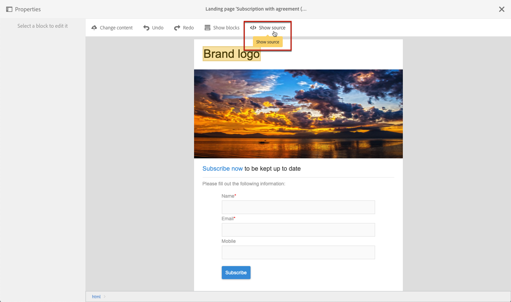

# ランディングページフォームデータの管理{#managing-landing-page-form-data}

## ランディングページフォームデータプロパティの変更{#changing-a-landing-page-form-data-properties}

データベースフィールドを入力ゾーン、ラジオボタンまたはチェックボックスタイプのブロックにリンクできます。これをおこなうには、ブロックを選択し、パレットの&#x200B;**[!UICONTROL Form data]**&#x200B;にアクセスします。

* **Field** 入力ゾーンを使用すると、フォームフィールドとリンクするためのデータベースフィールドを選択できます。
* 「**Mandatory**」オプションを使用すると、ユーザーがフィールドに入力した場合にのみページの送信を承認します。必須フィールドに入力されていない場合、エラーメッセージが表示されます。

## フォームフィールドのマッピング {#mapping-form-fields}

入力フィールドは、Campaign データベースにデータを格納または更新するために使用します。これをおこなうには、データベースフィールドを入力ゾーン、ラジオボタンまたはチェックボックスタイプのブロックにリンクする必要があります。手順は次のとおりです。

1. ランディングページでブロックを選択します。
1. パレットの **[!UICONTROL Form data]** 部分を完成させます。

   

1. データベースフィールドを選択し、**[!UICONTROL Field]** 選択ゾーンのフォームフィールドとリンクします。ランディングページとマッピングできるのは **Profiles** のみです。

1. 必要に応じて、「**[!UICONTROL Mandatory]**」オプションを選択します。ページは、ユーザーがこのフィールドに入力した場合にのみ送信できます。必須フィールドが未入力の場合、ユーザーがページを検証するとエラーメッセージが表示されます。

1. フィールドのタイプを定義するには、**[!UICONTROL HTML type of the field]** 選択領域で、「**[!UICONTROL Text]**」、「**[!UICONTROL Number]**」、「**[!UICONTROL Date]**」などを選択します。
必須の **[!UICONTROL Checkbox]** を選択する場合は、そのタイプが **[!UICONTROL Field]** であることを確認します。

>[!NOTE]
>
>組み込みランディングページのデフォルトのフィールドは事前に設定されています。必要に応じて変更できます。

## データのストレージと紐付け{#data-storage-and-reconciliation}

データ紐付けパラメーターを使用すると、ランディングページに入力されたデータが送信された後の管理方法を定義できます。

手順は次のとおりです。

1. ランディングページダッシュボードの  アイコンを使用してアクセスするランディングページのプロパティを編集し、「**[!UICONTROL Job]**」パラメーターを表示します。

   

1. **[!UICONTROL Reconciliation key]** を選択：これらのデータベースフィールド（例：E メール、名、姓）は、Adobe Campaign データベース内に訪問者のプロファイルが既に存在するかどうかを判断するために使用されます。これにより、定義した更新方法のパラメーターに従って、プロファイルを更新または作成できます。
1. **[!UICONTROL Form parameter mapping]** を定義：このセクションでは、ランディングページフィールドのパラメーターと、紐付けキーで使用するパラメーターをマップできます。
1. **[!UICONTROL Update strategy]** を選択：紐付けキーが既存のデータベースプロファイルを回復した場合、フォームに入力されたデータを使用してこのプロファイルを更新するか、この更新を実行しないかを選択できます。

## 契約チェックボックス{#agreement-checkbox}

ランディングページを送信する前にプロファイルが確認する必要があるチェックボックスを追加できます。

例えば、ユーザーがフォームを送信する前に、プライバシーポリシーに対する同意を要求したり、ユーザーが利用条件を承諾するように設定したりできます。

<!--This is particularly useful in the following case:

When a profile opens the landing page from an Outlook.com mailbox, Outlook checks whether the links on the landing page are suspicious. However, this Outlook security feature (called safelinks) has an unwanted effect: it automatically activates the buttons included on the landing page. Consequently, profiles are automatically subscribed or unsubscribed without confirmation when the landing page is displayed after clicking the email link, even if they do not submit the form.

To avoid this, Adobe recommends you always add to your landing page a checkbox which enables the profile to agree before proceeding with subscription or unsubscription.-->

>[!IMPORTANT]
>
>このチェックボックスの選択は、ユーザーに必須です。 選択しないと、ランディングページを送信できなくなります。

このチェックボックスを挿入して設定するには、次の操作を行います。

1. ランディングページのデザイン時に、「**[!UICONTROL Show source]**」をクリックします。

   

1. 次の例のように、チェックボックスを手動で挿入します。

   

   <!--
   
<input type="checkbox" class="nl-dce-todo" data-nl-bindto="agreement" data-nl-agreementmsg="You must agree with the terms and conditions before proceeding" />I agree with the terms and conditions

   -->

1. 「**[!UICONTROL Hide source]**」をクリックします。

1. 新しいチェックボックスが表示されます。 選択します。

   

1. 対応するドロップダウンリストがパレットの&#x200B;**[!UICONTROL Form data]**&#x200B;セクションに表示されます。 リストから&#x200B;**[!UICONTROL Agreement]**&#x200B;を選択します。

   

   >[!NOTE]
   >
   >**[!UICONTROL Agreement]**&#x200B;要素がCampaignデータベースのフィールドにマッピングされていません。

1. **[!UICONTROL Form data]**&#x200B;の横にあるアイコンをクリックして、チェックボックスの詳細設定プロパティにアクセスします。

1. 必要に応じて、メッセージを編集できます。

   

   このテキストは、ユーザーがフォームを送信する前にチェックボックスを選択していない場合に、警告として表示されます。

   >[!NOTE]
   >
   >このアクションはデフォルトで必須で、変更できません。

1. 「**[!UICONTROL Confirm]**」をクリックします。

これで、ランディングページが表示されるたびに、フォームを送信する前に、このチェックボックスをオンにする必要があります。 そうでない場合、警告が表示され、チェックボックスが有効になるまでフォームを送信できません。