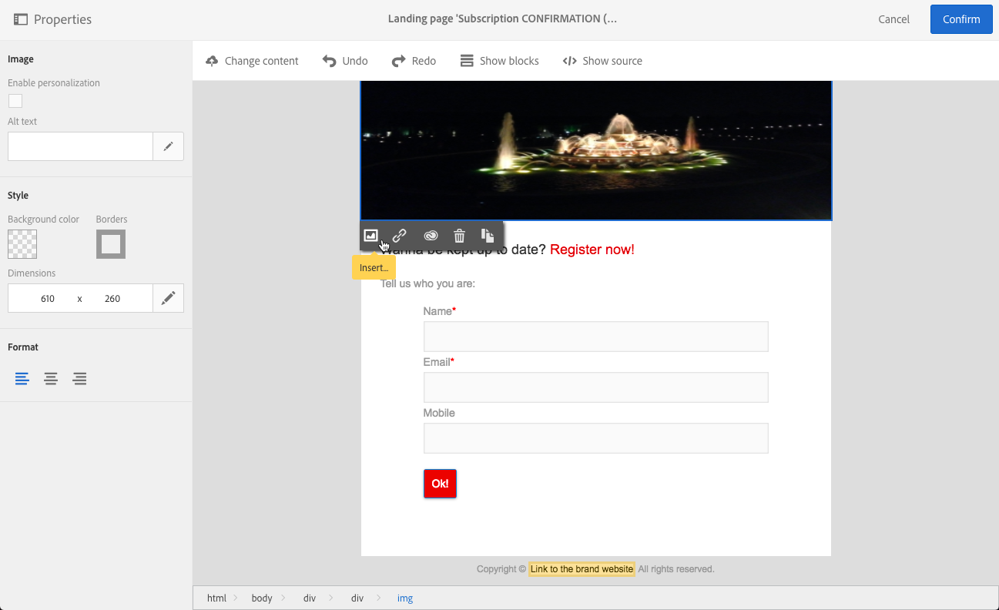

# ランディングページの構造とスタイルを管理する{#managing-landing-page-structure-and-style}

## コンテンツエディタでブロックを管理する {#managing-blocks-in-the-content-editor}

異なるHTMLコンテンツ要素は、&lt;div&gt; **&lt;/div&gt;タグに対応するブロックとしてランディング·ページに表示され****** ます。

ブロックを選択して、そのブロックと対話します。 その後、青い箱に囲まれます。

ブロックを選択すると、対応するHTML要素の親オブジェクトが、編集ゾーンの下部にあるブレッドクラムに表示されます。

ブレッドクラム要素の1つにマウスを置くと、関連する要素がハイライト表示されます。 したがって、異なるブロック間を簡単に移動し、修正するHTML要素を正確に選択できます。

パレットとコンテキストツールバーのオプションを使用して、ブロックを修正、削除、または複製します。

文字を含むブロックの場合は、ブロック内を再度クリックして、文字編集モードを有効にします。 ブロックの周りのフレームが緑に変わります。 次に、テキストを選択または入力します。 パレットとコンテキストツールバーのオプションを使用して、リンクを追加したり、文字の書式を変更したりします。

ブロック内の要素に対して定義されたパラメータ（リンク、個人用設定フィールド、コンテンツブロックなど）は、パレットからいつでも修正できます。

## コンテンツエディタでの枠線と背景の追加 {#adding-a-border-and-a-background-in-the-content-editor}

また、グラフから色を選 **択して** 、背景色を定義することもできます。 この色は、選択したブロックに適用されます。

選択したブロックに **境界を追加** できます。

## コンテンツエディタで文字スタイルを変更する {#changing-the-text-style-in-the-content-editor}

文字のスタイルを変更するには、文字ブロック内をクリックする必要があります。

文字の配置を変更するには、左側のパレットで次の3つのアイコンのいずれかを選択します。

* **左揃え**:選択したブロックの左に文字を揃えます(style="text-align:左；")
* **中心**:選択したブロックの文字を中央に揃えます(style="text-align:中心；")
* **右揃え**:選択したブロックの右に文字を揃えます(style="text-align:右；」)。

ツールバーを使用して、フォント属性を変更することもできます。フォントサイズを調整し、テキストを太字または斜体にし、下線を引くか、テキストの色を変更します。 本項を参 [照](../../channels/using/landing-page-content-editor-interface.md#landing-page-editor-toolbar)。

## ランディング·ページへのイメージの挿入 {#inserting-images-in-a-landing-page}

1. ランディングページのコンテンツで、イメージを含むブロックを選択します。
1. ボタンを選択 **[!UICONTROL Insert]** します。

   

1. コンテキスト **[!UICONTROL Local image]** ツールバーからを選択します。

   

1. ファイルを選択します。

   

1. 必要に応じて、イメージのプロパティを調整します。

   
