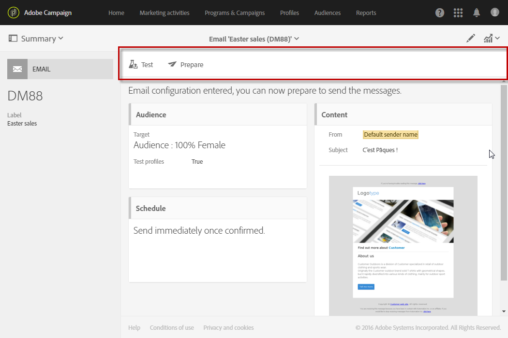
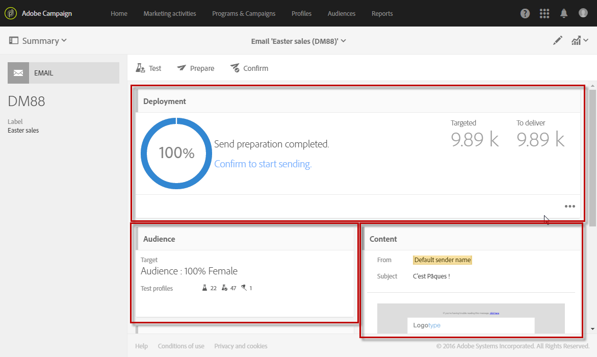
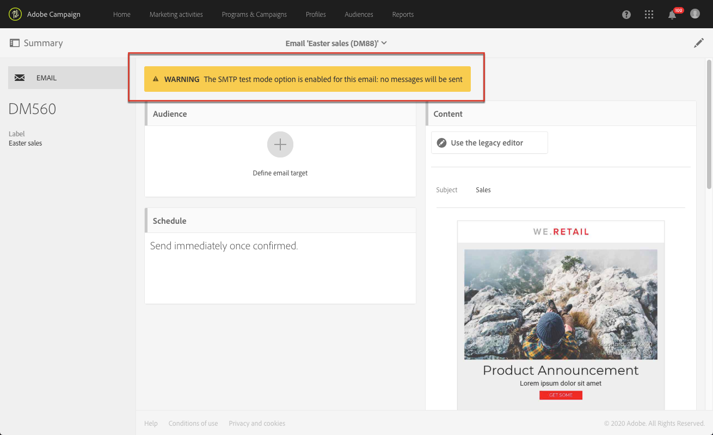

# メッセージダッシュボード{#message-dashboard}

メッセージダッシュボードは、様々なアイコンと様々な機能ブロックで構成されるワークスペースで、メッセージのパラメーターを設定して送信できます。 これらの要素は以下に示す。

## グレーバー {#gray-bar}

グレーのバーには、メッセージにリンクされたさまざまなアイコンがグループ化されます。

* **[!UICONTROL Summary]**: メッセージに関する主な情報を表示/非表示にします。
* **[!UICONTROL Edit properties]**: メッセージの[詳細パラメーター](../../administration/using/configuring-email-channel.md#list-of-email-properties)を編集できます。
* **[!UICONTROL Reports]**: メッセージに関連するレポートにアクセスできます。

**関連トピック：**

* [チャネルの設定](../../administration/using/about-channel-configuration.md)
* [レポートへのアクセス](../../reporting/using/about-dynamic-reports.md)

## アクションバー {#action-bar}

アクションバーには、メッセージを操作するための様々なアイコンが用意されています。

設定されたパラメーターと実行された進行状況によっては、特定のアイコンが使用できない場合があります。

* **[!UICONTROL Show proofs]**：送信されたプルーフのリストが存在する場合、そのリストを表示または非表示にします。 このボタンは、プルーフを送信した場合にのみ有効になります。

  プルーフについて詳しくは、[ プルーフの送信](../../sending/using/sending-proofs.md)を参照してください。

* **[!UICONTROL Send a test]**：使用する承認モードを選択できます：**[!UICONTROL Email rendering]** （電子メールのみ）、**[!UICONTROL Proof]**、またはその両方。 テストプロファイルについて詳しくは、[ プルーフの送信](../../sending/using/sending-proofs.md)を参照してください。 このボタンは、テストプロファイルを作成した場合にのみ有効になります。

* **[!UICONTROL Prepare send]**：送信の準備を開始します。 **[!UICONTROL Deployment]** ブロックが表示され、準備結果が表示されます。 このボタンは、ターゲットが入力された後にのみ表示されます。 対応するボタンを使用して、いつでも準備を停止できます。 メッセージの準備について詳しくは、[送信の準備](../../sending/using/preparing-the-send.md)を参照してください。

* **[!UICONTROL Confirm send]**: メッセージの送信を確認します。 送信統計情報が&#x200B;**[!UICONTROL Deployment]** ブロックに表示されます。 このボタンは、送信の準備が完了した後にのみ表示されます。 **送信を停止** ボタンと&#x200B;**[!UICONTROL Pause]** ボタンを使用して、いつでも送信を停止または一時停止できます。 送信の確認について詳しくは、[ メッセージの送信](../../sending/using/confirming-the-send.md)を参照してください。

## ブロック {#blocks}

メイン画面は、さまざまなブロックで構成されています。 ブロック内をクリックして、対応するパラメーター画面にアクセスします。

* **[!UICONTROL Deployment]**: メッセージの準備または送信の進行状況を追跡できます。 このブロックの右下にあるボタンをクリックして、送信と分析のログにアクセスします。 このブロックは、送信が準備された後にのみ表示されます。 関連トピックス。 [送信確認](../../sending/using/confirming-the-send.md)を参照してください。
* **[!UICONTROL Audience]**: メッセージのメイン ターゲットとテスト プロファイルを確立できます。 [オーディエンスの作成](../../audiences/using/creating-audiences.md)を参照してください。
* **[!UICONTROL Schedule]**: メッセージを送信する日付を指定できます。 [ スケジュール ](../../sending/using/about-scheduling-messages.md)を参照してください。
* **[!UICONTROL Content]**: メッセージの内容を定義してプレビューできます。 メッセージを送信するための主な手順[を参照](../../channels/using/key-steps-to-send-a-message.md)。

## 警告 {#warnings}

メッセージ ダッシュボードの上に黄色いバナーで警告が表示される場合があります。

以下は、表示できるメッセージのリストです。

* *「この電子メールに対してSMTP テストモードオプションが有効になっています。メッセージは送信されません。」*

  詳しくは、[この節](../../administration/using/configuring-email-channel.md#smtp-test-mode)を参照してください。

* *「外部アカウントのルーティングは無効になっています。」*

  詳しくは、[外部アカウント ](../../administration/using/external-accounts.md)を参照してください。

* *「現在のIP アフィニティが送信プロセスで処理されていないため、メッセージを送信できません。」*

  このメッセージが表示された場合、IP アフィニティ定義レベルまたは送信プロセス レベルで問題が発生します。 Adobe管理者にお問い合わせください。

* *&quot;これは標準のトランザクションメッセージテンプレートです。 変更する場合は、複製してコピーに取り組む必要があります。&quot;*

  これらのすぐに使えるトランザクションメッセージテンプレートの中には、組み込みのランディングページテンプレートもあります。 詳しくは、[この節](../../channels/using/landing-page-templates.md)を参照してください。

* *&quot;このメッセージは技術的なトランザクションメッセージテンプレートです。 変更または公開できません。&quot;*

  この警告は、編集不可の空のトランザクションメッセージテンプレートに表示されます。 トランザクションメッセージについて詳しくは、[この節](../../channels/using/getting-started-with-transactional-msg.md)を参照してください。
