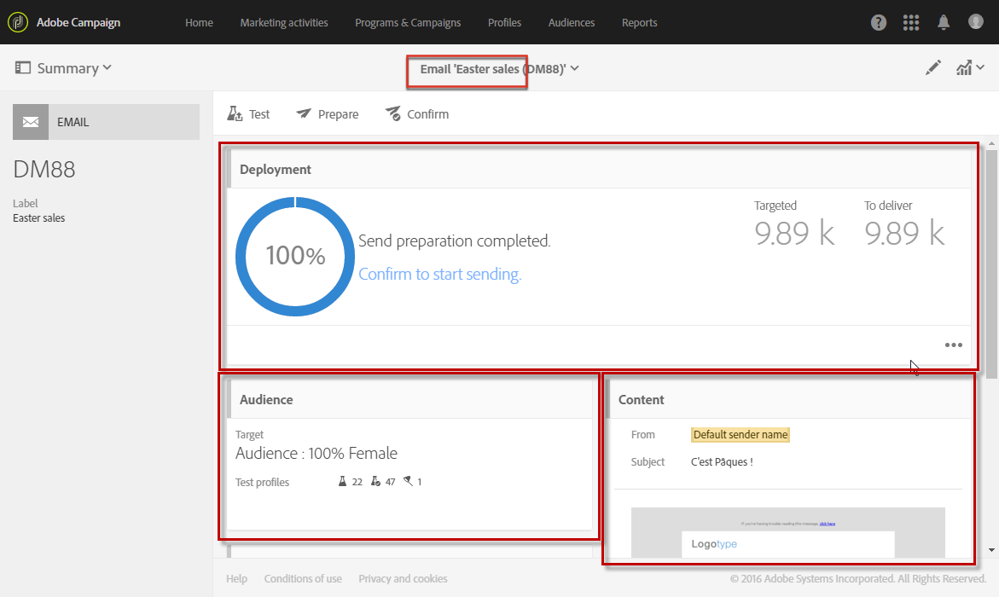

# Message dashboard{#message-dashboard}

メッセージダッシュボードは、異なるアイコンで構成されているワークスペースであり、アクションバーに再グループ化して、メッセージのパラメータを確立して送信するための様々な機能ブロックを使用できます。これらの要素は、以降に表示されます。

## Gray bar {#gray-bar}

灰色のバーは、メッセージにリンクされている様々なアイコンを再グループ化します。

* **[!UICONTROL Summary]**:メッセージに関するメイン情報を表示/非表示にします。
* **[!UICONTROL Edit properties]**:メッセージの高度なパラメーターを編集できます。
* **[!UICONTROL Reports]**:を使用して、メッセージに関連するレポートにアクセスできます。

**関連トピック:**

* [チャネルの設定](../../administration/using/about-channel-configuration.md)
* [レポートへのアクセス](../../reporting/using/about-dynamic-reports.md)

## Action bar {#action-bar}

アクションバーには、メッセージを操作できるアイコンがあります。

設定されているパラメータに応じて、特定のアイコンが使用できない場合があります。

* **[!UICONTROL Show proofs]**:送信済みの配達証明書の表示/非表示を切り替えます。このボタンは、配達確認を送信した後にのみ有効になります。

   For more on proofs, see [Managing test profiles and sending proofs](../../sending/using/managing-test-profiles-and-sending-proofs.md).

* **[!UICONTROL Send a test]**:を使用すると、使用する承認モードを選択できます。 **[!UICONTROL Email rendering]**&#x200B;または **[!UICONTROL Proof]** その両方を電子メール用に送信します。For more on test profiles, see [Sending proofs](../../sending/using/managing-test-profiles-and-sending-proofs.md#sending-proofs).

   このボタンは、テストプロファイルを確立した後にのみ有効になります。

   >[!NOTE]
   >
   >For an SMS message, there is no other choice: it is automatically a **[!UICONTROL Proof]**.

* **[!UICONTROL Prepare send]**:を起動して送信を準備します。**[!UICONTROL Deployment]** ブロックが表示され、準備の結果が表示されます。このボタンは、ターゲットが入力された後にのみ表示されます。対応するボタンを使用していつでも準備を停止できます。

   For more on message preparation, [Preparing the send](../../sending/using/preparing-the-send.md).

* **[!UICONTROL Confirm send]**:メッセージの送信を確認します。The sending statistics appear in the **[!UICONTROL Deployment]** block. このボタンは、送信が準備された後にのみ表示されます。You can stop or pause the send at any time using the **Stop send** and **[!UICONTROL Pause]** buttons.

   For more on confirming sending, see [Sending messages](../../sending/using/confirming-the-send.md).

## Blocks {#blocks}

メイン画面は、異なるブロックで構成されています。ブロック内をクリックして、対応するパラメーター画面にアクセスします。

* **[!UICONTROL Deployment]**:では、メッセージの準備または送信の進行状況を追跡できます。このブロックの右下にあるボタンをクリックして、送信ログと分析ログにアクセスします。このブロックは、送信が準備された後にのみ表示されます。詳しくは、を参照してください。See [Confirming send](../../sending/using/confirming-the-send.md).
* **[!UICONTROL Audience]**:では、メッセージのメインターゲットとテストプロファイルを確立できます。See [Creating audiences](../../audiences/using/creating-audiences.md).
* **[!UICONTROL Schedule]**:では、メッセージの送信日を指定できます。[「スケジュール](../../sending/using/about-scheduling-messages.md)」を参照してください。
* **[!UICONTROL Content]**:を使用すると、メッセージのコンテンツを定義してプレビューできます。See [Defining content](../../designing/using/designing-content-in-adobe-campaign.md).

