# プッシュ通知の準備と送信{#preparing-and-sending-a-push-notification}

## 通知の準備 {#preparing-the-notification}

Adobe Campaignでプッシュ通知を作成する手順は次のとおりです。

1. **[!UICONTROL Marketing activities]** ウィンドウから、[新しいマーケティング アクティビティを作成](../../start/using/marketing-activities.md#creating-a-marketing-activity)。

   1回のプッシュ通知は、[campaign](../../start/using/marketing-activities.md#creating-a-marketing-activity)またはAdobe Campaign [ ホームページ ](../../start/using/interface-description.md#home-page)から作成することもできます。

   ワークフローでプッシュ通知配信アクティビティを使用することもできます。 このアクティビティは、[ プッシュ通知配信](../../automating/using/push-notification-delivery.md) セクションに表示されます。

1. 「**[!UICONTROL Push notification]**」を選択します。
1. テンプレートを選択します。

   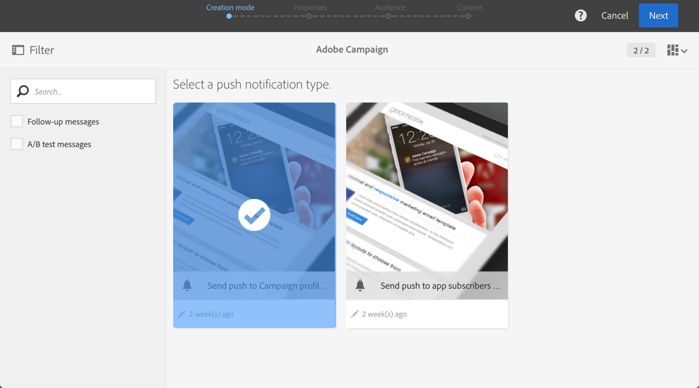

   デフォルトでは、次の2つのテンプレートのいずれかを選択できます。

   * **[!UICONTROL Send push to Campaign profiles]**：このテンプレートを使用して、モバイルアプリケーションを購読し、プッシュ通知の受信をオプトインしているAdobe Campaign CRM プロファイルをターゲットにします。 受信者の名前など、[ パーソナライゼーション ](../../designing/using/personalization.md#inserting-a-personalization-field)のフィールドをプッシュ通知に挿入できます。
   * **[!UICONTROL Send push to app subscribers]**：このテンプレートを使用して、アプリケーションからの通知の受信をオプトインしたすべての既知および匿名のモバイルアプリケーションユーザーにプッシュ通知を送信します。 モバイルアプリケーションから収集したデータを使用して、これらのメッセージをパーソナライズできます。

   多言語テンプレートを選択することもできます。 詳しくは、[多言語プッシュ通知の作成](../../channels/using/creating-a-multilingual-push-notification.md)を参照してください。

   テンプレートについて詳しくは、「[ テンプレートの管理](../../start/using/marketing-activity-templates.md)」の節を参照してください。

1. プッシュ通知のプロパティを入力し、**[!UICONTROL Associate a Mobile App to a delivery]** フィールドでモバイルアプリを選択します。

   ドロップダウンには、SDK V4とExperience Platform SDKの両方のアプリケーションが表示されます。

   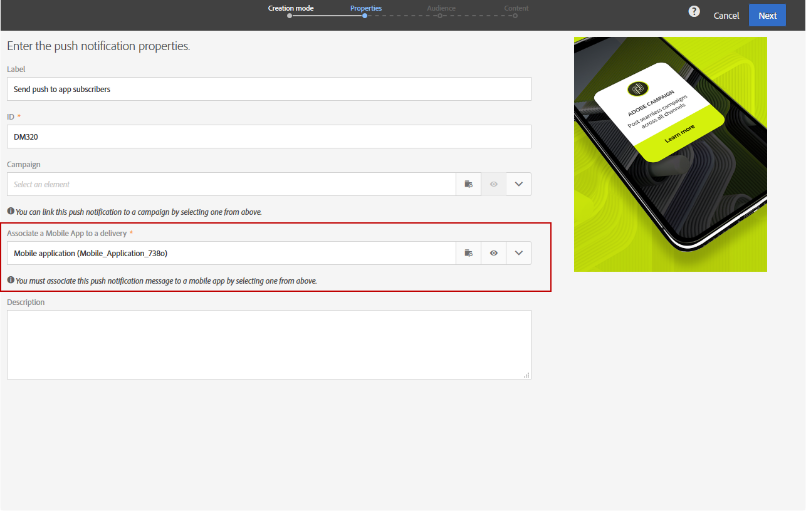

   プッシュ通知をキャンペーンにリンクできます。 これを行うには、作成済みのキャンペーンから選択します。

1. 次の画面では、オーディエンスを指定できます。例えば、特定のモバイルアプリケーションを購読しているすべてのVIPのお客様を指定できます。 詳しくは、「[ オーディエンスの作成](../../audiences/using/creating-audiences.md)」を参照してください。

   前の手順で選択したモバイルアプリケーションに基づいて、オーディエンスが自動的にフィルタリングされます。

   

1. プッシュ通知をカスタマイズできるようになりました。 まず、メッセージスタイルを選択します：**[!UICONTROL Alert/Message/Badge]**&#x200B;または&#x200B;**[!UICONTROL Silent push]**。 プッシュ通知の種類については、[ プッシュ通知について](../../channels/using/about-push-notifications.md) セクションで説明します。

   プッシュ通知のコンテンツを編集し、詳細オプションを定義します。 [ プッシュ通知のカスタマイズ ](../../channels/using/customizing-a-push-notification.md)を参照してください。

   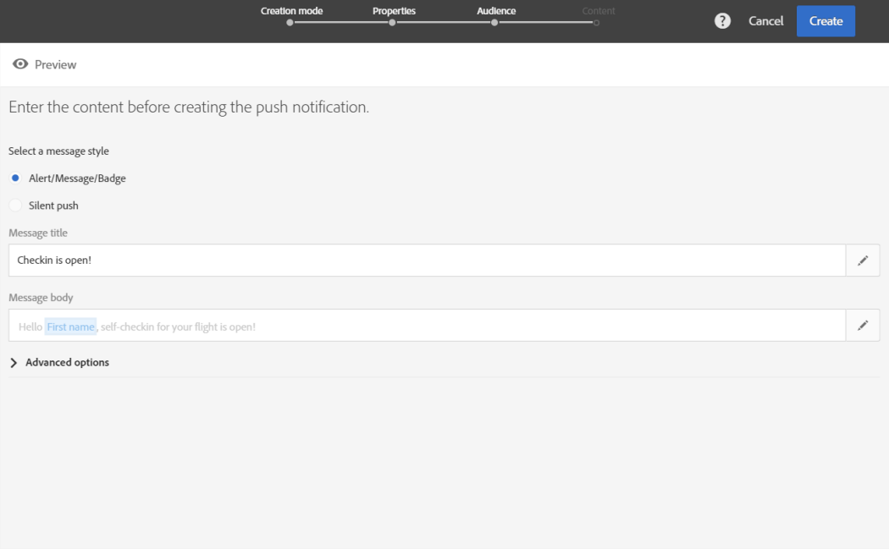

   ここで設定したプッシュ通知のコンテンツとオプションは、ペイロードの形式でモバイルアプリに渡されます。 ペイロードの詳細な構造については、[Campaign Standard プッシュ通知ペイロード構造の概要](../../administration/using/push-payload.md)のテクニカルノートを参照してください。

1. 「**[!UICONTROL Create]**」をクリックします。

   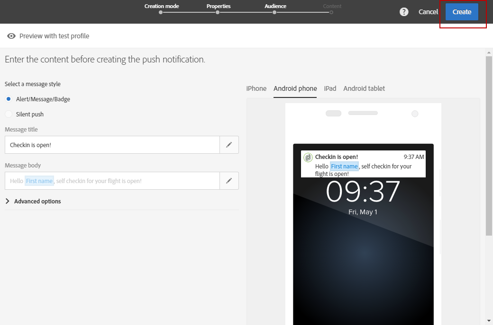

1. 通知を送信する前に、テストプロファイルでテストし、配信を送信する前に受信者に表示される内容を正確に確認できます。 配信の概要から「**[!UICONTROL Audiences]**」を選択し、「**[!UICONTROL Test profiles]**」タブをクリックします。

   テストの送信について詳しくは、[ テストプロファイル ](../../sending/using/sending-proofs.md)を参照してください。

1. テストプロファイルを選択し、**[!UICONTROL Preview]**&#x200B;をクリックして通知を表示します。コンテンツはテストプロファイルデータでパーソナライズされます。
1. 様々なデバイスでプッシュ通知のレイアウトを確認する：iPhone、Android phone、iPadまたはAndroid タブレットを選択してレンダリングをプレビューします。

   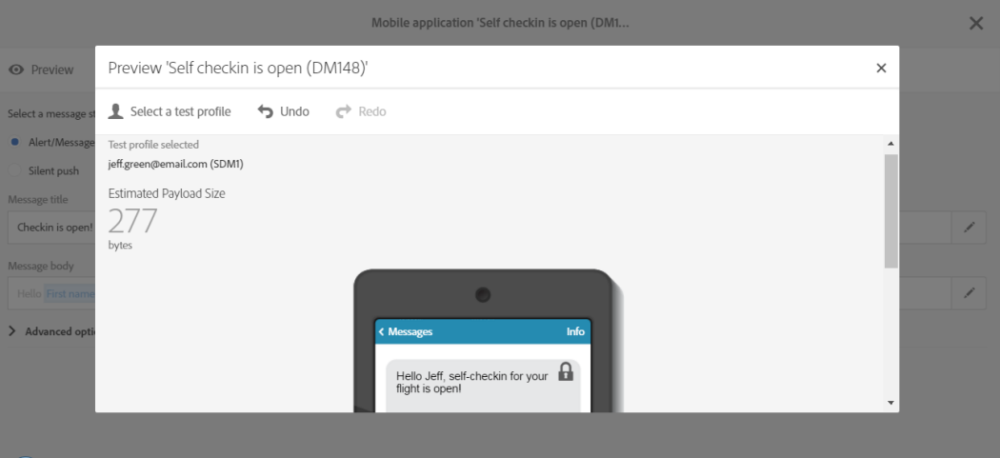

1. **[!UICONTROL Estimated Payload Size]**&#x200B;は、テストプロファイルデータに基づく推定値です。 実際のペイロードのサイズは異なる場合があります。 メッセージの上限は4 KBです。

   >[!CAUTION]
   >
   >ペイロードサイズが4 KBの制限を超えると、メッセージは配信されません。

パーソナライゼーションデータは、メッセージのサイズに影響します。

## 通知の送信 {#sending-the-notification}

プッシュ通知は、オーディエンス条件を定義することで、Adobe Campaignで選択したオーディエンスに送信できます。 次の例では、選択したオーディエンスは4人のターゲットモバイルアプリ加入者で構成されています。

1. 「**[!UICONTROL Prepare]**」をクリックしてターゲットを計算し、通知を生成します。

   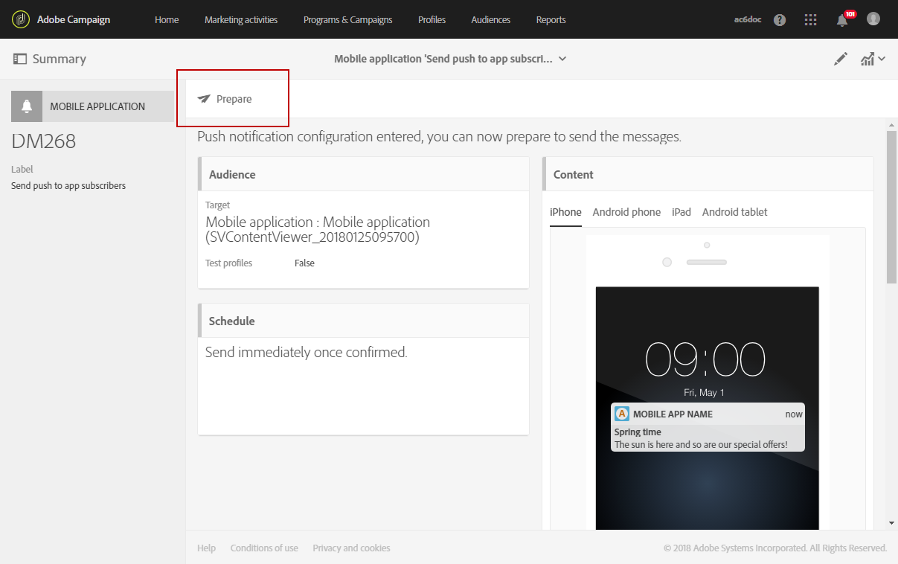

1. 準備が正常に完了すると、**[!UICONTROL Deployment]** ウィンドウに次のKPIが表示されます：**[!UICONTROL Target]**&#x200B;と&#x200B;**[!UICONTROL To deliver]**。 **[!UICONTROL Deployment]** ウィンドウの下部にある「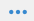」ボタンをクリックして表示できる除外事項のため、**[!UICONTROL To deliver]**&#x200B;数が&#x200B;**[!UICONTROL Targeted]**&#x200B;数よりも少ないことに注意してください。

   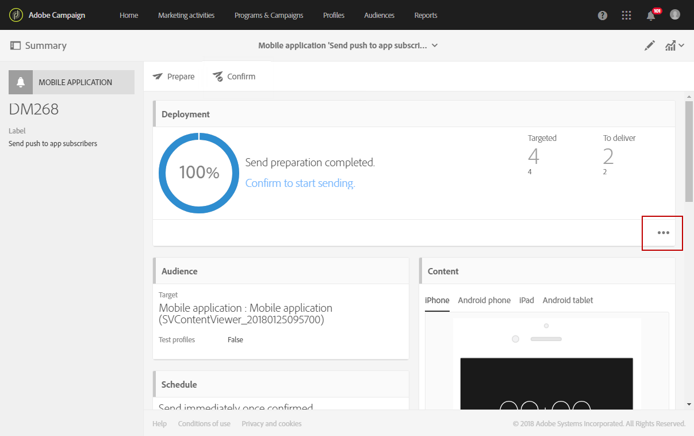

1. 「**[!UICONTROL Exclusion logs]**」タブには、送信されたターゲットから除外されたすべてのメッセージのリストと、この除外の背後にある理由が表示されます。

   ここでは、プロファイルが重複していたため、メールアドレスがoCブロックリストにあったため、モバイルアプリのサブスクライバーの1人が除外されたことがわかります。

   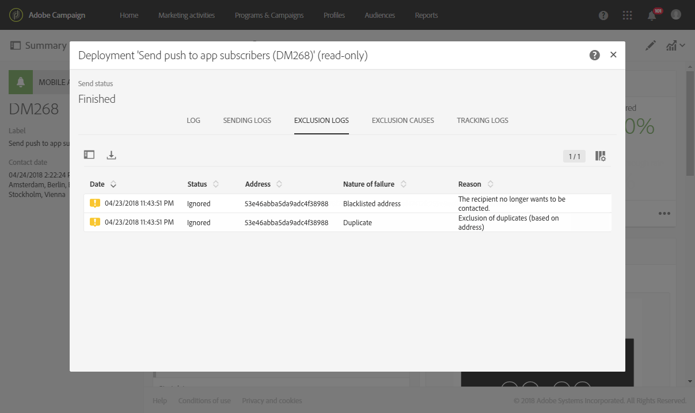

1. 「**[!UICONTROL Exclusion causes]**」タブをクリックして、除外されたメッセージの量を表示します。

   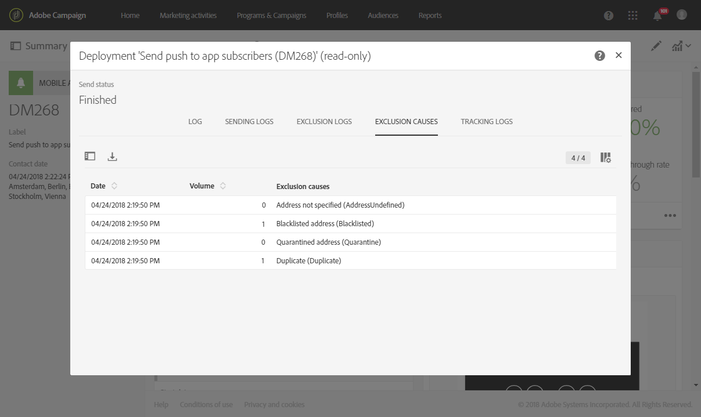

1. **[!UICONTROL Confirm]**&#x200B;をクリックして、プッシュ通知の送信を開始できるようになりました。
1. 配信のステータスは、メッセージダッシュボードとログで確認できます。 詳しくは、[ メッセージの送信](../../sending/using/confirming-the-send.md)および[配信ログ ](../../sending/using/monitoring-a-delivery.md#delivery-logs)を参照してください。

   この例では、メッセージダッシュボードに、Adobe Campaignが2つのプッシュ通知を送信しようとしたことを表示します。1つはデバイスに正常に配信され、もう1つは失敗しました。 配信にエラーがある理由を確認するには、**[!UICONTROL Deployment]** ウィンドウの下部にある ボタンをクリックします。

   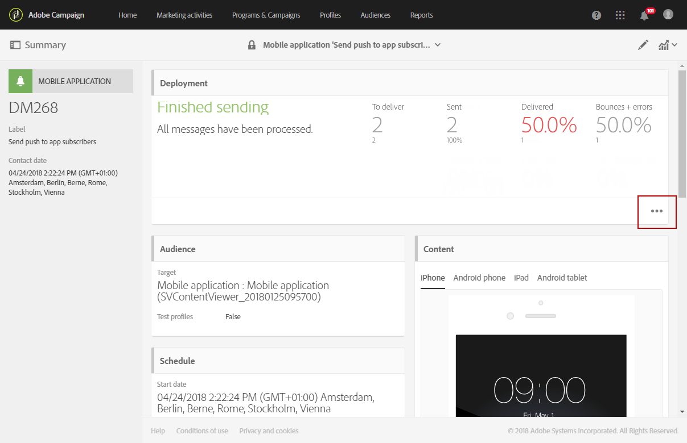

1. **[!UICONTROL Deployment]** ウィンドウで「**[!UICONTROL Sending logs]**」タブをクリックして、送信されたプッシュ通知のリストとそのステータスにアクセスします。 この配信では、1つのプッシュ通知が正常に送信されましたが、もう1つは不正なデバイストークンが原因で失敗しました。 その後、この購読者は、追加の配信からメールブロックリストに追加されます。

   >[!NOTE]
   >
   >Adobe Campaignのダウンストリームでエラーが発生する場合があります。 apnsやfcmなどのプロバイダーから障害が発生した場合、その理由も反映されます。 プロバイダーのエラーについて詳しくは、[Apple](https://developer.apple.com/library/content/documentation/NetworkingInternet/Conceptual/RemoteNotificationsPG/CommunicatingwithAPNs.html)および[Android](https://firebase.google.com/docs/cloud-messaging/http-server-ref?hl=ja)のドキュメントを参照してください。

   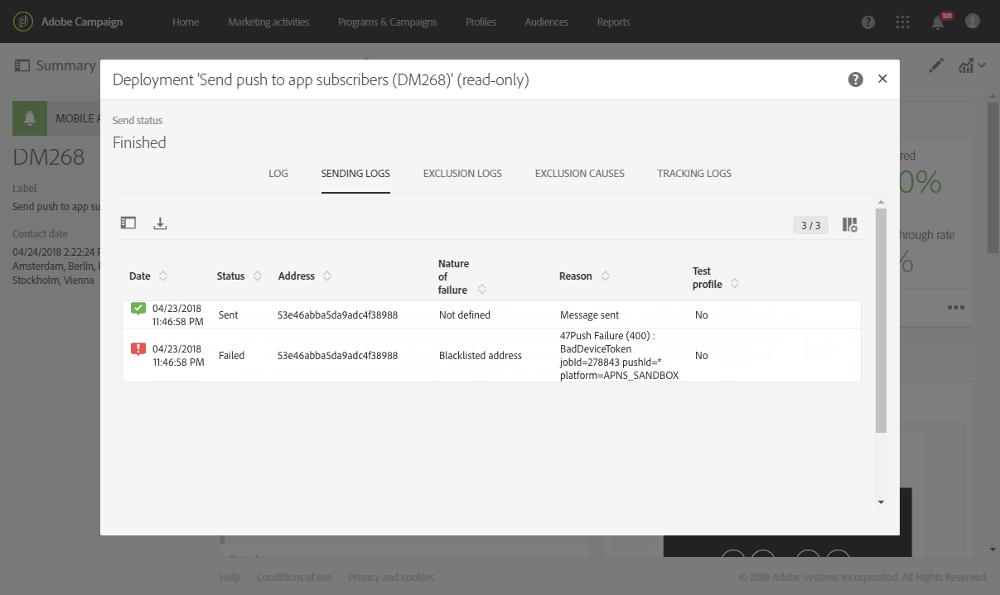

動的レポートを使用して、プッシュ通知配信の影響を測定できるようになりました。

**関連トピック：**

* [プッシュ通知レポート](../../reporting/using/push-notification-report.md)
* [ワークフロー内でのプッシュ通知の送信](../../automating/using/push-notification-delivery.md)
