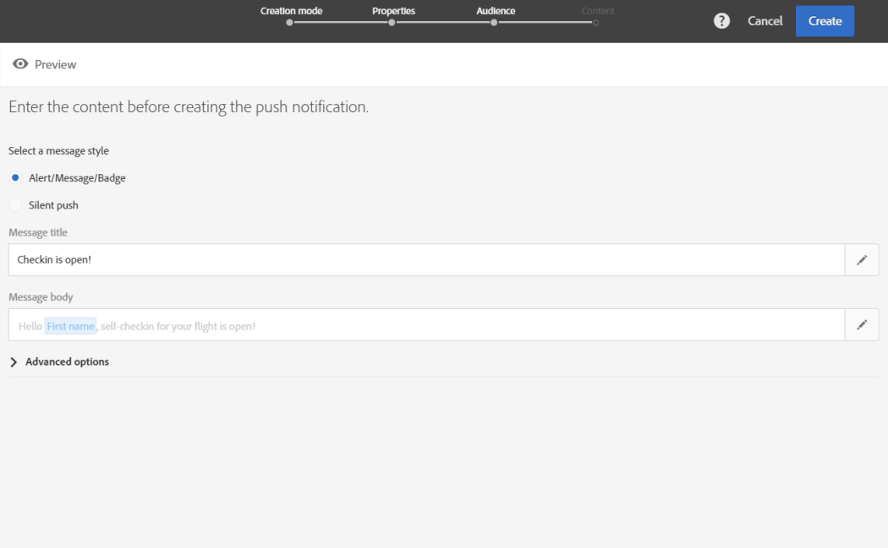

# プッシュ通知の準備と送信{#preparing-and-sending-a-push-notification}

## 通知の準備 {#preparing-the-notification}

Adobe Campaignでプッシュ通知を作成する手順は、次のとおりです。

1. **[!UICONTROL Marketing activities]**&#x200B;ウィンドウで、[新しいマーケティングアクティビティ](../../start/using/marketing-activities.md#creating-a-marketing-activity)を作成します。

   1つのプッシュ通知は、[キャンペーン](../../start/using/marketing-activities.md#creating-a-marketing-activity)またはAdobe Campaign [ホームページ](../../start/using/interface-description.md#home-page)からも作成できます。

   また、ワークフローでプッシュ通知配信アクティビティを使用することもできます。 このアクティビティについては、[プッシュ通知配信](../../automating/using/push-notification-delivery.md)の節で説明しています。

1. 「**[!UICONTROL Push notification]**」を選択します。
1. テンプレートを選択します。

   

   デフォルトでは、次の2つのテンプレートのいずれかを選択できます。

   * **[!UICONTROL Send push to Campaign profiles]**:このテンプレートを使用して、モバイルアプリケーションを購読し、プッシュ通知の受信をオプトインしたAdobe Campaign CRMプロファイルをターゲットに設定します。プッシュ通知には、[パーソナライゼーション](../../designing/using/personalization.md#inserting-a-personalization-field)フィールド（受信者の名など）を挿入できます。
   * **[!UICONTROL Send push to app subscribers]**:このテンプレートを使用して、アプリケーションからの通知の受信をオプトインした既知の匿名のモバイルアプリケーションユーザー全員にプッシュ通知を送信します。モバイルアプリケーションから収集したデータを使用して、これらのメッセージをパーソナライズできます。

   また、多言語のテンプレートを選択することもできます。 詳しくは、「[多言語プッシュ通知の作成](../../channels/using/creating-a-multilingual-push-notification.md)」を参照してください。

   テンプレートについて詳しくは、[テンプレートの管理](../../start/using/marketing-activity-templates.md)の節を参照してください。

1. プッシュ通知のプロパティを入力し、「 **[!UICONTROL Associate a Mobile App to a delivery]** 」フィールドでモバイルアプリを選択します。

   ドロップダウンには、SDK V4とExperience PlatformSDKの両方のアプリケーションが表示されます。

   

   プッシュ通知をキャンペーンにリンクできます。 作成済みのキャンペーンから選択します。

1. 次の画面で、オーディエンス(例えば、特定のモバイルアプリケーションを購読しているVIPのすべての顧客)を指定できます。 詳しくは、[オーディエンスの作成](../../audiences/using/creating-audiences.md)を参照してください。

   前の手順で選択したモバイルアプリに基づいて、オーディエンスが自動的にフィルタリングされます。

   

1. これで、プッシュ通知をカスタマイズできます。 まず、メッセージのスタイルを選択します。**[!UICONTROL Alert/Message/Badge]**&#x200B;または&#x200B;**[!UICONTROL Silent push]**。 プッシュ通知のタイプについては、[プッシュ通知について](../../channels/using/about-push-notifications.md)の節で説明します。

   プッシュ通知のコンテンツを編集し、詳細設定オプションを定義します。 [プッシュ通知のカスタマイズ](../../channels/using/customizing-a-push-notification.md)を参照してください。

   

   ここで設定するプッシュ通知のコンテンツとオプションは、ペイロードの形式でモバイルアプリに渡されます。 ペイロードの詳細な構造については、「[Campaign Standardプッシュ通知のペイロード構造について](https://docs.adobe.com/content/help/ja-JP/campaign-standard/using/communication-channels/push-notifications/push-payload.html)」のテクニカルノートを参照してください。

1. 「**[!UICONTROL Create]**」をクリックします。

   

1. 通知を送信する前に、テストプロファイルを使用してテストし、配信を送信する前に、受信者に送られる内容を正確に確認できます。 配信の概要から「**[!UICONTROL Audiences]**」を選択し、「**[!UICONTROL Test profiles]**」タブをクリックします。

   テストの送信について詳しくは、[テストプロファイル](../../sending/using/sending-proofs.md)を参照してください。

1. テストプロファイルを選択し、「**[!UICONTROL Preview]**」をクリックして通知を表示します。コンテンツは、テストプロファイルデータを使用してパーソナライズされます。
1. 様々なデバイスでのプッシュ通知レイアウトを確認します。レンダリングをプレビューするには、「 iPhone 」、「 Android phone 」、「 iPad 」または「 Android tablet 」を選択します。

   

1. **[!UICONTROL Estimated Payload Size]**&#x200B;は、テストプロファイルデータに基づく推定値です。 実際のペイロードサイズは変わる場合があります。 メッセージの上限は4 KBです。

   >[!CAUTION]
   >
   >ペイロードサイズが4 KBの制限を超える場合、メッセージは配信されません。

パーソナライゼーションデータはメッセージのサイズに影響します。

## 通知の送信 {#sending-the-notification}

オーディエンス条件を定義することで、Adobe Campaignの選択したオーディエンスにプッシュ通知を送信できます。 以下の例では、選択したオーディエンスは4人のターゲットモバイルアプリ購読者で構成されています。

1. **[!UICONTROL Prepare]**&#x200B;をクリックして、ターゲットを計算し、通知を生成します。

   

1. 準備が完了したら、**[!UICONTROL Deployment]**&#x200B;ウィンドウに次のKPIが表示されます。**[!UICONTROL Target]**&#x200B;と&#x200B;**[!UICONTROL To deliver]**。 除外が原因で&#x200B;**[!UICONTROL To deliver]**&#x200B;が&#x200B;**[!UICONTROL Targeted]**&#x200B;よりも小さいことに注意してください。除外は、**[!UICONTROL Deployment]**&#x200B;ウィンドウの下部にある「」ボタンをクリックすると表示できます。

   

1. 「 **[!UICONTROL Exclusion logs]** 」タブでは、送信されたターゲットから除外されたすべてのメッセージのリストと、この除外の理由を確認できます。

   ここでは、アドレスがプロファイル上にあったのでモバイルアプリの購読者の1人が除外されたのブロックリストを確認できます。また、プロファイルが重複していたので、他の購読者も除外されました。

   

1. 「**[!UICONTROL Exclusion causes]**」タブをクリックして、除外されたメッセージのボリュームを表示します。

   

1. これで、**[!UICONTROL Confirm]**&#x200B;をクリックして、プッシュ通知の送信を開始できます。
1. 配信のステータスは、メッセージダッシュボードとログで確認できます。詳しくは、[メッセージの送信](../../sending/using/confirming-the-send.md)および[配信ログ](../../sending/using/monitoring-a-delivery.md#delivery-logs)を参照してください。

   この例では、メッセージダッシュボードに、Adobe Campaignが2つのプッシュ通知の送信を試みたことが表示されます。1つはデバイスに正常に配信され、もう1つは失敗しました。 配信にエラーが発生した理由を知るには、**[!UICONTROL Deployment]**&#x200B;ウィンドウの下部にある「」ボタンをクリックします。

   

1. **[!UICONTROL Deployment]**&#x200B;ウィンドウで、「**[!UICONTROL Sending logs]**」タブをクリックして、送信されたプッシュ通知とそのステータスのリストにアクセスします。 この配信では、1つのプッシュ通知が正常に送信されたのに対して、もう1つのプッシュ通知は、不正なデバイストークンが原因で失敗しました。 その後、この購読者は、以降の配信からブロックリストに追加されます。

   >[!NOTE]
   >
   >原因は、Adobe Campaignの下流で発生するあらゆる障害になる可能性があります。 apnsやfcmなどのプロバイダーからエラーが発生した場合も、その理由が反映されます。 プロバイダーのエラーについて詳しくは、 [Apple](https://developer.apple.com/library/content/documentation/NetworkingInternet/Conceptual/RemoteNotificationsPG/CommunicatingwithAPNs.html)および[Android](https://firebase.google.com/docs/cloud-messaging/http-server-ref)のドキュメントを参照してください。

   

動的レポートを使用して、プッシュ通知配信の影響を測定できるようになりました。

**関連トピック：**

* [プッシュ通知レポート](../../reporting/using/push-notification-report.md)
* [ワークフロー内でのプッシュ通知の送信](../../automating/using/push-notification-delivery.md)
