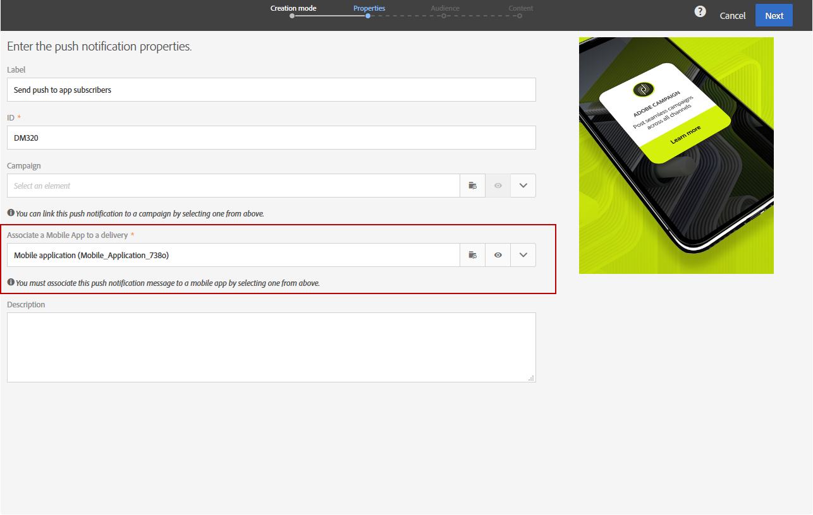

# プッシュ通知の準備と送信{#preparing-and-sending-a-push-notification}

## 通知の準備 {#preparing-the-notification}

Adobe Campaignを使用してプッシュ通知を作成する手順は、次のとおりです。

1. ウィンドウから、新しいマーケティングアクティビティを **[!UICONTROL Marketing activities]** 作成します 。

   単一のプッシュ通知は、 [キャンペーン](../../start/using/marketing-activities.md#creating-a-marketing-activity) またはAdobe Campaign [ホームページからも作成できます](../../start/using/interface-description.md#home-page)。

   また、プッシュ通知配信アクティビティをワークフローで使用することもできます。 このアクティビティは、「 [プッシュ通知配信](../../automating/using/push-notification-delivery.md) 」セクションに表示されます。

1. 「**[!UICONTROL Push notification]**」を選択します。
1. テンプレートを選択します.

   

   デフォルトでは、次の2つのテンプレートのいずれかを選択できます。

   * **[!UICONTROL Send push to Campaign profiles]**:このテンプレートを使用して、モバイルアプリケーションを購読し、プッシュ通知の受信を希望するAdobe CampaignCRMプロファイルをターゲットします。 受信者の名などの [個人設定](../../designing/using/personalization.md#inserting-a-personalization-field) フィールドをプッシュ通知に挿入できます。
   * **[!UICONTROL Send push to app subscribers]**:このテンプレートを使用して、アプリケーションからの通知の受信をオプトインしている、既知で匿名のモバイルアプリケーションユーザー全員にプッシュ通知を送信します。 モバイルアプリケーションから収集したデータを使用して、これらのメッセージをパーソナライズできます。

   また、多言語テンプレートを選択することもできます。 詳しくは、多言語プッシュ通知の [作成を参照してください](../../channels/using/creating-a-multilingual-push-notification.md)。

   For more on templates, refer to the [Managing templates](../../start/using/marketing-activity-templates.md) section.

1. Enter your push notification properties and select your mobile app in the **[!UICONTROL Associate a Mobile App to a delivery]** field.

   ドロップダウンには、SDK V4とExperience PlatformSDKの両方のアプリケーションが表示されます。

   

   プッシュ通知をキャンペーンにリンクできます。 これを行うには、既に作成されているキャンペーンから選択します。

1. 次の画面では、オーディエンスを指定できます。例えば、特定のモバイルアプリケーションを購読しているVIPのすべての顧客を指定できます。 詳しくは、「オーディエンスの [作成](../../audiences/using/creating-audiences.md)」を参照してください。

   オーディエンスは、前の手順で選択したモバイルアプリに基づいて自動的にフィルタリングされます。

   

1. プッシュ通知をカスタマイズできるようになりました。 最初に、メッセージのスタイルを選択します。 **[!UICONTROL Alert/Message/Badge]** または **[!UICONTROL Silent push]**。 プッシュ通知のタイプについては、プッシュ通知 [についての節で説明し](../../channels/using/about-push-notifications.md) ます。

   プッシュ通知の内容を編集し、高度なオプションを定義します。 See [Customizing a push notification](../../channels/using/customizing-a-push-notification.md).

   

   ここで設定するプッシュ通知コンテンツとオプションは、ペイロードの形式でモバイルアプリに渡されます。 ペイロードの詳細な構造は、「ACSプッシュ通知ペイロード構造 [について](https://docs.adobe.com/content/help/ja-JP/campaign-standard/using/communication-channels/push-notifications/push-payload.translate.html) 」で説明しています。

1. 「**[!UICONTROL Create]**」をクリックします。

   

1. 通知を送信する前に、テストプロファイルを使用してテストを実行し、配信を送信する前に受信者に表示される内容を正確に確認できます。 配信 **[!UICONTROL Audiences]** の概要からを選択し、 **[!UICONTROL Test profiles]** タブをクリックします。

   テストの送信について詳しくは、「 [テストプロファイル](../../sending/using/sending-proofs.md)」を参照してください。

1. テストプロファイルを選択し、をクリック **[!UICONTROL Preview]** して通知を表示します。コンテンツは、テストプロファイルデータを使用してパーソナライズされます。
1. 別のデバイスでのプッシュ通知レイアウトの確認：「iPhone」、「Android phone」、「iPad」または「Androidタブレットでプレビューレンダリング」を選択します。

   

1. は、テストプロファイルデータに基づく予測 **[!UICONTROL Estimated Payload Size]** です。 実際のペイロードサイズは異なる場合があります。 メッセージの制限は4 KBです。

   >[!CAUTION]
   >
   >ペイロードのサイズが4 KBの制限を超える場合、メッセージは配信されません。

パーソナライゼーションデータは、メッセージのサイズに影響します。

## 通知の送信 {#sending-the-notification}

オーディエンス条件を定義すると、Adobe Campaign内の選択したオーディエンスにプッシュ通知を送信できます。 以下の例では、選択したオーディエンスは4人のターゲットモバイルアプリの購読者で構成されています。

1. Click **[!UICONTROL Prepare]** to compute the target and generate the notifications.

   

1. Once the preparation has finished successfully, the **[!UICONTROL Deployment]** window presents the following KPIs: **[!UICONTROL Target]** and **[!UICONTROL To deliver]**. Note that the **[!UICONTROL To deliver]** count is lower than the **[!UICONTROL Targeted]** one due to exclusions which can be viewed by clicking  button at the bottom of the **[!UICONTROL Deployment]** window.

   

1. タブでは、送信されたターゲットから除外されたすべてのリストのメッセージと、この除外の原因を確認できます。 **[!UICONTROL Exclusion logs]**

   ここでは、アドレスがプロファイルにあったためにモバイルアプリのサブスクライバーの1人が除外されブロックリスト、他のサブスクライバーが重複にあったために除外されたことがわかります。

   

1. タブをクリックし **[!UICONTROL Exclusion causes]** て、除外されたメッセージの量を表示します。

   

1. をクリックして、プッシュ通知 **[!UICONTROL Confirm]** の送信を開始できるようになりました。
1. 配信のステータスは、メッセージダッシュボードとログで確認できます。詳しくは、「メッセージ [と](../../sending/using/confirming-the-send.md) 配信ログの送信 [」を参照してください](../../sending/using/monitoring-a-delivery.md#delivery-logs)。

   この例では、メッセージダッシュボードに、Adobe Campaignが2つのプッシュ通知を送信しようとしたことが表示されます。1つはデバイスに正常に配信され、もう1つは失敗しました。 配信にエラーがある理由を知るには、ウィンドウの下部にある  ボタンをクリックし **[!UICONTROL Deployment]** ます。

   

1. ウィンドウで **[!UICONTROL Deployment]** 、 **[!UICONTROL Sending logs]** タブをクリックして、送信されたプッシュ通知のリストとそのステータスにアクセスします。 この配信では、1つのプッシュ通知が正常に送信されたのに対し、もう1つのプッシュ通知は、デバイストークンの不良が原因で失敗しました。 その後、このサブスクライバは、さらに別の配信からブロックリストに追加されます。

   >[!NOTE]
   >
   >Adobe Campaignの下流で障害が発生した場合、その理由が考えられます。 apnsやfcmなどのプロバイダーがエラーを発生させた場合も、その理由には反映されます。 プロバイダーでのエラーについて詳しくは、 [Apple](https://developer.apple.com/library/content/documentation/NetworkingInternet/Conceptual/RemoteNotificationsPG/CommunicatingwithAPNs.html) および  Androidのドキュメントを参照してください。

   

動的レポートを使用して、プッシュ通知配信の影響を測定できるようになりました。

**関連トピック：**

* [プッシュ通知レポート](../../reporting/using/push-notification-report.md)
* [ワークフロー内でのプッシュ通知の送信](../../automating/using/push-notification-delivery.md)
