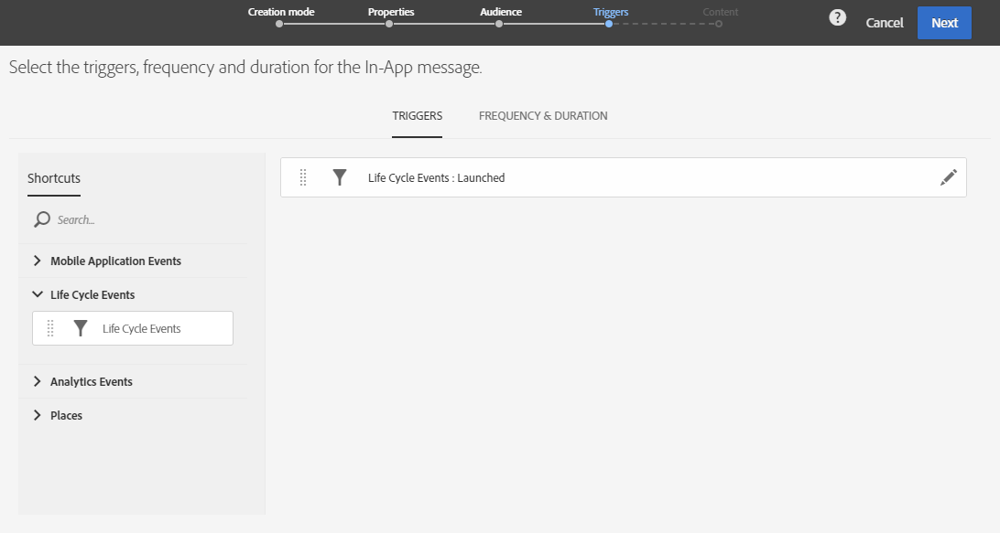
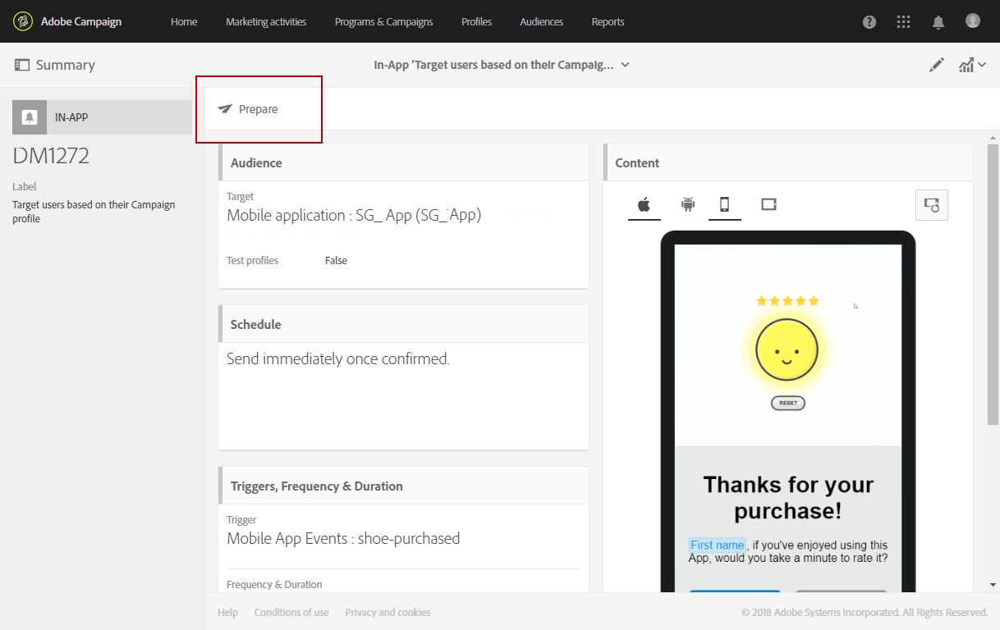

# アプリ内メッセージの準備と送信{#preparing-and-sending-an-in-app-message}

>[!NOTE]
>
>アプリ内パーソナライゼーションは、リンケージフィールドに基づいています。リンケージフィールドは通常、CRM の ID やモバイルアプリのログイン ID になります。リンケージフィールドを Adobe Campaign と連携して使用する場合は、このフィールドのセキュリティはユーザー自身が確保する必要があります。リンケージフィールドのセキュリティが確保されないと、パーソナライズされたメッセージが脆弱になる可能性があります。お客様がセキュリティで保護されたリンケージフィールドの構成、管理、および保護に伴う慣行を順守されない場合、不正なアクセスまたはプロファイルデータの使用に起因する損害に対して、アドビでは責任を負いかねます。

Adobe Campaign では、次の 3 つのタイプのアプリ内メッセージを使用できます。

* **[!UICONTROL Target users based on their Campaign profile (inAppProfile)]**：このメッセージタイプでは、モバイルアプリケーションを購読している Adobe Campaign プロファイル（CRM プロファイル）をターゲットとして設定できます。このメッセージタイプは、Adobe Campaign で使用可能なすべてのプロファイル属性を使用してパーソナライズできますが、Mobile SDK と Campaign のアプリ内メッセージングの間でセキュリティ保護されたハンドシェイクを使用する必要があります。これは、個人情報や機密情報を含んだメッセージの使用を、許可されたユーザーのみに制限するために必要になります。

   このメッセージタイプをユーザーのデバイスにダウンロードするには、Mobile SDK が、モバイルプロファイルを Adobe Campaign 内の CRM プロファイルに接続するためのリンケージフィールドを送信する必要があります。アプリ内メッセージのサポートに必要な SDK API について詳しくは、この[ページ](https://aep-sdks.gitbook.io/docs/using-mobile-extensions/adobe-campaign-standard/adobe-campaign-standard-api-reference)を参照してください。

* **[!UICONTROL Target all users of a Mobile app (inAppBroadcast)]**：このメッセージタイプでは、Adobe Campaign にプロファイルが存在していない場合でも、モバイルアプリケーションの全ユーザー（現在のユーザーも将来のユーザーも含む）にメッセージを送信できるようになります。したがって、メッセージのカスタマイズ時には、Adobe Campaign にユーザープロファイルが存在しない可能性があるので、パーソナライゼーションができません。
* **[!UICONTROL Target users based on their Mobile profile (inApp)]**：このメッセージタイプでは、Adobe Campaign にモバイルプロファイルを持つモバイルアプリケーションの既知のユーザーや匿名ユーザーすべてをターゲットにすることができます。このメッセージタイプは、個人情報も機密性も含まない属性のみを使用してパーソナライズできるので、Mobile SDK と Adobe Campaign のアプリ内メッセージングサービスの間にセキュリティで保護されたハンドシェイクは必要ありません。

   個人データと機密データの扱い方について詳しくは、[個人データと機密データを含んだモバイルプロファイルフィールドの扱い方](#handling-mobile-profile-fields-with-personal-and-sensitive-data)の節を参照してください。

## 個人データと機密データを含んだモバイルプロファイルフィールドの扱い方 {#handling-mobile-profile-fields-with-personal-and-sensitive-data}

Adobe Campaign では、モバイルデバイスから送信されたモバイルプロファイル属性データは、アプリケーション購読者から収集するデータを定義できる「**[!UICONTROL Subscriptions to an application (appSubscriptionRcp)]**」リソースに保存されます。

モバイルデバイスから Adobe Campaign に送信するデータを収集するには、このリソースを拡張する必要があります。その詳しい手順については、この[ページ](../../developing/using/extending-the-subscriptions-to-an-application-resource.md)を参照してください。

アプリ内メッセージのパーソナライゼーション機能をより安全に有効にするには、このリソースのモバイルプロファイルフィールドを適宜設定する必要があります。「**[!UICONTROL Subscriptions to an application (appSubscriptionRcp)]**」では、新しいモバイルプロファイルフィールドを作成する際に「**[!UICONTROL Personal and Sensitive]**」をオンにして、アプリ内メッセージのパーソナライズ時に使用できないようにします。

>[!NOTE]
>
>カスタムリソースを拡張した実装がこのテーブルに既に存在する場合は、各フィールドに適切なラベルを付けてから、アプリ内メッセージのパーソナライズに利用することをお勧めします。

「**[!UICONTROL Subscriptions to an application]**」カスタムリソースが設定されて公開されると、「**[!UICONTROL Target users based on their Mobile profile (inApp)]**」テンプレートを使用してアプリ内配信の準備を開始できます。パーソナライズのために「**[!UICONTROL Subscriptions to an application (appSubscriptionRcp)]**」リソースで利用できるフィールドは、個人情報も機密性も含まないフィールドに限られます。

**個人情報や機密性を含むフィールド**&#x200B;を使用したパーソナライズが必要な場合は、ユーザーの PII データを保護するためのセキュリティメカニズムが強化された「**[!UICONTROL Target users based on their Campaign profile (inAppProfile)]**」テンプレートの使用をお勧めします。

## アプリ内メッセージの準備 {#preparing-your-in-app-message}

Adobe Campaign を使用してスタンドアロンのアプリ内メッセージを作成する手順は次のとおりです。

1. Adobe Campaign ホームページで「**[!UICONTROL In-App messaging]**」カードをクリックします。

   またアプリ内メッセージは、「**[!UICONTROL Create]**」ボタンをクリックして「**Marketing activities**」タブから作成することもできます。

   アプリ内メッセージは、キャンペーン、または Adobe Campaign ホームページから、あるいはワークフローの内部でも作成できます。

1. 「**In-App message**」を選択します。

   

1. オーディエンスターゲティングのニーズに応じたテンプレートを選択します。

   

   デフォルトでは、次の 3 つの既製テンプレートのいずれかを選択できます。

   * **[!UICONTROL Target users based on their Campaign CRM profile (inAppProfile)]**
   * **[!UICONTROL Target all users of a Mobile app (inAppBroadcast)]**
   * **[!UICONTROL Target users based on their Mobile profile (inApp)]**

1. アプリ内メッセージのプロパティを入力し、「**[!UICONTROL Associate a Mobile App to a delivery]**」フィールドでモバイルアプリを選択します。モバイルアプリが Adobe Campaign Standard と連携するように設定されていない場合、リストには表示されません。モバイルアプリケーションの設定について詳しくは、この[ページ](https://helpx.adobe.com/jp/campaign/kb/configuring-app-sdk.html#ChannelspecificapplicationconfigurationinAdobeCampaign)を参照してください。

   

1. アプリ内メッセージのターゲットに設定するオーディエンスを選択します。オーディエンスは、この配信に関連付けられているモバイルアプリケーションに応じて、事前にフィルタリングされます。

   「**[!UICONTROL Broadcast an In-App message (inAppBroadcast)]**」では、モバイルアプリケーションのすべてのユーザーがターゲットになるので、この手順は必要はありません。

   

1. 「**[!UICONTROL Triggers]**」タブで、メッセージのトリガーとして使用するイベントをドラッグ＆ドロップします。トリガーを選択することにより、アプリ内メッセージを表示するきっかけとなるユーザーアクションを指定できます。

   次の 4 つのカテゴリーのイベントを使用できます。

   * **[!UICONTROL Mobile Application events]**：モバイルアプリケーションに実装されたカスタムイベント。

      イベント作成について詳しくは、この[ページ](https://helpx.adobe.com/jp/campaign/kb/configuring-app-sdk.html)を参照してください。

   * **[!UICONTROL Life Cycle events]**：Adobe Mobile SDK でサポートされる既製のライフサイクルイベント。

      ライフサイクルイベントについて詳しくは、この[ページ](https://docs.adobe.com/content/help/en/mobile-services/android/metrics.html)を参照してください。

   * **[!UICONTROL Analytics Events]**：モバイルアプリに実装されている機能に応じて、Adobe Analytics、コンテキストデータ、画面遷移のいずれかのカテゴリがサポートされます。

      これらのイベントは、Adobe Analytics のライセンスをお持ちの場合にのみ利用できます。

   * **[!UICONTROL Places]**：Places コンテキストデータ、Places カスタムメタデータ、Places イベントタイプの 3 つのカテゴリでリアルタイムの位置情報データを利用して、コンテキストに応じたモバイルエクスペリエンスを提供します。

      Adobe Places について詳しくは、[Places のドキュメント](https://placesdocs.com/)を参照してください。
   

1. 「**[!UICONTROL Analytics Events]**」を使用する場合、Adobe Analytics イベントおよび画面遷移イベントには、Adobe Experience Platform Launch の Analytics 拡張機能で設定されたレポートスイートに基づいて、自動的に入力がおこなわれます。これに対して、コンテキストデータイベントは手動で追加する必要があります。

   これらのイベントは、Adobe Analytics のライセンスをお持ちの場合にのみ利用できます。

   

1. **[!UICONTROL Places]** トリガーを使用すると、Places コンテキストデータ、Places カスタムメタデータ、Places イベントタイプのいずれかには、すべてのライブラリと Adobe Places で作成されたライブラリ目標点データに従って自動的に入力がおこなわれます。

   なお、デバイスでは、このトリガーは、Experience Platform Launch の Places 拡張機能で選択されたライブラリの目標地点データにのみ適用されます。Places 拡張機能とそのインストール方法について詳しくは、この[ドキュメント](https://docs.adobe.com/content/help/ja-JP/places/using/places-ext-aep-sdks/places-extension/places-extension.html)を参照してください。

1. 「**[!UICONTROL Frequency & duration]**」タブで、トリガーの頻度、開始日と終了日、曜日、アプリ内メッセージを有効にする時刻帯を選択します。

   

1. メッセージの内容を編集し、詳細設定オプションを指定します。[アプリ内メッセージのカスタマイズ](https://helpx.adobe.com/campaign/standard/channels/using/customizing-an-in-app-message.html)を参照してください。

   

1. 「**[!UICONTROL Create]**」をクリックします。

これで、アプリ内メッセージをターゲットオーディエンスに送信する準備が整いました。

**関連トピック：**

* [アプリ内メッセージのカスタマイズ](../../channels/using/customizing-an-in-app-message.md)
* [アプリ内レポート](../../reporting/using/in-app-report.md)
* [ワークフロー内でのアプリ内メッセージの送信](../../automating/using/in-app-delivery.md)

## アプリ内メッセージの送信 {#sending-your-in-app-message}

配信の準備が完了し、承認手順が完了したら、メッセージを送信できます。

1. 「**[!UICONTROL Prepare]**」をクリックして、ターゲットを計算し、メッセージを生成します。

   

1. 準備が完了したら、**Deployment** ウィンドウに **Target** および **To deliver** の KPI が表示されます。

   Deployment ウィンドウで  ボタンをクリックすれば、配信中に除外やエラーが生じていないかを確認できます。

   

1. 「**[!UICONTROL Confirm]**」をクリックして、アプリ内メッセージの送信を開始します。

   

1. 配信のステータスは、メッセージダッシュボードとログで確認できます。詳しくは、[この節](../../sending/using/monitoring-a-delivery.md)を参照してください。

   「**[!UICONTROL Delivered]**」と「**[!UICONTROL Sent]**」の KPI 値は、Campaign からメッセージ配信サービスに正常に送信された内容に基づいて算出されます。なお、これらの KPI は、メッセージ配信サービスからメッセージを正常に受信またはダウンロードしたモバイルデバイスの数を示すものではありません。

   

1. 配信レポートを使用して、アプリ内メッセージの影響を測定します。レポートについて詳しくは、[この節](../../reporting/using/in-app-report.md)を参照してください。

**関連トピック：**

* [アプリ内レポート](../../reporting/using/in-app-report.md)
* [ワークフロー内でのアプリ内メッセージの送信](../../automating/using/in-app-delivery.md)

