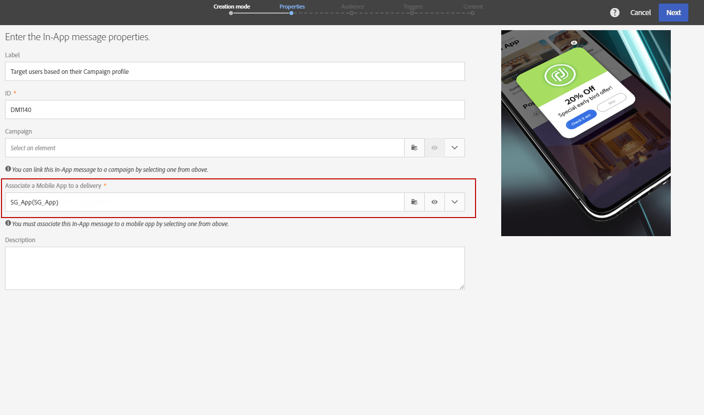

# Preparing and sending an In-App message{#preparing-and-sending-an-in-app-message}

>[!NOTE]
>
>アプリ内のパーソナライゼーションは、リンケージフィールドに依存しています。これは通常、CRM IDやモバイルアプリログインIDです。このリンケージフィールドの保護は、Adobe Campaignとの接続で使用する場合にのみ行います。リンケージフィールドのセキュリティを保護していないと、パーソナライズされたメッセージが脆弱になる可能性があります。セキュアリンケージフィールド構成、管理および保護の方策に失敗した場合、アドビは、未承認のアクセスまたはプロファイルデータの使用に起因する損害に対して責任を負いません。

Adobe Campaignでは、3種類のアプリ内メッセージを利用できます。

* **[!UICONTROL Target users based on their Campaign profile (inAppProfile)]**:このメッセージタイプを使用すると、モバイルアプリケーションをサブスクライブしているAdobe Campaignプロファイル（CRMプロファイル）をターゲット設定できます。このメッセージタイプは、Adobe Campaignで使用可能なすべてのプロファイル属性を使用してパーソナライズできますが、モバイルSDKとCampaignのIn- App Messagingサービスの安全なハンドシェイクを必要とするので、個人情報と機密情報のメッセージを許可されたユーザーのみが使用するようにする必要があります。

   ユーザーのデバイスでこのメッセージタイプをダウンロードするには、Mobile SDKは、モバイルプロファイルをAdobe CampaignのCRMプロファイルに接続するために使用されるリンケージフィールドを送信する必要があります。For more information on SDK APIs required to support In-App, refer to this [page](https://aep-sdks.gitbook.io/docs/using-mobile-extensions/adobe-campaign-standard/adobe-campaign-standard-api-reference).

* **[!UICONTROL Target all users of a Mobile app (inAppBroadcast)]**:このメッセージタイプを使用すると、Adobe Campaignに既存のプロファイルがない場合でも、モバイルアプリケーションのすべてのユーザー（現在または将来）にメッセージを送信できます。Adobe Campaignにユーザープロファイルが存在しない場合でも、メッセージをカスタマイズする際にはパーソナライゼーションはできません。
* **[!UICONTROL Target users based on their Mobile profile (inApp)]**:このメッセージタイプを使用すると、Adobe Campaignでモバイルプロファイルを持つモバイルアプリの既知のユーザーまたは匿名ユーザーをターゲットにすることができます。このメッセージタイプは、個人ではない属性のみを使用してパーソナライズでき、モバイルSDKとAdobe Campaignのアプリ内メッセージサービス間の安全なハンドシェイクは不要です。

   For more information on how to handle personal and sensitive data, refer to [Handling mobile profile fields with personal and sensitive data](../../channels/using/preparing-and-sending-an-in-app-message.md#handling-mobile-profile-fields-with-personal-and-sensitive-data).

## Handling mobile profile fields with personal and sensitive data {#handling-mobile-profile-fields-with-personal-and-sensitive-data}

In Adobe Campaign, mobile profile attributes data sent from mobile device are stored in **[!UICONTROL Subscriptions to an application (appSubscriptionRcp)]** resource which allows you to define the data that you want to collect from your applications' subscribers.

このリソースを拡張して、モバイルデバイスからAdobe Campaignに送信するデータを収集する必要があります。To do so, refer to this [page](../../developing/using/extending-the-subscriptions-to-an-application-resource.md) for the detailed steps.

アプリ内メッセージのパーソナライズ機能をより安全に有効にするには、このリソースのモバイルプロファイルフィールドを適宜設定する必要があります。In your **[!UICONTROL Subscriptions to an application (appSubscriptionRcp)]**, when creating your new mobile profiles fields, check **[!UICONTROL Personal and Sensitive]** to make them unavailable during In-App messages personalization.

>[!NOTE]
>
>この表のカスタムリソース拡張機能を持つ既存の実装をお持ちの場合は、アプリ内メッセージのパーソナライズに利用する前に、フィールドに適切なラベルを付けることをお勧めします。

**[!UICONTROL Subscriptions to an application]** カスタムリソースを設定して公開すると **[!UICONTROL Target users based on their Mobile profile (inApp)]** 、テンプレートを使用してアプリ内配信の準備を開始できます。Only non-personal and non-sensitive fields will be available from **[!UICONTROL Subscriptions to an application (appSubscriptionRcp)]** resource for personalization.

**個人フィールドと機密** フィールドにパーソナライゼーションが必要な場合は **[!UICONTROL Target users based on their Campaign profile (inAppProfile)]** 、ユーザーのPIIデータがセキュリティで保護されていることを確認するためのセキュリティメカニズムが追加されたテンプレートを使用することをお勧めします。

## Preparing your In-App message {#preparing-your-in-app-message}

Adobe Campaignを使用してスタンドアロンのアプリ内メッセージを作成する手順を次に示します。

1. From Adobe Campaign home page, click the **[!UICONTROL In-App messaging]** card.

   You can also create an In-App from the **Marketing activities** tab, by clicking the **[!UICONTROL Create]** button.

   アプリ内メッセージは、キャンペーンまたはAdobe Campaignホームページまたはワークフローから作成することもできます。

1. **アプリ内メッセージを選択**&#x200B;します。

   

1. オーディエンスのターゲット設定ニーズに基づいて、適切なテンプレートを選択します。

   

   デフォルトでは、次の3つの既成のテンプレートのいずれかを選択できます。

   * **[!UICONTROL Target users based on their Campaign CRM profile (inAppProfile)]**
   * **[!UICONTROL Target all users of a Mobile app (inAppBroadcast)]**
   * **[!UICONTROL Target users based on their Mobile profile (inApp)]**

1. Enter the In-App message properties and select your mobile app in the **[!UICONTROL Associate a Mobile App to a delivery]** field.

   

1. アプリ内メッセージのターゲットにするオーディエンスを選択します。オーディエンスは、この配信に関連付けられたモバイルアプリケーションによって、事前にフィルタリングされます。

   Note that this step is not needed with the **[!UICONTROL Broadcast an In-App message (inAppBroadcast)]** since it targets all users of a mobile application.

   

1. **[!UICONTROL Triggers]** タブで、メッセージをトリガーするイベントをドラッグ&amp;ドロップします。トリガーを選択すると、アプリ内メッセージが表示される原因となるアクションを選択します。

   次の4つのイベントを使用できます。

   * **[!UICONTROL Mobile Application events]**:モバイルアプリケーションに実装されたカスタムイベント。

      For more on events creations, refer to this [page](https://helpx.adobe.com/campaign/kb/configuring-app-sdk.html).

   * **[!UICONTROL Life Cycle events]**:Adobe Mobile SDKでサポートされている、すぐに使用できるライフサイクルイベント。

      For more on life cycle events, refer to this [page](https://marketing.adobe.com/resources/help/en_US/mobile/android/metrics.html).

   * **[!UICONTROL Analytics Events]**:モバイルアプリで実装される内容に応じて、次の3つのカテゴリがサポートされます。Adobe Analytics、コンテキストデータまたはビュー状態。

      これらのイベントは、Adobe Analyticsライセンスがある場合にのみ利用できます。

   * **[!UICONTROL Places]**:以下の3つのカテゴリは、コンテキストに関連するモバイルエクスペリエンスを提供するために、リアルタイムの場所データを活用しています。場所コンテキストデータ、カスタムメタデータまたは場所イベントタイプを配置します。

      For more information on Adobe Places, refer to the [Places documentation](https://placesdocs.com/).
   

1. If you use an **[!UICONTROL Analytics Events]**, Adobe Analytics and View state events will be automatically populated based on the report suites configured in the Analytics extension in Adobe Experience Platform Launch whereas Context data events have to be manually added.

   これらのイベントは、Adobe Analyticsライセンスがある場合にのみ利用できます。

   

1. If you use a **[!UICONTROL Places]** trigger, Places context data, Places custom metadata or Places event type will be automatically populated based on all the Libraries and their Points of Interest created in Adobe Places.

   このトリガーは、Experience Platform Launchの場所拡張で選択されたライブラリからの目標地点のみのデバイスに適用されることに注意してください。For more information on the Places extension and how to install it, refer to this [documentation](https://aep-sdks.gitbook.io/docs/using-mobile-extensions/places-extension-1/places-extension).

1. **[!UICONTROL Frequency & duration]** このタブで、トリガーの頻度、開始日と終了日、アプリ内メッセージがアクティブになる曜日および時刻を選択します。

   

1. メッセージの内容を編集し、アドバンスオプションを定義します。See [Customizing an In-App message](https://helpx.adobe.com/campaign/standard/channels/using/customizing-a-push-notification.html).

   

1. **[!UICONTROL Create]**&#x200B;をクリックします。

アプリ内メッセージを対象オーディエンスに送信できるようになりました。

**関連トピック:**

* [アプリ内メッセージのカスタマイズ](../../channels/using/customizing-an-in-app-message.md)
* [アプリ内レポート](../../reporting/using/in-app-report.md)
* [ワークフロー内でのアプリ内メッセージの送信](../../automating/using/in-app-delivery.md)

## Sending your In-App message {#sending-your-in-app-message}

配信の準備が完了し、承認手順が実行されたら、メッセージを送信できます。

1. Click **[!UICONTROL Prepare]** to compute the target and generate the messages.

   

1. 準備が完了したら、**Deployment** ウィンドウが表示され、**Target** および **To deliver** の KPI を示します。

   You can check the Deployment window by clicking the  button for potential exclusions or errors in your delivery.

   

1. Click **[!UICONTROL Confirm]** to start sending your In-App message.

   

1. メッセージのダッシュボードとログから配信状況を確認します。For more on this, refer to this [section](../../sending/using/monitoring-a-delivery.md).

   **[!UICONTROL Delivered]****[!UICONTROL Sent]** およびKPIは、キャンペーン配信サービスからメッセージ配信サービスへの送信に成功したことに基づいてカウントされます。これらのKPIは、メッセージ配信サービスからメッセージを受け取った、またはダウンロードしたモバイルデバイスの数を示すものではありません。

   

1. アプリ内メッセージが配信レポートに与える影響を測定します。For more on reporting, refer to [this section](../../reporting/using/in-app-report.md).

**関連トピック:**

* [アプリ内レポート](../../reporting/using/in-app-report.md)
* [ワークフロー内でのアプリ内メッセージの送信](../../automating/using/in-app-delivery.md)

