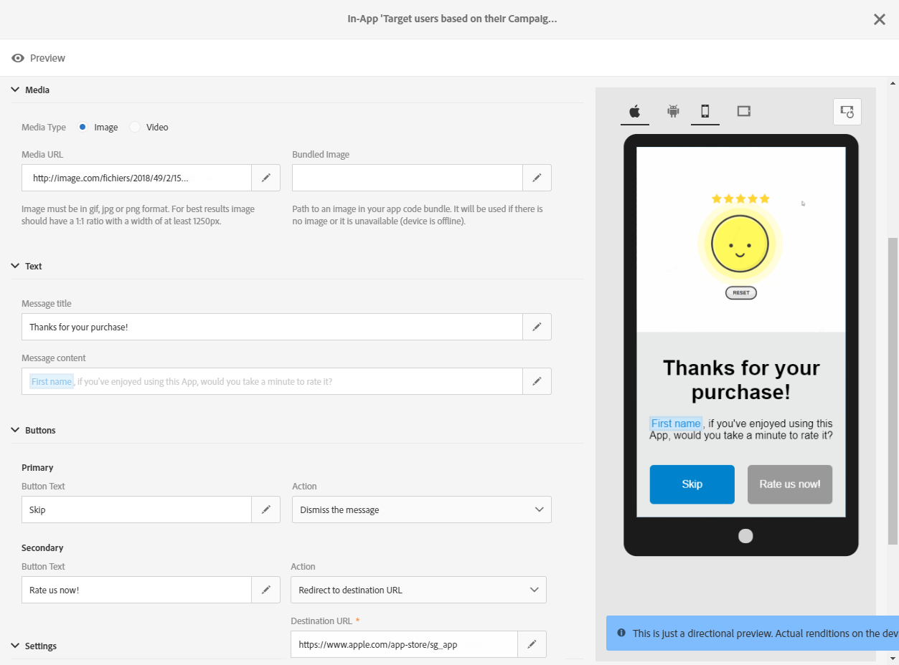

# アプリ内メッセージの準備と送信{#preparing-and-sending-an-in-app-message}

Adobe Campaign では、次の 3 つのタイプのアプリ内メッセージを使用できます。

* **[!UICONTROL Target users based on their Campaign profile (inAppProfile)]**：このメッセージタイプでは、モバイルアプリケーションを購読している Adobe Campaign プロファイル（CRM プロファイル）をターゲットとして設定できます。このメッセージタイプは、Adobe Campaign で使用可能なすべてのプロファイル属性を使用してパーソナライズできますが、Mobile SDK と Campaign のアプリ内メッセージングの間でセキュリティ保護されたハンドシェイクを使用する必要があります。これは、個人情報や機密情報を含んだメッセージの使用を、許可されたユーザーのみに制限するために必要になります。

   このメッセージタイプをユーザーのデバイスにダウンロードするには、Mobile SDK が、モバイルプロファイルを Adobe Campaign 内の CRM プロファイルに接続するためのリンケージフィールドを送信する必要があります。アプリ内メッセージのサポートに必要な SDK API について詳しくは、この[ページ](https://aep-sdks.gitbook.io/docs/using-mobile-extensions/adobe-campaign-standard/adobe-campaign-standard-api-reference)を参照してください。

* **[!UICONTROL Target all users of a Mobile app (inAppBroadcast)]**：このメッセージタイプでは、Adobe Campaign にプロファイルが存在していない場合でも、モバイルアプリケーションの全ユーザー（現在のユーザーも将来のユーザーも含む）にメッセージを送信できるようになります。したがって、メッセージのカスタマイズ時には、Adobe Campaign にユーザープロファイルが存在しない可能性があるので、パーソナライゼーションができません。
* **[!UICONTROL Target users based on their Mobile profile (inApp)]**：このメッセージタイプでは、Adobe Campaign にモバイルプロファイルを持つモバイルアプリケーションの既知のユーザーや匿名ユーザーすべてをターゲットにすることができます。このメッセージタイプは、個人情報も機密性も含まない属性のみを使用してパーソナライズできるので、Mobile SDK と Adobe Campaign のアプリ内メッセージングサービスの間にセキュリティで保護されたハンドシェイクは必要ありません。

   個人データと機密データの扱い方について詳しくは、[個人データと機密データを含んだモバイルプロファイルフィールドの扱い方](../../channels/using/about-in-app-messaging.md#handling-mobile-profile-fields-with-personal-and-sensitive-data)の節を参照してください。

## アプリ内メッセージの準備 {#preparing-your-in-app-message}

>[!CAUTION]
>
>アプリ内パーソナライゼーションは、リンケージフィールドに基づいています。リンケージフィールドは通常、CRM の ID やモバイルアプリのログイン ID になります。リンケージフィールドを Adobe Campaign と連携して使用する場合は、このフィールドのセキュリティはユーザー自身が確保する必要があります。リンケージフィールドのセキュリティが確保されないと、パーソナライズされたメッセージが脆弱になる可能性があります。お客様がセキュリティで保護されたリンケージフィールドの構成、管理、および保護に伴う慣行を順守されない場合、不正なアクセスまたはプロファイルデータの使用に起因する損害に対して、アドビでは責任を負いかねます。

Adobe Campaign を使用してスタンドアロンのアプリ内メッセージを作成する手順は次のとおりです。

1. Adobe Campaign ホームページで「**[!UICONTROL In-App messaging]**」カードをクリックします。

   またアプリ内メッセージは、「**[!UICONTROL Create]**」ボタンをクリックして「**Marketing activities**」タブから作成することもできます。

   アプリ内メッセージは、キャンペーン、または Adobe Campaign ホームページから、あるいはワークフローの内部でも作成できます。

1. 「**アプリ内メッセージ**」を選択します。

   

1. オーディエンスターゲティングのニーズに応じたテンプレートを選択します。

   

   デフォルトでは、次の 3 つの既製テンプレートのいずれかを選択できます。

   * **[!UICONTROL Target users based on their Campaign CRM profile (inAppProfile)]**
   * **[!UICONTROL Target all users of a Mobile app (inAppBroadcast)]**
   * **[!UICONTROL Target users based on their Mobile profile (inApp)]**

1. アプリ内メッセージのプロパティを入力し、「**[!UICONTROL Associate a Mobile App to a delivery]**」フィールドでモバイルアプリを選択します。

   ドロップダウンリストにアプリが表示されない場合は、モバイルアプリが **設定済み** 状態。 Adobe Analytics のアプリ **設定準備完了** 状態はリストに表示されません。 モバイルアプリケーションの設定について詳しくは、この[ページ](../../administration/using/configuring-a-mobile-application.md#channel-specific-config)を参照してください。

   

1. アプリ内メッセージのターゲットに設定するオーディエンスを選択します。オーディエンスは、この配信に関連付けられているモバイルアプリケーションに応じて、事前にフィルタリングされます。

   「**[!UICONTROL Broadcast an In-App message (inAppBroadcast)]**」では、モバイルアプリケーションのすべてのユーザーがターゲットになるので、この手順は必要はありません。

   

1. 「**[!UICONTROL Triggers]**」タブで、メッセージのトリガーとして使用するイベントをドラッグ＆ドロップします。トリガーを選択することにより、アプリ内メッセージを表示するきっかけとなるユーザーアクションを指定できます。

   次の 4 つのカテゴリーのイベントを使用できます。

   * **[!UICONTROL Mobile Application events]**：モバイルアプリケーションに実装されたカスタムイベント。

      イベント作成について詳しくは、この[ページ](../../administration/using/configuring-a-mobile-application.md)を参照してください。

   * **[!UICONTROL Life Cycle events]**：Adobe Mobile SDK でサポートされる既製のライフサイクルイベント。

      ライフサイクルイベントについて詳しくは、この[ページ](https://experienceleague.adobe.com/docs/mobile-services/android/metrics.html)を参照してください。

   * **[!UICONTROL Analytics Events]**：モバイルアプリに実装されている機能に応じて、Adobe Analytics、コンテキストデータ、画面遷移のいずれかのカテゴリがサポートされます。

      これらのイベントは、Adobe Analytics のライセンスをお持ちの場合にのみ利用できます。

   * **[!UICONTROL Places]**：Places コンテキストデータ、Places カスタムメタデータ、Places イベントタイプの 3 つのカテゴリでリアルタイムの位置情報データを利用して、コンテキストに応じたモバイルエクスペリエンスを提供します。

      Adobe Places について詳しくは、[Places のドキュメント](https://experienceleague.adobe.com/docs/places/using/home.html)を参照してください。
   

1. 次を使用する場合、 **[!UICONTROL Analytics Events]**&#x200B;コンテキストデータイベントを手動で追加する必要があるのに対し、 Adobe Analyticsおよび表示状態イベントは、データ収集 UI の Analytics 拡張機能で設定されたレポートスイートに基づいて自動的に入力されます。

   これらのイベントは、Adobe Analytics のライセンスをお持ちの場合にのみ利用できます。

   

1. **[!UICONTROL Places]** トリガーを使用すると、Places コンテキストデータ、Places カスタムメタデータ、Places イベントタイプのいずれかには、すべてのライブラリと Adobe Places で作成されたライブラリ目標点データに従って自動的に入力がおこなわれます。

   このトリガーは、デバイス上で、データ収集 UI の Places 拡張機能で選択されたライブラリの目標地点に対してのみ適用されます。 Places 拡張機能とそのインストール方法について詳しくは、この[ドキュメント](https://experienceleague.adobe.com/docs/places/using/places-ext-aep-sdks/places-extension/places-extension.html)を参照してください。

1. 「**[!UICONTROL Frequency & duration]**」タブで、トリガーの頻度、開始日と終了日、曜日、アプリ内メッセージを有効にする時刻帯を選択します。

   

1. メッセージの内容を編集し、詳細設定オプションを指定します。[アプリ内メッセージのカスタマイズ](../../channels/using/customizing-an-in-app-message.md)を参照してください。

   

1. 「**[!UICONTROL Create]**」をクリックします。

これで、アプリ内メッセージをターゲットオーディエンスに送信する準備が整いました。

**関連トピック：**

* [アプリ内メッセージのカスタマイズ](../../channels/using/customizing-an-in-app-message.md)
* [アプリ内レポート](../../reporting/using/in-app-report.md)
* [ワークフロー内でのアプリ内メッセージの送信](../../automating/using/in-app-delivery.md)

## アプリ内メッセージのプレビュー {#previewing-the-in-app-message}

アプリ内メッセージを送信する前に、テストプロファイルにテスト送信して、ターゲットオーディエンスでの受信時にメッセージがどのように表示されるかを確認できます。

1. 「**[!UICONTROL Preview]**」ボタンをクリックします。

   

1. 「**[!UICONTROL Select a test profile]**」ボタンをクリックし、テストプロファイルを 1 つ選択して、配信のプレビューを開始します。テストプロファイルについて詳しくは、[こちら](../../audiences/using/managing-test-profiles.md)を参照してください。
1. Android、iPhone、タブレットなど、様々なデバイスでのメッセージを確認します。また、パーソナライゼーションフィールドが適切なデータを取得しているかどうかも確認できます。

   

1. これで、メッセージを送信し、配信レポートを使用して影響を測定できるようになりました。

## アプリ内メッセージの送信 {#sending-your-in-app-message}

配信の準備が完了し、承認手順が完了したら、メッセージを送信できます。

1. 「**[!UICONTROL Prepare]**」をクリックして、ターゲットを計算し、メッセージを生成します。

   

1. 準備が完了したら、**Deployment** ウィンドウに **Target** および **To deliver** の KPI が表示されます。

   Deployment ウィンドウで  ボタンをクリックすれば、配信中に除外やエラーが生じていないかを確認できます。

   

1. 「**[!UICONTROL Confirm]**」をクリックして、アプリ内メッセージの送信を開始します。

   

1. 配信のステータスは、メッセージダッシュボードとログで確認できます。詳しくは、[この節](../../sending/using/monitoring-a-delivery.md)を参照してください。

   「**[!UICONTROL Delivered]**」と「**[!UICONTROL Sent]**」の KPI 値は、Campaign からメッセージ配信サービスに正常に送信された内容に基づいて算出されます。なお、これらの KPI は、メッセージ配信サービスからメッセージを正常に受信またはダウンロードしたモバイルデバイスの数を示すものではありません。

   

1. 配信レポートを使用して、アプリ内メッセージの影響を測定します。レポートについて詳しくは、[この節](../../reporting/using/in-app-report.md)を参照してください。

1. アプリ内メッセージを送信した後で、配信の非アクティブ化を選択できます。 これは、特定の配信を停止する場合や、同じトリガーで新しい配信を実行する場合などに役立ちます。

   クリック **[!UICONTROL Deactivate]** その後 **[!UICONTROL Ok]** をクリックして非アクティブ化リクエストを開始します。

   

1. リクエストが送信されると、配信は非アクティブ化され、他のメッセージは送信されません。

   この配信のレポートは、引き続きアクセス可能です。

   

**関連トピック：**

* [アプリ内レポート](../../reporting/using/in-app-report.md)
* [ワークフロー内でのアプリ内メッセージの送信](../../automating/using/in-app-delivery.md)
