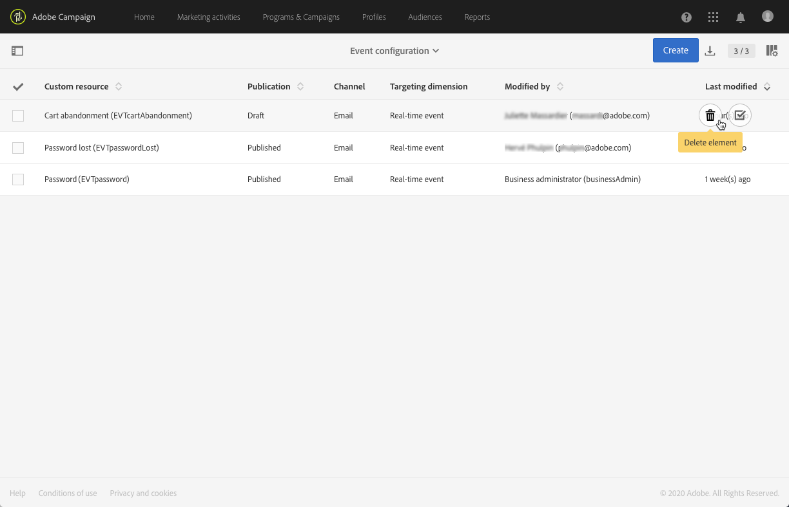

# トランザクションイベントの公開{#publishing-transactional-event}

[設定](../../channels/using/configuring-transactional-event.md)が完了すると、イベントは公開する準備ができます。 イベントのプレビュー、公開、非公開、削除の手順を以下に示します。

>[!IMPORTANT]
>
>イベントの構成とパブリケーションは、[管理者](../../administration/using/users-management.md#functional-administrators)が実行する必要があります。

イベント構成の公開と非公開を含む、トランザクションメッセージングの公開プロセス全体を示すグラフは、[このセクション](../../channels/using/publishing-transactional-message.md)で参照できます。

公開が完了したら、次の操作を行います。
* 対応するトランザクションメッセージが自動的に作成されます。 「[トランザクションメッセージの編集](../../channels/using/editing-transactional-message.md)」を参照してください。
* Webサイト開発者が使用するAPIがデプロイされ、トランザクションイベントを送信できるようになりました。 統合イベントのトリガー(../../channels/using/getting-started-with-transactional-msg.md#integrate-イベントトリガー)を参照してください。

## イベントのプレビューと公開{#previewing-and-publishing-the-event}

イベントを使用する前に、プレビューして公開する必要があります。

1. **[!UICONTROL API preview]**&#x200B;ボタンをクリックすると、Webサイト開発者が公開前に使用するREST APIのシミュレーションが表示されます。

   イベントが公開されると、このボタンをクリックして実稼働中のAPIのプレビューも表示できます。 統合イベントのトリガー(../../channels/using/getting-started-with-transactional-msg.md#integrate-イベントトリガー)を参照してください。

   

   >[!NOTE]
   >
   >REST APIは、選択したチャネルと選択したターゲティングディメンションに応じて異なります。 様々な設定について詳しくは、[トランザクションイベント固有の設定](../../channels/using/configuring-transactional-event.md#transactional-event-specific-configurations)を参照してください。

1. **[!UICONTROL Publish]**&#x200B;をクリックして開始パブリケーションを作成します。

   

   Webサイト開発者が使用するAPIがデプロイされ、トランザクションイベントを送信できるようになりました。

1. 対応するタブで、パブリケーションログを表示できます。

   

   >[!IMPORTANT]
   >
   >イベントを変更するたびに、**[!UICONTROL Publish]**&#x200B;を再度クリックして、Webサイト開発者が使用する更新されたREST APIを生成する必要があります。

   イベントが公開されると、新しいイベントにリンクされた[トランザクションメッセージ](../../channels/using/editing-transactional-message.md)が自動的に作成されます。

1. このトランザクションメッセージには、左側の領域にあるリンクから直接アクセスできます。

   

   >[!NOTE]
   >
   >* イベントがトランザクションメッセージの送信をトリガーするには、作成したばかりのメッセージを変更して発行する必要があります。 「[編集](../../channels/using/editing-transactional-message.md)」および「[トランザクションメッセージの公開](../../channels/using/publishing-transactional-message.md)」の節を参照してください。
      >
      >
   * また、このトリガーイベント](../../channels/using/getting-started-with-transactional-msg.md#integrate-event-trigger)をWebサイトに[統合する必要があります。

1. Adobe Campaign開始がこのイベント設定に関連するイベントを受け取ったら、**[!UICONTROL History]**&#x200B;セクションの&#x200B;**[!UICONTROL Latest transactional events]**&#x200B;リンクをクリックして、サードパーティのサービスから送信され、Adobe Campaignで処理された最新のイベントにアクセスできます。

イベント（JSON形式）は、最新のものから最も古いものへと順に表示されます。 このリストを使用すると、イベントの内容やステータスなどのデータを調べ、制御およびデバッグの目的で確認できます。

## イベントの非公開{#unpublishing-an-event}

**[!UICONTROL Unpublish]**&#x200B;ボタンを使用すると、イベントの公開をキャンセルできます。これにより、以前に作成したイベントに対応するリソースがREST APIから削除されます。

これで、Web サイトを通じてイベントがトリガーされた場合でも、対応するメッセージは送信されなくなり、データベースには保存されません。

>[!NOTE]
>
>対応するトランザクションメッセージを既に公開している場合は、トランザクションメッセージの公開もキャンセルされます。 [トランザクションメッセージの非公開](../../channels/using/publishing-transactional-message.md#unpublishing-a-transactional-message)を参照してください。

**[!UICONTROL Publish]**&#x200B;ボタンをクリックして、新しいREST APIを生成します。

<!--## Transactional messaging publication process {#transactional-messaging-pub-process}

The chart below illustrates the transactional messaging publication process.

For more on publishing, pausing and unpublishing a transactional message, see [this section](../../channels/using/publishing-transactional-message.md).-->

## イベントの削除{#deleting-an-event}

イベントが未公開になった場合、またはイベントがまだ公開されていない場合は、イベント設定リストから削除できます。 手順は次のとおりです。

1. 左上隅の **[!UICONTROL Adobe Campaign]** ロゴをクリックし、**[!UICONTROL Marketing plans]**／**[!UICONTROL Transactional messages]**／**[!UICONTROL Event configuration]** を選択します。
1. 選択したイベント構成にマウスを移動し、**[!UICONTROL Delete element]**&#x200B;ボタンを選択します。

   

   >[!NOTE]
   >
   >イベント構成のステータスが&#x200B;**[!UICONTROL Draft]**&#x200B;であることを確認してください。そうしないと、削除できません。 **[!UICONTROL Draft]**&#x200B;ステータスは、まだ公開されていないイベント、または[未公開](#unpublishing-an-event)の画像に適用されます。

1. 「**[!UICONTROL Confirm]**」ボタンをクリックします。

   

>[!IMPORTANT]
>
>公開済みで既に使用されているイベント設定を削除すると、対応するトランザクションメッセージとその送信およびトラッキングログも削除されます。
