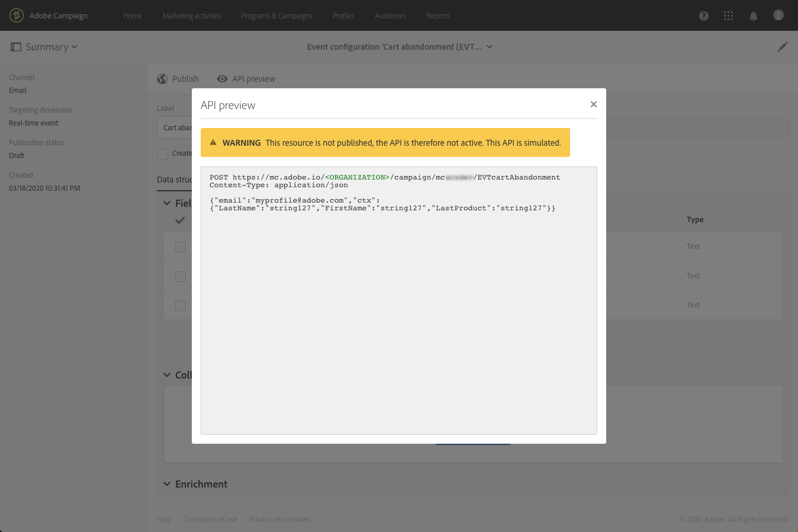
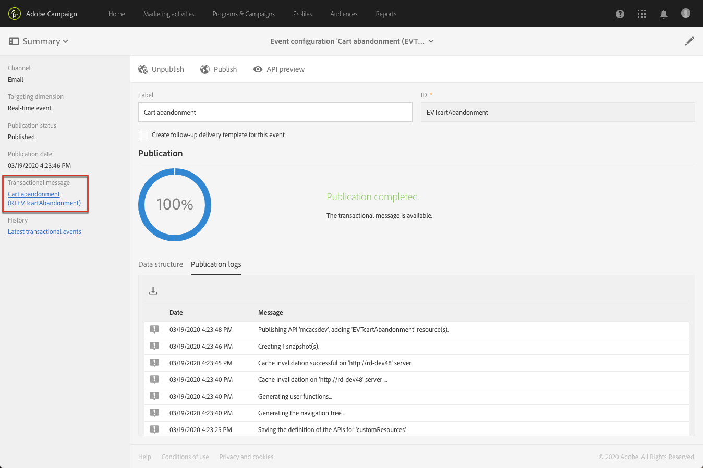
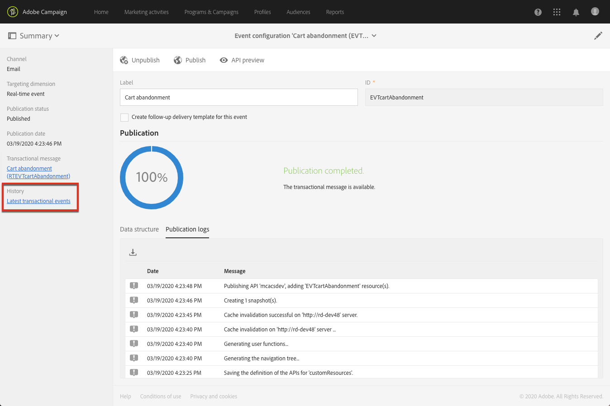
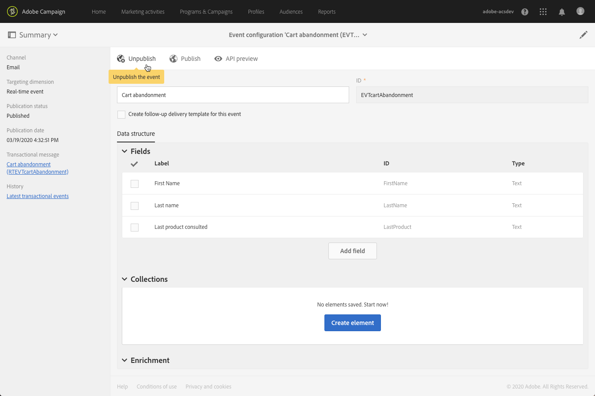
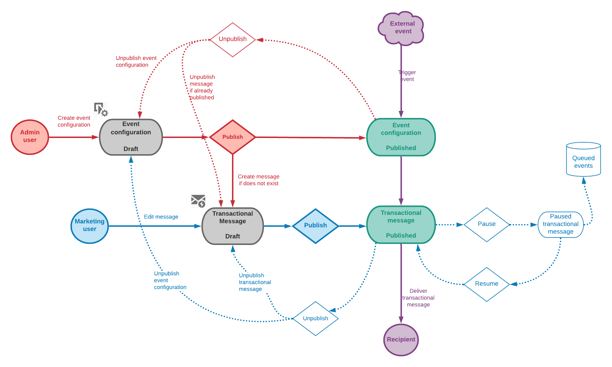
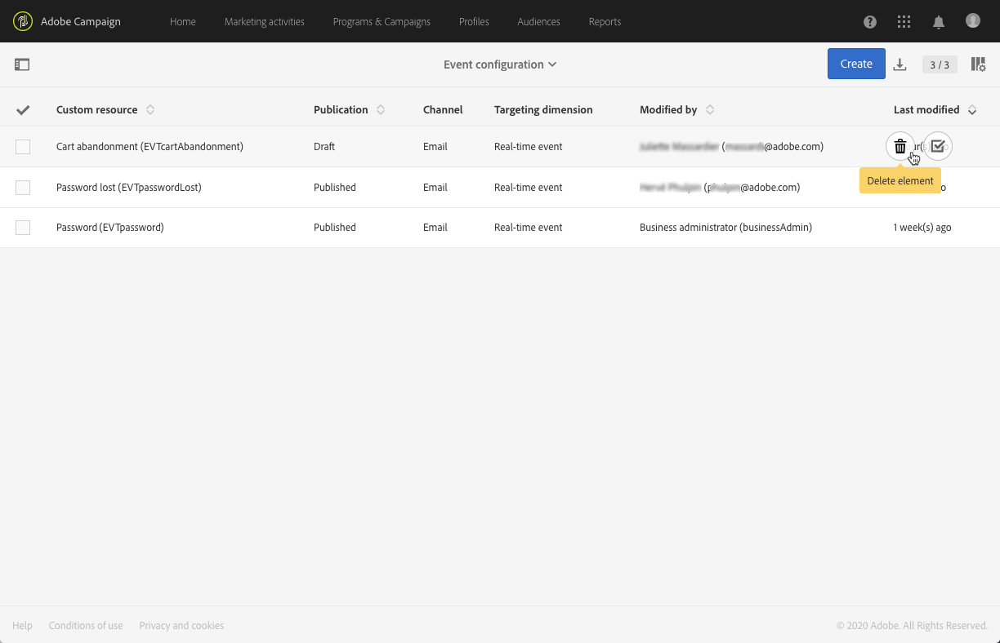

# トランザクションイベントの公開 {#publishing-transactional-event}

[設定](../../channels/using/configuring-transactional-event.md)が完了すると、イベントを公開する準備が整います。 イベントをプレビュー、公開、非公開および削除する手順については、以下で説明します。

>[!IMPORTANT]
>
>[機能管理者](../../administration/using/users-management.md#functional-administrators) <!--being part of the **[!UICONTROL All]** [organizational unit](../../administration/using/organizational-units.md) -->のみが、イベント設定を公開するための適切な権限を持っています。

公開と非公開のイベント設定を含む、トランザクションメッセージの公開プロセス全体を示すチャートは、[このセクション ](../../channels/using/publishing-transactional-message.md)で利用できます。

公開が完了したら：
* 対応するトランザクションメッセージが自動的に作成されます。 [ トランザクションメッセージの編集](../../channels/using/editing-transactional-message.md)を参照してください。
* Web サイト開発者が使用するAPIがデプロイされ、トランザクションイベントを送信できるようになりました。 [ イベントトリガーの統合](../../channels/using/getting-started-with-transactional-msg.md#integrate-event-trigger)を参照してください。

## イベントのプレビューと公開 {#previewing-and-publishing-the-event}

イベントを使用するには、イベントをプレビューして公開する必要があります。

1. 「**[!UICONTROL API preview]**」ボタンをクリックすると、Web サイト開発者が公開前に使用するREST APIのシミュレーションが表示されます。

   イベントが公開されると、このボタンを使用すると、実稼動環境でAPIのプレビューを表示することもできます。 [ イベントトリガーの統合](../../channels/using/getting-started-with-transactional-msg.md#integrate-event-trigger)を参照してください。

   

   >[!NOTE]
   >
   >REST APIは、選択したチャネルと選択したターゲティングディメンションによって異なります。 様々な設定について詳しくは、[この節](../../channels/using/configuring-transactional-event.md#transactional-event-specific-configurations)を参照してください。

1. **[!UICONTROL Publish]**&#x200B;をクリックして公開を開始します。

   

   Web サイト開発者が使用するAPIがデプロイされ、トランザクションイベントを送信できるようになりました。

1. 対応するタブで公開ログを表示できます。

   

   >[!IMPORTANT]
   >
   >イベントを変更するたびに、**[!UICONTROL Publish]**&#x200B;をもう一度クリックして、web サイト開発者が使用する更新されたREST APIを生成する必要があります。

   イベントが公開されると、新しいイベントにリンクされた[ トランザクションメッセージ ](../../channels/using/editing-transactional-message.md)が自動的に作成されます。

1. 左側の領域にあるリンクから、このトランザクションメッセージに直接アクセスできます。

   

   >[!NOTE]
   >
   >イベントがトランザクションメッセージの送信をトリガーにするには、作成したばかりのメッセージを変更して公開する必要があります。 「[編集](../../channels/using/editing-transactional-message.md)および[ トランザクションメッセージの公開](../../channels/using/publishing-transactional-message.md)」を参照してください。 また、このトリガーイベント [をweb サイトに](../../channels/using/getting-started-with-transactional-msg.md#integrate-event-trigger)統合する必要があります。

1. Adobe Campaignがこのイベント設定に関連するイベントの受信を開始したら、「**[!UICONTROL Latest transactional events]**」セクションの「**[!UICONTROL History]**」リンクをクリックして、サードパーティサービスによって送信され、Adobe Campaignによって処理された最新のイベントにアクセスできます。

イベント（JSON形式）は、最新のイベントから最も古いイベントまで一覧表示されます。 このリストを使用すると、制御とデバッグの目的で、コンテンツやイベントのステータスなどのデータを確認できます。

## イベントの非公開 {#unpublishing-an-event}

**[!UICONTROL Unpublish]** ボタンを使用すると、イベントの公開をキャンセルできます。これにより、以前に作成したイベントに対応するリソースがREST APIから削除されます。

これで、Web サイトを通じてイベントがトリガーされた場合でも、対応するメッセージは送信されなくなり、データベースには保存されません。

>[!NOTE]
>
>対応するトランザクションメッセージを既に公開している場合、トランザクションメッセージの公開もキャンセルされます。 「[ トランザクションメッセージの非公開](../../channels/using/publishing-transactional-message.md#unpublishing-a-transactional-message)」を参照してください。

**[!UICONTROL Publish]** ボタンをクリックして、新しいREST APIを生成します。

<!--
## Transactional messaging publication process {#transactional-messaging-pub-process}

The chart below illustrates the transactional messaging publication process.

For more on publishing, pausing and unpublishing a transactional message, see [this section](../../channels/using/publishing-transactional-message.md).
-->

## イベントの削除 {#deleting-an-event}

イベントが非公開になった後、またはイベントがまだ公開されていない場合は、イベント設定リストからイベントを削除できます。 手順は次のとおりです。

1. 左上隅の&#x200B;**Adobe** ロゴをクリックし、**[!UICONTROL Marketing plans]** > **[!UICONTROL Transactional messages]** > **[!UICONTROL Event configuration]**&#x200B;を選択します。
1. 目的のイベント設定にマウスを合わせ、**[!UICONTROL Delete element]** ボタンを選択します。

   

   >[!NOTE]
   >
   >イベント設定のステータスが&#x200B;**[!UICONTROL Draft]**&#x200B;であることを確認してください。そうしないと、イベント設定を削除できません。 **[!UICONTROL Draft]** ステータスは、まだ公開されていないイベントまたは[未公開](#unpublishing-an-event)のイベントに適用されます。

1. 「**[!UICONTROL Confirm]**」ボタンをクリックします。

   

>[!IMPORTANT]
>
>公開され、既に使用されているイベント設定を削除すると、対応するトランザクションメッセージとその送信ログとトラッキングログも削除されます。
