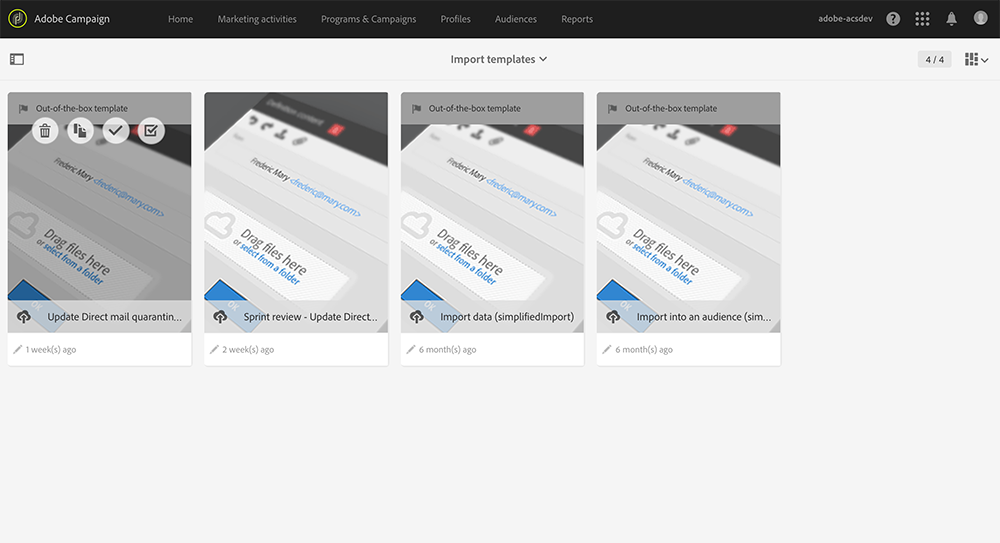

# 送信者に返信{#return-to-sender}

Return to Sender情報を組み込んだダイレクトメールプロバイダーとのフラットファイル交換がサポートされています。 これにより、対応する郵便アドレスを今後の通信から除外することができます。 これにより、誤った住所の通知を受け、他のチャネルを通じて顧客とエンゲージしたり、住所の更新を促したりすることもできます。

例えば、連絡先が新しい場所に移動し、新しい住所を提供しなかったとします。 プロバイダーは、誤ったアドレスのリストを取得し、この情報をAdobe Campaignに送信します。これにより、誤ったアドレスが自動的にブロックリストに加えるされます。

この機能を機能させるには、ダイレクトメールのデフォルト配信テンプレートに、コンテンツに配信ログ IDが含まれます。 したがって、Adobe Campaignは、プロファイルデータと配信データをプロバイダーから返された情報と同期させることができます。

インポートテンプレートは&#x200B;**[!UICONTROL Adobe Campaign > Resources > Templates > Import templates > Update Direct Mail quarantines and delivery logs]**&#x200B;で利用できます。 このテンプレートを複製して、独自のテンプレートを作成します。 インポートテンプレートの使用について詳しくは、[&#x200B; インポートテンプレートの使用](../../automating/using/importing-data-with-import-templates.md#setting-up-import-templates)を参照してください。

読み込みが完了すると、Adobe Campaignは自動的に次のアクションを実行します。

* プロファイルレベルで誤ったアドレスがブロックリストに加えるされる
* 配信の主要指標（KPI）が更新されます
* 配信ログが更新されます
