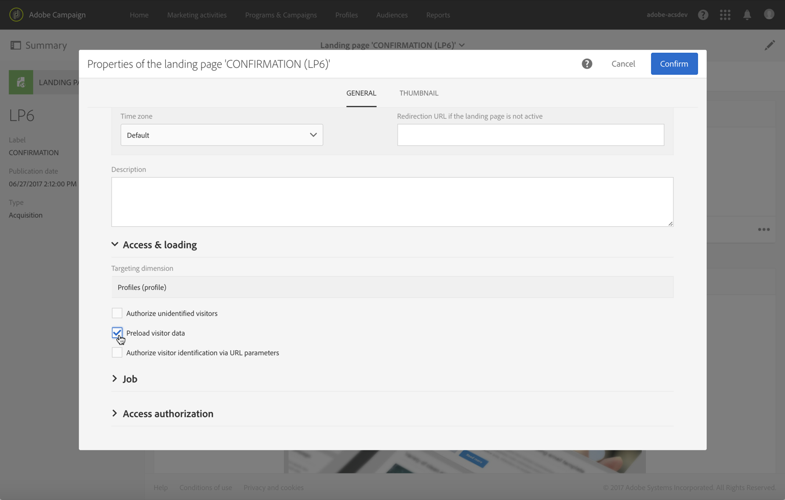

# ダブルオプトインプロセスのセットアップ{#setting-up-a-double-opt-in-process}

## ダブルオプトインについて {#about-double-opt-in}

ダブルオプトインは、E メールを送信する際のベストプラクティスです。不正な E メールアアドレスや、無効な E メールアドレス、スパムボットからプラットフォームを保護し、スパムの苦情が報告されないようにします。

ダブルオプトインの原則は、訪問者を「プロファイル」としてキャンペーンのデータベースに保存する前に、E メールを送信して合意を確認することです。オンラインランディングページに入力した訪問者は、受信した E メールの確認リンクをクリックして購読を確定する必要があります。

この設定をおこなうには、次の操作が必要です。

1. 訪問者が登録して購読できるように、ランディングページを作成して公開します。このランディングページは Web サイトから利用可能になります。このランディングページに入力して送信した訪問者は、最終的な検証前に通信を受け取らないようブロックリストに、データベースに保存されますが、に追加されます（Campaign の [ 管理 ](../../audiences/using/about-opt-in-and-opt-out-in-campaign.md) を参照）。
1. 確認リンクを含んだオプトイン E メールを作成し自動的に送信します。この E メールは、ランディングページを送信した訪問者をターゲットにしますが、「オプトアウト」プロファイルをターゲットにできる E メールテンプレートに基づいて作成されます。
1. 確認ランディングページにリダイレクトします。この最後のランディングページでは確認ボタンが表示されるので、訪問者はそれをクリックして確認する必要があります。確認した訪問者に送信される「ようこそ」メールをデザインしたり、例えば新しい受信者向けの特別なオファーを E メールに追加したりできます。

これらの手順は、すべてのパラメーターが正しく有効化されるように、Adobe Campaign で特定の順序で設定する必要があります。

## 手順 1：確認ランディングページの作成 {#step-1--create-the-confirmation-landing-page}

ダブルオプトインの設定の最初の手順は確認ランディングページの作成です。このページは、訪問者が登録のために確認 E メールをクリックした場合に表示されます。

このランディングページを作成して設定するには、次の操作が必要です。

1. [新しいランディングページ](../../channels/using/getting-started-with-landing-pages.md)を「**[!UICONTROL Profile acquisition (acquisition)]**」テンプレートに基づいてデザインします。ラベルを「**CONFIRMATION**」と入力します。

   [サービス](../../audiences/using/about-subscriptions.md)を使用する必要がある場合は、「**[!UICONTROL Subscription (sub)]**」テンプレートも使用できます。

1. ランディングページのプロパティを編集し、「**[!UICONTROL Access and loading]**」セクションでオプション「**[!UICONTROL Authorize unidentified visitors]**」の選択を解除して「**[!UICONTROL Preload visitor data]**」を選択します（これは必須ではありません）。

   

1. **[!UICONTROL Job]**／「**[!UICONTROL Additional data]**」セクションで「**[!UICONTROL Add an element]**」をクリックし、次のコンテキストパスを入力します。

   /context/profile/blackList

   値を **false** に設定し、「**[!UICONTROL Add]**」をクリックします。

   

   このコンテキストにより、E メールを送ブロックリスト信できるように、「オン」フィールドが削除されます。 後で説明がありますが、最初のランディングページでは、確認前、このフィールドを **true** と設定し、未確認のプロファイルに E メールが送信されないようにしてありました。詳しくは、 [手順3：獲得ランディングページの作成](#step-3--create-the-acquisition-landing-page)を参照してください。

1. ランディングページのコンテンツをカスタマイズします。例えば、パーソナライズされたデータを表示し、確認ボタンのラベルを「ここをクリックして購読を確認」などに変更できます。

   

1. 確認ページのコンテンツを調整して、登録されたことが購読者にわかるようにします。

   

1. ランディングページを[テストして公開](../../channels/using/testing-publishing-landing-page.md)します。

## 手順 2：確認電子メールの作成 {#step-2--create-the-confirmation-email}

確認ランディングページを作成したら、確認 E メールをデザインできます。この E メールは、獲得ランディングページを検証するすべての訪問者に自動的に送信されます。この検証はイベントと見なされ、E メールはトランザクションメッセージで、オプトアウト母集団をターゲットにできる特定のタイポロジルールにリンクされています。

これらの要素を作成する手順を以下に示します。確認 E メールのテンプレートは、獲得ランディングページで参照されるので、ランディングページ作成の前に作成しておく必要があります。

### イベントの作成 {#create-the-event}

確認 E メールは、「フォームの検証」イベントに反応するので、[トランザクションメッセージ](../../channels/using/getting-started-with-transactional-msg.md)になります。最初にイベントを作成し、次にトランザクションメッセージのテンプレートを作成する必要があります。

1. Adobe Campaign のロゴからアクセスできる&#x200B;**[!UICONTROL Marketing plans]**／**[!UICONTROL Transactional messages]**／**[!UICONTROL Event configuration]**&#x200B;メニューからイベントを作成し、ラベルを「**CONFIRM**」と入力します。
1. 「**[!UICONTROL Profile]**」ターゲティングディメンションを選択し、「**[!UICONTROL Create]**」をクリックします。

   

1. 「**[!UICONTROL Fields]**」セクションで、「**[!UICONTROL Create element]**」をクリックし、データ構造に「**[!UICONTROL email]**」を追加し、紐付けを有効にします。
1. 「**[!UICONTROL Enrichment]**」セクションで、「**[!UICONTROL Create element]**」をクリックし、「**[!UICONTROL Profile]**」ターゲットリソースを選択します。その後、必要に応じて、「**[!UICONTROL Join definition]**」セクションで **[!UICONTROL email]** フィールドにマップしたり、他の任意の複合紐付けキーにマップしたりできます。

   

   サービスを使用する必要がある場合は、「**[!UICONTROL Service]**」ターゲットリソースを追加し、**[!UICONTROL serviceName]** フィールドにマップします。

1. 「**[!UICONTROL Profile]**」をドロップダウンリストの「**[!UICONTROL Targeting enrichment]**」として選択します。
1. 「**[!UICONTROL Publish]**」をクリックして、イベントを公開します。

イベントの準備ができました。これで、E メールテンプレートをデザインできます。このテンプレートには、前に作成した **CONFIRMATION** ランディングページへのリンクを含める必要があります。詳しくは、[確認メッセージのデザイン](#design-the-confirmation-message)を参照してください。

### タイポロジの作成 {#create-the-typology-rule}

標準搭載の[タイポロジ](../../sending/using/about-typology-rules.md)を複製して、特定のタイポロジを作成する必要があります。このタイポロジを使用すると、契約が未確認でまだ承認中のプロファイルにメッセージを送信でブロックリストきます。 デフォルトのタイポロジでは、オプトアウト ( 例：ブロックリストタイポロジ ) プロファイルは除外されます。 このタイポロジを作成するには、次の手順に従います。

1. Adobe Campaign のロゴから、**[!UICONTROL Administration]**／**[!UICONTROL Channels]**／**[!UICONTROL Typologies]**&#x200B;を選択し、「**[!UICONTROL Typologies]**」をクリックします。
1. 標準搭載のタイポロジ「**[!UICONTROL Transactional message on profile (mcTypologyProfile)]**」を複製します。
1. 複製が確認されたら、新しいタイポロジを編集し、ラベルを「**TYPOLOGY_PROFILE**」と入力します。
1. ルール **の** アブロックリストドレスを削除します。
1. 「**[!UICONTROL Save]**」をクリックします。

これで、このタイポロジを確認 E メールに関連付けることができるようになりました。

### 確認メッセージのデザイン {#design-the-confirmation-message}

確認 E メールは、前に作成したイベントに基づくトランザクションメッセージです。次の手順に従って、このメッセージを作成します。

1. Adobe Campaign のロゴから&#x200B;**[!UICONTROL Marketing plans]**／**[!UICONTROL Transactional messages]**&#x200B;を選択し、「**[!UICONTROL Transactional messages]**」をクリックします。
1. **CONFIRM** E メールテンプレートを編集し、カスタマイズします。既存のコンテンツをアップロードすることも、標準搭載のテンプレートを使用することもできます。
1. **CONFIRMATION** ランディングページへのリンクを追加し、「**[!UICONTROL Confirm]**」をクリックして変更内容を保存します。

   

1. E メールテンプレートのプロパティを編集します。**[!UICONTROL Advanced parameters]**／「**[!UICONTROL Preparation]**」セクションで、前に作成した **TYPOLOGY_PROFILE** タイポロジを選択します。
1. このトランザクションメッセージを保存して公開します。

## 手順 3：獲得ランディングページの作成 {#step-3--create-the-acquisition-landing-page}

最初の獲得ランディングページを作成する必要があります。このオプトインフォームが Web サイトに公開されます。

このランディングページを作成して設定するには、次の操作が必要です。

1. [新しいランディングページ](../../channels/using/getting-started-with-landing-pages.md)を「**[!UICONTROL Profile acquisition (acquisition)]**」テンプレートに基づいてデザインします。ラベルを「**ACQUISITION**」と入力します。
1. ランディングページのプロパティを編集します。**[!UICONTROL Job]** ／「**[!UICONTROL Additional data]**」セクションで「**[!UICONTROL Add an element]**」をクリックし、次のコンテキストパスを入力します。

   /context/profile/blackList

   値を **true** に設定します。

   これは、を強制的に追加しブロックリストて、契約を確認していない訪問者にメッセージを送信しないようにするために必須です。 確認ランディングページの検証が確認されると、このフィールドが **false** に設定されます。この点について詳しくは、[手順 1：確認ランディングページの作成](#step-1--create-the-confirmation-landing-page)を参照してください。

1. **[!UICONTROL Job]**／「**[!UICONTROL Specific actions]**」セクションで、「**[!UICONTROL Start sending messages]**」オプションを選択します。
1. 関連するドロップダウンリストで、作成した **CONFIRM** トランザクションメッセージテンプレートを選択します。

   

1. ブランドや取得する必要のあるデータに応じて、ランディングページのコンテンツをカスタマイズします。パーソナライズされたデータを表示し、確認ボタンのラベルを&#x200B;**購読を確認**&#x200B;などに変更できます。

   

1. 確認ページをカスタマイズして、新しい購読者に購読の検証が必要であることを通知します。

   

1. ランディングページを[テストして公開](../../channels/using/testing-publishing-landing-page.md)します。

これで、ダブルオプトインが設定されました。この **[!UICONTROL ACQUISITION]** ランディングページのパブリック URL から開始して、プロシージャをエンドツーエンドで実行しテストできます。この URLは、ランディングページダッシュボードに表示されます。
