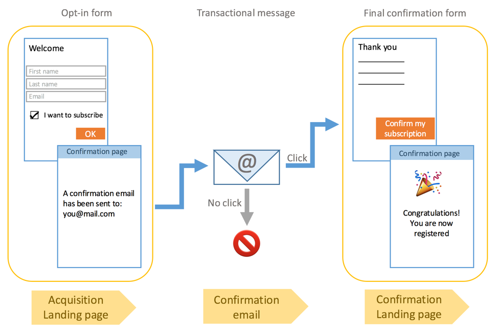

# ダブルオプトインプロセスの設定{#setting-up-a-double-opt-in-process}

## 重複オプトインについて {#about-double-opt-in}

重複のオプトインメカニズムは、電子メールを送信する際のベストプラクティスです。 これは、間違ったまたは無効な電子メールアドレスやスパンボットからプラットフォームを保護し、迷惑メールの可能性を防ぎます。

原則として、訪問者の契約を確認する電子メールを送信し、「プロファイル」としてキャンペーンデータベースに保存します。訪問者がオンラインランディングページを入力し、電子メールを受信したら、確認リンクをクリックして購読を確定する必要があります。

この設定を行うには、次の操作を行う必要があります。

1. 登録と購読が可能なランディングページを作成し、訪問者を公開します。 このランディングページはWebサイトから入手できます。 このランディングページに入力して送信する訪問者は、最終検証前に通信を受け取らないように、「ブラックリスト登録済み」のみのデータベースに格納されます(キャンペーンでのブラックリストの管理を参照 )。
1. オプトイン電子メールを作成し、確認リンクと共に自動的に送信します。 この電子メールは、ターゲットを送信したランディングページの訪問者です。 これは、「オプトアウト」プロファイルをターゲットできる電子メールテンプレートに基づいています。
1. 確認ランディングページ この最後のランディングページは、確認ボタンを提案します。訪問者はクリックする必要があります。 確認の際に送信されるご案内の電子メールを設計し、例えば新しい受信者向けの特別なオファーを電子メールに追加できます。

これらの手順は、すべてのパラメーターを正しく有効にするために、Adobe Campaignで特定の順序で設定する必要があります。

## 手順1:確認ランディングページ {#step-1--create-the-confirmation-landing-page}

確認重複の作成時に、開始オプトインメカニズムのランディングページを設定するプロセス。このページは、登録のために訪問者が確認電子メールをクリックした場合に表示されます。

このオプションを作成および設定するには、次のランディングページが必要になります。

1. テンプレート [に基づいて新しいランディングページ](../../channels/using/getting-started-with-landing-pages.md) をデザイン **[!UICONTROL Profile acquisition (acquisition)]** します。 ラベル&#39;**CONFIRMATION**&#39;を入力します。

   サービスを使用する必要が [ある場合](../../audiences/using/about-subscriptions.md)、テンプレートも使用でき **[!UICONTROL Subscription (sub)]** ます。

1. ランディングページのプロパティを編集し、セク **[!UICONTROL Access and loading]** ションの下で、オプションの選 **[!UICONTROL Authorize unidentified visitors]**&#x200B;択を解除し **[!UICONTROL Preload visitor data]** ます（これは必須ではありません）。

   

1. 「>」セクシ **[!UICONTROL Job]** ョンで、 **[!UICONTROL Additional data]** をクリックし、 **[!UICONTROL Add an element]** 次のコンテキストパスを入力します。

   /context/プロファイル/blackList

   値を **falseに設定し** 、をクリックしま **[!UICONTROL Add]**&#x200B;す。

   

   このコンテキストにより、電子メールを送信できるように、ブラックリストフィールドが削除されます。 後で、最初のランディングページが確認前にこのフィールドを **true** に設定し、未確認のプロファイルに電子メールを送信しないようにしています。 詳しくは、手順3を参照し [てください。獲得ランディングページ](#step-3--create-the-acquisition-landing-page)。

1. ランディングページの内容例えば、パーソナライズされたデータを表示し、確認ボタンのラベルを「ここをクリックして購読を確認」に変更できます。

   

1. 確認ページの内容を適合させて、登録されたことを購読者に通知します。

   

1. [ランディングページのテストと公開](../../channels/using/testing-publishing-landing-page.md) 。

## 手順2:確認電子メールの作成 {#step-2--create-the-confirmation-email}

確認電子メールのランディングページが作成されたら、確認用の電子メールを設計できます。この電子メールは、獲得データを検証するすべての訪問者に自動的に送信されます。ランディングページ この検証はイベントと見なされ、電子メールはトランザクションメッセージで、特定のタイポロジルールにリンクされ、ターゲットのオプトアウトが可能です。

これらの要素を作成する手順を以下に示します。 ダウンロード計測用テンプレートを作成する前に、この電子メールランディングページが参照されるので、ダウンロード計測用テンプレート自体を作成する必要があります。

### イベント {#create-the-event}

確認電子メールは、 [トランザクションメッセージ](../../channels/using/about-transactional-messaging.md) (イベント)に対する反応です。フォームの検証。 まずテンプレートを作成し、次にイベントのテンプレートを作成する必要があります。トランザクションメッセージ

1. > >メニューからイベントを作成し **[!UICONTROL Marketing plans]** 、Adobe Campaignのロゴからアクセスで **[!UICONTROL Transactional messages]** きるようにし、「 **[!UICONTROL Event configuration]** CONFIRM ****」というラベルを入力します。
1. 選択し、 **[!UICONTROL Profile]** ターゲティングディメンションをクリックしま **[!UICONTROL Create]**&#x200B;す。

   

1. セクション **[!UICONTROL Fields]** でをクリックし、デ **[!UICONTROL Create element]** ータ構造に **[!UICONTROL email]** を追加して、調整を有効にします。
1. セクション **[!UICONTROL Enrichment]** でをクリックし、 **[!UICONTROL Create element]** リソースを **[!UICONTROL Profile]** ターゲットします。 その後、必要に応じて、セクシ **[!UICONTROL email]** ョン内のフィー **[!UICONTROL Join definition]** ルドまたは他の複合紐付けキーにマップできます。

   

   サービスを使用する必要がある場合は、ターゲットリソースを追加し、フ **[!UICONTROL Service]** ィールドにマッピング **[!UICONTROL serviceName]** します。 詳しくは、を参照してください。

1. ドロップダウ **[!UICONTROL Profile]** ン・ **[!UICONTROL Targeting enrichment]** リストでを選択します。
1. をクリック **[!UICONTROL Publish]** して、イベントを公開します。

イベントの準備ができた。 これで、電子メールテンプレートを設計できます。 このテンプレートには、前に作成した **CONFIRMATION** ランディングページへのリンクが含まれている必要があります。 詳しくは、確認メッセージの [設計を参照してください](#design-the-confirmation-message)。

### タイポロジの作成 {#create-the-typology-rule}

あらかじめ用意されているタイ [ポロジを](../../sending/using/about-typology-rules.md)複製して、特定のタイポロジを作成する必要があります。 タイポロジを使用すると、契約をまだ確認していないプロファイルにメッセージを送信し、まだブラックリスト登録済みです。 デフォルトでは、タイポロジによってオプトアウト(ブラックリスト登録済み)プロファイルが除外されます。 このタイポロジを作成するには、次の手順に従います。

1. Adobe Campaignのロゴから、//を選 **[!UICONTROL Administration]** 択し、 **[!UICONTROL Channels]** をク **[!UICONTROL Typologies]** リックしま **[!UICONTROL Typologies]**&#x200B;す。
1. 重複は、すぐに使用できるタイポロジで **[!UICONTROL Transactional message on profile (mcTypologyProfile)]**&#x200B;す。
1. 重複が確認されたら、新しいタイポロジを編集し、ラベル **TYPOLOGY_プロファイル**。
1. ブラックリスト登録済みアドレス **規則を削除** 。
1. クリック **[!UICONTROL Save]** .

このタイポロジを確認用電子メールに関連付けることができるようになりました。

### 確認メッセージの設計 {#design-the-confirmation-message}

確認用の電子メールは、以前に作成したトランザクションメッセージに基づくイベントです。 次の手順に従って、このメッセージを作成します。

1. Adobe Campaignのロゴから/を選択し **[!UICONTROL Marketing plans]** 、をク **[!UICONTROL Transactional messages]** リックしま **[!UICONTROL Transactional messages]**&#x200B;す。
1. 確認の電子メール **テンプレート** を編集し、パーソナライズします。 既存のコンテンツをアップロードするか、あらかじめ用意されているテンプレートを使用できます。
1. 追加 **CONFIRMATION** ランディングページへのリンクをクリックし、変更を **[!UICONTROL Confirm]** 保存します。

   

1. 電子メールテンプレートのプロパティを編集します。 「>」セクシ **[!UICONTROL Advanced parameters]** ョンで、 **[!UICONTROL Preparation]** 前に作成した **TYPOLOGY_プロファイル** 、タイポロジを選択します。
1. 保存して公開します。トランザクションメッセージ

## 手順3:獲得ランディングページ {#step-3--create-the-acquisition-landing-page}

最初の獲得ランディングページ:このオプトインフォームはWebサイトに公開されます。

このオプションを作成および設定するには、ランディングページを次のように設定する必要があります。

1. テンプレート [に基づいて新しいランディングページ](../../channels/using/getting-started-with-landing-pages.md) をデザイン **[!UICONTROL Profile acquisition (acquisition)]** します。 ラベル&#39;**ACQUISITION**&#39;を入力します。
1. 次の手順でランディングページのプロパティを編集します。>セクション **[!UICONTROL Job]** でをク **[!UICONTROL Additional data]** リックし、次のコ **[!UICONTROL Add an element]** ンテキストパスを入力します。

   /context/プロファイル/blackList

   値を **trueに設定**。

   ブラックリストを強制的に使用し、契約を確認していない訪問者にメッセージを送信しないようにするには、これが必須です。 CONFIRMATIONランディングページの検証では、確認後にこのフィールドが **falseに設定さ** れます。 詳しくは、手順1を参照し [てください。確認ランディングページ](#step-1--create-the-confirmation-landing-page)。

1. 「>」セクシ **[!UICONTROL Job]** ョンで、 **[!UICONTROL Specific actions]** オプションを選択しま **[!UICONTROL Start sending messages]**&#x200B;す。
1. 関連するドロップダウンリストで、作成した **CONFIRM** トランザクションメッセージテンプレートを選択します。

   

1. ブランドや取得する必要のあるランディングページに応じて、データのコンテンツをカスタマイズします。 パーソナライズされたデータを表示し、確認ボタンのラベルを「購読を **確認** 」などに変更できます。

   

1. 確認ページをカスタマイズして、新しい購読者に対して、購読の検証が必要であることを通知します。購読

   

1. [ランディングページのテストと公開](../../channels/using/testing-publishing-landing-page.md) 。

重複のオプトインメカニズムが設定されました。 このプロシージャのパブリックURLから開始して、プロシージャを最後から最後まで実行し、テストすることがで **[!UICONTROL ACQUISITION]** きます。 このURLは、ランディングページダッシュボードに表示
