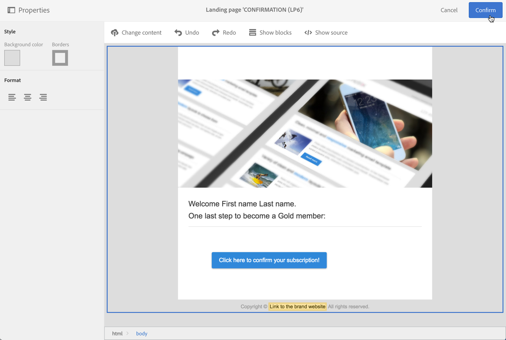
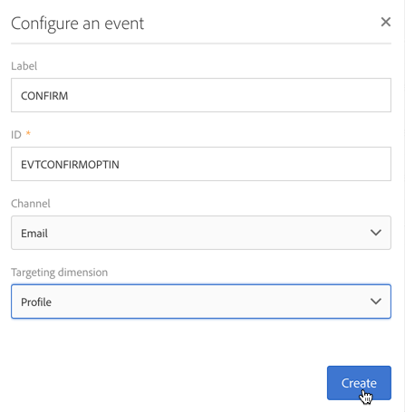

# Setting up a double opt-in process{#setting-up-a-double-opt-in-process}

## About double opt-in {#about-double-opt-in}

電子メールを送信する際には、ダブルオプトインメカニズムがベストプラクティスです。これにより、プラットフォームを不正または無効な電子メールアドレスやスパムから保護し、スパムの苦情を防止できます。

訪問者の同意をキャンペーンデータベースに保存する前に、電子メールを送信して、訪問者の契約書を確認します。訪問者はオンラインランディングページに入力してから電子メールを受け取り、確認リンクをクリックして購読を終了する必要があります。

これを設定するには、以下を行う必要があります。

1. ランディングページを作成して公開し、訪問者が登録および登録できるようにします。このランディングページはWebサイトから利用できます。Visitors who fill in and submit this landing page will be stored in the database but ‘blacklisted', in order not to receive any communication before the final validation (see [Managing blacklisting in Campaign](../../audiences/using/about-opt-in-and-opt-out-in-campaign.md)).
1. 自動的にオプトイン電子メールを作成し、確認リンクを使用して送信します。この電子メールはランディングページを提出した訪問者をターゲットにします。これは、「オプトアウト」プロファイルをターゲットにできる電子メールテンプレートに基づいています。
1. 確認ランディングページにリダイレクトします。最終ランディングページには、確認ボタンが表示されます。訪問者はクリックする必要があります。確認のために送信するようこそ電子メールをデザインしたり、例えば新しい受信者用の電子メールに特別なオファーを追加したりできます。

これらの手順は、すべてのパラメーターを適切に有効にするために、Adobe Campaignで設定する必要があります。

## Step 1: Create the confirmation landing page {#step-1--create-the-confirmation-landing-page}

ダブルオプトインメカニズムを設定するためのプロセスは、確認ランディングページの作成から始まります。このページは、訪問者が登録のために確認電子メールをクリックしたときに表示されます。

このランディングページを作成および設定するには、以下を行う必要があります。

1. Design a [new landing page](../../channels/using/about-landing-pages.md) based on the **[!UICONTROL Profile acquisition (acquisition)]** template. Enter the label '**CONFIRMATION**'.

   [サービス](../../audiences/using/about-subscriptions.md)を使用する必要がある場合は **[!UICONTROL Subscription (sub)]** 、テンプレートを使用することもできます。

1. Edit the landing page properties and under the **[!UICONTROL Access and loading]** section, unselect the option **[!UICONTROL Authorize unidentified visitors]**, select **[!UICONTROL Preload visitor data]** (this one is not mandatory).

   

1. **[!UICONTROL Job]** "&gt; **[!UICONTROL Additional data]** 」セクションで、をクリック **[!UICONTROL Add an element]** し、次のコンテキストパスを入力します。

   /context/profile/blackList

   Set the value to **false** and click **[!UICONTROL Add]**.

   

   このコンテキストにより、電子メールを送信できるようにブラックリストフィールドが削除されます。We will see later that the first landing page was setting this field to **true** before confirmation, to prevent from sending emails to non-confirmed profiles. For more on this, see [Step 3: Create the acquisition landing page](../../channels/using/setting-up-a-double-opt-in-process.md#step-3--create-the-acquisition-landing-page).

1. ランディングページのコンテンツのカスタマイズ:個人用データを表示し、確認ボタンのラベルを「ここをクリックすると、購読を確認する」に変更できます。

   

1. 購読者に登録されていることを通知するために、確認ページの内容を調整します。

   

1. [ランディングページをテストして公開](../../channels/using/sharing-a-landing-page.md) します。

## Step 2: Create the confirmation email {#step-2--create-the-confirmation-email}

確認のランディングページが作成されたら、確認用の電子メールを設計できます。この電子メールは、獲得ランディングページを検証するすべての訪問者に自動的に送信されます。この検証はイベントと見なされ、電子メールは、特定のタイポロジルールにリンクされており、オプトアウト訪問者をターゲットにすることができます。

これらの要素を作成する手順を以下に説明します。この電子メールテンプレートを作成する前に、獲得ランディングページ自体を作成する前にそれらをフォローする必要があります。

### Create the event {#create-the-event}

The confirmation email is a [transactional message](../../channels/using/about-transactional-messaging.md) as it reacts to an event: the validation of the form. まず、イベントを作成してから、トランザクションメッセージのテンプレートを作成する必要があります。

1. **[!UICONTROL Marketing plans]** / **[!UICONTROL Transactional messages]** &gt; **[!UICONTROL Event configuration]** メニューから、Adobe Campaignロゴからアクセス可能なイベントを作成し、ラベル「**REVIEW**」を入力します。
1. **[!UICONTROL Profile]** ターゲットディメンションを選択して、をクリック **[!UICONTROL Create]**&#x200B;します。

   

1. **[!UICONTROL Fields]** セクションで、 **[!UICONTROL Create element]** データ構造 **[!UICONTROL email]** をクリックして追加し、紐付けを有効にします。
1. **[!UICONTROL Enrichment]** セクションで、目的のリソースをクリック **[!UICONTROL Create element]** して選択 **[!UICONTROL Profile]**&#x200B;します。You can then map on the **[!UICONTROL email]** in the **[!UICONTROL Join definition]** section, or any other composite reconciliation key, depending on your needs.

   

   If you need to use services, you can also add the **[!UICONTROL serviceName]**.

1. Select **[!UICONTROL Profile]** as the **[!UICONTROL Targeting enrichment]** in the dropdown list.
1. Click **[!UICONTROL Publish]** to publish the event.

イベントが準備完了です。これで、電子メールテンプレートを設計できます。This template must include a link to the **CONFIRMATION** landing page created before. For more on this, see [Design the confirmation message](../../channels/using/setting-up-a-double-opt-in-process.md#design-the-confirmation-message).

### Create the typology rule {#create-the-typology-rule}

You need to create a specific [typology rule](../../administration/using/about-typology-rules.md), by duplicating an out-of-box one. このルールでは、まだ契約を確認しておらず、まだブラックリストに記載されているプロファイルにメッセージを送信できます。デフォルトでは、タイポロジルールはオプトアウト（ブラックリストに記載された）プロファイルを除外します。このタイポロジルールを作成するには、次の手順に従います。

1. From the Adobe Campaign logo, select **[!UICONTROL Administration]** &gt; **[!UICONTROL Channels]** &gt; **[!UICONTROL Typologies]** and click **[!UICONTROL Typologies]**.
1. Duplicate the out-of-box typology **[!UICONTROL Transactional message on profile (mcTypologyProfile)]**.
1. Once duplication confirmed, edit the new typology and enter the label **TYPOLOGY_PROFILE**.
1. **[!UICONTROL Save]**&#x200B;をクリックします。

この誤植を確認電子メールに関連付けることができるようになりました。

### Design the confirmation message {#design-the-confirmation-message}

確認電子メールは、以前に作成されたイベントに基づくトランザクションメッセージです。このメッセージを作成するには、次の手順に従います。

1. From the Adobe Campaign logo, select **[!UICONTROL Marketing plans]** &gt; **[!UICONTROL Transactional messages]** and click **[!UICONTROL Transactional messages]**.
1. **確認** 電子メールテンプレートを編集し、パーソナライズします。既存のコンテンツをアップロードしたり、既成のテンプレートを使用したりできます。
1. **確認** のランディングページにリンクを追加し、クリック **[!UICONTROL Confirm]** して変更を保存します。

   

1. 電子メールテンプレートのプロパティを編集します。**[!UICONTROL Advanced parameters]** "&gt; **[!UICONTROL Preparation]** 」セクションで、以前に作成した **PERTIICAL_ PROFILE** タイポロジを選択します。
1. トランザクションメッセージを保存して発行します。

## Step 3: Create the acquisition landing page {#step-3--create-the-acquisition-landing-page}

最初の獲得ランディングページを作成する必要があります。このフォームはWebサイトに公開されます。

このランディングページを作成および設定するには、以下を行う必要があります。

1. Design a [new landing page](../../channels/using/about-landing-pages.md) based on the **[!UICONTROL Profile acquisition (acquisition)]** template. Enter the label '**ACQUISITION**'.
1. Edit the landing page properties: in the **[!UICONTROL Job]** &gt; **[!UICONTROL Additional data]** section, click **[!UICONTROL Add an element]** and enter the following context path:

   /context/profile/blackList

   and set the value to **true**.

   これは、強制的にブラックリストを記述し、契約を確認しなかった訪問者にメッセージを送信しないようにするために必須です。The validation of the CONFIRMATION landing page will set this field to **false** after confirmation. For more on this, see [Step 1: Create the confirmation landing page](../../channels/using/setting-up-a-double-opt-in-process.md#step-1--create-the-confirmation-landing-page).

1. **[!UICONTROL Job]** "&gt; **[!UICONTROL Specific actions]** 」セクションで、このオプションを選択 **[!UICONTROL Start sending messages]**&#x200B;します。
1. In the associated drop-down list, choose the **CONFIRM** transactional message template you created.

   

1. ブランドおよび獲得する必要のあるデータに応じて、ランディングページのコンテンツをカスタマイズします。You can display personalized data and change the label of the confirmation button to **Confirm my subscription** for example.

   

1. 確認ページをカスタマイズして、購読の検証が必要な新しい加入者に通知します。

   

1. [ランディングページをテストして公開](../../channels/using/sharing-a-landing-page.md) します。

ダブルオプトインメカニズムが設定されるようになりました。You can run and test the procedure from end to end, starting from the public URL of this **[!UICONTROL ACQUISITION]** landing page. このURLはランディングページダッシュボードに表示されます。
