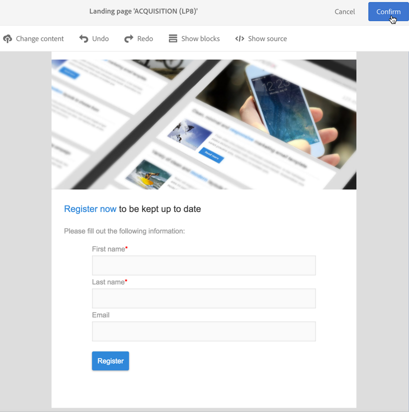

# ダブルオプトインプロセスの設定{#setting-up-a-double-opt-in-process}

## ダブルオプトインについて {#about-double-opt-in}

電子メールを送信する際のベストプラクティスは、ダブルオプトインメカニズムです。 これは、間違った電子メールアドレスや無効な電子メールアドレス、スパムボットからプラットフォームを保護し、迷惑メールの可能性を防ぎます。

原則として、訪問者の契約を確認する電子メールを送信してから、「プロファイル」としてCampaignデータベースに保存します。訪問者がオンラインランディングページに入力し、電子メールを受け取り、確認リンクをクリックして購読を終了する必要があります。

この設定を行うには、次の操作を行う必要があります。

1. ランディングページを作成して発行し、訪問者が登録して購読できるようにします。 このランディングページはWebサイトから入手できます。 このランディングページに入力して送信した訪問者は、最終検証前に通信を受け取らないように、データベースに保存されますが、「ブラックリスト」に保存されます(「 [Campaignでのブラックリストの管理](../../audiences/using/about-opt-in-and-opt-out-in-campaign.md)」を参照)。
1. オプトイン電子メールを作成し、確認リンクと共に自動的に送信します。 この電子メールは、ランディングページを送信した訪問者をターゲットにします。 これは、「オプトアウト」プロファイルをターゲットにする電子メールテンプレートに基づいています。
1. 確認ランディングページにリダイレクトします。 この最後のランディングページには、確認ボタンが表示されます。訪問者はクリックする必要があります。 確認の送信時に送信されるご案内の電子メールをデザインしたり、新しい受信者向けの特別オファーを電子メールに追加したりできます。

これらの手順は、すべてのパラメーターが正しく有効になるように、Adobe Campaignで特定の順序で設定する必要があります。

## 手順1:確認ランディングページの作成 {#step-1--create-the-confirmation-landing-page}

ダブルオプトインメカニズムを設定するプロセスは、確認ランディングページの作成から開始します。このページは、訪問者が登録のために確認電子メールをクリックした場合に表示されます。

このランディングページを作成して設定するには、次の操作を行う必要があります。

1. テンプレート [に基づいて新しいランディング](../../channels/using/getting-started-with-landing-pages.md) ページをデザイン **[!UICONTROL Profile acquisition (acquisition)]** します。 「確認&#x200B;****」というラベルを入力します。

   サービスを使用する必要が [ある場合](../../audiences/using/about-subscriptions.md)、テンプレートも使用でき **[!UICONTROL Subscription (sub)]** ます。

1. ランディングページのプロパティを編集し、セクシ **[!UICONTROL Access and loading]** ョンでオプションの選択を解除 **[!UICONTROL Authorize unidentified visitors]**&#x200B;し、「 **[!UICONTROL Preload visitor data]** 」を選択します（これは必須ではありません）。

   

1. 「&gt;」セクシ **[!UICONTROL Job]** ョンで、を **[!UICONTROL Additional data]** クリックし、 **[!UICONTROL Add an element]** 次のコンテキストパスを入力します。

   /context/profile/blackList

   値を **falseに設定し** 、をクリックしま **[!UICONTROL Add]**&#x200B;す。

   

   このコンテキストにより、電子メールを送信できるように、ブラックリストフィールドが削除されます。 確認前に、最初のランディングページでこのフィールドが **** trueに設定され、未確認のプロファイルに電子メールが送信されないようにしています。 詳しくは、手順3を参照し [てください。獲得ランディングページを作成します](#step-3--create-the-acquisition-landing-page)。

1. ランディングページのコンテンツをカスタマイズします。パーソナライズされたデータを表示し、確認ボタンのラベルを「ここをクリックして購読を確認」に変更できます。

   

1. 確認ページのコンテンツを適合させて、登録されたことを購読者に知らせます。

   

1. [ランディングページをテスト](../../channels/using/testing-publishing-landing-page.md) 、公開します。

## 手順2:確認電子メールの作成 {#step-2--create-the-confirmation-email}

確認ランディングページが作成されたら、確認電子メールを設計できます。この電子メールは、獲得ランディングページを検証するすべての訪問者に自動的に送信されます。 この検証はイベントと見なされ、電子メールはトランザクションメッセージで、オプトアウト訪問者をターゲット設定できる特定のタイポロジルールにリンクされています。

これらの要素を作成する手順を以下に示します。 ダウンロード計測用ランディングページを作成する前に、電子メールテンプレートが参照されるので、このページに従う必要があります。

### イベントの作成 {#create-the-event}

確認電子メールは、イベントに反 [応する](../../channels/using/about-transactional-messaging.md) 、トランザクションメッセージです。フォームの検証。 最初にイベントを作成し、次にトランザクションメッセージのテンプレートを作成する必要があります。

1. Adobe Campaignのロゴからアクセ **[!UICONTROL Marketing plans]** ス可能な/ **[!UICONTROL Transactional messages]** / **[!UICONTROL Event configuration]** メニューでイベントを作成し、「**CONFIRM**」というラベルを入力します。
1. ターゲットディメン **[!UICONTROL Profile]** ションを選択し、をクリックしま **[!UICONTROL Create]**&#x200B;す。

   

1. セクション **[!UICONTROL Fields]** でをクリックし、デ **[!UICONTROL Create element]** ータ構造に **[!UICONTROL email]** を追加して調整を有効にします。
1. セクション **[!UICONTROL Enrichment]** でをクリックし、タ **[!UICONTROL Create element]** ーゲットリソース **[!UICONTROL Profile]** を選択します。 その後、必要に応じて、セクシ **[!UICONTROL email]** ョン内のフィール **[!UICONTROL Join definition]** ドまたは他の複合調整キーにマッピングできます。

   

   サービスを使用する必要がある場合は、ターゲットリソースを追 **[!UICONTROL Service]** 加し、フィールドにマップし **[!UICONTROL serviceName]** ます。 詳しくは、を参照してください。

1. ドロップ **[!UICONTROL Profile]** ダウンリスト **[!UICONTROL Targeting enrichment]** でを選択します。
1. をクリック **[!UICONTROL Publish]** して、イベントを発行します。

イベントの準備が整いました。 これで、電子メールテンプレートを設計できます。 このテンプレートには、前に作成した **** CONFIRMATIONランディングページへのリンクを含める必要があります。 詳しくは、「確認メッセージの [デザイン」を参照してください](#design-the-confirmation-message)。

### タイポロジルールの作成 {#create-the-typology-rule}

あらかじめ用意されている文 [字を複製して](../../administration/using/about-typology-rules.md)、特定の文字体裁ルールを作成する必要があります。 このルールでは、契約をまだ確認しておらず、まだブラックリストに記載されているプロファイルにメッセージを送信できます。 デフォルトでは、タイポロジルールはオプトアウト（ブラックリストに記載された）プロファイルを除外します。 このタイポロジルールを作成するには、次の手順に従います。

1. Adobe Campaignのロゴで、//を選択し **[!UICONTROL Administration]** 、をク **[!UICONTROL Channels]** リッ **[!UICONTROL Typologies]** クします **[!UICONTROL Typologies]**。
1. 既製のタイポロジを複製します **[!UICONTROL Transactional message on profile (mcTypologyProfile)]**。
1. 重複が確認されたら、新しいタイポロジを編集し、ラベル **TYPOLOGY_PROFILEを入力します**。
1. ブラックリストに記載さ **れたアドレス規則を削除** 。
1. Click **[!UICONTROL Save]**.

このタイポロジを確認電子メールに関連付けることができるようになりました。

### 確認メッセージの設計 {#design-the-confirmation-message}

確認電子メールは、以前に作成されたイベントに基づくトランザクションメッセージです。 このメッセージを作成するには、次の手順に従います。

1. Adobe Campaignのロゴで、/を選択し、 **[!UICONTROL Marketing plans]** をクリ **[!UICONTROL Transactional messages]** ックしま **[!UICONTROL Transactional messages]**&#x200B;す。
1. 確認用電子メールテ **ンプレートを編集し** 、パーソナライズします。 既存のコンテンツをアップロードすることも、あらかじめ用意されているテンプレートを使用することもできます。
1. CONFIRMATIONランディングページにリ **ンクを追加し** 、をクリックして変 **[!UICONTROL Confirm]** 更を保存します。

   

1. 電子メールテンプレートのプロパティを編集します。 「&gt;」セ **[!UICONTROL Advanced parameters]** クショ **[!UICONTROL Preparation]** ンで、前に作成した **TYPOLOGY_PROFILE** 、タイポロジを選択します。
1. トランザクションメッセージを保存して公開します。

## 手順3:獲得ランディングページの作成 {#step-3--create-the-acquisition-landing-page}

最初の獲得ランディングページを作成する必要があります。このオプトインフォームはWebサイトに公開されます。

このランディングページを作成して設定するには、次の操作を行う必要があります。

1. テンプレート [に基づいて新しいランディング](../../channels/using/getting-started-with-landing-pages.md) ページをデザイン **[!UICONTROL Profile acquisition (acquisition)]** します。 ラベル'**ACQUISITION**'を入力します。
1. ランディングページのプロパティを編集します。&gt;セクション **[!UICONTROL Job]** で、をク **[!UICONTROL Additional data]** リックし、次のコ **[!UICONTROL Add an element]** ンテキストパスを入力します。

   /context/profile/blackList

   値を **trueに設定します**。

   ブラックリストを強制的に使用し、契約を確認していない訪問者にメッセージを送信しないようにするには、このオプションが必須です。 CONFIRMATIONランディングページの検証では、確認後にこのフィールドが **falseに設定され** ます。 詳しくは、手順1を参照し [てください。確認ランディングページを作成します](#step-1--create-the-confirmation-landing-page)。

1. 「&gt;」セクシ **[!UICONTROL Job]** ョンで、オ **[!UICONTROL Specific actions]** プションを選択しま **[!UICONTROL Start sending messages]**&#x200B;す。
1. 関連するドロップダウンリストで、作成した **CONFIRM** （確認）トランザクションメッセージテンプレートを選択します。

   

1. ブランドや取得する必要があるデータに応じて、ランディングページのコンテンツをカスタマイズします。 パーソナライズされたデータを表示し、確認ボタンのラベルを「購読を確認 **」などに変更できます** 。

   

1. 確認ページをカスタマイズして、新しい購読者に購読を検証する必要があることを通知します。

   

1. [ランディングページをテスト](../../channels/using/testing-publishing-landing-page.md) 、公開します。

ダブルオプトインメカニズムが設定されました。 このランディングページの公開URLから開始して、プロシージャを実行し、最後から最後までテストすること **[!UICONTROL ACQUISITION]** ができます。 このURLは、ランディングページのダッシュボードに表示されます。
