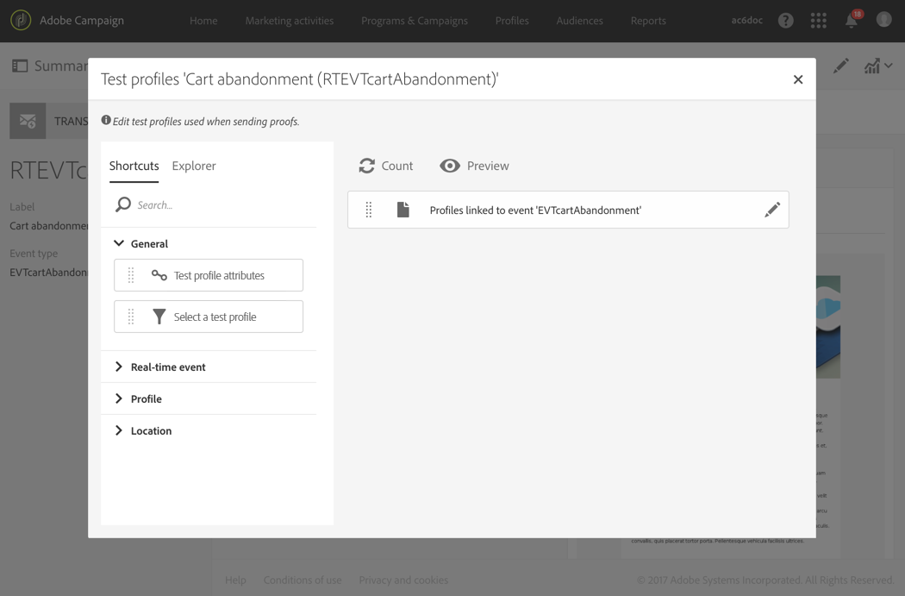
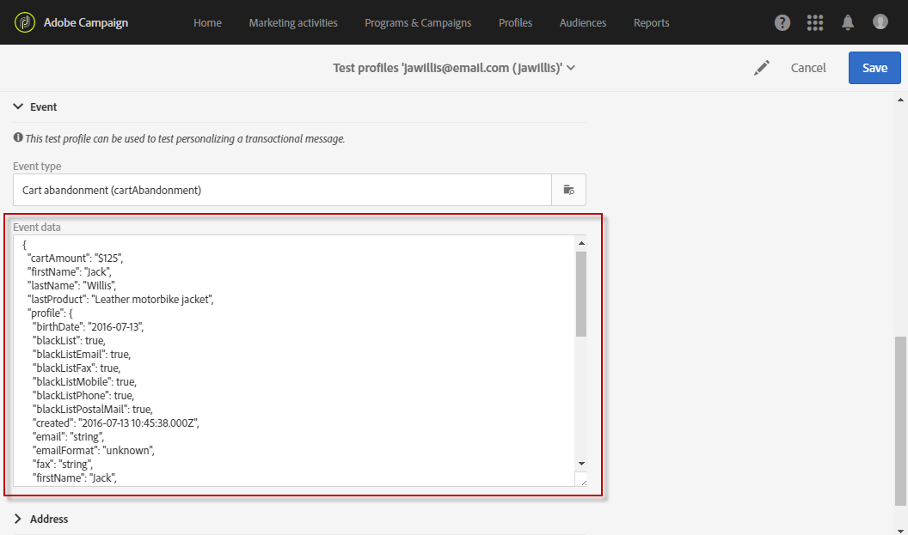
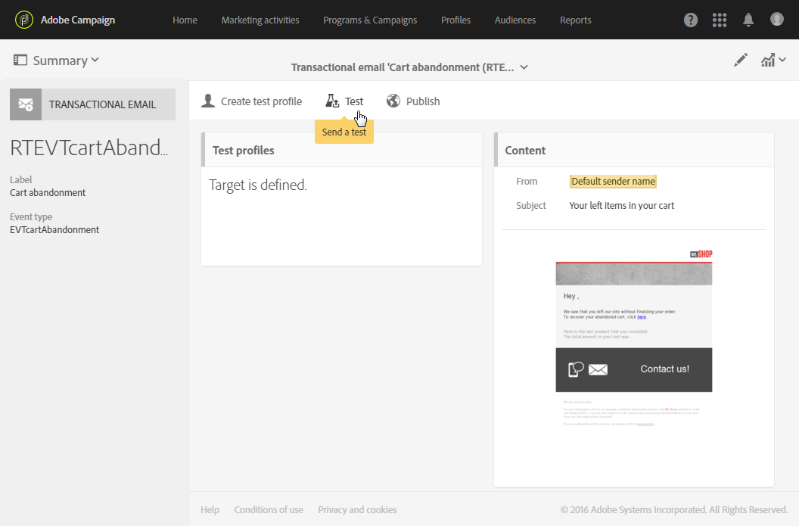

# トランザクションメッセージのテスト {#testing-a-transactional-message}

トランザクションメッセージを公開する前に、メッセージを適切にチェックできる特定のテストプロファイルを作成できます。

## 特定のテストプロファイルの定義 {#defining-specific-test-profile}

イベントにリンクされるテストプロファイルを定義します。これにより、メッセージをプレビューし、関連するプルーフを送信できます。

1. [&#x200B; トランザクションメッセージダッシュボード &#x200B;](../../channels/using/editing-transactional-message.md#accessing-transactional-messages)で、**[!UICONTROL Create test profile]** ボタンをクリックします。

   

1. JSON 形式で送信する情報を「**[!UICONTROL Event data used for personalization]**」セクションに指定します。 これは、メッセージをプレビューするとき、およびテストプロファイルが配達確認を受け取るときに使用されるコンテンツです。

   

   >[!NOTE]
   >
   >メッセージを強化した場合は、**[!UICONTROL Profile]**&#x200B;など、別のテーブルに関連する情報を入力することもできます。 [&#x200B; イベントの強化](../../channels/using/configuring-transactional-event.md#enriching-the-transactional-message-content)および[&#x200B; トランザクションメッセージのパーソナライズ &#x200B;](../../channels/using/editing-transactional-message.md#personalizing-a-transactional-message)を参照してください。

1. 作成したテストプロファイルは、トランザクションメッセージで事前に指定されます。 配達確認のターゲットを確認するには、メッセージの「**[!UICONTROL Test profiles]**」ブロックをクリックします。

   

新しいテストプロファイルを作成するか、**[!UICONTROL Test profiles]** メニューに既に存在するテストプロファイルを使用することもできます。 手順は次のとおりです。

1. 左上隅の&#x200B;**Adobe** ロゴをクリックし、**[!UICONTROL Profiles & audiences]** > **[!UICONTROL Test profiles]**&#x200B;を選択します。
1. **[!UICONTROL Event]** セクションで、作成したばかりのイベントを選択します。 この例では、「買い物かごの放棄（EVTcartAbandant）」を選択します。
1. JSON 形式で送信する情報を「**[!UICONTROL Event data]**」テキストボックスに指定します。

   

1. 変更内容を保存します。
1. [作成したメッセージ &#x200B;](../../channels/using/editing-transactional-message.md#accessing-transactional-messages)にアクセスし、更新されたテストプロファイルを選択します。

**関連トピック：**

* [テストプロファイルの管理](../../audiences/using/managing-test-profiles.md)
* [オーディエンスの作成](../../audiences/using/creating-audiences.md)

## 配達確認の送信 {#sending-proof}

1つ以上の特定のテストプロファイルを作成し、トランザクションメッセージを保存したら、プルーフを送信してテストできます。

プルーフを送信する手順について詳しくは、[&#x200B; プルーフの送信](../../sending/using/sending-proofs.md) セクションを参照してください。
