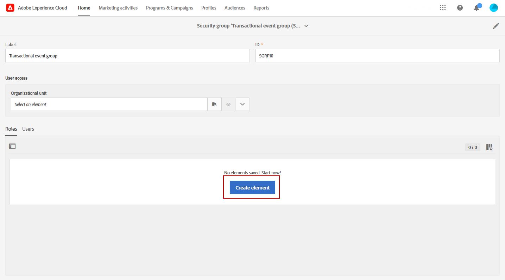
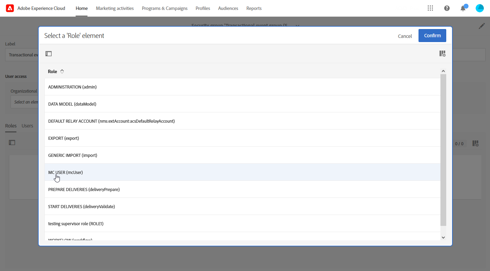
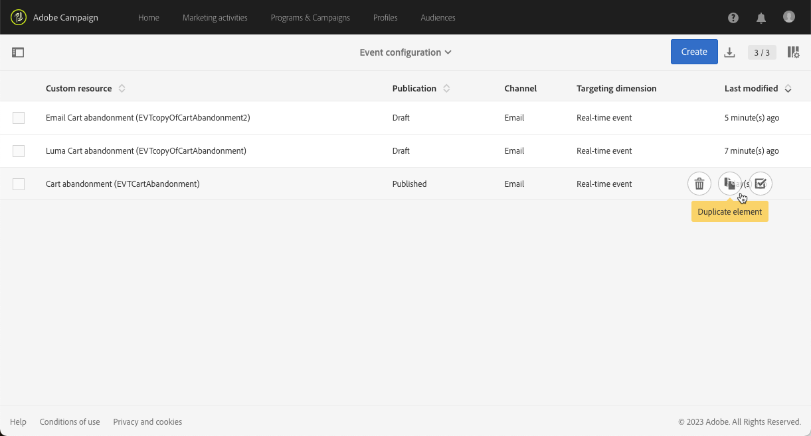
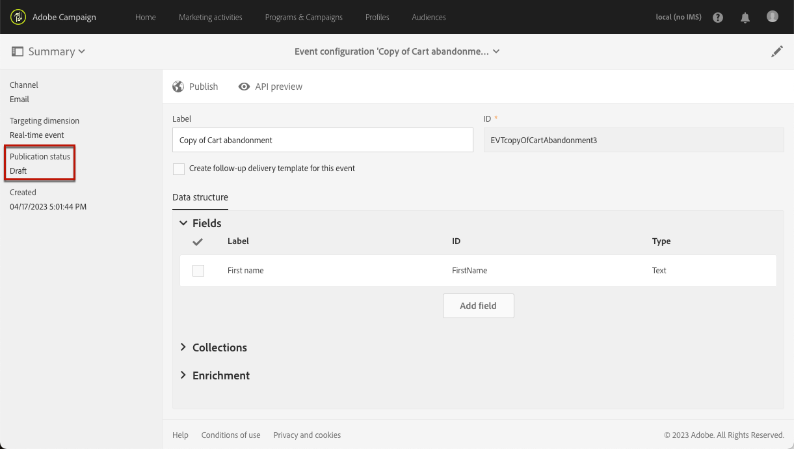
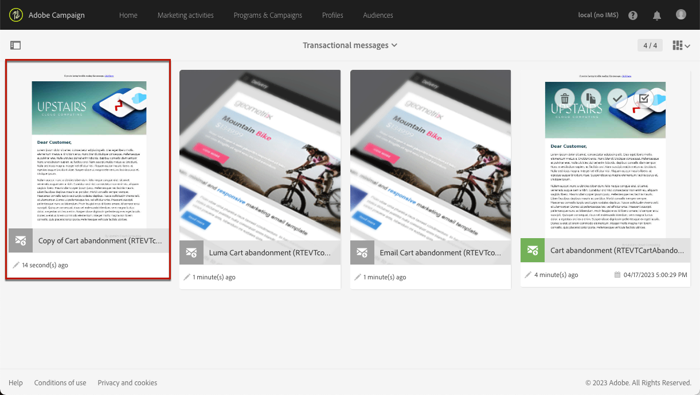
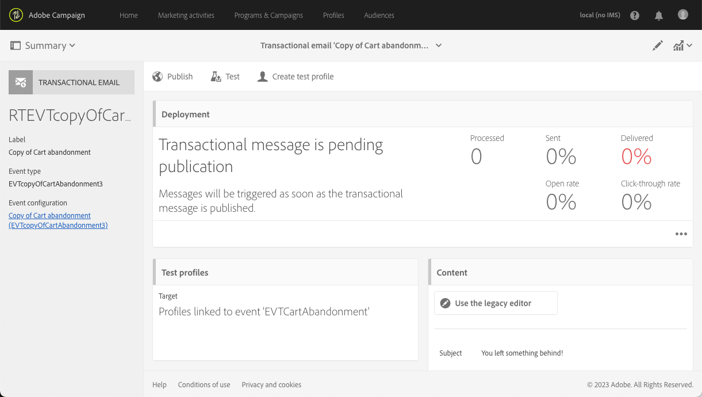

# トランザクションイベントの改善 {#transactional-event-improvements}

>[!AVAILABILITY]
>
>これらの機能は現在、一連の組織でのみ使用できます（利用制限あり）。 詳しくは、アドビ担当者にお問い合わせください。

現在、Adobe Campaign Standardでは、Administrator セキュリティグループを持たないユーザーがトランザクションイベントにアクセス、作成、または公開できなくなり、イベントの設定と公開が必要だが管理者権限がないビジネスユーザーに問題が発生します。 また、トランザクションイベントを複製することはできません。

トランザクションメッセージングアクセス制御に対して、次の改善を実施しました。

* **MC user**&#x200B;という新しい&#x200B;**[!UICONTROL Role]**&#x200B;が追加され、管理者以外のユーザーがトランザクションイベント設定を管理できるようになりました。 **MC ユーザー**&#x200B;の役割により、これらのユーザーはトランザクションイベントとメッセージにアクセス、作成、公開、非公開の機能を付与されます。

* 実行配信（トランザクションメッセージが再編集されて公開されるたびに作成される技術的なメッセージ、またはデフォルトで月に1回）が、**Message Center エージェント（mcExec）**&#x200B;のセキュリティグループの&#x200B;**[!UICONTROL Organizational unit]**&#x200B;に制限されるのではなく、イベントを作成するユーザーが属するセキュリティグループの&#x200B;**[!UICONTROL Organizational unit]**&#x200B;に設定されるようになりました。

* **管理者**&#x200B;は、公開されたトランザクションイベントを複製できるようになりました。また、イベントを作成したユーザーと同じ&#x200B;**組織単位**&#x200B;階層にある&#x200B;**MC ユーザー**&#x200B;の役割を持つユーザーも複製できるようになりました。

## MC ユーザーの役割の割り当て {#assign-role}

**MC ユーザー**&#x200B;の役割をセキュリティグループに割り当てるには：

1. 新しい&#x200B;**[!UICONTROL Security group]**&#x200B;を作成するか、既存のものを更新します。 [詳細情報](../../administration/using/managing-groups-and-users.md)。

1. 「**[!UICONTROL Create element]**」をクリックして、セキュリティグループに役割を割り当てます。

   

1. MC ユーザー&#x200B;**[!UICONTROL Role]**&#x200B;を選択し、**[!UICONTROL Confirm]**&#x200B;をクリックします。

   >[!IMPORTANT]
   >
   > MC ユーザーの役割をオペレーターに割り当てる場合は、イベントを非公開にする機能があるため、慎重に進めてください。

   

1. 設定が完了したら、**[!UICONTROL Save]**&#x200B;をクリックします。

この&#x200B;**[!UICONTROL Security group]**&#x200B;にリンクされたユーザーは、トランザクションイベントとメッセージにアクセス、作成、公開できるようになりました。

## MC ユーザーセキュリティグループの割り当て {#assign-group}

1. Admin Consoleで、「**製品**」タブを選択します。

1. 「**Adobe Campaign Standard**」を選択し、インスタンスを選択します。

1. **製品プロファイル** リストから、**MC ユーザー** グループを選択します。

1. 「**ユーザーを追加**」をクリックし、この製品プロファイルに追加するプロファイルの名前、ユーザーグループ、または電子メールアドレスを入力します。

1. 追加したら、**保存**&#x200B;をクリックします。

この&#x200B;**[!UICONTROL Security group]**&#x200B;に追加されたユーザーは、トランザクションイベントとメッセージにアクセス、作成、公開できるようになりました。

## トランザクションイベントの重複 {#duplicate-transactional-events}

**管理者** セキュリティ グループ <!--([Functional administrators](../../administration/using/users-management.md#functional-administrators)?)-->を持つユーザーは、イベントが&#x200B;**公開**&#x200B;されている場合に、イベント設定を複製できるようになりました。

さらに、**MC ユーザー**&#x200B;の役割を持つ管理者以外のユーザーは、イベント設定にアクセスできるようになりましたが、複製する権限は、所属する&#x200B;**組織単位**&#x200B;によって決定されます。 現在のユーザーとイベントを作成したユーザーが同じ組織単位階層に属している場合、複製が許可されます。

例えば、「France Sales」組織単位に属するユーザーがイベント設定を作成する場合は、次のようになります。

* 組織単位が「パリの販売」である別のユーザーは、このイベントを複製できます。「パリの販売」は「フランスの販売」組織単位の一部であるため。

* ただし、組織単位が「San Francisco Sales」のユーザーは、「San Francisco Sales」の組織単位の下にあり、「France Sales」の組織単位とは別であるため、実行できません。

イベント設定を複製するには、次の手順に従います。

1. 左上隅の&#x200B;**Adobe** ロゴをクリックし、**[!UICONTROL Marketing plans]** > **[!UICONTROL Transactional messages]** > **[!UICONTROL Event configuration]**&#x200B;を選択します。

1. 選択した公開イベント設定にマウスを合わせ、**[!UICONTROL Duplicate element]** ボタンを選択します。

   

   >[!CAUTION]
   >
   >公開されていないイベント設定を複製することはできません。 [詳細情報](publishing-transactional-event.md)

1. 重複したイベントが自動的に表示されます。 元のイベントに対して定義したのと同じ設定が含まれていますが、**[!UICONTROL Draft]**&#x200B;のステータスがあります。

   

1. 対応するトランザクションメッセージが自動的に作成されます。 アクセスするには、**[!UICONTROL Transactional messages]** > **[!UICONTROL Transactional messages]**&#x200B;に移動します。

   

1. 新しく複製されたメッセージを開きます。 元のトランザクションメッセージに対して定義したデザインと同じデザインが含まれていますが、元のトランザクションメッセージが公開された場合でも、**[!UICONTROL Draft]** ステータスになります。

   

1. このメッセージを編集してパーソナライズできるようになりました。 [&#x200B; トランザクションメッセージの編集](../../channels/using/editing-transactional-message.md)を参照してください。

## 影響 {#impacts}

次の表に、これらの改善の影響の概要を示します。

| オブジェクト | 変更前 | この変更後 |
|:-: | :--: | :-:|
| トランザクションイベント | **Administrator** セキュリティ グループ内のユーザーのみがイベントを作成および公開できます。 | **MC ユーザー**&#x200B;の役割により、ユーザーはイベントを作成および公開できます。 |
| トランザクションメッセージ | トランザクションメッセージは、**Message Center エージェント （mcExec）** セキュリティグループの&#x200B;**組織単位**&#x200B;に設定されます。 | トランザクションメッセージは、トランザクションイベント/メッセージを作成するユーザーが属するセキュリティグループの&#x200B;**組織単位**&#x200B;に設定されます。 |
| 実行配信 | 実行の配信は、**Message Center エージェント （mcExec）** セキュリティ グループの&#x200B;**組織単位**&#x200B;に設定されます。 | 実行配信は、トランザクションイベント/メッセージを作成するユーザーが属するセキュリティグループの&#x200B;**組織単位**&#x200B;に設定されます。 |
| 公開されたトランザクションイベント | どのユーザーでも複製することはできません。 | <ul><li>**Administrator** セキュリティ グループを持つユーザーは、公開されたイベントを複製できます。</li> <li>**MC ユーザー**&#x200B;の役割を持つユーザーは、イベントを作成したユーザーと同じ&#x200B;**組織単位**&#x200B;階層にある場合、公開されたイベントを複製できます。</li></ul> |

<!--Transactional Message Templates| Transactional Message templates are set to the Organizational unit **All**. | Transaction Message Template will be set to the **Organizational unit** of the security group to which the user creating the message template belongs.-->