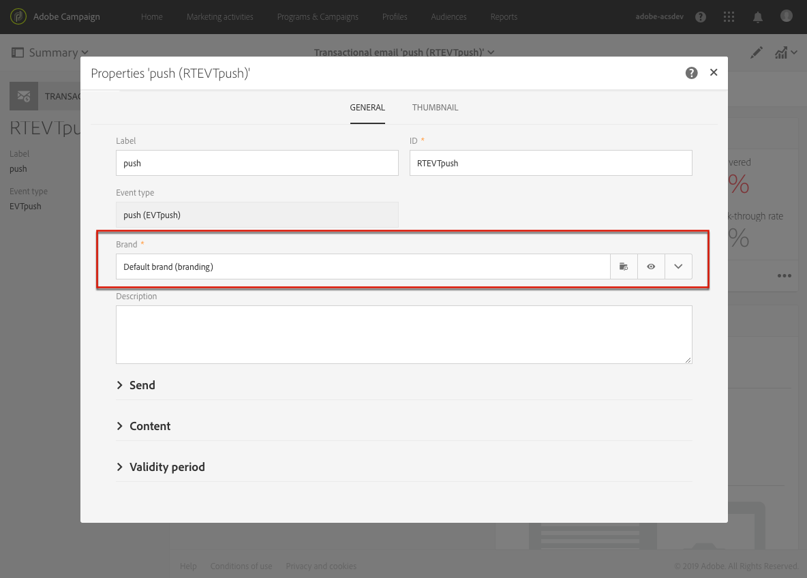

# トランザクションメッセージのベストプラクティスと制限事項 {#transactional-messaging-limitations}

この節では、トランザクションメッセージの作成を開始する前に確認しておくべきベストプラクティスと制限事項を示します。

<!--For more on transactional messages, including on how to configure and create them, see [Getting started with transactional messaging](../../channels/using/getting-started-with-transactional-msg.md).-->

## 権限 {#permissions}

トランザクション イベントを設定し、トランザクション メッセージにアクセスできるのは、[管理](../../administration/using/users-management.md#functional-administrators)の役割を持つユーザーのみです。

## イベントの設定と公開 {#design-and-publication}

トランザクションイベントを設定および公開する際に、実行する必要がある手順の一部を元に戻すことはできません。 次の制限事項に留意してください。

* トランザクションメッセージで使用できるチャネルは、**[!UICONTROL Email]**、**[!UICONTROL Mobile (SMS)]**&#x200B;および&#x200B;**[!UICONTROL Push notification]**&#x200B;です。
* 各イベント設定で使用できるチャネルは 1 つだけです。 詳しくは、[イベントの作成](../../channels/using/configuring-transactional-event.md#creating-an-event)を参照してください。
* イベントを作成した後は、チャネルを変更できません。 したがって、メッセージが正常に送信されない場合は、ワークフローを使用して別のチャネルからメッセージを送信できるメカニズムを設計する必要があります。 [ワークフローのデータとプロセス](../../automating/using/get-started-workflows.md).
* イベントの作成後にターゲティングディメンション（**[!UICONTROL Real-time event]** または **[!UICONTROL Profile]**）を変更することはできません。 詳しくは、[イベントの作成](../../channels/using/configuring-transactional-event.md#creating-an-event)を参照してください。
* 公開をロールバックすることはできませんが、イベントを非公開にすることは可能です。この操作により、イベントとそれに関連するトランザクションメッセージにアクセスできなくなります。 詳しくは、[イベントの非公開](../../channels/using/publishing-transactional-event.md#unpublishing-an-event)を参照してください。
* イベントに関連付けることができる唯一のトランザクションメッセージは、そのイベントの公開時に自動的に作成されるメッセージです。 詳しくは、[イベントのプレビューと公開](../../channels/using/publishing-transactional-event.md#previewing-and-publishing-the-event)を参照してください。

## トランザクションメッセージ数 {#transactional-message-number}

公開されるトランザクションメッセージの数は、プラットフォームに大きな影響を与える可能性があります。 最適なパフォーマンスを実現するには、公開されるトランザクションメッセージの数を100未満に抑える必要があります。そうしないと、パフォーマンスの低下が発生する可能性があります。 これを確実にするには、前述のガードレールを満たすために、未使用のトランザクションメッセージを非公開または削除します。 [ トランザクションメッセージの非公開](../../channels/using/publishing-transactional-message.md#unpublishing-a-transactional-message)および[ トランザクションメッセージの削除](../../channels/using/publishing-transactional-message.md#deleting-a-transactional-message)を参照してください。

最高のパフォーマンスを確保するために、未使用のイベントを非公開または削除することもできます。 実際、イベントを非公開または削除すると、対応するトランザクションメッセージ、および送信ログとトラッキングログ（存在する場合）も非公開または削除されます。 [ イベントの非公開](../../channels/using/publishing-transactional-event.md#unpublishing-an-event)および[ イベントの削除](../../channels/using/publishing-transactional-event.md#deleting-an-event)を参照してください。

## パーソナライズ機能 {#personalization}

メッセージの内容をパーソナライズする方法は、トランザクションメッセージの種類によって異なります。 具体的な内容は以下のとおりです。

### イベントベースのトランザクトメッセージ

* パーソナライゼーションに関する情報は、イベント自体に含まれるデータから取得されます。 [ イベントベースのトランザクションメッセージ設定](../../channels/using/configuring-transactional-event.md#event-based-transactional-messages)を参照してください。
* **では、イベントトランザクションメッセージで&#x200B;**[!UICONTROL Unsubscription link]**コンテンツブロックを使用できません。**
* イベントベースのトランザクションメッセージでは、受信者とメッセージコンテンツのパーソナライゼーションを定義するために、送信イベント内のデータのみを使用することが想定されています。 ただし、Adobe Campaign データベースの情報を使用して、トランザクションメッセージの内容をエンリッチメントすることができます。 [ イベントの強化](../../channels/using/configuring-transactional-event.md#enriching-the-transactional-message-content)および[ トランザクションメッセージのパーソナライズ ](../../channels/using/editing-transactional-message.md#personalizing-a-transactional-message)を参照してください。
* イベントトランザクションメッセージにはプロファイル情報が含まれないため、プロファイルを使用したエンリッチメントの場合でも、疲労ルールと互換性がありません。

### プロファイルベースのトランザクションメッセージ

* パーソナライゼーションに関する情報は、イベントに含まれるデータ、または紐付け済みのプロファイルレコードから取得できます。 [ プロファイルベースのトランザクションメッセージ設定](../../channels/using/configuring-transactional-event.md#profile-based-transactional-messages)および[ プロファイルベースのトランザクションメッセージの詳細](../../channels/using/editing-transactional-message.md#profile-transactional-message-specificities)を参照してください。
* プロファイルのトランザクションメッセージで&#x200B;**[!UICONTROL Unsubscription link]** コンテンツブロックを&#x200B;**さんが**&#x200B;使用できます。 [コンテンツブロックの追加](../../designing/using/personalization.md#adding-a-content-block)を参照してください。
* 疲労ルールは、プロファイルトランザクションメッセージと互換性があります。 [疲労ルール](../../sending/using/fatigue-rules.md)を参照してください。

### 製品リスト

商品リストは、トランザクション **電子メールメッセージ**&#x200B;でのみ利用できます。 詳しくは、[トランザクションメッセージでの製品リストの使用](../../designing/using/using-product-listings.md)を参照してください。

## ブランディング {#permissions-and-branding}

[ブランディング](../../administration/using/branding.md)管理の場合、トランザクションメッセージは標準のメッセージよりも柔軟性が低くなります。 トランザクションメッセージで使用されるすべてのブランドを&#x200B;**[!UICONTROL All]**[&#x200B;組織単位](../../administration/using/organizational-units.md)にリンクすることをお勧めします。 詳しくは、以下の詳細を参照してください。

トランザクションメッセージを編集する際に、ブランドにリンクして、ブランド名やブランドロゴなどのパラメーターを自動的に適用できます。 トランザクションメッセージプロパティでは、デフォルトで **[!UICONTROL Default brand]** が選択されています。

トランザクションメッセージで使用されるすべてのオブジェクト（ブランドを含む）は **[!UICONTROL Message Center]** 組織単位で表示されている必要があります。つまり、これらのオブジェクトは **[!UICONTROL Message Center]** 組織単位または **[!UICONTROL All]** 組織単位に属する必要があります。

ただし、メッセージプロパティで選択したブランドが、**[!UICONTROL Message Center]** または **[!UICONTROL All]** とは異なる組織単位にリンクされている場合、これはエラーの原因となり、トランザクションメッセージを送信できなくなります。

したがって、トランザクションメッセージのコンテキストでマルチブランディングを使用する場合は、すべてのブランドを **[!UICONTROL Message Center]** 組織単位または **[!UICONTROL All]** 組織単位にリンクする必要があります。

## トランザクションメッセージの書き出しと読み込み {#exporting-and-importing-transactional-messages}

* トランザクションメッセージをエクスポートするには、[パッケージのエクスポートを作成](../../automating/using/managing-packages.md#creating-a-package)する際に、対応するイベント設定を含める必要があります。
* トランザクションメッセージが[パッケージからインポートされる](../../automating/using/managing-packages.md#importing-a-package)と、トランザクションメッセージリストには表示されなくなります。 関連するトランザクションメッセージを使用可能にするには、イベント設定を[公開](../../channels/using/publishing-transactional-event.md)する必要があります。
