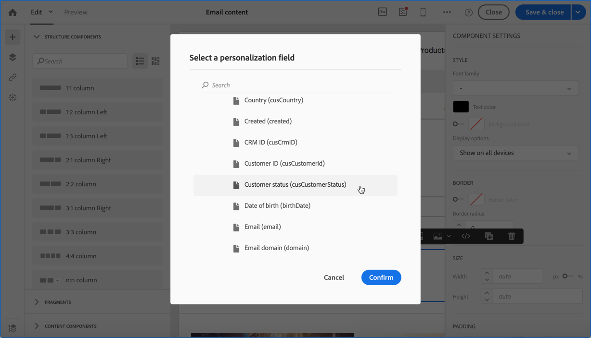

# トランザクションメッセージのユースケース {#transactional-messaging-use-case}

この例では、Adobe Campaignのトランザクションメッセージ機能を使用して、web サイトでの購入が完了するたびに CRM ID で顧客を特定する確認メールを送信します。

前提条件は次のとおりです。

* **[!UICONTROL Profile]** リソースが、CRM ID に対応する新しいフィールドを使用して拡張されていることを確認します。

* 購入に対応するカスタムリソースを作成して公開し、**[!UICONTROL Profile]** リソースにリンクします。 これにより、このリソースから情報を取得して、メッセージコンテンツを充実させることができます。

リソースの拡張、作成、公開について詳しくは、[&#x200B; この節 &#x200B;](../../developing/using/key-steps-to-add-a-resource.md) を参照してください。

このユースケースを実装する主な手順を以下に示します。

>[!NOTE]
>
>トランザクションメッセージの一般的なプロセスを図で表すには、[&#x200B; このスキーマ &#x200B;](../../channels/using/getting-started-with-transactional-msg.md#key-steps) を参照してください。

## 手順 1 - イベント設定の作成と公開 {#create-event-configuration}

1. **[!UICONTROL Email]** チャネルを使用して新しいイベントを作成します。 詳しくは、[イベントの作成](../../channels/using/configuring-transactional-event.md#creating-an-event)を参照してください。

1. **[!UICONTROL Profile]** ターゲティングディメンションを選択して、[&#x200B; プロファイルベースのトランザクションメッセージ &#x200B;](../../channels/using/configuring-transactional-event.md#profile-based-transactional-messages) を作成します。

1. トランザクションメッセージをパーソナライズするために使用できる属性を定義します。 この例では、「CRM ID」と「製品識別子」フィールドを追加します。 [&#x200B; イベント属性の定義 &#x200B;](../../channels/using/configuring-transactional-event.md#defining-the-event-attributes) を参照してください。

   

1. 顧客の購入に関する情報でメッセージコンテンツをエンリッチメントするには、**[!UICONTROL Purchase]** リソースをターゲットにしたエンリッチメントを作成します。 [&#x200B; イベントのエンリッチメント &#x200B;](../../channels/using/configuring-transactional-event.md#enriching-the-transactional-message-content) を参照してください。

   

1. イベントに以前に追加した「製品識別子」フィールドと、**[!UICONTROL Purchase]** リソース内の対応するフィールドの間に結合条件を作成します。

   

1. また、プロファイルベースのイベントには必須なので、**[!UICONTROL Profile]** のリソースをターゲットにしたエンリッチメントも作成する必要があります。

1. メッセージに以前に追加した「CRM ID」フィールドと、拡張した **[!UICONTROL Profile]** リソースの対応するフィールドの間に結合条件を作成します。<!--What's the purpose to have created a CRM ID for this event and to have the CRM ID as a join condition? could it be any other field provided you created it in the event?-->

   

1. 「**[!UICONTROL Targeting enrichment]**」セクションで、**[!UICONTROL Profile]** リソースに対して、配信の実行中にメッセージターゲットとして使用されるエンリッチメントを選択します。

   

1. イベントのプレビューと公開。 詳しくは、[イベントのプレビューと公開](../../channels/using/publishing-transactional-event.md#previewing-and-publishing-the-event)を参照してください。

## 手順 2 - トランザクションメッセージを編集して公開する {#create-transactional-message}

1. イベントの公開時に自動的に作成されたトランザクションメッセージに移動します。 [&#x200B; トランザクションメッセージへのアクセス &#x200B;](../../channels/using/editing-transactional-message.md#accessing-transactional-messages) を参照してください。

1. メッセージを編集およびパーソナライズします。 [&#x200B; プロファイルトランザクションメッセージの編集 &#x200B;](../../channels/using/editing-transactional-message.md#editing-profile-transactional-message) を参照してください。

1. **[!UICONTROL Profile]** リソースに追加した「CRM ID」フィールドとの紐付けを通じて、すべてのプロファイル情報に直接アクセスし、メッセージを [&#x200B; パーソナライズ &#x200B;](../../designing/using/personalization.md#inserting-a-personalization-field) できます。

   

1. 「製品識別子」フィールドとの紐付けを通じて、**[!UICONTROL Purchase]** リソースの任意のフィールドを追加することで、顧客の購入に関する情報でメッセージコンテンツをエンリッチメントできます。

   

   これを行うには、コンテキストツールバーから **[!UICONTROL Insert personalization field]** を選択します。 **[!UICONTROL Context]**/**[!UICONTROL Transactional event]**/**[!UICONTROL Event context]** ノードから、**[!UICONTROL Purchase]** カスタムリソースに対応するノードを開き、任意のフィールドを選択します。

1. 特定のテストプロファイルを使用して、メッセージをテストできます。 [&#x200B; トランザクションメッセージのテスト &#x200B;](../../channels/using/testing-transactional-message.md#testing-a-transactional-message) を参照してください。

1. コンテンツの準備が整ったら、変更を保存し、メッセージを公開します。 [トランザクションメッセージの公開](../../channels/using/publishing-transactional-message.md#publishing-a-transactional-message)を参照してください。

## 手順 3 - イベントトリガーの統合 {#integrate-event-trigger}

イベントを Web サイトに統合します。 [&#x200B; イベントトリガーの統合 &#x200B;](../../channels/using/getting-started-with-transactional-msg.md#integrate-event-trigger) を参照してください。

## 手順 4 - メッセージ配信 {#message-delivery}

これらの手順をすべて実行すると、顧客が web サイトから製品を購入するとすぐに、購入に関する情報を含む、パーソナライズされた確認メールが届きます。
