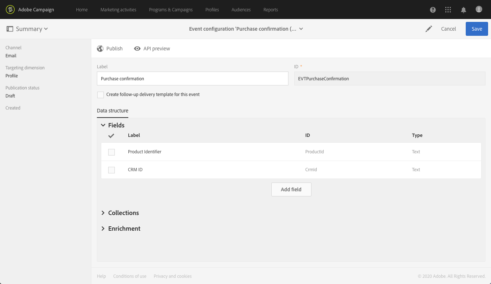
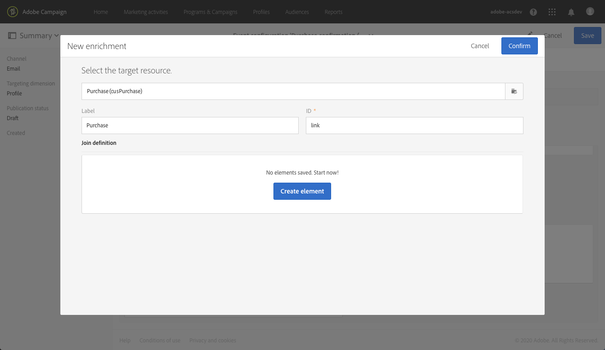
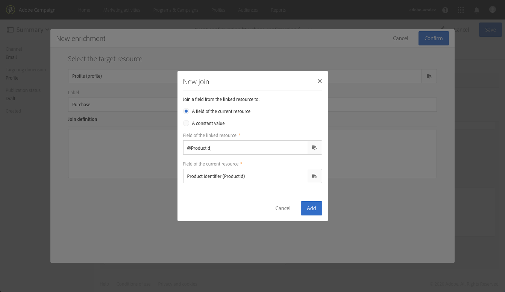
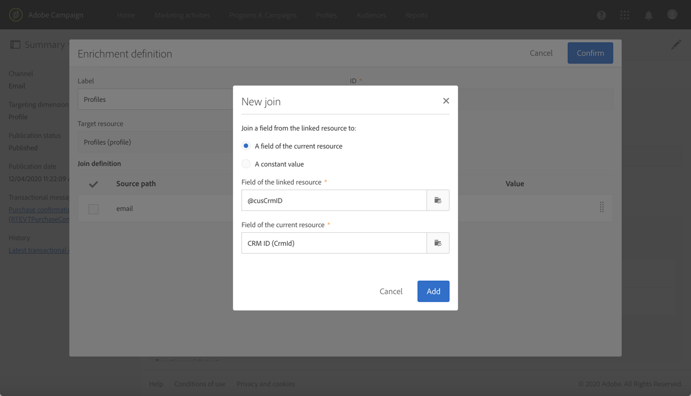
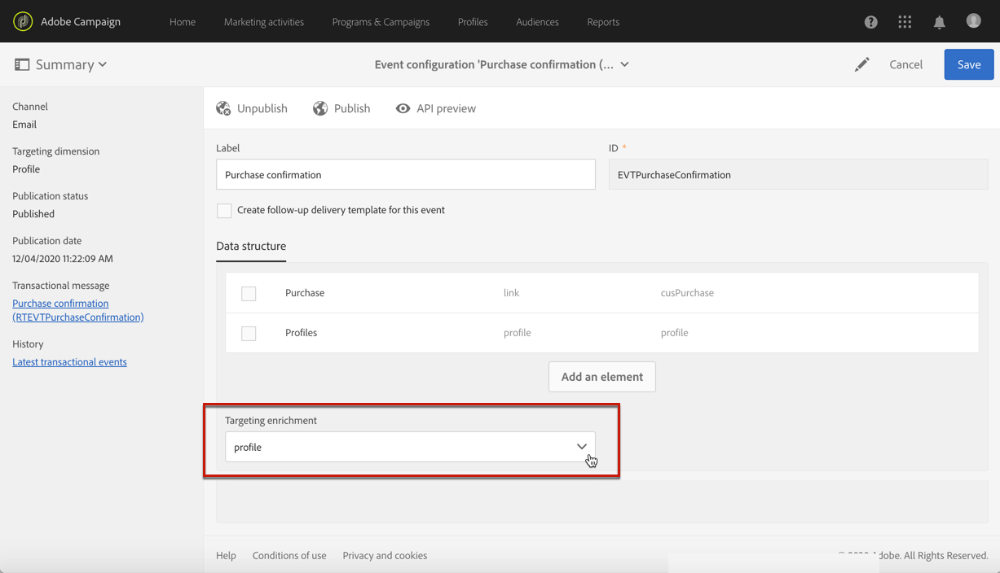
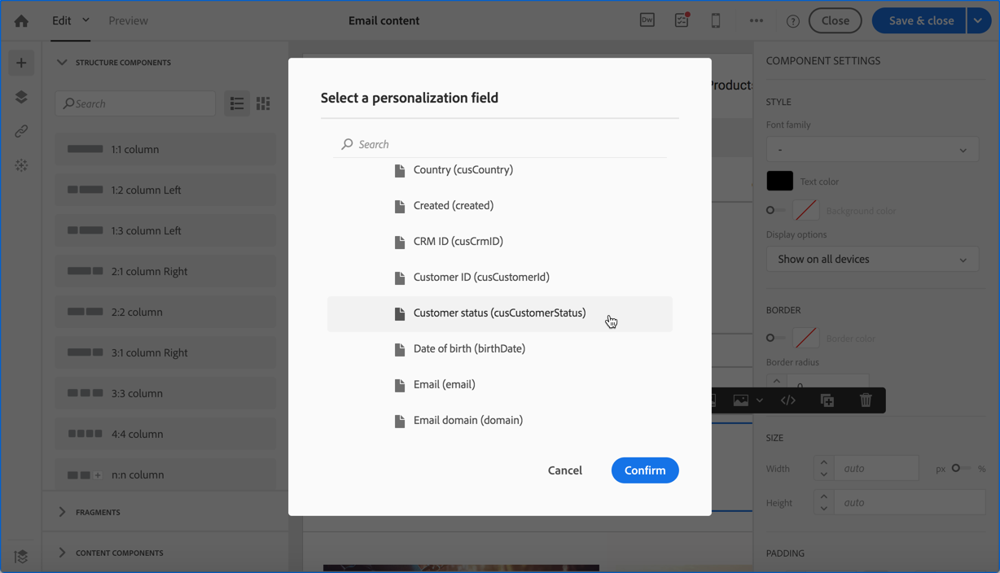
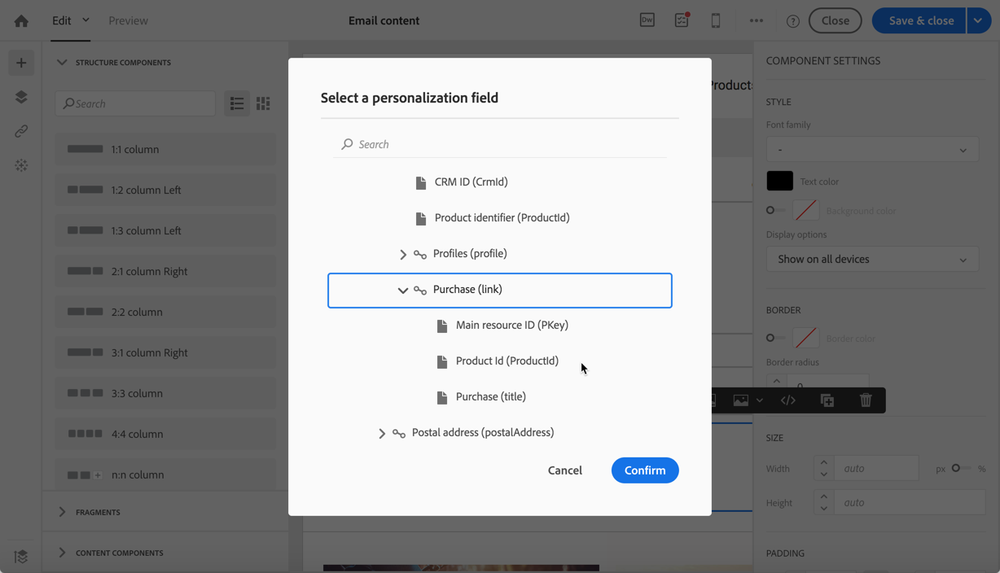

# トランザクションメッセージのユースケース {#transactional-messaging-use-case}

この例では、Adobe Campaignのトランザクションメッセージ機能を使用して、web サイトで購入するたびに確認メールを送信し、CRM IDを介して顧客を識別します。

前提条件は次のとおりです。

* **[!UICONTROL Profile]** リソースが、CRM IDに対応する新しいフィールドで拡張されていることを確認します。

* 購入に対応するカスタムリソースを作成して公開し、それを&#x200B;**[!UICONTROL Profile]** リソースにリンクします。 これにより、このリソースから情報を取得して、メッセージコンテンツを充実させることができます。

リソースの拡張、作成、公開について詳しくは、[この節](../../developing/using/key-steps-to-add-a-resource.md)を参照してください。

このユースケースを実装するための主な手順を以下に示します。

>[!NOTE]
>
>トランザクションメッセージの一般的なプロセスのグラフィカルな表現については、[このスキーマ ](../../channels/using/getting-started-with-transactional-msg.md#key-steps)を参照してください。

## 手順1 - イベント設定を作成して公開する {#create-event-configuration}

1. **[!UICONTROL Email]** チャネルを使用して新しいイベントを作成します。 詳しくは、[イベントの作成](../../channels/using/configuring-transactional-event.md#creating-an-event)を参照してください。

1. **[!UICONTROL Profile]** ターゲティングディメンションを選択して、[ プロファイルベースのトランザクションメッセージ ](../../channels/using/configuring-transactional-event.md#profile-based-transactional-messages)を作成します。

1. トランザクションメッセージをパーソナライズするために使用できる属性を定義します。 この例では、「CRM ID」フィールドと「製品識別子」フィールドを追加します。 [ イベント属性の定義](../../channels/using/configuring-transactional-event.md#defining-the-event-attributes)を参照してください。

   

1. 顧客の購入に関する情報をメッセージ コンテンツに含めるには、**[!UICONTROL Purchase]** リソースをターゲットとするエンリッチメントを作成します。 [ イベントの強化](../../channels/using/configuring-transactional-event.md#enriching-the-transactional-message-content)を参照してください。

   

1. 以前にイベントに追加された「製品識別子」フィールドと、**[!UICONTROL Purchase]** リソースの対応するフィールドとの間に結合条件を作成します。

   

1. プロファイルベースのイベントには必須であるため、**[!UICONTROL Profile]** リソースをターゲットとするエンリッチメントも作成する必要があります。

1. 以前にメッセージに追加された「CRM ID」フィールドと、拡張した&#x200B;**[!UICONTROL Profile]** リソースの対応するフィールドとの間に結合条件を作成します。<!--What's the purpose to have created a CRM ID for this event and to have the CRM ID as a join condition? could it be any other field provided you created it in the event?-->

   

1. **[!UICONTROL Targeting enrichment]** セクションで、**[!UICONTROL Profile]** リソースのエンリッチメントを選択します。このエンリッチメントは、配信実行時にメッセージターゲットとして使用されます。

   

1. イベントをプレビューして公開します。 詳しくは、[イベントのプレビューと公開](../../channels/using/publishing-transactional-event.md#previewing-and-publishing-the-event)を参照してください。

## 手順2 - トランザクションメッセージの編集と公開 {#create-transactional-message}

1. イベントの公開時に自動的に作成されたトランザクションメッセージに移動します。 「[ トランザクションメッセージへのアクセス ](../../channels/using/editing-transactional-message.md#accessing-transactional-messages)」を参照してください。

1. メッセージの編集とパーソナライゼーション： [ プロファイルのトランザクションメッセージの編集](../../channels/using/editing-transactional-message.md#editing-profile-transactional-message)を参照してください。

1. **[!UICONTROL Profile]** リソースに追加した「CRM ID」フィールドとの紐付けにより、メッセージを[ パーソナライズ ](../../designing/using/personalization.md#inserting-a-personalization-field)するためにすべてのプロファイル情報に直接アクセスできます。

   

1. 「製品識別子」フィールドとの紐付けにより、**[!UICONTROL Purchase]** リソースから任意のフィールドを追加して、顧客の購入に関する情報をメッセージのコンテンツに追加できます。

   

   これを行うには、コンテキストツールバーから&#x200B;**[!UICONTROL Insert personalization field]**&#x200B;を選択します。 **[!UICONTROL Context]** > **[!UICONTROL Transactional event]** > **[!UICONTROL Event context]** ノードから、**[!UICONTROL Purchase]** カスタムリソースに対応するノードを開き、任意のフィールドを選択します。

1. 特定のテストプロファイルを使用して、メッセージをテストできます。 [ トランザクションメッセージのテスト ](../../channels/using/testing-transactional-message.md#testing-a-transactional-message)を参照してください。

1. コンテンツの準備ができたら、変更を保存してメッセージを公開します。 [トランザクションメッセージの公開](../../channels/using/publishing-transactional-message.md#publishing-a-transactional-message)を参照してください。

## 手順3 - イベントトリガーの統合 {#integrate-event-trigger}

イベントをweb サイトに統合する： [ イベントトリガーの統合](../../channels/using/getting-started-with-transactional-msg.md#integrate-event-trigger)を参照してください。

## ステップ 4 - メッセージ配信 {#message-delivery}

これらすべてのステップを完了すると、顧客がweb サイトから製品を購入するとすぐに、購入に関する情報を含むパーソナライズされた確認メールが届きます。
