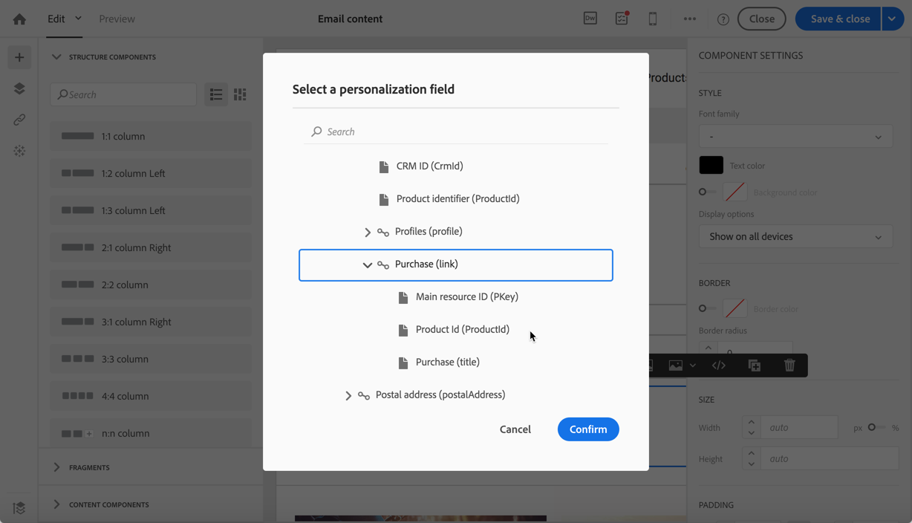

# トランザクションメッセージのユースケース {#transactional-messaging-use-case}

この例では、Adobe Campaignトランザクションメッセージ機能を使用して、Web サイトでの各購入後に確認メールを送信し、CRM ID を使用して顧客を識別します。

前提条件は次のとおりです。

* 必ず **[!UICONTROL Profile]** リソースは、CRM ID に対応する新しいフィールドで拡張されました。

* 購入に対応したカスタムリソースを作成して公開し、 **[!UICONTROL Profile]** リソース。 これにより、このリソースから情報を取得して、メッセージコンテンツをエンリッチメントできます。

リソースの拡張、作成および公開について詳しくは、 [この節](../../developing/using/key-steps-to-add-a-resource.md).

この使用例を実装する主な手順を次に示します。

>[!NOTE]
>
>トランザクションメッセージの一般的なプロセスのグラフィカルな表現については、 [このスキーマ](../../channels/using/getting-started-with-transactional-msg.md#key-steps).

## 手順 1 — イベント設定の作成と公開 {#create-event-configuration}

1. 新しいイベントを作成するには、 **[!UICONTROL Email]** チャネル。 詳しくは、[イベントの作成](../../channels/using/configuring-transactional-event.md#creating-an-event)を参照してください。

1. を選択します。 **[!UICONTROL Profile]** ターゲティングディメンションを使用して作成 [プロファイルベースのトランザクションメッセージ](../../channels/using/configuring-transactional-event.md#profile-based-transactional-messages).

1. トランザクションメッセージのパーソナライズに使用できる属性を定義します。 この例では、「CRM ID」および「製品識別子」フィールドを追加します。 詳しくは、 [イベント属性の定義](../../channels/using/configuring-transactional-event.md#defining-the-event-attributes).

   

1. 顧客の購入に関する情報をメッセージの内容に含めるには、 **[!UICONTROL Purchase]** リソース。 詳しくは、 [イベントのエンリッチメント](../../channels/using/configuring-transactional-event.md#enriching-the-transactional-message-content).

   

1. イベントに以前追加した「製品識別子」フィールドと、 **[!UICONTROL Purchase]** リソース。

   

1. これはプロファイルベースのイベントに必須なので、 **[!UICONTROL Profile]** リソース。

1. 以前メッセージに追加した「CRM ID」フィールドと、 **[!UICONTROL Profile]** 拡張したリソース。 <!--What's the purpose to have created a CRM ID for this event and to have the CRM ID as a join condition? could it be any other field provided you created it in the event?-->

   

1. 内 **[!UICONTROL Targeting enrichment]** セクションで、 **[!UICONTROL Profile]** リソース：配信の実行中にメッセージのターゲットとして使用されます。

   

1. イベントをプレビューして公開します。 詳しくは、[イベントのプレビューと公開](../../channels/using/publishing-transactional-event.md#previewing-and-publishing-the-event)を参照してください。

## 手順 2 — トランザクションメッセージを編集して公開する {#create-transactional-message}

1. イベントの公開時に自動的に作成されたトランザクションメッセージに移動します。 詳しくは、 [トランザクションメッセージへのアクセス](../../channels/using/editing-transactional-message.md#accessing-transactional-messages).

1. メッセージを編集し、パーソナライズします。 詳しくは、 [プロファイルトランザクションメッセージの編集](../../channels/using/editing-transactional-message.md#editing-profile-transactional-message).

1. に追加した「CRM ID」フィールドとの紐付けを通じて **[!UICONTROL Profile]** リソースは、 [パーソナライズ](../../designing/using/personalization.md#inserting-a-personalization-field) メッセージ。

   

1. 「製品識別子」フィールドとの紐付けを通じて、 **[!UICONTROL Purchase]** リソース。

   

   それには、「 **[!UICONTROL Insert personalization field]** を選択します。 次の **[!UICONTROL Context]** > **[!UICONTROL Transactional event]** > **[!UICONTROL Event context]** ノードで、 **[!UICONTROL Purchase]** カスタムリソースを選択し、任意のフィールドを選択します。

1. 特定のテストプロファイルを使用して、メッセージをテストできます。 詳しくは、 [トランザクションメッセージのテスト](../../channels/using/testing-transactional-message.md#testing-a-transactional-message).

1. コンテンツの準備が整ったら、変更を保存し、メッセージを公開します。 [トランザクションメッセージの公開](../../channels/using/publishing-transactional-message.md#publishing-a-transactional-message)を参照してください。

## 手順 3 — イベントトリガーの統合 {#integrate-event-trigger}

イベントを Web サイトに統合します。 詳しくは、 [イベントトリガーの統合](../../channels/using/getting-started-with-transactional-msg.md#integrate-event-trigger).

## 手順 4 — メッセージ配信 {#message-delivery}

これらの手順がすべて実行されると、顧客が Web サイトで製品を購入するとすぐに、購入に関する情報を含むパーソナライズされた確認 E メールが届きます。
