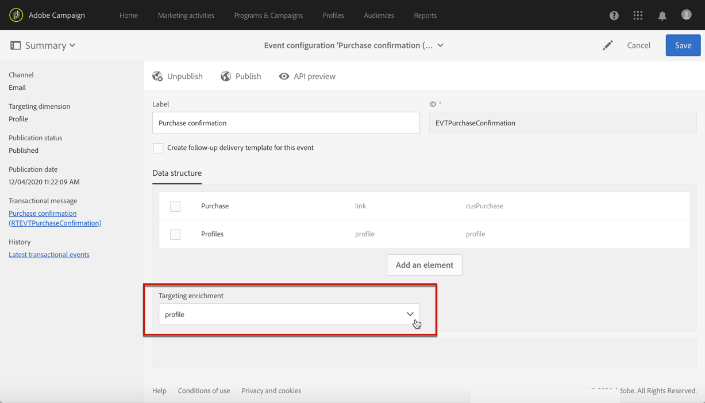

# トランザクションメッセージのユースケース {#transactional-messaging-use-case}

この例では、Adobe Campaignのトランザクションメッセージ機能を使用して、Webサイトでの各購入後に確認Eメールを送信し、CRM IDを使用して顧客を識別します。

前提条件は次のとおりです。

* **[!UICONTROL Profile]**&#x200B;リソースがCRM IDに対応する新しいフィールドで拡張されていることを確認します。

* 購入に対応したカスタムリソースを作成して公開し、**[!UICONTROL Profile]**&#x200B;リソースにリンクします。 これにより、このリソースから情報を取得して、メッセージコンテンツをエンリッチメントできます。

リソースの拡張、作成、公開について詳しくは、[この節](../../developing/using/key-steps-to-add-a-resource.md)を参照してください。

この使用例を実装する主な手順を以下に示します。

>[!NOTE]
>
>トランザクションメッセージの一般的なプロセスのグラフィカルな表現については、[このスキーマ](../../channels/using/getting-started-with-transactional-msg.md#key-steps)を参照してください。

## 手順1 — イベント設定の作成と公開 {#create-event-configuration}

1. **[!UICONTROL Email]**&#x200B;チャネルを使用して新しいイベントを作成します。 詳しくは、[イベントの作成](../../channels/using/configuring-transactional-event.md#creating-an-event)を参照してください。

1. **[!UICONTROL Profile]**&#x200B;ターゲティングディメンションを選択して、[プロファイルベースのトランザクションメッセージ](../../channels/using/configuring-transactional-event.md#profile-based-transactional-messages)を作成します。

1. トランザクションメッセージをパーソナライズするために使用できる属性を定義します。 この例では、「CRM ID」フィールドと「製品識別子」フィールドを追加します。 [イベント属性の定義](../../channels/using/configuring-transactional-event.md#defining-the-event-attributes)を参照してください。

   

1. 顧客の購入に関する情報でメッセージの内容をエンリッチメントするには、**[!UICONTROL Purchase]**&#x200B;リソースをターゲットとするエンリッチメントを作成します。 [イベントのエンリッチメント](../../channels/using/configuring-transactional-event.md#enriching-the-transactional-message-content)を参照してください。

   

1. イベントに以前に追加された「製品識別子」フィールドと、**[!UICONTROL Purchase]**&#x200B;リソースの対応するフィールドとの結合条件を作成します。

   

1. プロファイルベースのイベントには必須なので、**[!UICONTROL Profile]**&#x200B;リソースをターゲットとするエンリッチメントも作成する必要があります。

1. 以前にメッセージに追加した「CRM ID」フィールドと、拡張した&#x200B;**[!UICONTROL Profile]**&#x200B;リソースの対応するフィールドとの結合条件を作成します。<!--What's the purpose to have created a CRM ID for this event and to have the CRM ID as a join condition? could it be any other field provided you created it in the event?-->

   

1. **[!UICONTROL Targeting enrichment]**&#x200B;セクションで、**[!UICONTROL Profile]**&#x200B;リソースのエンリッチメントを選択します。このエンリッチメントは、配信の実行中にメッセージターゲットとして使用されます。

   

1. イベントをプレビューして公開します。 詳しくは、[イベントのプレビューと公開](../../channels/using/publishing-transactional-event.md#previewing-and-publishing-the-event)を参照してください。

## 手順2 — トランザクションメッセージの編集と公開 {#create-transactional-message}

1. イベントの公開時に自動的に作成されたトランザクションメッセージに移動します。 [トランザクションメッセージへのアクセス](../../channels/using/editing-transactional-message.md#accessing-transactional-messages)を参照してください。

1. メッセージを編集およびパーソナライズします。 [プロファイルトランザクションメッセージの編集](../../channels/using/editing-transactional-message.md#editing-profile-transactional-message)を参照してください。

1. **[!UICONTROL Profile]**&#x200B;リソースに追加した「CRM ID」フィールドとの紐付けを通じて、すべてのプロファイル情報に直接アクセスし、メッセージを[パーソナライズ](../../designing/using/personalization.md#inserting-a-personalization-field)します。

   

1. 「製品識別子」フィールドとの紐付けをおこなうことで、**[!UICONTROL Purchase]**&#x200B;リソースから任意のフィールドを追加して、メッセージの内容を顧客の購入に関する情報でエンリッチメントできます。

   

   これをおこなうには、コンテキストツールバーから「**[!UICONTROL Insert personalization field]**」を選択します。 **[!UICONTROL Context]** > **[!UICONTROL Transactional event]** > **[!UICONTROL Event context]**&#x200B;ノードから、**[!UICONTROL Purchase]**&#x200B;カスタムリソースに対応するノードを開き、任意のフィールドを選択します。

1. 特定のテストプロファイルを使用して、メッセージをテストできます。 [トランザクションメッセージのテスト](../../channels/using/testing-transactional-message.md#testing-a-transactional-message)を参照してください。

1. コンテンツの準備が整ったら、変更を保存し、メッセージを公開します。 [トランザクションメッセージの公開](../../channels/using/publishing-transactional-message.md#publishing-a-transactional-message)を参照してください。

## 手順3 — イベントトリガーの統合 {#integrate-event-trigger}

イベントをWebサイトに統合します。 [イベントトリガーの統合](../../channels/using/getting-started-with-transactional-msg.md#integrate-event-trigger)を参照してください。

## 手順4 — メッセージ配信 {#message-delivery}

これらの手順がすべて実行されると、顧客がWebサイトから製品を購入するとすぐに、購入に関する情報を含むパーソナライズされた確認Eメールが届きます。
