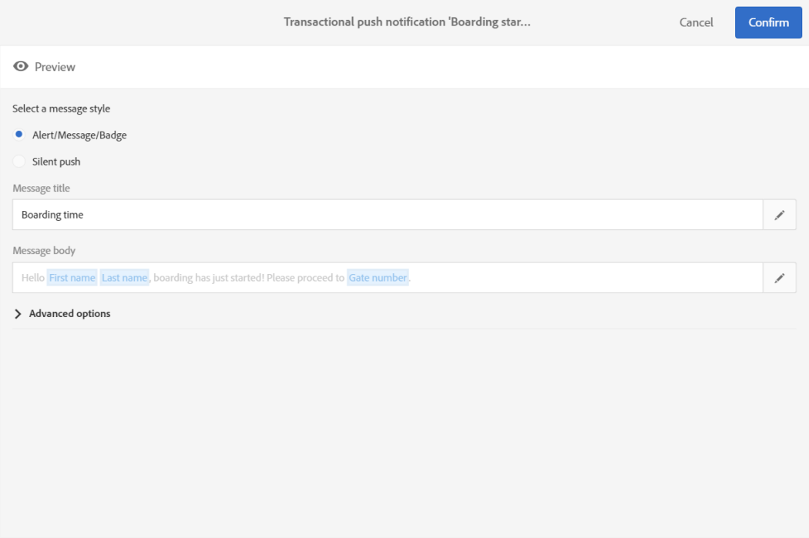

# トランザクションプッシュ通知{#transactional-push-notifications}

Adobe Campaignを使用して、iOSおよびAndroidモバイルデバイスでトランザクションプッシュ通知を送信できます。 これらのメッセージは、Experience CloudMobile SDKを利用して、Adobe Campaignで設定したモバイルアプリケーションで受信されます。

>[!NOTE]
>
>プッシュチャネルはオプションです。 使用許諾契約書を確認してください。標準的なプッシュ通知について詳しくは、[プッシュ通知について](../../channels/using/about-push-notifications.md)を参照してください。

トランザクションプッシュ通知を送信できるようにするには、それに応じてAdobe Campaignを設定する必要があります。 「[モバイルアプリケーションの設定](../../administration/using/configuring-a-mobile-application.md)」を参照してください。

2種類のトランザクションプッシュ通知を送信できます。

* [イベントを対象としたトランザクションプッシュ通知](#transactional-push-notifications-targeting-an-event)
* [Adobe Campaignデータベースの](#transactional-push-notifications-targeting-a-profile) プロファイルをターゲットにしたトランザクションプッシュ通知

## イベント{#transactional-push-notifications-targeting-an-event}を対象としたトランザクションプッシュ通知

Adobe Campaignを使用すると、モバイルアプリケーションからの通知の受信を希望するすべてのユーザー&#x200B;**に、**&#x200B;匿名トランザクションプッシュ通知を送信できます。

この場合、イベント自体に含まれる&#x200B;**データのみが、配信ターゲット**&#x200B;を定義するために使用されます。 Adobe Campaign統合プロファイル・データベースのデータは使用されません。

### イベントベースのトランザクションプッシュ通知の設定{#configuring-event-based-transactional-push-notification}

モバイルアプリケーションからの通知の受信をオプトインしているすべてのイベントにトランザクションプッシュ通知を送信するには、まず、ユーザー自体に含まれるデータをターゲットにしたイベントを作成し、設定する必要があります。

>[!NOTE]
>
>引き続き、[イベント属性](../../channels/using/configuring-transactional-event.md#defining-the-event-attributes)(イベントのデータ)および[イベントエンリッチメント](../../channels/using/configuring-transactional-event.md#enriching-the-transactional-message-content)(キャンペーンデータベースのデータ)を使用して、イベントベースのトランザクションプッシュ通知の内容をパーソナライズできます。 [下の例](#sending-event-based-transactional-push-notification)を参照してください。

イベントには、次の3つの要素を含める必要があります。

* **登録トークン**。これは、1つのモバイルアプリケーションと1つのデバイスのユーザーIDです。 Adobe Campaignデータベースのプロファイルに対応していない場合があります。
* **モバイルアプリケーション名**（すべてのデバイス用のアプリケーション名 — AndroidおよびiOS）。 これは、Adobe Campaignで設定されたモバイルアプリケーションのIDで、ユーザーのデバイスでのプッシュ通知の受信に使用されます。 詳しくは、[モバイルアプリケーションの設定](../../administration/using/configuring-a-mobile-application.md)を参照してください。
* **プッシュプラットフォーム**（Androidの場合は「gcm」、iOSの場合は「apns」）。

イベントを設定するには、次の手順に従います。

1. イベント設定を作成する際に、**[!UICONTROL Push notification]**&#x200B;チャネルと&#x200B;**[!UICONTROL Real-time event]**&#x200B;ターゲティングディメンションを選択します(「[イベントの作成](../../channels/using/configuring-transactional-event.md#creating-an-event)」を参照)。
1. イベント追加のフィールド。 これにより、トランザクションメッセージをパーソナライズできます(「[イベント属性の定義](../../channels/using/configuring-transactional-event.md#defining-the-event-attributes)」を参照)。 この例では、「gateNumber」、「lastname」、「firstname」の各フィールドを定義します。
1. メッセージの内容を拡張することもできます。 これを行うには、イベント設定にリンクしたテーブルからフィールドを追加します(「[イベントの強化](../../channels/using/configuring-transactional-event.md#enriching-the-transactional-message-content)」を参照)。

   <!--Event-based transactional messaging is supposed to use only the data that are in the sent event to define the recipient and the message content personalization. However, you can enrich the content of your transactional message using information from the Adobe Campaign database.-->

1. [イベントをプレビューして公開します](../../channels/using/publishing-transactional-event.md#previewing-and-publishing-the-event)。

   イベントをプレビューする場合、REST APIには、配信のターゲットに使用される「registrationToken」、「application」および「pushPlatform」属性が含まれます。

   

   イベントが発行されると、新しいイベントにリンクされたトランザクションプッシュ通知が自動的に作成されます。 これで、作成したメッセージを変更して公開できます（[このセクション](#sending-event-based-transactional-push-notification)を参照）。

1. イベントをWebサイトに統合します([イベントトリガーの統合](../../channels/using/getting-started-with-transactional-msg.md#integrate-event-trigger)を参照)。

### イベントベースのトランザクションプッシュ通知の送信{#sending-event-based-transactional-push-notification}

例えば、航空会社の会社が、搭乗のために関連ゲートに進むようモバイルアプリのユーザーを招待したいとします。

会社は、1台のモバイルアプリケーションを介して、1人のユーザー（登録トークンで識別）につき1つのトランザクションプッシュ通知を送信します。

1. 作成したトランザクションメッセージに移動して編集します。[トランザクションメッセージへのアクセス](../../channels/using/editing-transactional-message.md#accessing-transactional-messages)を参照してください。

   

1. **[!UICONTROL Content]**&#x200B;ブロックをクリックして、メッセージのタイトルと本文を変更します。

1. パーソナライゼーションフィールドを挿入して、イベントの作成時に定義した要素を追加できます(「[イベント属性の定義](../../channels/using/configuring-transactional-event.md#defining-the-event-attributes)」を参照)。

   

   これらのフィールドを探すには、項目の横の鉛筆をクリックし、**[!UICONTROL Insert personalization field]**&#x200B;をクリックして&#x200B;**[!UICONTROL Context]**/**[!UICONTROL Real-time event]**/**[!UICONTROL Event context]**&#x200B;を選択します。

   

   プッシュ通知コンテンツの編集について詳しくは、[プッシュ通知の準備と送信](../../channels/using/preparing-and-sending-a-push-notification.md)を参照してください。

1. また、トランザクションメッセージデータベースの追加情報を使用する場合は、Adobe Campaignの内容を拡張することもできます(「[イベントの強化](../../channels/using/configuring-transactional-event.md#enriching-the-transactional-message-content)」を参照)。

1. 変更を保存し、メッセージを公開します。[トランザクションメッセージの公開](../../channels/using/publishing-transactional-message.md#publishing-a-transactional-message)を参照してください。

1. Adobe Campaign StandardREST APIを使用して、搭載データを含むAndroid(gcm)上の1つのモバイルアプリケーション(WeFlight)を使用して、イベントを登録トークン(ABCDEF123456789)に送信します。

   ```
   {
     "registrationToken":"ABCDEF123456789",
     "application":"WeFlight",
     "pushPlatform":"gcm",
     "ctx":
     {
       "gateNumber":"Gate B18",
       "lastname":"Green",
       "firstname":"Jane"
     }
   }
   ```

   イベントのトリガーを外部システムに統合する方法について詳しくは、[イベントトリガーを統合する](../../channels/using/getting-started-with-transactional-msg.md#integrate-event-trigger)を参照してください。

登録トークンが存在する場合、対応するユーザーは、次のコンテンツを含むトランザクションプッシュ通知を受け取ります。

*「やあ、ジェーン・グリーンさん、乗船が始まったばかりです！ゲートB18に進んでください。&quot;*

## プロファイル{#transactional-push-notifications-targeting-a-profile}を対象としたトランザクションプッシュ通知

モバイルアプリケーション&#x200B;**をサブスクライブしているAdobe Campaignプロファイルに、トランザクションプッシュ通知**&#x200B;を送信できます。 この配信には、受信者の名など、Adobe Campaignデータベースから直接取得した[パーソナライゼーションフィールド](../../designing/using/personalization.md#inserting-a-personalization-field)を含めることができます。

この場合、イベントに&#x200B;**Adobe Campaignデータベース**&#x200B;のプロファイルとの調整を許可するフィールドがいくつか含まれている必要があります。

プロファイルをターゲット設定する場合、モバイルアプリケーションごとおよびデバイスごとに1つのトランザクションプッシュ通知が送信されます。 例えば、Adobe Campaignユーザーが2つのアプリをサブスクライブしている場合、このユーザーには2つの通知が届きます。 ユーザーが2つの異なるデバイスを使用して同じアプリケーションをサブスクライブしている場合、このユーザーは各デバイスで通知を受け取ります。

プロファイルがサブスクライブしたモバイルアプリケーションは、このプロファイルの&#x200B;**[!UICONTROL Mobile App Subscriptions]**&#x200B;タブに一覧表示されます。 このタブにアクセスするには、プロファイルを選択し、右側の&#x200B;**[!UICONTROL Edit profile properties]**&#x200B;ボタンをクリックします。


プロファイルへのアクセスと編集について詳しくは、[プロファイル](../../audiences/using/about-profiles.md)を参照してください。

### プロファイルベースのトランザクションプッシュ通知の設定{#configuring-profile-based-transactional-push-notification}

モバイルアプリケーションをサブスクライブしているAdobe Campaignプロファイルにトランザクションプッシュ通知を送信するには、まずAdobe Campaignデータベースをターゲットにしたイベントを作成し、設定する必要があります。

1. イベント設定を作成する際に、**[!UICONTROL Push notification]**&#x200B;チャネルと&#x200B;**[!UICONTROL Profile]**&#x200B;ターゲティングディメンションを選択します(「[イベントの作成](../../channels/using/configuring-transactional-event.md#creating-an-event)」を参照)。

   デフォルトでは、トランザクションプッシュ通知は、受信者がサブスクライブしているすべてのモバイルアプリケーションに送信されます。 特定のモバイルアプリケーションにプッシュ通知を送信するには、リストでそのアプリケーションを選択します。 その他のモバイルアプリはメッセージの対象になりますが、送信から除外されます。

   

1. イベント追加のフィールドに値を入力します。トランザクションメッセージをパーソナライズする場合は、[イベント属性の定義](../../channels/using/configuring-transactional-event.md#defining-the-event-attributes)を参照してください。

   >[!NOTE]
   >
   >エンリッチメントを作成するには、少なくとも1つのフィールドを追加する必要があります。 **名**&#x200B;や&#x200B;**姓**&#x200B;など、Adobe Campaignデータベースのパーソナライゼーションフィールドを使用できるフィールドを作成する必要はありません。

1. イベントを&#x200B;**[!UICONTROL Profile]**&#x200B;リソースにリンクするエンリッチメントを作成し(「[イベントの強化](../../channels/using/configuring-transactional-event.md#enriching-the-transactional-message-content)」を参照)、このエンリッチメントを&#x200B;**[!UICONTROL Targeting enrichment]**&#x200B;として選択します。

   >[!IMPORTANT]
   >
   >この手順は、プロファイルベースのイベントでは必須です。

1. [イベントをプレビューして公開します](../../channels/using/publishing-transactional-event.md#previewing-and-publishing-the-event)。

   イベントをプレビューする場合、REST APIには、登録トークン、アプリケーション名、プッシュプラットフォームを指定する属性が含まれず、**[!UICONTROL Profile]**&#x200B;リソースから取得されます。

   イベントが発行されると、新しいイベントにリンクされたトランザクションプッシュ通知が自動的に作成されます。 これで、作成したメッセージを変更して公開できます（[このセクション](#sending-profile-based-transactional-push-notification)を参照）。

1. イベントをWebサイトに統合します([イベントトリガーの統合](../../channels/using/getting-started-with-transactional-msg.md#integrate-event-trigger)を参照)。

### プロファイルベースのトランザクションプッシュ通知の送信{#sending-profile-based-transactional-push-notification}

例えば、航空会社の会社は、モバイルアプリを購読しているすべてのAdobe Campaignユーザーに、搭乗のための最後の通話を送信したいと考えています。

1. 作成したトランザクションメッセージに移動して編集します。[トランザクションメッセージへのアクセス](../../channels/using/editing-transactional-message.md#accessing-transactional-messages)を参照してください。

1. **[!UICONTROL Content]**&#x200B;ブロックをクリックして、メッセージのタイトルと本文を変更します。

   リアルタイムイベントに基づく設定とは異なり、すべてのプロファイル情報に直接アクセスして、メッセージをパーソナライズできます。 [パーソナライゼーションフィールドの挿入](../../designing/using/personalization.md#inserting-a-personalization-field)を参照してください。

   プッシュ通知コンテンツの編集について詳しくは、[プッシュ通知の準備と送信](../../channels/using/preparing-and-sending-a-push-notification.md)を参照してください。

1. 変更を保存し、メッセージを公開します。[トランザクションメッセージの公開](../../channels/using/publishing-transactional-message.md#publishing-a-transactional-message)を参照してください。
1. Adobe Campaign StandardREST APIを使用して、プロファイルにイベントを送信します。

   ```
   {
     "ctx":
     {
       "email":"janegreen@email.com",
       "gateNumber":"D16",
     }
   }
   ```

イベントのトリガーを外部システムに統合する方法について詳しくは、[イベントトリガーを統合する](../../channels/using/getting-started-with-transactional-msg.md#integrate-event-trigger)を参照してください。

対応するユーザは、Adobe Campaignデータベースから検索された全てのパーソナライゼーション要素を含むトランザクションプッシュ通知を受け取る。

>[!NOTE]
>
>登録トークン、アプリケーション、プッシュプラットフォームのフィールドはありません。 この例では、電子メールフィールドを使用して調整が実行されます。
