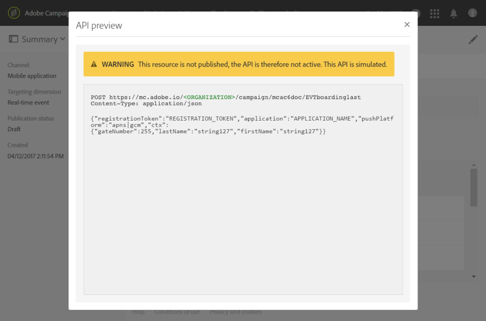
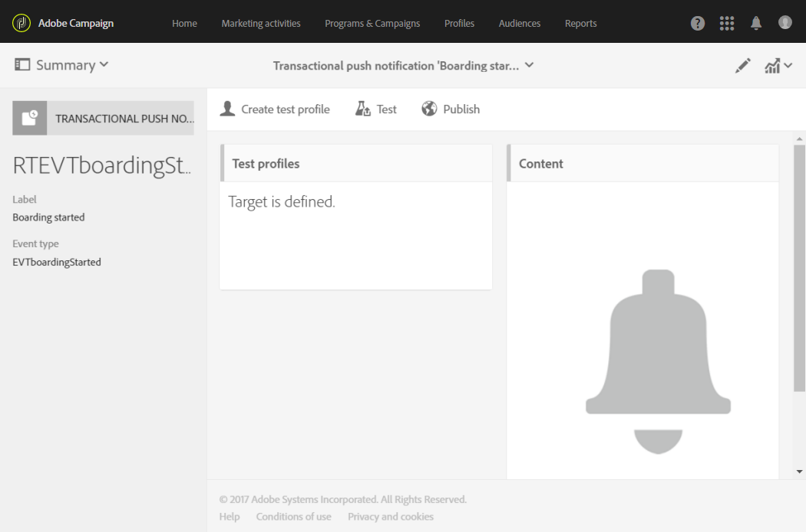
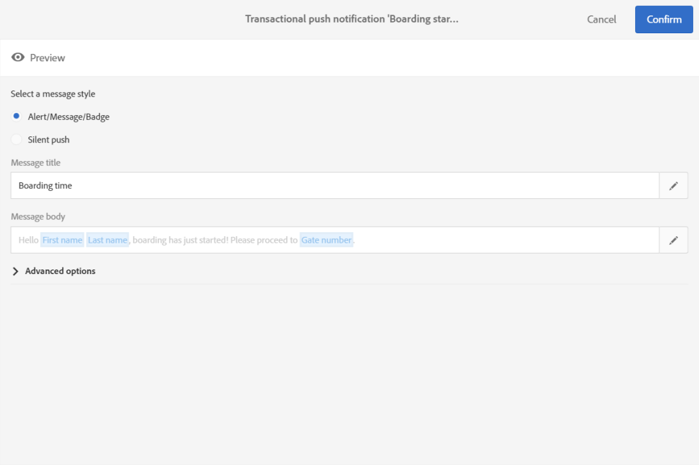
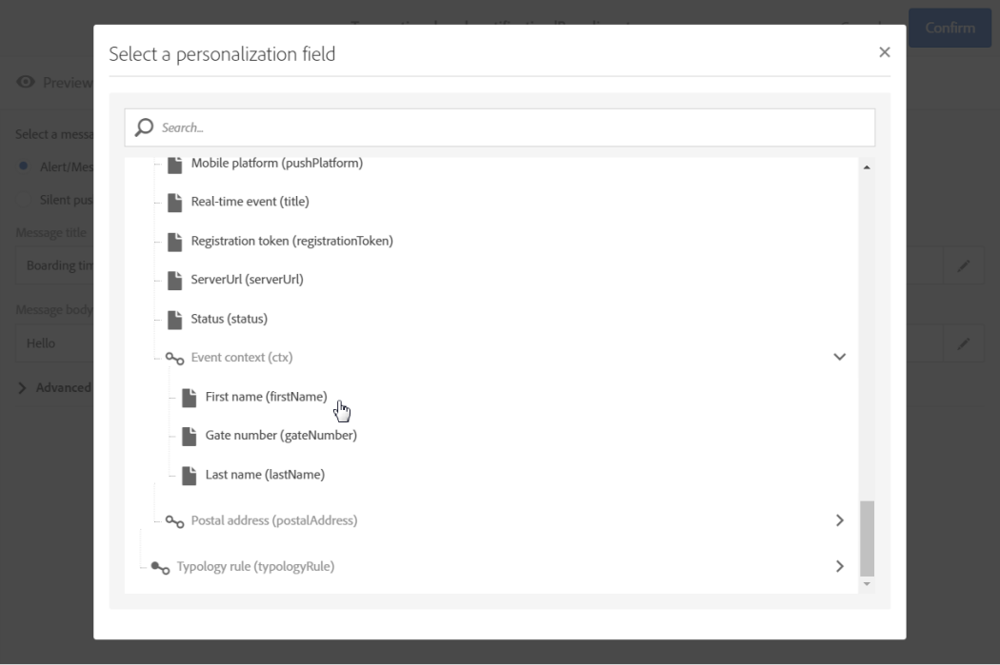
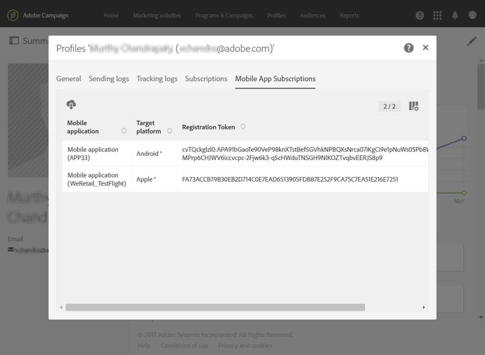
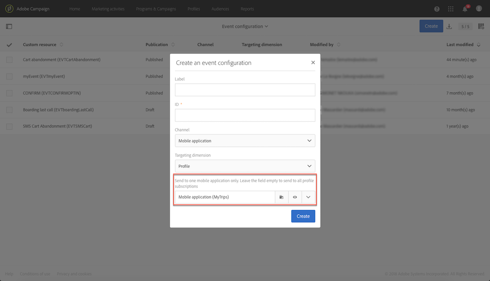
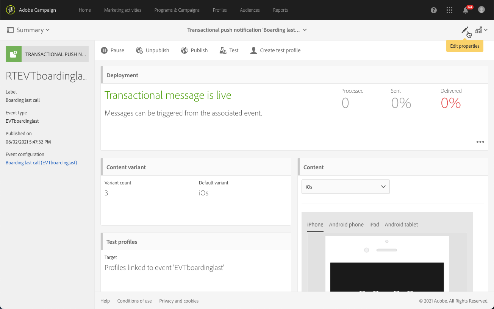
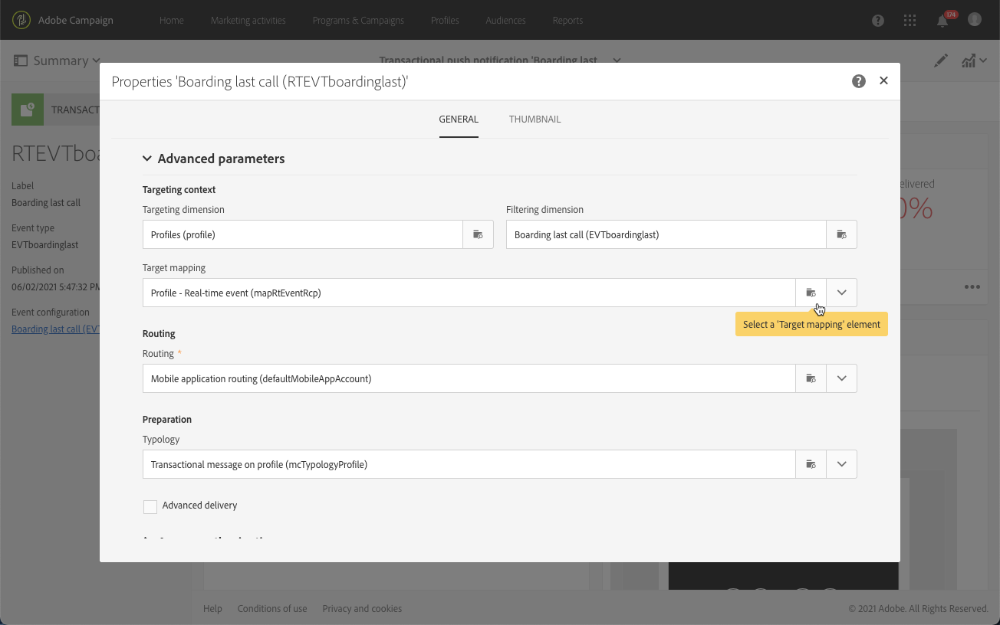
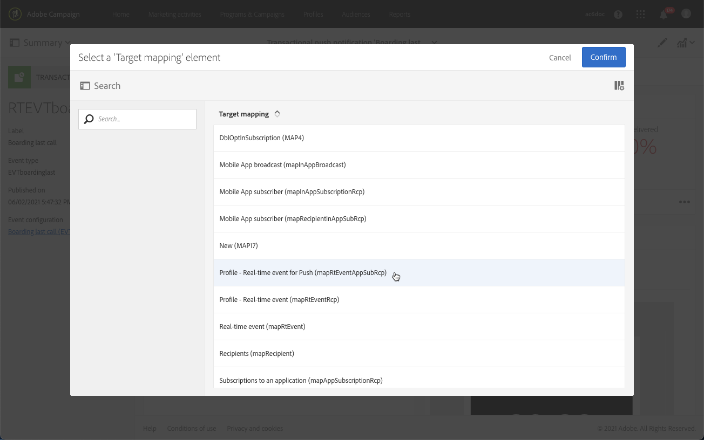

# トランザクションプッシュ通知{#transactional-push-notifications}

Adobe Campaignを使用して、iOSおよびAndroid モバイルデバイスでトランザクションプッシュ通知を送信できます。 これらのメッセージは、Experience Cloud Mobile SDKを利用してAdobe Campaignで設定したモバイルアプリケーションで受信されます。

>[!NOTE]
>
>プッシュチャネルはオプションです。 使用許諾契約書を確認してください。 標準プッシュ通知について詳しくは、[&#x200B; プッシュ通知について](../../channels/using/about-push-notifications.md)を参照してください。

トランザクションプッシュ通知を送信できるようにするには、それに応じてAdobe Campaignを設定する必要があります。 [&#x200B; モバイルアプリケーションの設定](../../administration/using/configuring-a-mobile-application.md)を参照してください。

2種類のトランザクションプッシュ通知を送信できます。

* [イベントをターゲットとしたトランザクションプッシュ通知](#transactional-push-notifications-targeting-an-event)
* Adobe Campaign データベースから[&#x200B; プロファイルをターゲットとするトランザクションプッシュ通知](#transactional-push-notifications-targeting-a-profile)

## イベントをターゲットとしたトランザクションプッシュ通知 {#transactional-push-notifications-targeting-an-event}

Adobe Campaignを使用すると、モバイルアプリケーションからの通知の受信をオプトインしたすべてのユーザー&#x200B;**に**&#x200B;匿名のトランザクションプッシュ通知を送信できます。

この場合、配信ターゲットの定義に使用されるのは、イベント自体に含まれるデータ **のみです**。 Adobe Campaign統合プロファイルデータベースのデータは活用されません。

### イベントベースのトランザクションプッシュ通知の設定 {#configuring-event-based-transactional-push-notification}

モバイルアプリケーションからの通知の受信をオプトインしたすべてのユーザーにトランザクションプッシュ通知を送信するには、まず、イベント自体に含まれるデータをターゲットとするイベントを作成して設定する必要があります。

>[!NOTE]
>
>[&#x200B; イベント属性](../../channels/using/configuring-transactional-event.md#defining-the-event-attributes) （イベントからのデータ）と[&#x200B; イベントエンリッチメント &#x200B;](../../channels/using/configuring-transactional-event.md#enriching-the-transactional-message-content) （Campaign データベースからのデータ）を使用して、イベントベースのトランザクションプッシュ通知のコンテンツを引き続きパーソナライズできます。 以下の例は[を参照してください](#sending-event-based-transactional-push-notification)。

イベントには、次の3つの要素を含める必要があります。

* 1つのモバイルアプリケーションと1つのデバイスのユーザーIDである&#x200B;**登録トークン**。 これは、Adobe Campaign データベースの任意のプロファイルに対応しない場合があります。
* **モバイルアプリケーション名** （すべてのデバイス用 – AndroidおよびiOS）。 これは、Adobe Campaignで設定されたモバイルアプリケーションのIDで、ユーザーのデバイスでプッシュ通知を受信するために使用されます。 詳しくは、[&#x200B; モバイルアプリケーションの設定](../../administration/using/configuring-a-mobile-application.md)を参照してください。
* **プッシュプラットフォーム** （Androidの場合は「gcm」、iOSの場合は「apns」）。

イベントを設定するには、次の手順に従います。

1. イベント設定を作成する際に、**[!UICONTROL Push notification]** チャネルと&#x200B;**[!UICONTROL Real-time event]** ターゲティングディメンションを選択します（[&#x200B; イベントの作成](../../channels/using/configuring-transactional-event.md#creating-an-event)を参照）。
1. イベントにフィールドを追加します。 これにより、トランザクションメッセージをパーソナライズできます（[&#x200B; イベント属性の定義](../../channels/using/configuring-transactional-event.md#defining-the-event-attributes)を参照）。 この例では、「gateNumber」、「lastname」および「firstname」フィールドを定義します。
1. メッセージのコンテンツを充実させることもできます。 これを行うには、イベント設定にリンクしたテーブルからフィールドを追加します（[&#x200B; イベントの強化](../../channels/using/configuring-transactional-event.md#enriching-the-transactional-message-content)を参照）。

   <!--Event-based transactional messaging is supposed to use only the data that are in the sent event to define the recipient and the message content personalization. However, you can enrich the content of your transactional message using information from the Adobe Campaign database.-->

1. [&#x200B; イベントをプレビューして公開](../../channels/using/publishing-transactional-event.md#previewing-and-publishing-the-event)。

   イベントをプレビューする際、REST APIには、配信のターゲティングに使用される「registrationToken」、「application」および「pushPlatform」属性が含まれます。

   

   イベントが公開されると、新しいイベントにリンクされたトランザクションプッシュ通知が自動的に作成されます。 作成したばかりのメッセージを変更して公開できるようになりました（[このセクション &#x200B;](#sending-event-based-transactional-push-notification)を参照）。

1. イベントをweb サイトに統合します（[&#x200B; イベントトリガーの統合](../../channels/using/getting-started-with-transactional-msg.md#integrate-event-trigger)を参照）。

### イベントベースのトランザクションプッシュ通知の送信 {#sending-event-based-transactional-push-notification}

例えば、ある航空会社が、モバイルアプリケーションのユーザーを招待し、適切な搭乗ゲートに誘導したいと考えています。

同社は、1つのモバイルアプリケーションを使用して、ユーザーごとに1つのトランザクションプッシュ通知（登録トークンで識別）を1つのデバイスを通じて送信します。

1. 作成されたトランザクションメッセージを編集します。 「[&#x200B; トランザクションメッセージへのアクセス &#x200B;](../../channels/using/editing-transactional-message.md#accessing-transactional-messages)」を参照してください。

   

1. メッセージのタイトルと本文を変更するには、**[!UICONTROL Content]** ブロックをクリックします。

1. パーソナライゼーションフィールドを挿入して、イベントの作成時に定義した要素を追加できます（[&#x200B; イベント属性の定義](../../channels/using/configuring-transactional-event.md#defining-the-event-attributes)を参照）。

   

   これらのフィールドを見つけるには、項目の横にある鉛筆をクリックし、**[!UICONTROL Insert personalization field]**&#x200B;をクリックして、**[!UICONTROL Context]** > **[!UICONTROL Real-time event]** > **[!UICONTROL Event context]**&#x200B;を選択します。

   

   プッシュ通知コンテンツの編集について詳しくは、[&#x200B; プッシュ通知の準備と送信](../../channels/using/preparing-and-sending-a-push-notification.md)を参照してください。

1. Adobe Campaign データベースの追加情報を使用する場合は、トランザクションメッセージの内容を強化することもできます（[&#x200B; イベントの強化](../../channels/using/configuring-transactional-event.md#enriching-the-transactional-message-content)を参照）。

1. 変更を保存し、メッセージを公開します。 [トランザクションメッセージの公開](../../channels/using/publishing-transactional-message.md#publishing-a-transactional-message)を参照してください。

1. Adobe Campaign Standard REST APIを使用して、Android（gcm）上の1つのモバイルアプリケーション（WeFlight）を使用して、登録トークン（ABCDEF123456789）にイベントを送信します。これには、次のボーディングデータが含まれます。

   ```
   {
     "registrationToken":"ABCDEF123456789",
     "application":"WeFlight",
     "pushPlatform":"gcm",
     "ctx":
     {
       "gateNumber":"Gate B18",
       "lastname":"Green",
       "firstname":"Jane"
     }
   }
   ```

   イベントのトリガーを外部システムに統合する方法について詳しくは、[&#x200B; イベントのトリガーを統合](../../channels/using/getting-started-with-transactional-msg.md#integrate-event-trigger)を参照してください。

登録トークンが存在する場合、対応するユーザーは次のコンテンツを含むトランザクションプッシュ通知を受信します。

*「こんにちはJane Greenさん、ご搭乗は始まったばかりです。 ゲート B18へ進んでください。&quot;*

## プロファイルをターゲットとしたトランザクションプッシュ通知 {#transactional-push-notifications-targeting-a-profile}

モバイルアプリケーション **を購読しているAdobe Campaign プロファイルに、トランザクションプッシュ通知**&#x200B;を送信できます。 この配信には、受信者の名前など、[&#x200B; パーソナライゼーションフィールド &#x200B;](../../designing/using/personalization.md#inserting-a-personalization-field)を含めることができ、Adobe Campaign データベースから直接取得されます。

この場合、イベントには一部のフィールド **が含まれている必要があり、Adobe Campaign データベースのプロファイルとの紐付けが可能です**。

プロファイルをターゲティングする場合、モバイルアプリケーションおよびデバイスごとに1つのトランザクションプッシュ通知が送信されます。 例えば、Adobe Campaign ユーザーが2つのアプリケーションを購読している場合、このユーザーには2つの通知が届きます。 ユーザーが2つの異なるデバイスで同じアプリケーションを購読している場合、このユーザーは各デバイスで通知を受け取ります。

プロファイルが購読しているモバイルアプリケーションは、このプロファイルの「**[!UICONTROL Mobile App Subscriptions]**」タブに一覧表示されます。 このタブにアクセスするには、プロファイルを選択し、右側の&#x200B;**[!UICONTROL Edit profile properties]** ボタンをクリックします。



プロファイルへのアクセスと編集について詳しくは、[&#x200B; プロファイルについて](../../audiences/using/about-profiles.md)を参照してください。

### プロファイルベースのトランザクションプッシュ通知の設定 {#configuring-profile-based-transactional-push-notification}

モバイルアプリケーションを購読しているAdobe Campaign プロファイルにトランザクションプッシュ通知を送信するには、まずAdobe Campaign データベースをターゲットとするイベントを作成して設定する必要があります。

1. イベント設定を作成する際に、**[!UICONTROL Push notification]** チャネルと&#x200B;**[!UICONTROL Profile]** ターゲティングディメンションを選択します（[&#x200B; イベントの作成](../../channels/using/configuring-transactional-event.md#creating-an-event)を参照）。

   デフォルトでは、トランザクションプッシュ通知は、受信者が購読したすべてのモバイルアプリケーションに送信されます。 プッシュ通知を特定のモバイルアプリケーションに送信するには、リストでプッシュ通知を選択します。 他のモバイルアプリケーションはメッセージのターゲットになりますが、送信から除外されます。

   

1. トランザクションメッセージをパーソナライズする場合は、イベントにフィールドを追加します（[&#x200B; イベント属性の定義](../../channels/using/configuring-transactional-event.md#defining-the-event-attributes)を参照）。

   >[!NOTE]
   >
   >エンリッチメントを作成するには、少なくとも1つのフィールドを追加する必要があります。 Adobe Campaign データベースのパーソナライゼーションフィールドを使用できるので、**名**&#x200B;や&#x200B;**姓**&#x200B;などの他のフィールドを作成する必要はありません。

1. イベントを&#x200B;**[!UICONTROL Profile]** リソースにリンクするためにエンリッチメントを作成し（[&#x200B; イベントのエンリッチメント &#x200B;](../../channels/using/configuring-transactional-event.md#enriching-the-transactional-message-content)を参照）、このエンリッチメントを&#x200B;**[!UICONTROL Targeting enrichment]**&#x200B;として選択します。

   >[!IMPORTANT]
   >
   >この手順は、プロファイルベースのイベントでは必須です。

1. [&#x200B; イベントをプレビューして公開](../../channels/using/publishing-transactional-event.md#previewing-and-publishing-the-event)。

   イベントをプレビューする際、REST APIには、登録トークン、アプリケーション名、プッシュプラットフォームを指定する属性が含まれていません。これらの属性は、**[!UICONTROL Profile]** リソースから取得されます。

   イベントが公開されると、新しいイベントにリンクされたトランザクションプッシュ通知が自動的に作成されます。 作成したばかりのメッセージを変更して公開できるようになりました（[このセクション &#x200B;](#sending-profile-based-transactional-push-notification)を参照）。

1. イベントをweb サイトに統合します（[&#x200B; イベントトリガーの統合](../../channels/using/getting-started-with-transactional-msg.md#integrate-event-trigger)を参照）。

### プロファイルベースのトランザクションプッシュ通知の送信 {#sending-profile-based-transactional-push-notification}

例えば、ある航空会社では、モバイルアプリを購読したことがあるすべてのAdobe Campaign利用者に対して、最後の搭乗呼び出しを送信したいと考えています。

1. 作成されたトランザクションメッセージを編集します。 「[&#x200B; トランザクションメッセージへのアクセス &#x200B;](../../channels/using/editing-transactional-message.md#accessing-transactional-messages)」を参照してください。

1. メッセージのタイトルと本文を変更するには、**[!UICONTROL Content]** ブロックをクリックします。

   リアルタイムのイベントにもとづく設定ではなく、あらゆるプロファイル情報に直接アクセスして、メッセージをパーソナライズできます。 [パーソナライゼーションフィールドの挿入](../../designing/using/personalization.md#inserting-a-personalization-field)を参照してください。

   プッシュ通知コンテンツの編集について詳しくは、[&#x200B; プッシュ通知の準備と送信](../../channels/using/preparing-and-sending-a-push-notification.md)を参照してください。

1. 変更を保存し、メッセージを公開します。 [トランザクションメッセージの公開](../../channels/using/publishing-transactional-message.md#publishing-a-transactional-message)を参照してください。
1. Adobe Campaign Standard REST APIを使用して、イベントをプロファイルに送信します。

   ```
   {
     "ctx":
     {
       "email":"janegreen@email.com",
       "gateNumber":"D16",
     }
   }
   ```

イベントのトリガーを外部システムに統合する方法について詳しくは、[&#x200B; イベントのトリガーを統合](../../channels/using/getting-started-with-transactional-msg.md#integrate-event-trigger)を参照してください。

対応するユーザーは、Adobe Campaign データベースから取得されたすべてのパーソナライゼーション要素を含むトランザクションプッシュ通知を受け取ります。

>[!NOTE]
>
>登録トークン、アプリケーション、プッシュプラットフォームのフィールドはありません。 この例では、紐付けはメールフィールドで実行されます。

## トランザクションプッシュ通知のターゲットマッピングの変更 {#change-target-mapping}

トランザクションプッシュ通知では、特定の[&#x200B; ターゲットマッピング &#x200B;](../../administration/using/target-mappings-in-campaign.md)を使用します。このマッピングには、このタイプの配信を送信するために必要な技術設定が含まれます。

このターゲットマッピングを変更するには、次の手順に従います。

1. トランザクションメッセージリストから、プッシュ通知を選択します。

1. メッセージダッシュボードで、**[!UICONTROL Edit properties]** ボタンをクリックします。

   

1. **[!UICONTROL Advanced parameters]** セクションを展開します。

1. 「**[!UICONTROL Select a 'Target mapping' element]**」をクリックします。

   

1. リストからターゲットマッピングを選択します。

   >[!NOTE]
   >
   >**プロファイルベース**&#x200B;のトランザクションプッシュ通知を送信する際の最適な配信準備時間とパフォーマンスを得るには、**[!UICONTROL Profile - Real-time event for Push (mapRtEventAppSubRcp)]** ターゲットマッピングを使用します。

   

1. 変更を確認し、メッセージを公開します。 [トランザクションメッセージの公開](../../channels/using/publishing-transactional-message.md#publishing-a-transactional-message)を参照してください。

   >[!IMPORTANT]
   >
   >変更を有効にするには、メッセージを再度公開する必要があります。そうしないと、以前のターゲットマッピングが引き続き使用されます。


