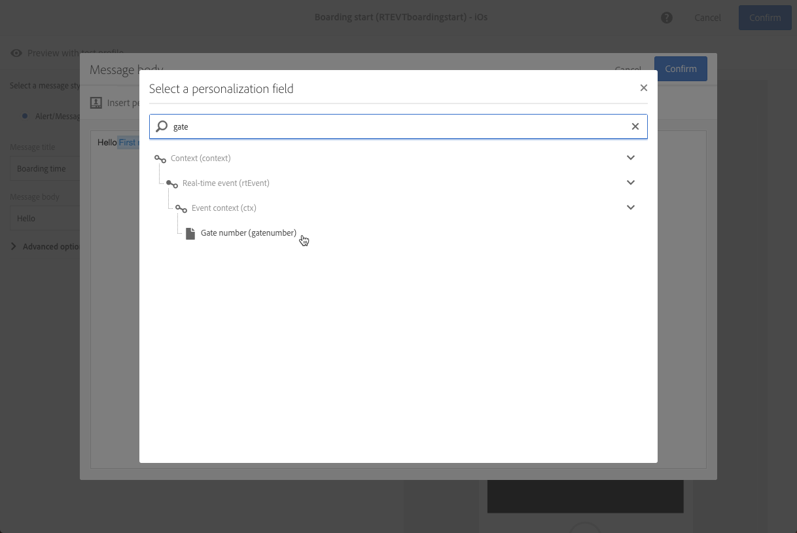

# Transactional push notifications{#transactional-push-notifications}

Adobe Campaignを使用して、iOSおよびAndroidモバイルデバイスでトランザクションプッシュ通知を送信できます。これらのメッセージは、Experience Cloud Mobile SDKを利用してAdobe Campaignで設定したモバイルアプリケーションで受信されます。

>[!NOTE]
>
>プッシュチャネルはオプションです。使用許諾契約書を確認してください。For more information on standard push notifications, see [Push notifications](../../channels/using/about-push-notifications.md).

次の2種類のトランザクションプッシュ通知を送信できます。

* イベントをターゲティングするトランザクションプッシュ通知。
* Adobe Campaignデータベースからのトランザクションプッシュ通知プロファイル。

Once you have created and published an event (the cart abandonment explained in [this section](../../channels/using/about-transactional-messaging.md#transactional-messaging-operating-principle)), the corresponding transactional push notification is created automatically.

The configuration steps are presented in the [Configuring an event to send a transactional push notification](../../administration/using/configuring-transactional-messaging.md#use-case--configuring-an-event-to-send-a-transactional-message) section.

イベントがトランザクションメッセージの送信をトリガーするには、メッセージをパーソナライズし、テストして公開する必要があります。

>[!NOTE]
>
>To access the transactional messages, you must have administration rights or appear in the **[!UICONTROL Message Center agents]** (mcExec) security group.

## Transactional push notifications targeting an event {#transactional-push-notifications-targeting-an-event}

モバイルアプリケーションから通知を受信することをオプトインしているすべてのユーザーに、匿名トランザクションプッシュ通知を送信できます。

この場合、イベント自体に含まれるデータのみが配信ターゲットを定義するために使用されます。Adobe Campaign統合プロファイルデータベースのデータは使用されません。

### Sending a transactional push notification targeting an event {#sending-a-transactional-push-notification-targeting-an-----------event}

例えば、航空会社がモバイルアプリケーションのユーザーを招待して、搭乗用の関連ゲートに進むことを希望しているとします。

1つのモバイルアプリケーションを使用して、1人のユーザー（登録トークンで識別）ごとに1つのトランザクションプッシュ通知が送信されます。

1. 作成されたトランザクションメッセージに移動します。[イベントトランザクションメッセージ](../../channels/using/event-transactional-messages.md)を参照してください。

   

1. **[!UICONTROL Content]** メッセージのタイトルと本文を変更するには、ブロックをクリックします。

   パーソナライゼーションフィールドを挿入して、イベントの作成時に定義した要素を追加できます。

   

   To find these fields, click the pencil next to an item, click **[!UICONTROL Insert personalization field]** and select **[!UICONTROL Transactional event]** &gt; **[!UICONTROL Event context]**.

   

   For more on editing a push notification content, see [Creating a push notification](../../channels/using/preparing-and-sending-a-push-notification.md).

1. 変更を保存して、メッセージを公開します。See [Publishing a transactional message](../../channels/using/event-transactional-messages.md#publishing-a-transactional-message).
1. Adobe Campaign Standard REST APIを使用して、1つのモバイルアプリケーション（WebFlight）に1つのモバイルアプリケーション（WebFlight）を使用し、搭乗データを含むAndroid（GCM）に1つのモバイルアプリケーション（WebLight）を送信します。

   ```
   {
     "registrationToken":"ABCDEF123456789",
     "application":"WeFlight",
     "pushPlatform":"gcm",
     "ctx":
     {
       "gateNumber":"Gate B18",
       "lastname":"Green",
       "firstname":"Jane"
     }
   }
   ```

   For more on integrating the triggering of an event into an external system, see [Site integration](../../administration/using/configuring-transactional-messaging.md#integrating-the-triggering-of-the-event-in-a-website).

登録トークンが存在する場合、対応するユーザーは次の内容を含むトランザクションプッシュ通知を受け取ります。

"Hello Jane Green， ping has just started!ゲートB18に進んでください」。

## Transactional push notifications targeting a profile {#transactional-push-notifications-targeting-a-profile}

モバイルアプリケーションを購読しているAdobe Campaignプロファイルにトランザクションプッシュ通知を送信できます。This delivery can contain [personalization](../../designing/using/inserting-a-personalization-field.md) fields, such as the recipient's first name.

この場合、イベントには、Adobe Campaignデータベースのプロファイルとの紐付けを許可するフィールドが含まれている必要があります。

プロファイルをターゲット設定する場合、モバイルアプリケーションごとおよびデバイスごとに1つのトランザクションプッシュ通知が送信されます。例えば、Adobe Campaignユーザーが2つのアプリケーションを購読している場合、このユーザーは2つの通知を受け取ります。ユーザーが2つの異なるデバイスで同じアプリケーションを購読している場合、このユーザーは各デバイスで通知を受け取ります。

The mobile applications a profile has subscribed to are listed in the **[!UICONTROL Mobile App Subscriptions]** tab of this profile. To access this tab, select a profile and click the **[!UICONTROL Edit profile properties]** button on the right.


For more information on accessing and editing profiles, see [Profiles](../../audiences/using/creating-profiles.md).

### Sending a transactional push notification targeting a profile {#sending-a-transactional-push-notification-targeting-a-----------profile}

例えば、航空会社がモバイルアプリケーションを購読しているすべてのAdobe Campaignユーザーに搭乗のための最後の呼び出しを送信したいとします。

1. 作成されたトランザクションメッセージに移動します。[イベントトランザクションメッセージ](../../channels/using/event-transactional-messages.md)を参照してください。

   

1. **[!UICONTROL Content]** メッセージのタイトルと本文を変更するには、ブロックをクリックします。

   リアルタイムイベントに基づく設定とは異なり、すべてのプロファイル情報に直接アクセスして、メッセージをパーソナライズすることができます。See [Inserting a personalization field](../../designing/using/inserting-a-personalization-field.md).

   

   プッシュ通知コンテンツの編集について詳しく説明します。See [Creating a push notification](../../channels/using/preparing-and-sending-a-push-notification.md).

1. 変更を保存して、メッセージを公開します。See [Publishing a transactional message](../../channels/using/event-transactional-messages.md#publishing-a-transactional-message).
1. Adobe Campaign Standard REST APIを使用して、イベントをプロファイルに送信します。

   ```
   {
     "ctx":
     {
       "email":"janegreen@email.com",
       "gateNumber":"D16",
     }
   }
   ```

   For more on integrating the triggering of an event into an external system, see [Site integration](../../administration/using/configuring-transactional-messaging.md#integrating-the-triggering-of-the-event-in-a-website).

   >[!NOTE]
   >
   >登録トークン、アプリケーションおよびプッシュプラットフォームフィールドはありません。この例では、電子メールフィールドを使用して紐付けが実行されます。

