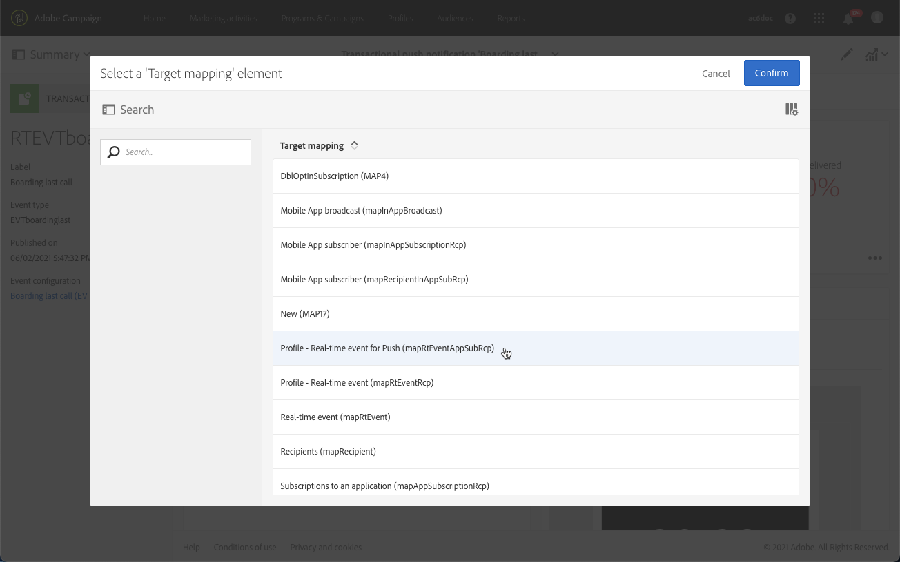

# トランザクションプッシュ通知{#transactional-push-notifications}

Adobe Campaignを使用して、iOSおよび Android モバイルデバイスでトランザクションプッシュ通知を送信できます。 これらのメッセージは、Experience CloudMobile SDK を利用して、Adobe Campaignで設定したモバイルアプリケーションで受信されます。

>[!NOTE]
>
>プッシュチャネルはオプションです。 使用許諾契約書を確認してください。標準のプッシュ通知について詳しくは、 [プッシュ通知について](../../channels/using/about-push-notifications.md).

トランザクションプッシュ通知を送信できるようにするには、それに応じてAdobe Campaignを設定する必要があります。 詳しくは、 [モバイルアプリケーションの設定](../../administration/using/configuring-a-mobile-application.md).

次の 2 種類のトランザクションプッシュ通知を送信できます。

* [イベントをターゲットとしたトランザクションプッシュ通知](#transactional-push-notifications-targeting-an-event)
* [プロファイルをターゲットとするトランザクションプッシュ通知](#transactional-push-notifications-targeting-a-profile) Adobe Campaignデータベースから

## イベントをターゲットとしたトランザクションプッシュ通知 {#transactional-push-notifications-targeting-an-event}

Adobe Campaignを使用して **匿名トランザクションプッシュ通知をすべてのユーザーに送信** モバイルアプリケーションからの通知の受信をオプトインしたユーザー

この場合、 **イベント自体に含まれるデータを使用して、配信ターゲットを定義します。**. Adobe Campaign統合プロファイルデータベースのデータは利用されません。

### イベントベースのトランザクションプッシュ通知の設定 {#configuring-event-based-transactional-push-notification}

モバイルアプリケーションからの通知の受信をオプトインしたすべてのユーザーにトランザクションプッシュ通知を送信するには、まず、イベント自体に含まれるデータをターゲットにしたイベントを作成し、設定する必要があります。

>[!NOTE]
>
>引き続き、を使用して、イベントベースのトランザクションプッシュ通知のコンテンツをパーソナライズできます。 [イベント属性](../../channels/using/configuring-transactional-event.md#defining-the-event-attributes) （イベントのデータ）および [イベントエンリッチメント](../../channels/using/configuring-transactional-event.md#enriching-the-transactional-message-content) （Campaign データベースのデータ）。 詳しくは、 [以下の例](#sending-event-based-transactional-push-notification).

イベントには、次の 3 つの要素が含まれている必要があります。

* A **登録トークン**:1 つのモバイルアプリケーションと 1 つのデバイスのユーザー ID。 Adobe Campaignデータベースのどのプロファイルにも対応していない可能性があります。
* A **モバイルアプリ名** ( すべてのデバイス用 — Android とiOS)。 これは、Adobe Campaignで設定され、ユーザーのデバイスでのプッシュ通知の受信に使用されるモバイルアプリケーションの ID です。 詳しくは、 [モバイルアプリケーションの設定](../../administration/using/configuring-a-mobile-application.md).
* A **プッシュプラットフォーム** (Android の場合は「gcm」、iOSの場合は「apns」)。

イベントを設定するには、次の手順に従います。

1. イベント設定を作成する際に、 **[!UICONTROL Push notification]** チャネルと **[!UICONTROL Real-time event]** ターゲティングディメンション ( [イベントの作成](../../channels/using/configuring-transactional-event.md#creating-an-event)) をクリックします。
1. イベントにフィールドを追加します。 これにより、トランザクションメッセージをパーソナライズできます ( [イベント属性の定義](../../channels/using/configuring-transactional-event.md#defining-the-event-attributes)) をクリックします。 この例では、「gateNumber」、「lastname」および「firstname」フィールドを定義します。
1. また、メッセージの内容をエンリッチメントすることもできます。 これをおこなうには、イベント設定にリンクしたテーブルからフィールドを追加します ( [イベントのエンリッチメント](../../channels/using/configuring-transactional-event.md#enriching-the-transactional-message-content)) をクリックします。

   <!--Event-based transactional messaging is supposed to use only the data that are in the sent event to define the recipient and the message content personalization. However, you can enrich the content of your transactional message using information from the Adobe Campaign database.-->

1. [イベントをプレビューして公開します。](../../channels/using/publishing-transactional-event.md#previewing-and-publishing-the-event).

   イベントをプレビューする際、REST API には、配信のターゲット設定に使用される「registrationToken」、「application」および「pushPlatform」属性が含まれます。

   

   イベントが公開されると、新しいイベントにリンクされたトランザクションプッシュ通知が自動的に作成されます。 作成したメッセージを変更して公開できるようになりました ( [この節](#sending-event-based-transactional-push-notification)) をクリックします。

1. イベントを Web サイトに統合する ( [イベントトリガーの統合](../../channels/using/getting-started-with-transactional-msg.md#integrate-event-trigger)) をクリックします。

### イベントベースのトランザクションプッシュ通知の送信 {#sending-event-based-transactional-push-notification}

例えば、航空会社がモバイルアプリのユーザーを招待して、搭乗用に関連するゲートに進みたいとします。

会社は、1 台のデバイスを通じて、1 つのモバイルアプリケーションを使用して、ユーザー（登録トークンで識別）ごとに 1 つのトランザクションプッシュ通知を送信します。

1. 作成したトランザクションメッセージに移動して編集します。詳しくは、 [トランザクションメッセージへのアクセス](../../channels/using/editing-transactional-message.md#accessing-transactional-messages).

   

1. 次をクリック： **[!UICONTROL Content]** ブロックを使用して、メッセージのタイトルと本文を変更します。

1. パーソナライゼーションフィールドを挿入して、イベントの作成時に定義した要素を追加できます ( [イベント属性の定義](../../channels/using/configuring-transactional-event.md#defining-the-event-attributes)) をクリックします。

   

   これらのフィールドを検索するには、項目の横にある鉛筆アイコンをクリックし、 **[!UICONTROL Insert personalization field]** を選択し、 **[!UICONTROL Context]** > **[!UICONTROL Real-time event]** > **[!UICONTROL Event context]**.

   

   プッシュ通知コンテンツの編集について詳しくは、 [プッシュ通知の準備と送信](../../channels/using/preparing-and-sending-a-push-notification.md).

1. また、Adobe Campaignデータベースからの追加情報を使用する場合は、トランザクションメッセージのコンテンツをエンリッチメントすることもできます ( [イベントのエンリッチメント](../../channels/using/configuring-transactional-event.md#enriching-the-transactional-message-content)) をクリックします。

1. 変更を保存し、メッセージを公開します。[トランザクションメッセージの公開](../../channels/using/publishing-transactional-message.md#publishing-a-transactional-message)を参照してください。

1. Adobe Campaign Standard REST API を使用して、ボーディングデータを含む Android(gcm) 上の 1 つのモバイルアプリケーション (WeFlight) を使用して、登録トークン (ABCDEF123456789) にイベントを送信します。

   ```
   {
     "registrationToken":"ABCDEF123456789",
     "application":"WeFlight",
     "pushPlatform":"gcm",
     "ctx":
     {
       "gateNumber":"Gate B18",
       "lastname":"Green",
       "firstname":"Jane"
     }
   }
   ```

   外部システムへのイベントトリガーの組み込みについて詳しくは、 [イベントトリガーの統合](../../channels/using/getting-started-with-transactional-msg.md#integrate-event-trigger).

登録トークンが存在する場合、対応するユーザーは、次のコンテンツを含むトランザクションプッシュ通知を受け取ります。

*「こんにちは、ジェーン・グリーンさん、搭乗が始まりました！ B18 番ゲートに進んでください。」*

## プロファイルをターゲットとしたトランザクションプッシュ通知 {#transactional-push-notifications-targeting-a-profile}

トランザクションプッシュ通知を送信できます **モバイルアプリケーションを購読しているAdobe Campaignプロファイルに追加します。**. この配信には、 [パーソナライゼーションフィールド](../../designing/using/personalization.md#inserting-a-personalization-field)( 受信者の名など、Adobe Campaignデータベースから直接取得したもの )。

この場合、イベントにはいくつかのフィールドが含まれている必要があります **Adobe Campaignデータベースのプロファイルとの紐付けの許可**.

プロファイルをターゲティングする場合、モバイルアプリケーションおよびデバイスごとに 1 つのトランザクションプッシュ通知が送信されます。 例えば、Adobe Campaignユーザーが 2 つのアプリケーションを購読している場合、このユーザーは 2 つの通知を受け取ります。 ユーザーが 2 つの異なるデバイスを使用して同じアプリケーションを購読した場合、このユーザーは各デバイスで通知を受け取ります。

プロファイルが購読登録したモバイルアプリが **[!UICONTROL Mobile App Subscriptions]** 」タブをクリックします。 このタブにアクセスするには、プロファイルを選択し、 **[!UICONTROL Edit profile properties]** 」ボタンをクリックします。


プロファイルへのアクセスと編集について詳しくは、 [プロファイルについて](../../audiences/using/about-profiles.md).

### プロファイルベースのトランザクションプッシュ通知の設定 {#configuring-profile-based-transactional-push-notification}

モバイルアプリケーションを購読したAdobe Campaignプロファイルにトランザクションプッシュ通知を送信するには、まずAdobe Campaignデータベースをターゲットとするイベントを作成し、設定する必要があります。

1. イベント設定を作成する際に、 **[!UICONTROL Push notification]** チャネルと **[!UICONTROL Profile]** ターゲティングディメンション ( [イベントの作成](../../channels/using/configuring-transactional-event.md#creating-an-event)) をクリックします。

   デフォルトでは、トランザクションプッシュ通知は、受信者がサブスクリプションを購入したすべてのモバイルアプリケーションに送信されます。 特定のモバイルアプリケーションにプッシュ通知を送信するには、リストでその通知を選択します。 その他のモバイルアプリはメッセージのターゲットになりますが、送信から除外されます。

   

1. トランザクションメッセージをパーソナライズする場合は、イベントにフィールドを追加します ( [イベント属性の定義](../../channels/using/configuring-transactional-event.md#defining-the-event-attributes)) をクリックします。

   >[!NOTE]
   >
   >エンリッチメントを作成するには、少なくとも 1 つのフィールドを追加する必要があります。 他のフィールド ( **名** および **姓** Adobe Campaignデータベースのパーソナライゼーションフィールドを使用できるようになります。

1. イベントを **[!UICONTROL Profile]** リソース ( [イベントのエンリッチメント](../../channels/using/configuring-transactional-event.md#enriching-the-transactional-message-content)) をクリックし、このエンリッチメントを選択します。 **[!UICONTROL Targeting enrichment]**.

   >[!IMPORTANT]
   >
   >この手順は、プロファイルベースのイベントでは必須です。

1. [イベントをプレビューして公開します。](../../channels/using/publishing-transactional-event.md#previewing-and-publishing-the-event).

   イベントをプレビューする際、REST API には、登録トークン、アプリケーション名、プッシュプラットフォームを指定する属性は含まれません。これらは、 **[!UICONTROL Profile]** リソース。

   イベントが公開されると、新しいイベントにリンクされたトランザクションプッシュ通知が自動的に作成されます。 作成したメッセージを変更して公開できるようになりました ( [この節](#sending-profile-based-transactional-push-notification)) をクリックします。

1. イベントを Web サイトに統合する ( [イベントトリガーの統合](../../channels/using/getting-started-with-transactional-msg.md#integrate-event-trigger)) をクリックします。

### プロファイルベースのトランザクションプッシュ通知の送信 {#sending-profile-based-transactional-push-notification}

例えば、航空会社がモバイルアプリを購読したすべてのAdobe Campaignユーザーに対して、ボーディング用の最後の呼び出しを送信するとします。

1. 作成したトランザクションメッセージに移動して編集します。詳しくは、 [トランザクションメッセージへのアクセス](../../channels/using/editing-transactional-message.md#accessing-transactional-messages).

1. 次をクリック： **[!UICONTROL Content]** ブロックを使用して、メッセージのタイトルと本文を変更します。

   リアルタイムイベントに基づく設定とは異なり、すべてのプロファイル情報に直接アクセスして、メッセージをパーソナライズできます。 [パーソナライゼーションフィールドの挿入](../../designing/using/personalization.md#inserting-a-personalization-field)を参照してください。

   プッシュ通知コンテンツの編集について詳しくは、 [プッシュ通知の準備と送信](../../channels/using/preparing-and-sending-a-push-notification.md).

1. 変更を保存し、メッセージを公開します。[トランザクションメッセージの公開](../../channels/using/publishing-transactional-message.md#publishing-a-transactional-message)を参照してください。
1. Adobe Campaign Standard REST API を使用して、イベントをプロファイルに送信します。

   ```
   {
     "ctx":
     {
       "email":"janegreen@email.com",
       "gateNumber":"D16",
     }
   }
   ```

外部システムへのイベントトリガーの組み込みについて詳しくは、 [イベントトリガーの統合](../../channels/using/getting-started-with-transactional-msg.md#integrate-event-trigger).

対応するユーザーは、Adobe Campaignデータベースから取得したすべてのパーソナライゼーション要素を含むトランザクションプッシュ通知を受け取ります。

>[!NOTE]
>
>登録トークン、アプリケーション、プッシュプラットフォームの各フィールドはありません。 この例では、E メールフィールドとの紐付けが実行されます。

## トランザクションプッシュ通知でのターゲットマッピングの変更 {#change-target-mapping}

トランザクションプッシュ通知では、特定の [ターゲットマッピング](../../administration/using/target-mappings-in-campaign.md) このタイプの配信を送信するために必要な技術設定が含まれています。

このターゲットマッピングを変更するには、次の手順に従います。

1. トランザクションメッセージリストで、プッシュ通知を選択します。

1. メッセージダッシュボードで、 **[!UICONTROL Edit properties]** 」ボタンをクリックします。

   

1. を展開します。 **[!UICONTROL Advanced parameters]** 」セクションに入力します。

1. 「**[!UICONTROL Select a 'Target mapping' element]**」をクリックします。

   

1. リストからターゲットマッピングを選択します。

   >[!NOTE]
   >
   >送信時の配信準備時間とパフォーマンスを最適化する **プロファイルベース** トランザクションプッシュ通知、 **[!UICONTROL Profile - Real-time event for Push (mapRtEventAppSubRcp)]** ターゲットマッピング。

   

1. 変更を確認し、メッセージを公開します。 [トランザクションメッセージの公開](../../channels/using/publishing-transactional-message.md#publishing-a-transactional-message)を参照してください。

   >[!IMPORTANT]
   >
   >変更を有効にするには、メッセージを再度公開する必要があります。公開しない場合、以前のターゲットマッピングが引き続き使用されます。


