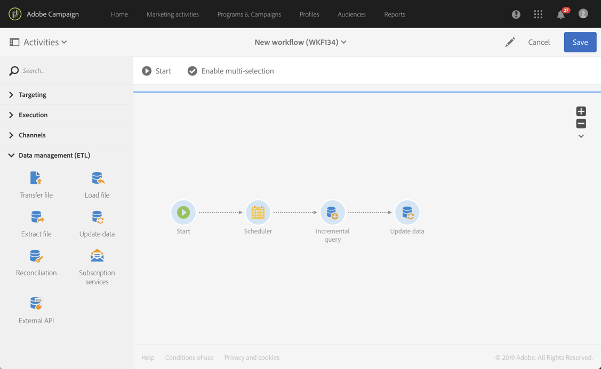

# モバイルアプリケーションデータに基づくプロファイル情報の作成と更新

## 概要

このページでは、モバイルアプリケーションが PII 収集データをスケジュールに従って送信した後にプロファイルデータを作成/更新するワークフローを開発する手順について説明します。

* **PII** は、「個人を特定できる情報」を意味します。 データには、例えば、Analytics for Mobile など、Campaign データベースのプロファイルテーブルに表示されない情報を含め、あらゆるデータを使用できます [目標地点](../../integrating/using/about-campaign-points-of-interest-data-integration.md). PII は、モバイルアプリ開発者（通常はマーケター）が定義します。
* **PII を収集** は、モバイルPOSTからAdobe Campaign Standardの Rest API に対する HTTP アプリ操作です。

この使用例の目的は、モバイルアプリケーションから返される PII データにプロファイル関連のデータが含まれる場合に、Campaign Standardプロファイルを作成または更新することです。

## 前提条件

モバイルアプリのサブスクリプションデータに基づいてプロファイルを作成または更新する前に、Campaign Standardでプッシュ通知を有効にするには、いくつかの設定手順を実行する必要があります。

1. [モバイルアプリケーションの作成](../../administration/using/configuring-a-mobile-application.md)
1. [AdobeMobile SDK をモバイルアプリケーションと統合する](../../administration/using/supported-mobile-use-cases.md).
1. [Adobe Campaignでプッシュ通知を送信するように設定する](../../administration/using/configuring-a-mobile-application.md).

## 手順 1 — プッシュ通知/購読のプロファイルリソースの拡張

PII データを使用してプロファイルリソースを作成または更新するには、まず目的のフィールドを使用してプロファイルリソースを拡張する必要があります。 手順は次のとおりです。

* モバイルアプリケーションから送信される PII フィールドを特定します。
* PII データとプロファイルデータを関連付けるための紐付けに使用するフィールドを特定します。

この例では、 **[!UICONTROL Fields]** 「 」セクションには、モバイルアプリケーションから送信される PII データが反映されています。 The **[!UICONTROL Link to profiles]** 「 」セクションには、PII をプロファイルデータに関連付けるために使用するフィールドが表示されます。ここで、 **cusEmail** マップ： **@email**.

を拡張する際のプロファイルデータのマッピング **[!UICONTROL Subscriptions to an Application]** リソースは読み取り専用です。 紐付けに使用されます。 プロファイルと PII データを紐付けるには、必要なデータを使用してプロファイルをシステムに入力する必要があります。 この場合、紐付けをおこなうには、プロファイルの電子メールアドレスが Collect PII からの電子メールと一致する必要があります。

* Collect PII は、ユーザーの姓が「Jane」、姓が「Doe」、電子メールアドレスがjanedoe@doe.comの場合に、モバイルアプリから受信されます。
* それとは別に、プロファイルの電子メールアドレスがjanedoe@doe.comであるプロファイルデータが存在する必要があります（例えば、データは手動で入力する必要があるか、既に他のリソースから取得している必要があります）。

**関連トピック：**

* [アプリケーションリソースへのサブスクリプションの拡張](../../developing/using/extending-the-subscriptions-to-an-application-resource.md).
* [既存のリソースの作成または拡張](../../developing/using/key-steps-to-add-a-resource.md).

## 手順 2 — ワークフローの作成

ワークフローをCampaign Standardで使用すると、管理者は、AppSubscription（購読者）データとプロファイルまたは受信者データの間でデータを一意に識別し、同期できます。 ワークフローベースの更新では、プロファイルデータはリアルタイムに同期されませんが、データベースの過度のロックやオーバーヘッドが発生することはありません。

ワークフローを作成する主な手順は次のとおりです。

1. の使用 **[!UICONTROL Query]** または **[!UICONTROL Incremental query]** 「 」アクティビティをクリックして、最新の購読のリストを取得します。
1. の使用 **[!UICONTROL Reconciliation]** 「 」アクティビティを使用して、PII データをプロファイルにマッピングします。
1. 検証プロセスを追加します。
1. を使用します。 **[!UICONTROL Update data]** をクリックして、PII データを使用してプロファイルを更新または作成します。

このワークフローでは、次の要件が想定されます。

* 拡張されたすべてのフィールドは、プロファイルテーブルの作成や更新に使用できる必要があります。
* プロファイルテーブルは、ネイティブでサポートされていないフィールド（T シャツサイズなど）をサポートするように拡張できます。
* AppSubscription テーブルの空白のフィールドは、プロファイルテーブルで更新されません。
* AppSubscription テーブル内で更新されたレコードは、次回のワークフロー実行に含める必要があります。

ワークフローを構築するには、次のアクティビティをワークスペースにドラッグ&amp;ドロップし、リンクします。 **[!UICONTROL Start]**, **[!UICONTROL Scheduler]**, **[!UICONTROL Incremental query]**, **[!UICONTROL Update data]**.

その後、以下の手順に従って各アクティビティを設定します。

### を設定します。 **[!UICONTROL Scheduler]** アクティビティ

Adobe Analytics の **[!UICONTROL General]** タブ、セット **[!UICONTROL Execution frequency]** （例：「日」）、 **[!UICONTROL Time]** ( 例： 1:00:00 AM&quot;)、および **[!UICONTROL Start]** （今日の日付など）。

### を設定します。 **[!UICONTROL Incremental query]** アクティビティ。

1. Adobe Analytics の **[!UICONTROL Properties]** タブで、 **[!UICONTROL Select an element]** アイコン **[!UICONTROL Resource]** 「 」フィールドで、「 **[!UICONTROL Subscriptions to an application (nms:appSubscriptionRcp:appSubscriptionRcpDetail)]** 要素を選択します。

   

1. Adobe Analytics の **[!UICONTROL Target]** タブで、 **[!UICONTROL Mobile application]** フィルターを使用して、モバイルアプリ名を選択します。

   

1. Adobe Analytics の **[!UICONTROL Processed data]** タブ、選択 **[!UICONTROL Use a date field]**&#x200B;をクリックし、 **[!UICONTROL Last modified (lastModified)]**  ～としてのフィールド **[!UICONTROL Path to the date field]**.

   

### を設定します。 **[!UICONTROL Update data]** アクティビティ。

1. Adobe Analytics の **[!UICONTROL Identification]** タブで、 **[!UICONTROL Dimension to update]** フィールドが「プロファイル (profile)」に設定されている場合、 **[!UICONTROL Create element]** ボタンを使用して、フィールドを紐付け条件として追加します。

   

1. Adobe Analytics の **[!UICONTROL Source]** 「 」フィールドで、appSubscriptionRcp テーブルから紐付けフィールドとしてフィールドを選択します。 プロファイルの電子メール、crmId、marketingCloudId などがあります。 この例では、「Email (cusEmail)」フィールドを使用します。

1. Adobe Analytics の **[!UICONTROL Destination]** 「 」フィールドで、プロファイルテーブルからフィールドを選択して、 appSubscriptionRcp テーブルからデータを紐付けします。 プロファイルの電子メール、または crmId、marketingCloudId などの拡張フィールドを指定できます。 この例では、「Email (email)」フィールドを選択して、appSubscriptionRcp テーブルの「Email (cusEmail)」フィールドにマッピングする必要があります。

   

1. Adobe Analytics の **[!UICONTROL Fields to update]** タブで、 **[!UICONTROL Create element]** ボタンをクリックし、 appSubscriptionRcp テーブル (**[!UICONTROL Source]** フィールド ) を、プロファイルテーブル (**[!UICONTROL Destination]** フィールド ) に書き込まれます。

1. Adobe Analytics の **[!UICONTROL Enabled if]** 「 」フィールドに式を追加して、ソースフィールドに値が含まれている場合にのみプロファイルテーブルの対応するフィールドが更新されるようにします。 これをおこなうには、リストからフィールドを選択し、「!=&quot;&quot;式 (「ソース」フィールドが `[target/@cusEmail]` 式エディターで、必ず「 `[target/@cusEmail] != ''"`) をクリックします。

   

>[!NOTE]
>
>この場合、ワークフローはアップサートを実行しますが、これは **[!UICONTROL Incremental query]** データは挿入されるだけです。 クエリを変更すると、挿入または更新されるデータに影響する場合があります。
>また、「更新するフィールド」タブの設定により、特定の条件下で挿入または更新されるフィールドが決まります。 これらの設定は、アプリケーションまたは顧客ごとに一意に指定できます。
>appSubscriptionRcp データに基づいてプロファイルのレコードを更新すると、検証されずにユーザーの個人情報が変更される可能性があるので、これらの設定をおこなう際は意図しない結果が生じる可能性があるので、注意が必要です。

プロファイルに挿入/更新するすべてのフィールドが追加されたら、 **[!UICONTROL Confirm]**.

ワークフローを保存し、「 **[!UICONTROL Start]** をクリックして、ワークフローを実行します。

