# モバイルアプリケーションデータに基づくプロファイル情報の作成と更新

## 概要

このページでは、モバイルアプリケーションがPII データの収集をスケジュールに従って送信した後に、プロファイルデータを作成または更新するワークフローを開発する手順について説明します。

* **PII**&#x200B;は「個人を特定できる情報」を表します。 任意のデータを指定できます。例えば、モバイル用Analytics [Points of Interest](../../integrating/using/about-campaign-points-of-interest-data-integration.md)など、Campaign データベースのプロファイルテーブルに表示されない情報を含みます。 PIIは、モバイルアプリ開発者（通常はマーケター）によって定義されます。
* **Collect PII**&#x200B;は、モバイルアプリからAdobe Campaign StandardのRest APIに対するHTTP-POST操作です。

このユースケースの目的は、モバイルアプリケーションから返されるPII データにプロファイル関連データが含まれている場合に、Campaign Standard プロファイルを作成または更新することです。

## 前提条件

モバイルアプリのサブスクリプションデータに基づいてプロファイルを作成または更新する前に、Campaign Standardでプッシュ通知を有効にするには、いくつかの設定手順に従います。

1. [モバイルアプリケーションの作成](../../administration/using/configuring-a-mobile-application.md)
1. [Adobe Mobile SDKをモバイルアプリケーションと統合](../../administration/using/supported-mobile-use-cases.md)。
1. [&#x200B; プッシュ通知を送信するようにAdobe Campaignを設定](../../administration/using/configuring-a-mobile-application.md)。

## 手順1 - プッシュ通知/購読のプロファイルリソースの拡張

PII データを使用してプロファイルリソースを作成または更新するには、まず目的のフィールドでプロファイルリソースを拡張する必要があります。 手順は次のとおりです。

* モバイルアプリケーションによって送信されるPII フィールドを特定します。
* PII データをプロファイルデータに関連付けるために、紐付けに使用するフィールドを指定します。

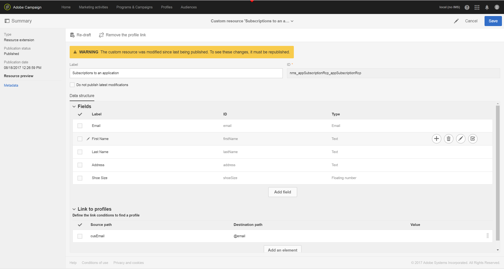

この例では、**[!UICONTROL Fields]** セクションには、モバイルアプリケーションから送信されたPII データが反映されています。 **[!UICONTROL Link to profiles]** セクションは、PIIをプロファイルデータに関連付けるために使用されるフィールドを示します。ここで、**cusEmail**&#x200B;は&#x200B;**@email**&#x200B;にマッピングされます。

**[!UICONTROL Subscriptions to an Application]** リソースの拡張中のプロファイル データのマッピングは読み取り専用です。 紐付けに使用されます。 プロファイルとPII データを紐付けるために、必要なデータを使用してプロファイルをシステムに入力する必要があります。 この場合、紐付けを行うには、プロファイルのメールアドレスがCollect PIIのメールと一致する必要があります。

* Collect PIIは、ユーザーのモバイルアプリから受信されます。ユーザーのファーストネームは「Jane」、姓は「Doe」、メールアドレスは「janedoe@doe.com」です。
* 別に、プロファイルのメールアドレスがjanedoe@doe.comの場所にプロファイルデータが存在する必要があります（例えば、データは手動で入力するか、既に他のリソースから取得している必要があります）。

**関連トピック：**

* [&#x200B; サブスクリプションをアプリケーションリソースに拡張しています](../../developing/using/extending-the-subscriptions-to-an-application-resource.md)。
* [既存のリソースの作成または拡張](../../developing/using/key-steps-to-add-a-resource.md)。

## 手順2 - ワークフローの作成

Campaign Standardでワークフローを使用すると、管理者はAppSubscription （サブスクライバー）データとプロファイルまたは受信者データの間でデータを一意に識別して同期できます。 ワークフローベースのアップデートでは、プロファイルデータをリアルタイムで同期することはできませんが、データベースの過度なロックやオーバーヘッドが発生することはありません。

ワークフローを構築する主な手順は次のとおりです。

1. **[!UICONTROL Query]**&#x200B;または&#x200B;**[!UICONTROL Incremental query]** アクティビティを使用して、最新のサブスクリプションのリストを取得します。
1. **[!UICONTROL Reconciliation]** アクティビティを使用して、PII データをプロファイルにマッピングします。
1. 検証プロセスを追加します。
1. **[!UICONTROL Update data]**&#x200B;を使用して、PII データを使用してプロファイルを更新または作成します。

このワークフローでは、次の要件が想定されます。

* 拡張されたすべてのフィールドは、プロファイルテーブルの作成または更新に使用できる必要があります。
* プロファイルテーブルは、ネイティブにサポートされていないフィールド（T シャツサイズなど）をサポートするように拡張できます。
* AppSubscription テーブルの空白のフィールドは、プロファイルテーブルで更新しないでください。
* AppSubscription テーブルで更新されたレコードは、ワークフローの次の実行に含める必要があります。

ワークフローを構築するには、次のアクティビティをワークスペースにドラッグ&amp;ドロップし、リンクします：**[!UICONTROL Start]**、**[!UICONTROL Scheduler]**、**[!UICONTROL Incremental query]**、**[!UICONTROL Update data]**。

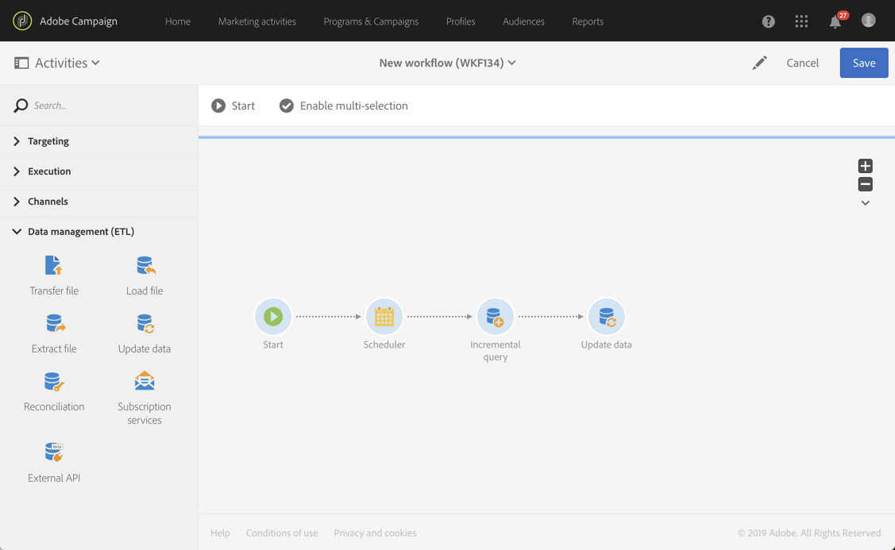

次に、以下の手順に従って各アクティビティを設定します。

### **[!UICONTROL Scheduler]** アクティビティの設定

**[!UICONTROL General]** タブで、**[!UICONTROL Execution frequency]** （例：「毎日」）、**[!UICONTROL Time]** （例：「1:00:00 AM」）、および&#x200B;**[!UICONTROL Start]** （例：「今日の日付」）を設定します。

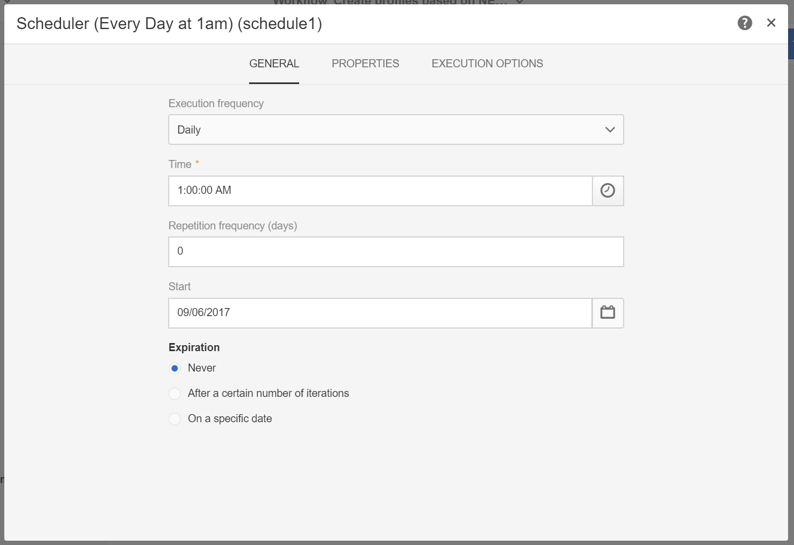

### **[!UICONTROL Incremental query]** アクティビティを設定します。

1. **[!UICONTROL Properties]** タブで、**[!UICONTROL Resource]** フィールドの&#x200B;**[!UICONTROL Select an element]** アイコンをクリックし、**[!UICONTROL Subscriptions to an application (`nms:appSubscriptionRcp:appSubscriptionRcpDetail`）]**&#x200B;要素を選択します。

   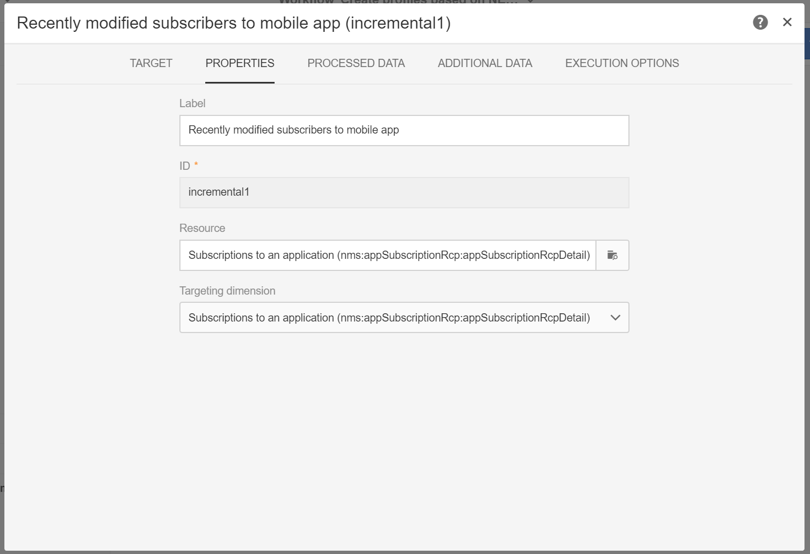

1. 「**[!UICONTROL Target]**」タブで、**[!UICONTROL Mobile application]** フィルターをドラッグし、モバイルアプリケーション名を選択します。

   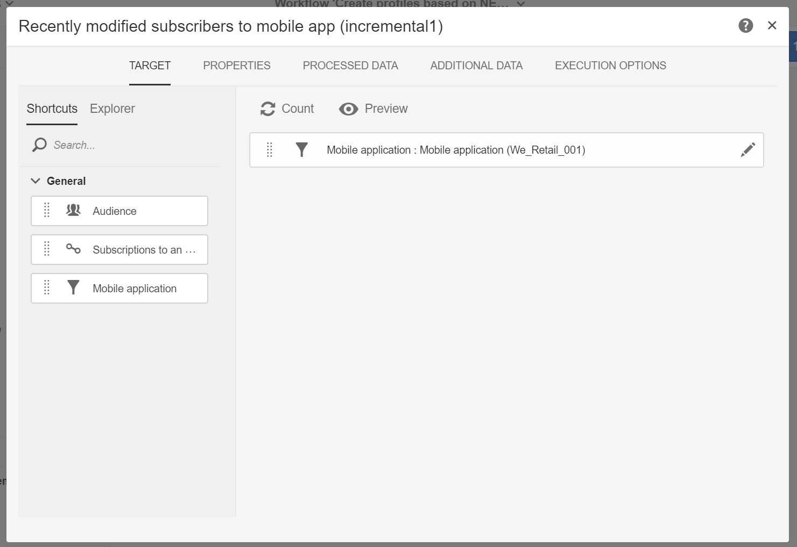

1. 「**[!UICONTROL Processed data]**」タブで「**[!UICONTROL Use a date field]**」を選択し、**[!UICONTROL Last modified (lastModified)]** フィールドを&#x200B;**[!UICONTROL Path to the date field]**&#x200B;として追加します。

   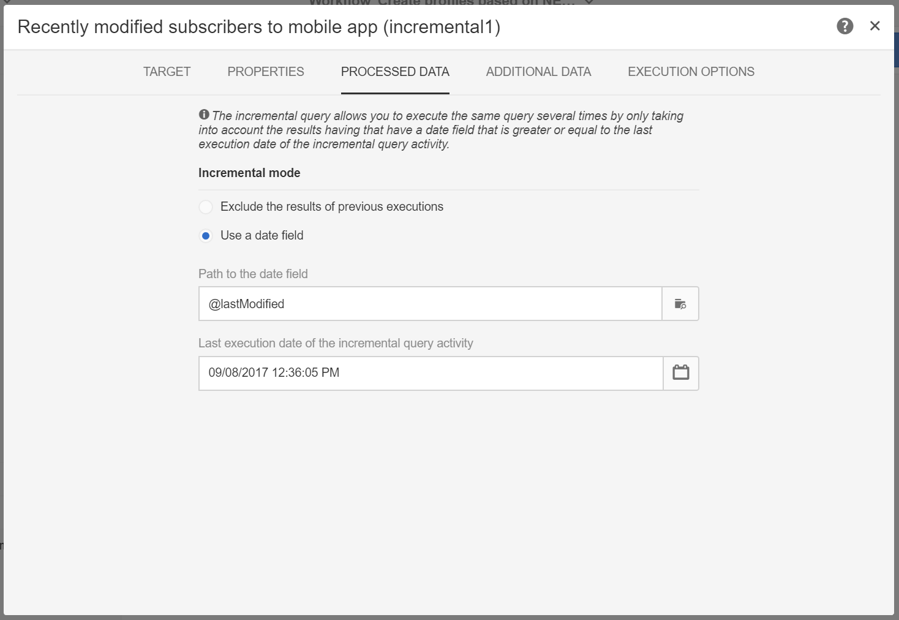

### **[!UICONTROL Update data]** アクティビティを設定します。

1. 「**[!UICONTROL Identification]**」タブで、**[!UICONTROL Dimension to update]** フィールドが「プロファイル（プロファイル）」に設定されていることを確認し、**[!UICONTROL Create element]** ボタンをクリックして、フィールドを紐付け条件として追加します。

   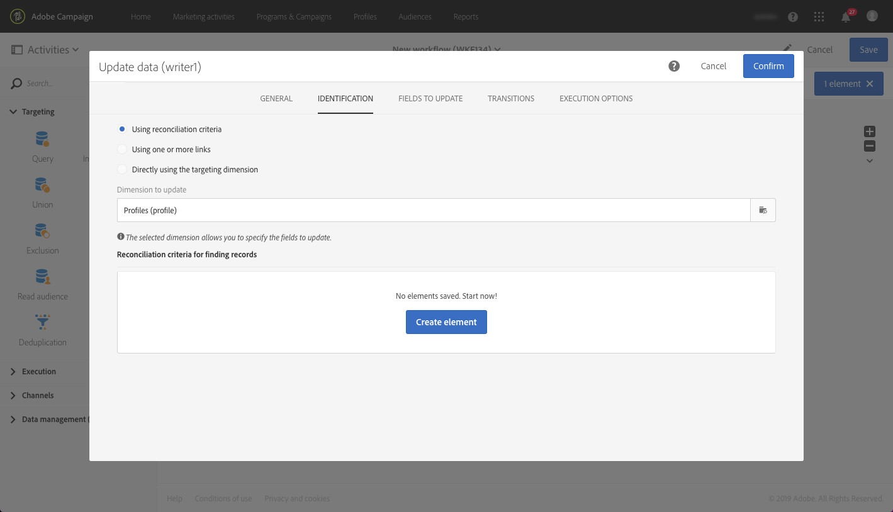

1. **[!UICONTROL Source]** フィールドで、appSubscrsiptionRcp テーブルのフィールドを紐付けフィールドとして選択します。 プロファイルの電子メール、crmId、marketingCloudIdなどを指定できます。この例では、「電子メール（cusEmail）」フィールドを使用します。

1. **[!UICONTROL Destination]** フィールドで、プロファイルテーブルからフィールドを選択して、appSubscriptionRcp テーブルのデータを紐付けます。 プロファイルの電子メール、またはcrmId、marketingCloudIdなどの拡張フィールドを指定できます。この例では、「Email （email）」フィールドを選択して、appSubscriptionRcp テーブルの「Email （cusEmail）」フィールドにマッピングする必要があります。

   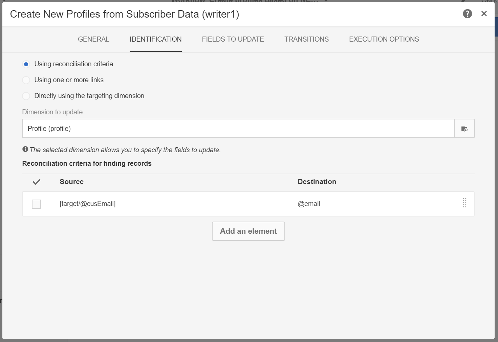

1. **[!UICONTROL Fields to update]** タブで、**[!UICONTROL Create element]** ボタンをクリックし、appSubscriptionRcp テーブル （**[!UICONTROL Source]** フィールド）から取得したフィールドを、プロファイルテーブル （**[!UICONTROL Destination]** フィールド）で更新するフィールドとマッピングします。

1. **[!UICONTROL Enabled if]** フィールドに式を追加して、ソースフィールドに値が含まれている場合にのみ、プロファイルテーブルの対応するフィールドが更新されるようにします。 これを行うには、リストからフィールドを選択し、「!=」式を追加します（式エディターのSource フィールドが`[target/@cusEmail]`の場合は、必ず`[target/@cusEmail] != ''"`と入力してください）。

   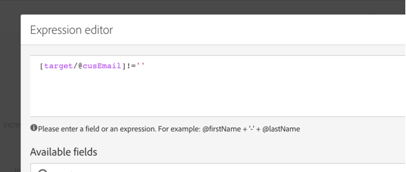

>[!NOTE]
>
>この場合、ワークフローはUPSERTを実行しますが、**[!UICONTROL Incremental query]** データに基づいているため、挿入されるだけです。 クエリを変更すると、挿入または更新されるデータに影響を与える可能性があります。
>さらに、「更新するフィールド」タブの設定によって、特定の条件で挿入または更新されるフィールドが決まります。 これらの設定は、アプリケーションや顧客ごとに一意にすることができます。
>appSubscriptionRcp データに基づいてプロファイルのレコードを更新すると、ユーザーの個人情報が検証されずに変更される可能性があるため、意図しない結果が生じる可能性があるので、これらの設定を設定する際には注意してください。

プロファイルに挿入/更新するフィールドがすべて追加されたら、**[!UICONTROL Confirm]**&#x200B;をクリックします。

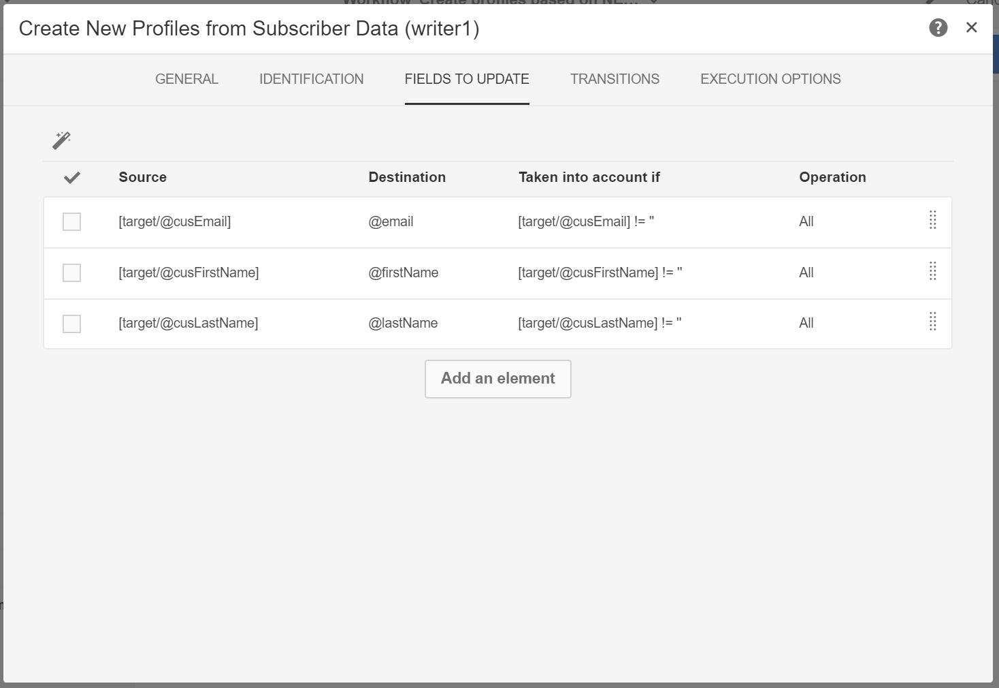

ワークフローを保存し、**[!UICONTROL Start]**&#x200B;をクリックしてワークフローを実行します。

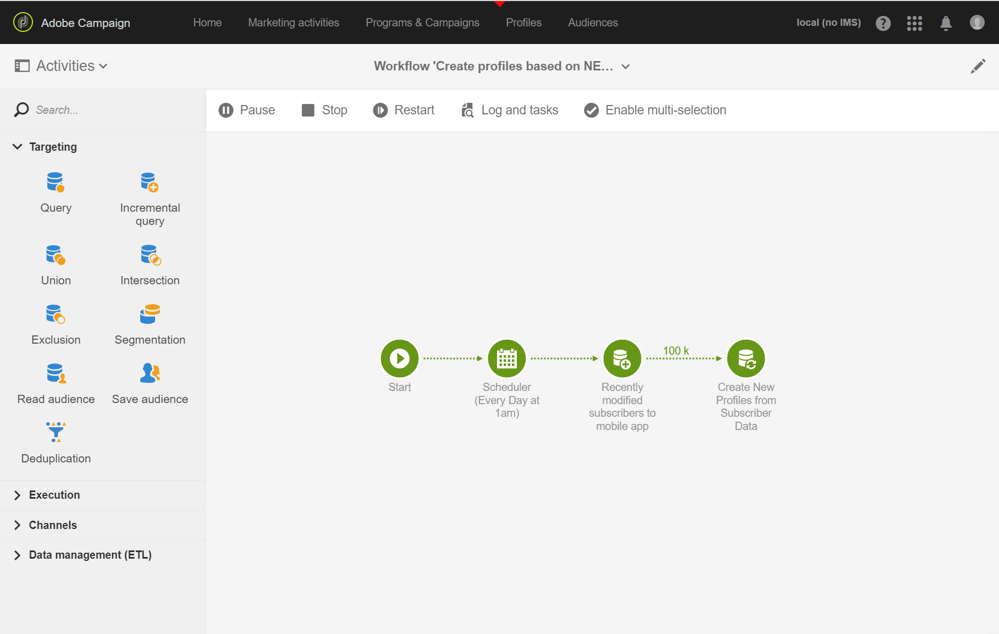
