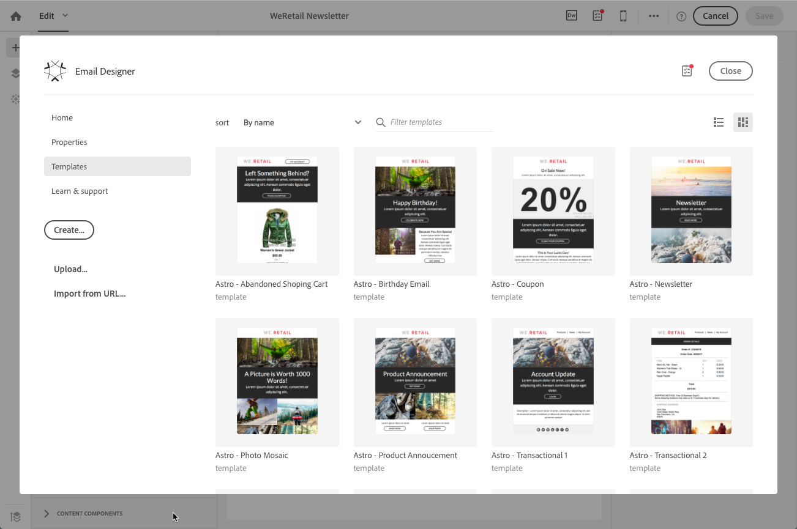
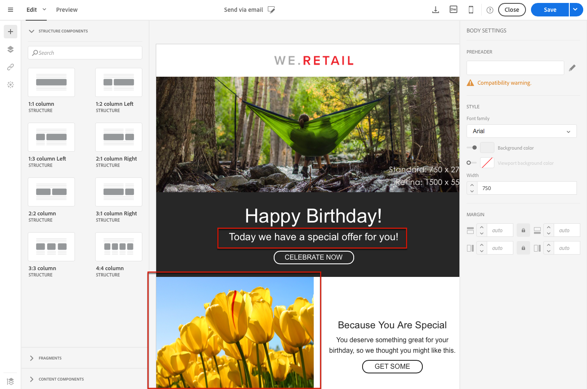

# 電子メールのコンテンツデザインについて{#about-email-content-design}

電子メールデザイナのドラッグアンドドロップインターフェイスを使用して、Adobe Campaignで電子メールの内容を作成および変更します。

このセクションでは、電子メールデザイナの特殊性について説明します。

* [電子メールデザイナについて](../../designing/using/about-email-content-design.md#about-the-email-designer)
* [電子メール構造の定義](../../designing/using/defining-the-email-structure.md)
* [電子メールスタイルの編集](../../designing/using/editing-email-styles.md)

1つ以上のマーケティング活動に共通するアクションの詳細については、次のセクションを参照してください。

* 電子メールコンテンツのカスタマイズの詳細については、「 [パーソナル化フィールドの挿入](../../designing/using/inserting-a-personalization-field.md) とコンテンツブロック [の追加」を](../../designing/using/adding-a-content-block.md)参照してください。
* 別の電子メールコンテンツのインポートについて詳しくは、既存のコンテンツ [の選択を参照](../../designing/using/selecting-an-existing-content.md)してください。
* 電子メールでの動的コンテンツの定義について詳しくは、「電子メールでの動的コンテンツ [の定義」を](../../designing/using/defining-dynamic-content-in-an-email.md)参照してください。
* 電子メールへのリンクの挿入について詳しくは、リンク [の挿入](../../designing/using/inserting-a-link.md)を参照してください。
* 電子メールにイメージを挿入する方法について詳しくは、イメージ [の挿入](../../designing/using/inserting-images.md)を参照してください。

また、コンテンツデザインの [一般的なベストプラクティスも確認](../../designing/using/content-design-best-practices.md)します。

## 電子メールデザイナについて {#about-the-email-designer}

電子メールデザイナでは、電子メールコンテンツと電子メールコンテンツテンプレートを作成できます。単純なEメール、トランザクションE-メール、A/BテストE-メール、多言語Eメール、定期的なEメールとの互換性があります。

電子メールデザイナを使用するには、電子メールデザイナの一般的な機能を説明するビデオ [](https://helpx.adobe.com/campaign/kt/acs/using/acs-email-designer-tutorial.html#GettingStarted) のセットと、電子メールを最初からデザインする方法やテンプレートを使用する方法を参照してください。

### 電子メールデザイナーのホームページ {#email-designer-home-page}

電子メール [](../../channels/using/creating-an-email.md)を作成すると、電子 **[!UICONTROL Email Designer]** メールの内容を選択するときにホームページが自動的に表示されます。


**[!UICONTROL Properties]** このタブでは、ラベル、送信者の住所、名前、電子メールの件名などの電子メールの詳細を編集できます。このタブにアクセスするには、画面上部の電子メールラベルをクリックします。


**[!UICONTROL Templates]** このタブでは、すぐに作成したHTMLコンテンツまたはテンプレートを選択して、電子メールのデザインをすばやく開始できます。[コンテンツテンプレート](../../start/using/about-templates.md#content-templates)を参照してください。



このタブ **[!UICONTROL Learn & support]** では、関連ドキュメントおよびチュートリアルに簡単にアクセスできます。


テンプレートを選択しない場合は、電子メールデザイナーのホームページで、コンテンツのデザイン方法を選択することもできます。

* 新しい **[!UICONTROL Create]** コンテンツを最初から開始するには、ボタンをクリックします。「 [電子メールコンテンツの最初からのデザイン」を参照](../../designing/using/about-email-content-design.md#designing-an-email-content-from-scratch)してください。
* **[!UICONTROL Upload]** コンピュータからファイルをアップロードするには、ボタンをクリックします。「 [ファイルからのコンテンツのインポート」を参照](../../designing/using/importing-content-from-a-file.md)してください。
* ボタン **[!UICONTROL Import from URL]** をクリックすると、既存のコンテンツがURLを作成します。「 [URLからのコンテンツのインポート」を参照](../../designing/using/importing-content-from-a-url.md)してください。

### 電子メールデザイナーインターフェイス {#email-designer-interface}

電子メールデザイナには、コンテンツのあらゆる側面を作成、編集、カスタマイズできる多くのオプションが用意されています。

インターフェイスは、さまざまな機能を提供する複数の領域で構成されます。


パレット **（** 1）で使用可能な要素から、構造コンポーネントとコンテンツフラグメントをメインワークス **ペース（** 2）にドラッグアンドドロップします。ワークス **ペース** （2）でコンポーネントまたは要素を選択し、そのメインスタイルと表示特性を設定 **** ペイン（3）からカスタマイズします。

メインツール **バー** （4）からより一般的なオプションと設定にアクセスします。

>[!NOTE]
>
>設定 **** ペインは、画面の解像度と表示に従って左に移動できます。


エディタインタフェースの **コンテキストツールバー** は、選択したゾーンに応じてさまざまな機能を提供します。これには、テキストのスタイルを変更できるアクションボタンとボタンが含まれます。変更内容は、選択したゾーンに常に適用されます。

### 電子メールデザイナを使用するための一般的な推奨事項 {#general-recommendations-for-using-the-email-designer}

電子メールデザイナを適切に使用し、最適な電子メールをできるだけ作成するには、次の原則を適用することをお勧めします。

* HTMLの&lt; head&gt;セクションで、個別のCSSおよびCSSではなくインラインスタイルを使用します。インラインスタイル設定を使用すると、コンテンツフラグメントの保存と再利用を最適化できます。

   インラインスタイル属性 [の追加を参照](../../designing/using/editing-email-styles.md#adding-inline-styling-attributes)してください。

* マーケティングキャンペーン全体の一貫性を維持するためにコンテンツフラグメントを作成および再利用することで、ブランドを簡単に決済できます。

   コンテンツフラグメント [の作成を参照](../../designing/using/defining-the-email-structure.md#creating-a-content-fragment)してください。

また、コンテンツデザインの [一般的なベストプラクティスも確認](../../designing/using/content-design-best-practices.md)します。

### 電子メールデザイナー互換モード {#email-designer-compatibility-mode}

コンテンツをアップロードするときに、電子メールデザイナのWYSIWYGエディタで完全に準拠し、編集できるようにするには、特定のタグ付けを含める必要があります。

アップロードされたHTMLの全部または一部が予期されるタグ付けに準拠していない場合、コンテンツは「互換モード」に読み込まれ、UIを介してエディションの可能性が制限されます。

コンテンツが互換モードで読み込まれると、インターフェイスを通じて次の変更を実行できます（使用できないアクションは非表示）。

* テキストの変更またはイメージの変更
* リンクおよびパーソナル化フィールドの挿入
* 選択したHTMLブロックのスタイル設定オプションを編集する
* 条件付きコンテンツの定義


電子メールや高度なスタイル設定に新しいセクションを追加するなどのその他の変更は、HTMLモードで電子メールのソースコードで直接実行する必要があります。

既存の電子メールを電子メールデザイナ互換電子メールに変換する方法については、このセクションを [](../../designing/using/about-email-content-design.md#designing-an-email-using-existing-contents)参照してください。

### 電子メールデザイナーの制限事項 {#email-designer-limitations}

* フラグメント化フィールドはフラグメントで使用できません。フラグメントの詳細については、このセクションを [](../../designing/using/defining-the-email-structure.md#about-fragments)参照してください。
* スタイルを編集する場合、ほとんどの電子メールクライアントで公式にサポートされているWebフォントのみが使用できます。
* スタイルは、今後再利用するテーマとして保存できません。ただし、CSSスタイルは、コンテンツテンプレートまたは電子メールで保存できます。スタイルの詳細については、このセクションを [](../../designing/using/editing-email-styles.md)参照してください。

### 電子メールデザイナーの更新 {#email-designer-updates}

電子メールデザイナーは継続的に改善されています。電子メールコンテンツを最初から作成した場合、すぐに使用できるテンプレートまたはフラグメントを作成した場合は、次にコンテンツを開いたときに次の更新メッセージが表示されることがあります。


CSS衝突問題などの問題を回避するには、コンテンツを最新バージョンに更新することをお勧めします。**[!UICONTROL Update now]**&#x200B;をクリックします。

コンテンツの更新中にエラーが発生した場合は、HTMLを確認し、この更新を再実行する前に修正してください。

フラグメントについては、次の点に注意してください。

* フラグメントを新しい電子メールまたはテンプレートに追加する場合、このメッセージが表示されたら、まずこのフラグメントを更新する必要があります。

* 複数のフラグメントがある場合は、電子メールの内容で使用する各フラグメントを更新する必要があります。

* まだ準備されていない現在の電子メールメッセージへの影響を回避するには、一部のフラグメントを更新しないように選択できます。

* 更新されていないフラグメントが既に使用されていても、そのフラグメントは編集できない電子メールを送信できます。

* 既に準備済みの電子メールで使用されるフラグメントを更新しても、その電子メールには影響しません。

## 電子メールコンテンツを最初からデザインする {#designing-an-email-content-from-scratch}

電子メール・デザイナを使用して電子メール・コンテンツを最初から作成および設計する主な手順を次に示します。

1. 電子メールを作成し、そのコンテンツを開きます。
1. 構造コンポーネントを追加して電子メールを作成します。電子 [メール構造の編集を参照](../../designing/using/defining-the-email-structure.md#editing-the-email-structure)してください。
1. コンポーネントコンポーネントにコンテンツコンポーネントとフラグメントを挿入します。フラグメントおよびコンテンツコンポーネント [の追加を参照](../../designing/using/defining-the-email-structure.md#adding-fragments-and-content-components)してください。
1. イメージを追加し、電子メールのテキストを編集します。イメージ [の挿入を参照](../../designing/using/inserting-images.md)してください。
1. パーソナル化フィールド、リンクなどを追加して、電子メールをカスタマイズします。「 [パーソナル化フィールドの挿入](../../designing/using/inserting-a-personalization-field.md)」、「リンク [の挿入](../../designing/using/inserting-a-link.md) 」および「動的コンテンツ [の電子メールへの定義」を](../../designing/using/defining-dynamic-content-in-an-email.md)参照してください。
1. 電子メールの件名を定義します。電子 [メールの件名のカスタマイズを参照](../../designing/using/personalizing-the-subject-line-of-an-email.md)してください。
1. 電子メールをプレビューします。
1. コンテンツを保存し、ユーザーがユーザーを定義して送信を適切にスケジュールしたことを確認した後にメッセージを表示します。

この [紹介ビデオをチェックアウト](https://video.tv.adobe.com/v/22771/?autoplay=true&hidetitle=true&captions=jpn)することもできます。

>[!NOTE]
>
>電子メールコンテンツを最初からデザインしないようにするには、すぐに使用できるコンテンツテンプレートを使用します。詳細については [、コンテンツテンプレート](../../start/using/about-templates.md#content-templates)を参照してください。

**関連トピック**:

* [電子メールの作成](../../channels/using/creating-an-email.md)
* [既存のコンテンツの選択](../../designing/using/selecting-an-existing-content.md)
* [メッセージ内の視聴者を選択する](../../audiences/using/selecting-an-audience-in-a-message.md)
* [メッセージのスケジュール設定](../../sending/using/about-scheduling-messages.md)
* [メッセージのプレビュー](../../sending/using/previewing-messages.md)
* [電子メールレンダリング](../../sending/using/email-rendering.md)
* [HTMLを必要とせずにカスタマイズされた電子メールを構築](https://helpx.adobe.com/campaign/kb/simplify-campaign-management.html#Createcompellingcontenttailoredtoeveryindividual)

## 既存のコンテンツを使用した電子メールのデザイン {#designing-an-email-using-existing-contents}

このセクションでは、既存の電子メールを電子メールデザイナ互換電子メールに変換する方法について説明します。

デフォルトでは、HTMLをアップロードするだけの場合（ファイルからのコンテンツ [のインポート](../../designing/using/importing-content-from-a-file.md)を参照）、コンテンツは«[互換モード](../../designing/using/about-email-content-design.md#email-designer-compatibility-mode)»にロードされます。これは、UI（インプレイスエディションのみ、ドラッグアンドドロップなし）でのエディションの可能性を制限します。

ただし、複数の電子メールで再利用できるモジュラー型テンプレートとフラグメントのフレームワークを構築する場合は、電子メールHTMLを電子メールデザイナーテンプレートに変換することを検討してください。

電子メールデザイナでコンテンツをデザインする場合、次の3つのオプションがあります。

* [すぐに使えるテンプレートからコンテンツを構築する](../../designing/using/about-email-content-design.md#building-content-from-an-out-of-the-box-template)
* [フラグメントとコンポーネントを使用し](../../designing/using/about-email-content-design.md#using-fragments-and-components)て、最初から開始し、HTMLデザインを再作成します
* [HTMLコンテンツ](../../designing/using/about-email-content-design.md#converting-an-html-content) の電子メールをモジュラー型電子メールデザイナのコンテンツに変換する

### すぐに使えるテンプレートからコンテンツを構築する {#building-content-from-an-out-of-the-box-template}

1. 電子メールを作成し、そのコンテンツを開きます。詳細については、「電子メール [の作成」を](../../channels/using/creating-an-email.md)参照してください。
1. ホームページにアクセスするには、ホームアイコン **[!UICONTROL Email Designer]** をクリックします。
1. タブをクリック **[!UICONTROL Templates]** します。
1. すぐに使用できるHTMLテンプレートを選択します。

   異なるテンプレートには、さまざまなタイプの要素のさまざまな組み合わせがあります。たとえば、「ぼかし」テンプレートには余白があり、「アストロ」テンプレートにはありません。詳細については [、コンテンツテンプレート](../../start/using/about-templates.md#content-templates)を参照してください。

1. これらの要素を組み合わせて、さまざまな電子メールのバリエーションを構築できます。たとえば、構造コンポーネントを選択し、コンテキストツールバーからクリック **[!UICONTROL Duplicate]** すると、電子メールセクションを複製できます。
1. 左側の青い矢印を使用して要素を移動すると、構造コンポーネントを別の要素の下または下にドラッグできます。詳細については、「電子メール構造 [の編集」を参照](../../designing/using/defining-the-email-structure.md#editing-the-email-structure)してください。
1. コンポーネントを移動して、各構造要素の組織を変更することもできます。詳細については、「フラグメントとコンポーネント [の追加」を](../../designing/using/defining-the-email-structure.md#adding-fragments-and-content-components)参照してください。
1. 必要に応じて、各要素のコンテンツを変更します。イメージ、テキスト、リンク
1. 必要に応じてスタイルオプションをコンテンツに合わせます。詳細については、「電子メールスタイル [の編集」を参照](../../designing/using/editing-email-styles.md)してください。

### フラグメントとコンポーネントの使用 {#using-fragments-and-components}

電子メールデザイナに外部コンテンツを簡単に作成するには、最初からメッセージを作成し、既存の電子メールからフラグメントおよびコンポーネントにコンテンツをコピーすることをお勧めします。

再作成できないコンテンツがある場合は、コンテンツ **[!UICONTROL Html]** コンポーネントを使用して元の電子メールからHTMLコードをコピーできます。続行する前にHTMLに精通していることを確認してください。

完全な例を以下に示します。

>[!NOTE]
>
>新しいコンテンツは、元の電子メールの正確なコピーではありませんが、以下の手順に従って、できるだけ近いメッセージを作成することができます。

Adobe Campaign以外で作成された既存のニュースレターを使用したいとします。

Adobe Campaignで送信するすべての電子メールに同じヘッダーとフッターを設定します。電子メールの本文は、各ニュースレターに表示するコンテンツに応じて変わります。

**前提条件**

1. 元の電子メールで、送信する各電子メールに一意のセクションから再利用可能なセクションを特定します。
1. 使用するすべてのイメージとアセットを保存します。
1. HTMLに精通している場合は、元のHTMLコンテンツを別の部分に分割します。

**再利用可能なコンテンツのフラグメントを作成する**

電子メールデザイナを使用して、再利用可能な各セクションのフラグメントを作成します。この例では、次の2つのフラグメントを作成します。1つはヘッダー用で、もう1つはフッター用です。その後、関連するパーツを既存のコンテンツからこれらのフラグメントにコピーできます。

これを行うには、次の手順に従います。

1. Adobe Campaignで **[!UICONTROL Resources]** &gt;に **[!UICONTROL Content templates & fragments]** 移動し、ヘッダーのフラグメントを作成します。詳細については、「コンテンツフラグメント [の作成」を](../../designing/using/defining-the-email-structure.md#creating-a-content-fragment)参照してください。
1. フラグメントに必要な数の構造コンポーネントを追加します。

   

1. 構造にイメージコンポーネントとテキストコンポーネントを挿入します。

   

1. 対応するイメージをアップロードし、テキストを入力して設定を調整します。

   スタイル設定とインライン属性の管理の詳細については、「電子メールスタイル [の編集」を参照](../../designing/using/editing-email-styles.md)してください。

   

1. フラグメントを保存します。
1. 同様に、フッターを作成して保存します。

   

   HTMLに精通している場合は、コンテンツ **[!UICONTROL Html]** コンポーネントを使用して元のフッターからHTMLコードをコピー貼り付けることができます。詳細については、「コンテンツコンポーネント [について」を参照](../../designing/using/defining-the-email-structure.md#about-content-components)してください。

   

これで、フラグメントをテンプレートで使用できるようになりました。

**フラグメントおよびコンポーネントをテンプレートに挿入する**

電子メール・デザイナで電子メール・テンプレートを作成できるようになりました。コンテンツコンポーネントを使用して、電子メールのさまざまなセクションを反映し、設定を調整して、元のニュースレターにできるだけ近づけるようにします。最後に、作成したフラグメントを挿入します。

1. 電子メールデザイナを使用して、テンプレートを作成します。詳細については [、コンテンツテンプレート](../../start/using/about-templates.md#content-templates)を参照してください。
1. 電子メールのヘッダー、フッター、および本文に対応する複数の構造コンポーネントをテンプレートに挿入します。構造コンポーネントの追加について詳しくは、電子メールデザイナーでの電子メール構造 [の編集を参照](../../designing/using/defining-the-email-structure.md#editing-the-email-structure)してください。
1. 必要な数のコンテンツコンポーネントを挿入して、ニュースレターの本文を作成します。これは、毎月更新する電子メールの編集可能なコンテンツになります。

   

   HTMLコードに精通している場合は **[!UICONTROL Html]** 、元の電子メールの複雑な要素をコピーペーストできるコンポーネントを活用することをお勧めします。その他のコンポーネント（コンテンツ **[!UICONTROL Button]**&#x200B;の **[!UICONTROL Image]** 他の **[!UICONTROL Text]** コンポーネントなど）を使用します。詳細については、「コンテンツコンポーネント [について」を参照](../../designing/using/defining-the-email-structure.md#about-content-components)してください。

   >[!NOTE]
   >
   >コンポーネント **[!UICONTROL Html]** を使用すると、限られたオプションで編集可能なコンポーネントを作成できます。このコンポーネントを選択する前に、HTMLコードの処理方法を確認してください。

1. コンテンツコンポーネントを、できるだけ元の電子メールに合わせて調整します。

   

   スタイル設定とインライン属性の管理の詳細については、「電子メールスタイル [の編集」を参照](../../designing/using/editing-email-styles.md)してください。

1. 以前に作成した2つのフラグメント（ヘッダーとフッター）を、目的の構造コンポーネントに挿入します。

   

1. テンプレートを保存します。

電子メールデザイナでこのテンプレートを完全に管理して、毎月送信するニュースレターを作成および更新できます。

これを使用するには、電子メールを作成し、作成したコンテンツテンプレートを選択します。

**関連トピック**:

* [電子メールの作成](../../channels/using/creating-an-email.md)
* [電子メールデザイナへのビデオの紹介](https://video.tv.adobe.com/v/22771/?autoplay=true&hidetitle=true&captions=jpn)
* [電子メールコンテンツを最初からデザインする](../../designing/using/about-email-content-design.md#designing-an-email-content-from-scratch)

### HTMLコンテンツの変換 {#converting-an-html-content}

このユースケースでは、HTML電子メールを電子メールデザイナコンポーネントに簡単に変換できます。

>[!CAUTION]
>
>このセクションでは、HTMLコードに精通した上級ユーザーについて説明します。

>[!NOTE]
>
>互換モードと同様に、HTMLコンポーネントは制限付きオプションで編集できます。インプレイス版のみを実行できます。

電子メールデザイナの外部で、元のHTMLが再利用可能なセクションに分割されていることを確認します。

この場合は、HTMLから別のブロックを切り取ってください。たとえば、

```
<!-- 3 COLUMN w/CTA (SCALED) -->
<table width="100%" align="center" cellspacing="0" cellpadding="0" border="0" role="presentation" style="max-width:680px;">
<tbody>
<tr>
<td class="padh10" align="center" valign="top" style="padding:0 5px 20px 5px;">
<table width="100%" cellspacing="0" cellpadding="0" border="0" role="presentation">
<tbody>
<tr>
...
</tr>
</tbody>
</table>
</td>
</tr>
</tbody>
</table>
<!-- //3 COLUMN w/CTA (SCALED) -->
```

すべてのブロックを特定したら、電子メールデザイナで、既存の電子メールの各セクションに対して次の手順を繰り返します。

1. 電子メールデザイナを開き、空の電子メールコンテンツを作成します。
1. ボディレベルの属性を設定します。背景色、幅など詳細については、「電子メールスタイル [の編集」を参照](../../designing/using/editing-email-styles.md)してください。
1. 構造コンポーネントを追加します。詳細については、「電子メール構造 [の編集」を参照](../../designing/using/defining-the-email-structure.md#editing-the-email-structure)してください。
1. HTMLコンポーネントを追加します。詳細については、「フラグメントとコンポーネント [の追加」を](../../designing/using/defining-the-email-structure.md#adding-fragments-and-content-components)参照してください。
1. HTMLをそのコンポーネントにコピーします。
1. モバイルビューに切り替えます。詳細については、このセクションを [](../../designing/using/about-email-content-design.md#switching-to-mobile-view)参照してください。

   CSSがないため、応答性のあるビューが壊れています。

1. これを修正するには、ソースコードモードに切り替え、スタイルセクションを新しいスタイルセクションにコピーします。たとえば、

   ```
   <style type="text/css">
   a {text-decoration:none;}
   body {min-width:100% !important; margin:0 auto !important; padding:0 !important;}
   img {line-height:100%; text-decoration:none; -ms-interpolation-mode:bicubic;}
   ...
   </style>
   ```

   >[!NOTE]
   >
   >電子メールデザイナで生成されたCSSは変更しないでください。 `<style acrite-template-css="true">``<style acrite-custom-styles="" type="text/css">`とします。この後、スタイルを追加してください。

1. モバイルビューに戻り、コンテンツが正しく表示されていることを確認し、変更内容を保存します。

## モバイルビューへの切り替え {#switching-to-mobile-view}

モバイルディスプレイのすべてのスタイルオプションを個別に編集することで、電子メールの応答性のあるデザインを微調整できます。たとえば、余白と埋め込みを調整したり、サイズを小さくしたり、フォントのサイズを変更したり、ボタンを変更したり、電子メールのモバイルバージョンに固有の背景色を適用したりできます。

すべてのスタイルオプションはモバイルビューで使用できます。電子メールデザイナーのスタイル設定は、「電子メールスタイル [の編集](../../designing/using/editing-email-styles.md) 」セクションにあります。

1. 電子メールを作成し、コンテンツの編集を開始します。詳細については、「電子メールコンテンツ [の最初からのデザイン」を](../../designing/using/about-email-content-design.md#designing-an-email-content-from-scratch)参照してください。
1. 専用モバイルビューにアクセスするには、ボタン **[!UICONTROL Switch to mobile view]** を選択します。

   

   電子メールのモバイルバージョンが表示されます。デスクトップビューで定義されたすべてのコンポーネントとスタイルが含まれます。

1. 背景色、配置、余白、余白、フォントファミリ、テキスト色など、すべてのスタイル設定を個別に編集します。

   

1. モバイルビューでスタイル設定を編集する場合、変更はモバイルディスプレイにのみ適用されます。

   たとえば、イメージのサイズを小さくし、緑の背景を追加して、モバイルビューの埋め込みを変更します。

   

1. コンポーネントは、モバイルデバイスに表示されるときに非表示にできます。これを行うには、からを選択 **[!UICONTROL Show only on desktop devices]****[!UICONTROL Display options]**します。
このコンポーネントをデスクトップデバイスで非表示にすることもできます。これは、モバイルデバイスにのみ表示されることを意味します。これを行うには、を選択 **[!UICONTROL Show only on mobile devices]**します。
たとえば、このオプションを使用すると、モバイルデバイスに特定のイメージを表示したり、デスクトップデバイス上の別のイメージを表示したりできます。
このオプションは、モバイルビューまたはデスクトップビューから設定できます。

   

1. ボタン **[!UICONTROL Switch to mobile view]** をもう一度クリックすると、標準のデスクトップビューに戻ります。作成したスタイルの変更は反映されません。

   

   >[!NOTE]
   >
   >唯一の例外は **[!UICONTROL Style inline]** 設定です。スタイルインライン設定変更は、標準デスクトップビューにも適用されます。

1. テキストの編集、新しいイメージのアップロード、新しいコンポーネントの追加などの電子メールの構造または内容へのその他の変更。標準ビューにも適用されます。

   たとえば、モバイルビューに切り替え、テキストを編集してイメージを置き換えます。

   

   ボタン **[!UICONTROL Switch to mobile view]** をもう一度クリックすると、標準のデスクトップビューに戻ります。変更が反映されます。

   

1. モバイルビューでスタイルを削除すると、デスクトップモードで適用されたスタイルに戻ります。

   たとえば、モバイルビューでは、緑の背景色をボタンに適用します。

   

1. デスクトップビューに切り替え、同じボタンに明るい背景を適用します。

   

1. モバイルビューに再度切り替え、 **[!UICONTROL Background color]** 設定を無効にします。

   

   デスクトップビューで定義された背景色が適用されます。はgrey（空白ではない）に変わります。

   唯一の例外は **[!UICONTROL Border color]** 設定です。モバイルビューで無効にすると、デスクトップビューで境界線の色が定義されていても、境界線は適用されません。

>[!NOTE]
>
>モバイルビューはフラグメントで [は使用](../../designing/using/defining-the-email-structure.md#about-fragments)できません。

## プレーンテキストとHTMLモード {#plain-text-and-html-modes}

### 電子メールのテキストバージョンの生成 {#generating-a-text-version-of-the-email}

既定では、電子メール **[!UICONTROL Plain text]** のバージョンは自動的に生成され、バージョン **[!UICONTROL Edit]** と同期されます。

HTMLバージョンに追加されたパーソナル化フィールドとコンテンツブロックもプレーンテキストバージョンと同期されます。

>[!NOTE]
>
>コンテンツブロックをプレーンテキストバージョンで使用するには、HTMLコードが含まれていないことを確認します。

HTMLバージョンとは異なるプレーンテキストバージョンを使用するには、電子メールのビューから **[!UICONTROL Sync with HTML]** スイッチをクリックして、この同期 **[!UICONTROL Plain text]** を無効にします。


その後、必要に応じてプレーンテキストバージョンを編集できます。

>[!NOTE]
>
>同期が無効になっているときに **[!UICONTROL Plain text]** バージョンを編集すると、次にオプション **[!UICONTROL Sync with HTML]** を有効にすると、プレーンテキストバージョンで行ったすべての変更がHTMLバージョンに置き換えられます。ビューの **[!UICONTROL Plain text]** 変更は **[!UICONTROL HTML]** ビューに反映されません。

### HTMLでの電子メールコンテンツソースの編集 {#editing-an-email-content-source-in-html}

最も高度なユーザーとデバッグの場合は、電子メールコンテンツをHTMLで直接表示および編集できます。

電子メールのHTMLバージョンを編集するには、次の2つの方法があります。

* **[!UICONTROL Edit]** "&gt;" **[!UICONTROL HTML]** を選択して、電子メールのHTMLバージョンを開きます。

   

* WYSIWYGインタフェースから要素を選択し、 **[!UICONTROL Source code]** アイコンをクリックします。

   選択した要素のソースのみが表示されます。選択した要素が **[!UICONTROL HTML]** コンテンツコンポーネントである場合は、ソースコードを編集できます。他のコンポーネントは読み取り専用モードですが、電子メールの完全なHTMLバージョンで編集できます。

   

HTMLを変更すると、電子メールの応答性が損なわれることがあります。**[!UICONTROL Preview]** ボタンを使ってテストしてください。「メッセージ [のプレビュー」を参照](../../sending/using/previewing-messages.md)してください。

## Adobeキャンペーン統合による設計 {#design-through-adobe-campaign-integrations}

### Dreamweaverでのコンテンツの編集 {#editing-content-in-dreamweaver}

Adobe Campaign StandardとDreamweaverを統合すると、Dreamweaverインターフェイスで電子メールのコンテンツを編集できます。Dreamweaverの強力なインターフェイスにアクセスして、応答性の高い電子メールコンテンツを設計および開発できます。

* **双方向同期**

   1つの製品で編集が行われるたびに、その編集はもう一方の製品でリアルタイムに更新されます。Dreamweaverでテキストの色を変更する場合は、その編集にすぐに、テキストの色が「キャンペーン」に表示されます。また、DreamweaverまたはCampaignでコードを選択すると、行番号が同じであるため、この2つの製品の間に選択が残ります。これは、コード内の特定のものを探すときに非常に便利です。

* **Dreamweaverを介してローカルイメージをACにアップロードする**

   Dreamweaver内で電子メールを作成または編集する場合は、デスクトップまたはローカルマシンからイメージを選択するだけです。Dreamweaverでは常にこれを許可していますが、Dreamweaverとキャンペーンが接続されると、ローカルファイルはAdobe Campaignサーバに直ちにアップロードされます。コンテンツの変更として手動でイメージをアップロードする必要はありません。さらに、最新のイメージが常にキャンペーンに使用されるようになります。

* **Dreamweaverでキャンペーンのカスタマイズを追加**

   電子メール開発者にとって、データモデルのテーブルの構文を検索し ```[[FIRSTNAME_PLACEHOLDER]]``` たり、検索したりする必要がなくなりました。DreamweaverのCampaignツールバーは、Campaignインスタンスのデータモデルに直接接続します。つまり、"First Name to Address"のようにカスタマイズしたいデータをすべてプルできます。キャンペーン内でコンテンツブロックを作成した場合は、それらをDreamweaverに直接プルすることもできます。

この機能は、 [Dreamweaverドキュメントで詳しく説明](https://helpx.adobe.com/dreamweaver/using/working-with-dreamweaver-and-campaign.html)されています。デモ [ビデオ](https://helpx.adobe.com/campaign/kt/acs/using/acs-dreamweaver-integration-feature-video-use.html) も使用できます。

### Experience Managerでのコンテンツの編集 {#editing-content-in-experience-manager}

電子メールコンテンツはExperience Managerで編集し、Adobe Campaign Standardで1つまたは複数の電子メールメッセージに使用できます。このドキュメント [を参照](../../integrating/using/integrating-with-experience-manager.md)してください。

### Eメールデザインオプションの比較 {#email-design-options-comparison}

Adobe Campaignには、いくつかの電子メールオーサリングオプションがあります。次の表に、それぞれの主な可能性、利点、制限事項を示します。

<table> 
 <thead> 
  <tr> 
   <th> </th> 
   <th> 電子メールデザイナー<br /> </th> 
   <th> 経験マネージャ<br /> </th> 
   <th> Dreamweaver<br /> </th> 
  </tr> 
 </thead> 
 <tbody> 
  <tr> 
   <td> <strong>空白の電子メールを開始</strong><br /> </td> 
   <td> サポート<br /> </td> 
   <td> サポート<br /> </td> 
   <td> サポート<br /> </td> 
  </tr> 
  <tr> 
   <td> <strong>HTMLの書き込み</strong><br /> </td> 
   <td> サポート<br /> </td> 
   <td> サポートされていない<br /> </td> 
   <td> サポート<br /> </td> 
  </tr> 
  <tr> 
   <td> <strong>HTMLの更新</strong><br /> </td> 
   <td> HTMLコンポーネント内のみ<br /> </td> 
   <td> サポートされていない<br /> </td> 
   <td> サポート<br /> </td> 
  </tr> 
  <tr> 
   <td> <strong>基本的なカスタマイズ</strong><br /> </td> 
   <td> サポート<br /> </td> 
   <td> サポート<br /> </td> 
   <td> サポート<br /> </td> 
  </tr> 
  <tr> 
   <td> <strong>高度なパーソナル化</strong><br /> </td> 
   <td> サポート<br /> </td> 
   <td> サポートされていない<br /> </td> 
   <td> サポートされていない<br /> </td> 
  </tr> 
  <tr> 
   <td> <strong>校正/プレビュー</strong><br /> </td> 
   <td> サポート<br /> </td> 
   <td> キャンペーンのAEM<br /> 証明書のプレビュー<br /> </td> 
   <td> キャンペーンのプレビューおよび証明<br /> </td> 
  </tr> 
  <tr> 
   <td> <strong>製品リスト</strong><br /> </td> 
   <td> 電子メールトランザクションメッセージでサポート<br /> </td> 
   <td> サポートされていない<br /> </td> 
   <td> サポートされていない<br /> </td> 
  </tr> 
  <tr> 
   <td> <strong>メリット</strong><br /> </td> 
   <td> 
     - ドラッグアンドドロップ操作による簡単な電子メール構築<br/>-従来のコンテンツエディタと同様の機能<br/>-断片化した再利用可能なコンテンツ
  </td> 
   <td> 
     - Webサイトからの資産を電子メール<br/>で再利用-メールの内容における体験マネージャの能力を活用
    </td> 
   <td> 
    - 開発者が電子メールを直接コーディング<br/>する機能-双方向同期<br/>-
 Dreamweaverでのオフライン編集および後で同期<br/>-
 Dreamweaverを介したAdobe Campaignへのイメージのアップロード
  </td> 
  </tr> 
  <tr> 
   <td> <strong>制限事項</strong><br /> </td> 
   <td> 
     - フラグメント内の条件付きコンテンツはあり<br/>ません-経験マネージャのフラグメントを使用できません
  </td> 
   <td> 
     - 高度なカスタマイズが実装困難<br/>- Adobe Campaignでテストを送信する必要がある
  </td> 
   <td> 動的コンテンツはサポートされていません<br /> </td> 
  </tr> 
  <tr> 
   <td> <strong>観客</strong><br /> </td> 
   <td> HTMLコンポーネントをドラッグアンドドロップ機能と組み合わせて使用する柔軟性を維持したいマーケティング担当者<br /> </td> 
   <td> 既存の電子メールテンプレートを使用してカスタマイズをほとんど実行しない経験マネージャを使用しているマーケティング担当者<br /> </td> 
   <td> 電子メールの内容をコーディングし、Adobeキャンペーンと直接統合する開発者<br /> </td> 
  </tr> 
  <tr> 
   <td> <strong>詳細については</strong><br /> </td> 
   <td> 「 <a href="../../designing/using/about-email-content-design.md#about-the-email-designer">電子メールデザイナについて」を参照</a><br /> </td> 
   <td> 経験マネージャと <a href="../../integrating/using/integrating-with-experience-manager.md">の統合を参照</a><br /> </td> 
   <td> <a href="https://helpx.adobe.com/dreamweaver/using/working-with-dreamweaver-and-campaign.html">Dreamweaverとキャンペーンを参照</a> し <a href="https://helpx.adobe.com/campaign/kt/acs/using/acs-dreamweaver-integration-feature-video-use.html">てこのビデオを見る</a><br /> </td> 
  </tr> 
 </tbody> 
</table>

