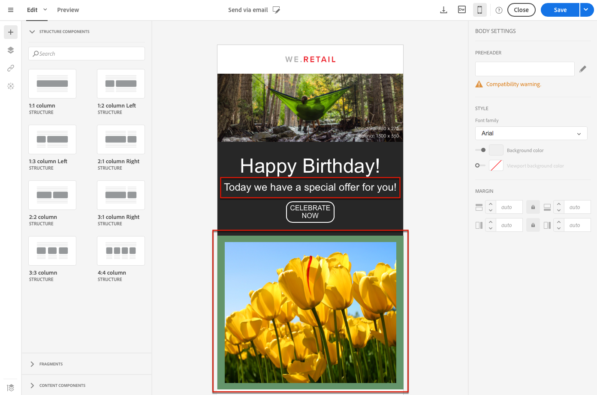

# About email content design{#about-email-content-design}

電子メールデザイナーのドラッグ&amp;ドロップインターフェイスを使用して、Adobe Campaignで電子メールのコンテンツを作成および変更します。

ここでは、電子メールデザイナーの特異性について説明します。

* [電子メールデザイナーについて](../../designing/using/about-email-content-design.md#about-the-email-designer)
* [電子メール構造の定義](../../designing/using/defining-the-email-structure.md)
* [電子メールスタイルの編集](../../designing/using/editing-email-styles.md)

1つまたは複数のマーケティングアクティビティに共通のアクションについて詳しくは、以下の節を参照してください。

* For more on personalizing an email content, see [Inserting a personalization field](../../designing/using/inserting-a-personalization-field.md) and [Adding a content block](../../designing/using/adding-a-content-block.md).
* For more on importing another email content, see [Selecting an existing content](../../designing/using/selecting-an-existing-content.md).
* For more on defining dynamic content in an email, see [Defining dynamic content in an email](../../designing/using/defining-dynamic-content-in-an-email.md).
* For more on inserting links in an email, see [Inserting a link](../../designing/using/inserting-a-link.md).
* For more on inserting images in an email, see [Inserting images](../../designing/using/inserting-images.md).

Also check the [general best practices for content design](../../designing/using/content-design-best-practices.md).

## About the Email Designer {#about-the-email-designer}

電子メールデザイナーを使用すると、電子メールコンテンツや電子メールコンテンツテンプレートを作成できます。これは、単純な電子メール、トランザクション電子メール、A/Bテスト電子メール、多言語電子メール、繰り返し電子メールと互換性があります。

To get started with the Email Designer, watch this [set of videos](https://helpx.adobe.com/campaign/kt/acs/using/acs-email-designer-tutorial.html#GettingStarted) that explain the general functionality of the Email Designer and how to design an email from scratch or using templates.

### Email Designer home page {#email-designer-home-page}

When [creating an email](../../channels/using/creating-an-email.md), the **[!UICONTROL Email Designer]** home page automatically displays upon selecting the email content.


**[!UICONTROL Properties]** このタブでは、ラベル、送信者のアドレスや名前、電子メールの件名などの電子メールの詳細を編集できます。画面上部の電子メールラベルをクリックして、このタブにアクセスすることもできます。


**[!UICONTROL Templates]** このタブでは、あらかじめ用意されたHTMLコンテンツまたは作成済みのテンプレートから選択して、電子メールのデザインを簡単に開始できます。[コンテンツテンプレート](../../start/using/about-templates.md#content-templates)を参照してください。


**[!UICONTROL Learn & support]** このタブを使用すると、関連するドキュメントやチュートリアルに簡単にアクセスできます。


テンプレートを選択しない場合、電子メールデザイナーのホームページでは、コンテンツのデザインの開始方法を選択できます。

* **[!UICONTROL Create]** 新しいコンテンツを最初から開始するには、ボタンをクリックします。See [Designing an email content from scratch](../../designing/using/about-email-content-design.md#designing-an-email-content-from-scratch).
* **[!UICONTROL Upload]** コンピューターからファイルをアップロードするには、ボタンをクリックします。See [Importing content from a file](../../designing/using/importing-content-from-a-file.md).
* **[!UICONTROL Import from URL]** 既存のコンテンツを取得するには、ボタンをクリックします。See [Importing content from a URL](../../designing/using/importing-content-from-a-url.md).

### Email Designer interface {#email-designer-interface}

電子メールDesignerには、コンテンツのすべてのアスペクトを作成、編集、カスタマイズできる数多くのオプションが用意されています。

インターフェイスは、様々な機能を提供する複数の領域で構成されています。


**パレット** （1）で使用できる要素から、構造コンポーネントとコンテンツフラグメントをメイン **Workspace** （2）にドラッグ&amp;ドロップします。**ワークスペース** でコンポーネントまたは要素を選択し、 **設定** ペイン（3）からのメインスタイルと表示の特性をカスタマイズします（3）。

Access more general options and settings from the main **Toolbar** (4).

>[!NOTE]
>
>**設定** ペインは、画面解像度と表示に応じて左方向に移動できます。


The **Contextual toolbar** of the editor interface offers various functionalities depending on the zone selected. テキストのスタイルを変更できるアクションボタンおよびボタンが含まれています。実行される変更は、常に選択したゾーンに適用されます。

### General recommendations for using the Email Designer {#general-recommendations-for-using-the-email-designer}

電子メールDesignerを適切に使用し、できるだけ適切な電子メールを作成するには、以下の原則を適用することをお勧めします。

* HTMLの&lt; head&gt;セクションに個別のCSSやCSSではなくインラインスタイリングを使用します。インラインスタイリングを使用することで、コンテンツフラグメントの保存と再利用を最適化できます。

   See [Adding inline styling attributes](../../designing/using/editing-email-styles.md#adding-inline-styling-attributes).

* コンテンツフラグメントを作成および再利用して、マーケティングキャンペーン全体の一貫性を維持することで、ブランディングを容易に調整できます。

   See [Creating a content fragment](../../designing/using/defining-the-email-structure.md#creating-a-content-fragment).

Also check the [general best practices for content design](../../designing/using/content-design-best-practices.md).

### Email Designer compatibility mode {#email-designer-compatibility-mode}

コンテンツをアップロードする場合、電子メールデザイナーのWYSIWYGエディターで完全に準拠し、編集可能な特定のタグを含める必要があります。

アップロードされたHTMLの全部または一部が予期したタグ付けに準拠していない場合、コンテンツは「互換モード」に読み込まれ、UIを介してエディションの可能性を制限します。

コンテンツが互換モードで読み込まれると、インターフェイスによって次の変更を実行できます（使用できないアクションは非表示になります）。

* テキストの変更または画像の変更
* リンクおよびパーソナライゼーションフィールドの挿入
* 選択したHTMLブロックでのいくつかのスタイル設定オプションの編集
* 条件付きコンテンツの定義


電子メールまたは高度なスタイル設定に新しいセクションを追加するなどの変更は、HTMLモードを使用して電子メールのソースコードで直接行う必要があります。

For more on converting an existing email into an Email Designer-compatible email, see [this section](../../designing/using/about-email-content-design.md#designing-an-email-using-existing-contents).

### Email Designer limitations {#email-designer-limitations}

* フラグメントでパーソナライゼーションフィールドを使用することはできません。For more on fragments, see [this section](../../designing/using/defining-the-email-structure.md#about-fragments).
* 電子メールデザイナー内で編集中の電子メールの一部のコンテンツとして直接保存することはできません。そのコンテンツに対応するHTMLを新しいフラグメントにコピー&amp;ペーストする必要があります。For more on this, see [Saving content as a fragment](../../designing/using/defining-the-email-structure.md#saving-content-as-a-fragment).
* スタイルを編集する場合、ほとんどの電子メールクライアントで正式にサポートされているWebフォントのみが使用できます。
* スタイルは、今後再利用するためにテーマとして保存することはできません。ただし、CSSスタイルはコンテンツテンプレートまたは電子メールで保存できます。For more on styles, see [this section](../../designing/using/editing-email-styles.md).

## Designing an email content from scratch {#designing-an-email-content-from-scratch}

電子メールデザイナーを使用して、最初から電子メールコンテンツを作成してデザインする主な手順を次に示します。

1. 電子メールを作成して、そのコンテンツを開きます。
1. 電子メールを形成する構造コンポーネントを追加します。See [Editing the email structure](../../designing/using/defining-the-email-structure.md#editing-the-email-structure).
1. コンポーネントコンポーネントにコンテンツコンポーネントとフラグメントを挿入します。See [Adding fragments and content components](../../designing/using/defining-the-email-structure.md#adding-fragments-and-content-components).
1. 画像を追加し、電子メールのテキストを編集します。See [Inserting images](../../designing/using/inserting-images.md).
1. パーソナライゼーションフィールドやリンクなどを追加して、電子メールをパーソナライズします。See [Inserting a personalization field](../../designing/using/inserting-a-personalization-field.md), [Inserting a link](../../designing/using/inserting-a-link.md) and [Defining dynamic content in an email](../../designing/using/defining-dynamic-content-in-an-email.md).
1. 電子メールの件名を定義します。See [Personalizing the subject line of an email](../../designing/using/personalizing-the-subject-line-of-an-email.md).
1. 電子メールをプレビューします。
1. コンテンツを保存し、オーディエンスを定義して送信を適切にスケジュールしたことを確認してから、メッセージに進んでください。

[この紹介ビデオ](https://video.tv.adobe.com/v/22771/?autoplay=true&hidetitle=true&captions=jpn)を確認することもできます。

>[!NOTE]
>
>電子メールコンテンツをゼロからデザインしないように、あらかじめ用意されているコンテンツテンプレートを使用できます。For more on this, see [Content templates](../../start/using/about-templates.md#content-templates).

**関連トピック**:

* [電子メールの作成](../../channels/using/creating-an-email.md)
* [既存のコンテンツの選択](../../designing/using/selecting-an-existing-content.md)
* [メッセージ内のオーディエンスの選択](../../audiences/using/selecting-an-audience-in-a-message.md)
* [メッセージのスケジュール](../../sending/using/about-scheduling-messages.md)
* [メッセージのプレビュー](../../sending/using/previewing-messages.md)
* [電子メールレンダリング](../../sending/using/email-rendering.md)

## Designing an email using existing contents {#designing-an-email-using-existing-contents}

ここでは、既存の電子メールを電子メールデザイナー互換の電子メールに変換する方法について説明します。

By default, if you just upload any HTML (see [Importing content from a file](../../designing/using/importing-content-from-a-file.md)), the content is loaded in ' [compatibility mode](../../designing/using/about-email-content-design.md#email-designer-compatibility-mode)', which limits the edition possibilities through the UI (only in-place edition, no drag-and-drop).

ただし、複数の電子メールで再利用できるように構成されたモジュールテンプレートとフラグメントのフレームワークを作成する場合は、電子メールのHTMLを電子メールデザイナーテンプレートに変換することを検討してください。

電子メールデザイナーを使用してコンテンツをデザインする場合、次の3つのオプションがあります。

* [あらかじめ用意されているテンプレートからコンテンツを作成する](../../designing/using/about-email-content-design.md#building-content-from-an-out-of-the-box-template)
* [フラグメントとコンポーネント](../../designing/using/about-email-content-design.md#using-fragments-and-components)の使用、最初から開始、HTMLデザインの再作成
* [HTMLコンテンツ](../../designing/using/about-email-content-design.md#converting-an-html-content) 電子メールのモジュール化電子メールデザイナーコンテンツへの変換

### Building content from an out-of-the-box template {#building-content-from-an-out-of-the-box-template}

1. 電子メールを作成して、そのコンテンツを開きます。For more on this, see [Creating an email](../../channels/using/creating-an-email.md).
1. Click the home icon to access the **[!UICONTROL Email Designer]** home page.
1. Click the **[!UICONTROL Templates]** tab.
1. あらかじめ用意されているHTMLテンプレートを選択します。

   異なるテンプレートには、複数のタイプの要素の様々な組み合わせがあります。例えば、"Feather"テンプレートにはマージンがありますが、「アトラス」テンプレートはありません。For more on this, see [Content templates](../../start/using/about-templates.md#content-templates).

1. これらの要素を組み合わせて、多数の電子メールバリアントを作成できます。For example, you can duplicate an email section by selecting a structure component and clicking **[!UICONTROL Duplicate]** from the contextual toolbar.
1. 左側の青い矢印を使用して要素を移動すると、構造コンポーネントを下または上にドラッグすることができます。For more on this, see [Editing the email structure](../../designing/using/defining-the-email-structure.md#editing-the-email-structure).
1. コンポーネントを移動して、各構造要素の組織を変更することもできます。For more on this, see [Adding fragments and components](../../designing/using/defining-the-email-structure.md#adding-fragments-and-content-components).
1. 必要に応じて各要素のコンテンツを変更します。画像、テキスト、リンク
1. 必要に応じて、スタイル設定オプションをコンテンツに合わせて調整します。For more on this, see [Editing email styles](../../designing/using/editing-email-styles.md).

### Using fragments and components {#using-fragments-and-components}

単に電子メールデザイナーに外部コンテンツを準拠させるには、最初からメッセージを作成し、既存の電子メールからフラグメントやコンポーネントにコンテンツをコピーすることをお勧めします。

When you have a content that cannot be recreated, you can copy-paste the HTML code from the original email using the **[!UICONTROL Html]** content component. 先に進む前に、HTMLに精通していることを確認してください。

完全な例を以下に示します。

>[!NOTE]
>
>新しいコンテンツは元の電子メールのコピーにはなりませんが、以下の手順では、できるだけ近いメッセージを作成します。

Adobe Campaign以外で作成した既存のニュースレターを使用するとします。

Adobe Campaignと共に送信するすべての電子メールに同じヘッダーとフッターを設定する必要があります。各ニュースレターに表示するコンテンツに応じて、電子メールの本文が変更されます。

**前提条件**

1. 元の電子メールで、送信する各電子メールに固有のセクションから再利用可能なセクションを特定します。
1. 使用するすべての画像とアセットを保存します。
1. HTMLに精通している場合は、元のHTMLコンテンツを別の部分に分割します。

**再利用可能なコンテンツのフラグメントの作成**

電子メールデザイナーを使用して、再利用可能な各セクションのフラグメントを作成します。この例では、次の2つのフラグメントを作成します。1つはヘッダー用、もう1つはフッター用です。その後、既存のコンテンツからこれらのフラグメントに関連するパーツをコピーできます。

これを行うには、次の手順に従います。

1. In Adobe Campaign, go to **[!UICONTROL Resources]** &gt; **[!UICONTROL Content templates & fragments]** and create a fragment for your header. For more on this, see [Creating a content fragment](../../designing/using/defining-the-email-structure.md#creating-a-content-fragment).
1. フラグメントに必要な数のコンポーネントを追加します。

   

1. 画像コンポーネントとテキストコンポーネントを構造に挿入します。

   

1. 対応する画像をアップロードし、テキストを入力して設定を調整します。

   For more on managing style settings and inline attributes, see [Editing email styles](../../designing/using/editing-email-styles.md).

   

1. フラグメントを保存します。
1. フッターを作成して保存する場合も同様に実行します。

   

   If you are familiar with HTML, you can copy-paste the HTML code from the original footer using the **[!UICONTROL Html]** content component. For more on this, see [About content components](../../designing/using/defining-the-email-structure.md#about-content-components).

   

これで、フラグメントをテンプレートで使用できるようになりました。

**フラグメントとコンポーネントのテンプレートへの挿入**

電子メールデザイナーを使用して電子メールテンプレートを作成できるようになりました。コンテンツコンポーネントを使用して、電子メールの様々なセクションを反映し、設定を調整して、元のニュースレターにできるだけ近くにします。最後に、作成したフラグメントを挿入します。

1. Email Designerを使用してテンプレートを作成します。For more on this, see [Content templates](../../start/using/about-templates.md#content-templates).
1. テンプレートに複数の構造コンポーネントを挿入し、電子メールのヘッダー、フッター、本文に対応します。For more on adding structure components, see [Editing the email structure with the Email Designer](../../designing/using/defining-the-email-structure.md#editing-the-email-structure).
1. 必要な数のコンテンツコンポーネントを挿入して、ニュースレター本文を作成します。毎月更新する電子メールの編集可能コンテンツになります。

   

   If you are familiar with HTML code, Adobe recommends leveraging **[!UICONTROL Html]** components where you can copy-paste the more complex elements of the original email. Use other components such as **[!UICONTROL Button]**, **[!UICONTROL Image]** or **[!UICONTROL Text]** for the rest of the content. For more on this, see [About content components](../../designing/using/defining-the-email-structure.md#about-content-components).

   >[!NOTE]
   >
   >**[!UICONTROL Html]** コンポーネントを使用すると、限られたオプションで編集可能なコンポーネントが作成されます。このコンポーネントを選択する前に、HTMLコードの処理方法を確認してください。

1. コンテンツコンポーネントを、元の電子メールに合わせて調整します。

   

   For more on managing style settings and inline attributes, see [Editing email styles](../../designing/using/editing-email-styles.md).

1. 以前に作成した2つのフラグメント（ヘッダーとフッター）を目的の構造コンポーネントに挿入します。

   

1. テンプレートを保存します。

電子メールデザイナー内でこのテンプレートを完全に管理し、毎月送信するニュースレターを受信者に作成して更新できるようになりました。

これを使用するには、電子メールを作成して、作成したコンテンツテンプレートを選択します。

**関連トピック**:

* [電子メールの作成](../../channels/using/creating-an-email.md)
* [電子メールデザイナー向けの紹介ビデオ](https://video.tv.adobe.com/v/22771/?autoplay=true&hidetitle=true&captions=jpn)
* [電子メールコンテンツの新規作成](../../designing/using/about-email-content-design.md#designing-an-email-content-from-scratch)

### Converting an HTML content {#converting-an-html-content}

この使用例では、HTML電子メールを電子メールデザイナーコンポーネントに簡単に変換できます。

>[!CAUTION]
>
>この節は、HTMLコードに精通している上級ユーザー向けです。

>[!NOTE]
>
>互換モードと同様、HTMLコンポーネントは、限定的なオプションで編集できます。インプレースエディションのみを実行できます。

電子メールデザイナーの外部で、元のHTMLが再利用可能なセクションに分割されていることを確認します。

その場合は、HTMLから別のブロックをカットアウトします。次に例を示します。

```
<!-- 3 COLUMN w/CTA (SCALED) -->
<table width="100%" align="center" cellspacing="0" cellpadding="0" border="0" role="presentation" style="max-width:680px;">
<tbody>
<tr>
<td class="padh10" align="center" valign="top" style="padding:0 5px 20px 5px;">
<table width="100%" cellspacing="0" cellpadding="0" border="0" role="presentation">
<tbody>
<tr>
...
</tr>
</tbody>
</table>
</td>
</tr>
</tbody>
</table>
<!-- //3 COLUMN w/CTA (SCALED) -->
```

すべてのブロックを特定したら、電子メールDesignerで、既存の電子メールのセクションごとに次の手順を繰り返します。

1. 電子メールデザイナーを開き、空の電子メールコンテンツを作成します。
1. ボディレベルの属性を設定します。背景色、幅などFor more on this, see [Editing email styles](../../designing/using/editing-email-styles.md).
1. 構造コンポーネントを追加します。For more on this, see [Editing the email structure](../../designing/using/defining-the-email-structure.md#editing-the-email-structure).
1. HTMLコンポーネントを追加します。For more on this, see [Adding fragments and components](../../designing/using/defining-the-email-structure.md#adding-fragments-and-content-components).
1. そのコンポーネントにHTMLをコピー&amp;ペーストします。
1. モバイルビューに切り替えます。For more on this, see [this section](../../designing/using/about-email-content-design.md#switching-to-mobile-view).

   CSSが見つからないため、レスポンシブビューが壊れています。

1. これを修正するには、ソースコードモードに切り替えて、スタイルセクションを新しいスタイルセクションにコピー&amp;ペーストします。次に例を示します。

   ```
   <style type="text/css">
   a {text-decoration:none;}
   body {min-width:100% !important; margin:0 auto !important; padding:0 !important;}
   img {line-height:100%; text-decoration:none; -ms-interpolation-mode:bicubic;}
   ...
   </style>
   ```

   >[!NOTE]
   >
   >Do not modify the CSS generated by the Email Designer: `<style acrite-template-css="true">` and `<style acrite-custom-styles="" type="text/css">`. この後にスタイルを追加してください。

1. モバイルビューに戻って、コンテンツが正しく表示されていることを確認し、変更内容を保存します。

## Switching to mobile view {#switching-to-mobile-view}

モバイルディスプレイのすべてのスタイルオプションを個別に編集することで、電子メールのレスポンシブデザインを微調整できます。例えば、マージンやパディングを適用したり、フォントサイズを小さくまたは大きくしたり、ボタンを変更したり、モバイルバージョンの電子メールに固有の背景色を適用したりできます。

モバイルビューでは、すべてのスタイルオプションを使用できます。The Email Designer style settings are presented in the [Editing email styles](../../designing/using/editing-email-styles.md) section.

1. 電子メールを作成し、コンテンツの編集を開始します。For more on this, see [Designing an email content from scratch](../../designing/using/about-email-content-design.md#designing-an-email-content-from-scratch).
1. To access the dedicated mobile view, select the **[!UICONTROL Switch to mobile view]** button.

   

   電子メールのモバイルバージョンが表示されます。デスクトップビューで定義されていたすべてのコンポーネントとスタイルが含まれています。

1. 背景色、整列、パディング、マージン、フォントファミリー、テキストカラーなど、すべてのスタイル設定を個別に編集します。

   

1. モバイルビューのスタイル設定を編集する場合、変更はモバイルディスプレイにのみ適用されます。

   例えば、画像のサイズを小さくし、緑の背景を追加して、モバイルビューでパディングを変更します。

   

1. コンポーネントを非表示にすることもできます。このオプションをオンにすると、対応するコンポーネントがモバイルデバイスに表示されたときに非表示になります。

   

1. Click again the **[!UICONTROL Switch to mobile view]** button to go back to the standard desktop view. 行ったスタイル変更は反映されません。

   

   >[!NOTE]
   >
   >The only exception is the **[!UICONTROL Style inline]** settings. インラインでのスタイル設定の変更は、標準のデスクトップビューにも適用されます。

1. テキスト編集、新しい画像のアップロード、新しいコンポーネントの追加など、電子メールの構造やコンテンツに対するその他の変更。は標準ビューにも適用されます。

   例えば、モバイルビューに戻り、テキストを編集して画像を置換します。

   

   Click again the **[!UICONTROL Switch to mobile view]** button to go back to the standard desktop view. 変更が反映されます。

   

1. モバイルビューのスタイルを削除すると、デスクトップモードで適用されたスタイルに戻ります。

   例えば、モバイルビューで、ボタンに緑色の背景色を適用します。

   

1. デスクトップビューに切り替えて、グレーの背景を同じボタンに適用します。

   

1. Switch again to mobile view, and now disable the **[!UICONTROL Background color]** setting.

   

   デスクトップビューで定義されている背景色が適用されるようになりました。灰色で表示されます（空白ではありません）。

   The only exception is the **[!UICONTROL Border color]** setting. モバイルビューで無効にした場合、デスクトップビューで境界線の色が定義されていても、境界線は適用されなくなります。

## Plain text and HTML modes {#plain-text-and-html-modes}

### Generating a text version of the email {#generating-a-text-version-of-the-email}

By default, the **[!UICONTROL Plain text]** version of your email is automatically generated and synchronized with the **[!UICONTROL Edit]** version.

HTMLバージョンに追加されたパーソナライゼーションフィールドとコンテンツブロックも、プレーンテキストバージョンと同期されます。

>[!NOTE]
>
>プレーンテキストバージョンのコンテンツブロックを使用するには、HTMLコードが含まれていないことを確認します。

To have a plain text version different from the HTML version, you can disable this synchronization by clicking the **[!UICONTROL Sync with HTML]** switch from the **[!UICONTROL Plain text]** view of your email.


必要に応じてプレーンテキストバージョンを編集できます。

>[!NOTE]
>
>If you edit the **[!UICONTROL Plain text]** version while synchronization is disabled, the next time you enable the **[!UICONTROL Sync with HTML]** option, all the changes you made in the plain text version will be replaced with the HTML version. The changes made in **[!UICONTROL Plain text]** view cannot be reflected in **[!UICONTROL HTML]** view.

### Editing an email content source in HTML {#editing-an-email-content-source-in-html}

最も高度なユーザーおよびデバッグの場合は、HTMLで直接電子メールコンテンツを表示および編集できます。

電子メールのHTMLバージョンを編集するには、次の2つの方法があります。

* Select **[!UICONTROL Edit]** &gt; **[!UICONTROL HTML]** to open the HTML version of the entire email.

   

* From the WYSIWYG interface, select an element and click the **[!UICONTROL Source code]** icon.

   選択した要素のソースのみが表示されます。You can edit the source code if the selected element is a **[!UICONTROL HTML]** content component. その他のコンポーネントは読み取り専用モードになっていますが、完全なHTMLバージョンの電子メールで編集できます。

   

HTMLを変更すると、電子メールの応答性が断ち切れることがあります。**[!UICONTROL Preview]** 必ずボタンを使用してテストしてください。See [Previewing messages](../../sending/using/previewing-messages.md).

## Design through Adobe Campaign integrations {#design-through-adobe-campaign-integrations}

### Editing content in Dreamweaver {#editing-content-in-dreamweaver}

DreamweaverとAdobe Campaign Standardの統合により、Dreamweaverインターフェイスで電子メールのコンテンツを編集できます。レスポンシブ電子メールコンテンツを設計および開発するために、Dreamweaverの強力なインターフェイスにアクセスできます。

* **双方向同期**

   1つの製品で編集が行われると、その製品は他の製品のリアルタイムで更新されます。Dreamweaverのテキストの色を変更する場合は、編集を行うと、テキストの色がキャンペーンに反映されます。また、行番号は同じであるため、Dreamweaverまたはキャンペーンのコードを選択すると、その行番号が2つの製品の間に残り、コード内の特定のものを探すときに非常に便利です。

* **Dreamweaverでのローカル画像のACへのアップロード**

   Dreamweaver内で電子メールを作成または編集するときに、デスクトップまたはローカルマシンから画像を選択するだけです。Dreamweaverでは常に、DreamweaverとCampaignが接続されているときに、ローカルファイルがAdobe Campaignサーバーにアップロードされます。コンテンツの変更として手動で画像をアップロードする必要はありません。さらに、最新の画像が常にCampaignに配信されます。

* **DreamweaverでのCampaignのパーソナライゼーションの追加**

   For the email developer there is no longer a need to add text like [[FIRSTNAME_PLACEHOLDER]] nor to look up the syntax of your data model’s tables. Dreamweaverのキャンペーンツールバーは、キャンペーンインスタンスのデータモデルに直接接続します。つまり、「名」に「名」という名前のデータを取り込むことができます。キャンペーン内でコンテンツブロックを作成した場合は、それらを直接Dreamweaverに取り込むことができます。

This capability is detailed in the Dreamweaver Documentation accessible [here](https://helpx.adobe.com/dreamweaver/using/working-with-dreamweaver-and-campaign.html). A demonstration [video](https://helpx.adobe.com/campaign/kt/acs/using/acs-dreamweaver-integration-feature-video-use.html) is also available.

### Editing content in Experience Manager {#editing-content-in-experience-manager}

電子メールコンテンツは、Experience Managerで編集して、Adobe Campaign Standardの1つまたは複数の電子メールメッセージに使用できます。Refer to [this document](../../integrating/using/integrating-with-experience-manager.md).

### Email design options comparison {#email-design-options-comparison}

Adobe Campaignには、複数の電子メールオーサリングオプションがあります。以下の表に、それぞれの主な可能性、それぞれのメリットおよび制限を示します。

<table> 
 <thead> 
  <tr> 
   <th> </th> 
   <th> Email Designer<br /> </th> 
   <th> Experience Manager<br /> </th> 
   <th> Dreamweaver<br /> </th> 
  </tr> 
 </thead> 
 <tbody> 
  <tr> 
   <td> <strong>空白の電子メールを開始</strong><br /> </td> 
   <td> Supported<br /> </td> 
   <td> Supported<br /> </td> 
   <td> Supported<br /> </td> 
  </tr> 
  <tr> 
   <td> <strong>HTMLの書き込み</strong><br /> </td> 
   <td> Supported<br /> </td> 
   <td> Not supported<br /> </td> 
   <td> Supported<br /> </td> 
  </tr> 
  <tr> 
   <td> <strong>HTMLの更新</strong><br /> </td> 
   <td> Only inside an HTML component<br /> </td> 
   <td> Not supported<br /> </td> 
   <td> Supported<br /> </td> 
  </tr> 
  <tr> 
   <td> <strong>基本的なパーソナライゼーション</strong><br /> </td> 
   <td> Supported<br /> </td> 
   <td> Supported<br /> </td> 
   <td> Supported<br /> </td> 
  </tr> 
  <tr> 
   <td> <strong>高度なパーソナライゼーション</strong><br /> </td> 
   <td> Supported<br /> </td> 
   <td> Not supported<br /> </td> 
   <td> Not supported<br /> </td> 
  </tr> 
  <tr> 
   <td> <strong>校正/プレビュー</strong><br /> </td> 
   <td> Supported<br /> </td> 
   <td> Preview in AEM<br /> Proof in Campaign<br /> </td> 
   <td> Preview and proof in Campaign<br /> </td> 
  </tr> 
  <tr> 
   <td> <strong>製品リスト</strong><br /> </td> 
   <td> Supported in email transactional messages<br /> </td> 
   <td> Not supported<br /> </td> 
   <td> Not supported<br /> </td> 
  </tr> 
  <tr> 
   <td> <strong>メリット</strong><br /> </td> 
   <td> 
     - Easy email building through drag-and-drop experience<br/>
     - Functionalities similar to legacy content editor<br/>
     - Reusable content with fragments
  </td> 
   <td> 
     - Reusing assets from website in emails<br/>
     - Leveraging the power of Experience Manager in email contents
    </td> 
   <td> 
    - Capability for a developer to directly code an email<br/>
    - Bi-directional synchronization<br/>
    - Editing offline in Dreamweaver and synchronizing later<br/>
    - Uploading images to Adobe Campaign through Dreamweaver
  </td> 
  </tr> 
  <tr> 
   <td> <strong>制限事項</strong><br /> </td> 
   <td> 
     - No conditional content within fragments<br/>
     - Using Experience Manager fragments not possible
  </td> 
   <td> 
     - Advanced personalization difficult to implement<br/>
     - Need to send tests in Adobe Campaign
  </td> 
   <td> Dynamic content not supported<br /> </td> 
  </tr> 
  <tr> 
   <td> <strong>オーディエンス</strong><br /> </td> 
   <td> Marketers who want to keep the flexibility to use HTML components in combination with drag-and-drop features<br /> </td> 
   <td> Marketers already using Experience Manager who want to use standard email templates with little personalization<br /> </td> 
   <td> Developers who want to code email contents and integrate directly with Adobe Campaign<br /> </td> 
  </tr> 
  <tr> 
   <td> <strong>詳しくは、</strong><br /> </td> 
   <td> See <a href="../../designing/using/about-email-content-design.md#about-the-email-designer">About the Email Designer</a><br /> </td> 
   <td> See <a href="../../integrating/using/integrating-with-experience-manager.md">Integrating with Experience Manager</a><br /> </td> 
   <td> <a href="https://helpx.adobe.com/dreamweaver/using/working-with-dreamweaver-and-campaign.html">DreamweaverとCampaignを参照</a> して、このビデオをご覧 <a href="https://helpx.adobe.com/campaign/kt/acs/using/acs-dreamweaver-integration-feature-video-use.html">ください</a><br /> </td> 
  </tr> 
 </tbody> 
</table>

