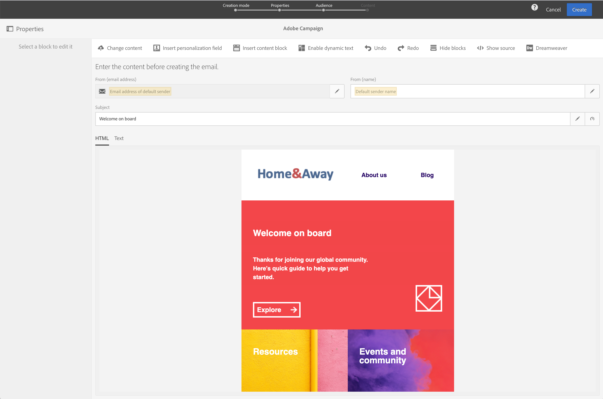
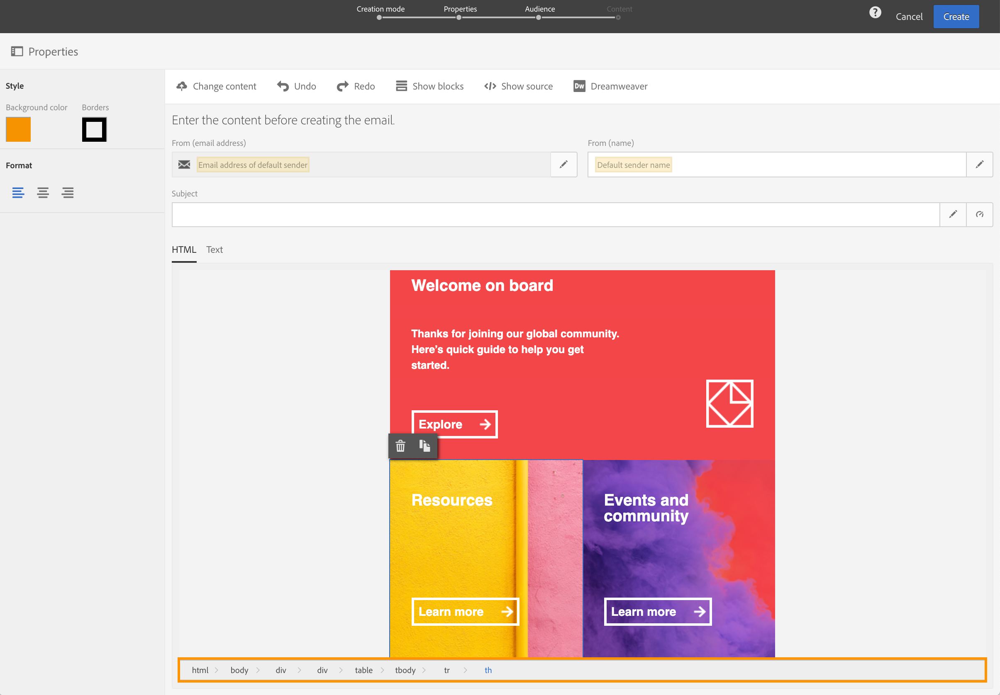

# レガシーエディターの電子メールコンテンツを変換{#converting-an-html-content}

電子メールデザイナーで作業する際に開始が発生した場合は、レガシーエディターで作成した電子メールHTMLから、再利用可能なテンプレートやフラグメントを作成してください。

この使用例では、HTML電子メールを使用して電子メールデザイナーテンプレートを作成し、電子メールデザイナーでHTMLコンポーネントに分割できます。

>[!NOTE]
>
>互換モードと同様に、HTMLコンポーネントは次の制限付きオプションで編集できます。インプレースエディションのみ実行できます。

>[!IMPORTANT]
>
>この節は、HTMLコードに詳しい上級ユーザー向けです。

## 電子メールコンテンツの準備

1. HTML電子メールを選択します。
1. HTML電子メールを分割するセクションを指定します。
1. HTMLから異なるブロックを切り取ります。

## 電子メール構造の作成

1. **[!UICONTROL Email Designer]**&#x200B;を開いて、空の電子メールコンテンツを作成します。
1. ボディレベルの属性を設定します。背景色、幅など 詳しくは、[メールスタイルの編集](../../designing/using/styles.md)を参照してください。
1. 断追加面を持つ構造コンポーネントの数と同じ数 詳しくは、[メール構造の編集](../../designing/using/designing-from-scratch.md#defining-the-email-structure)を参照してください。

## 追加HTMLコンテンツ

1. 各構造コンポ追加ーネントに対するHTMLコンポーネント。 詳しくは、[フラグメントとコンポーネントの追加](../../designing/using/designing-from-scratch.md#defining-the-email-structure)を参照してください。
1. HTMLをすべてのコンポーネントにコピー&amp;ペーストします。

## 電子メールのスタイルを管理{#manage-the-style-of-your-email}

1. **[!UICONTROL Mobile view]**&#x200B;に切り替えます。 詳しくは、[この節](../../designing/using/plain-text-html-modes.md#switching-to-mobile-view)を参照してください。

1. これを修正するには、ソースコードモードに切り替えて、スタイルセクションを新しいスタイルセクションにコピー&amp;ペーストします。 例：

   ```
   <style type="text/css">
   a {text-decoration:none;}
   body {min-width:100% !important; margin:0 auto !important; padding:0 !important;}
   img {line-height:100%; text-decoration:none; -ms-interpolation-mode:bicubic;}
   ...
   </style>
   ```

   >[!NOTE]
   >
   >この後に、別のカスタムスタイルタグでスタイルを追加してください。
   >
   >電子メールデザイナで生成されたCSSは変更しないでください。
   >
   >* `<style data-name="default" type="text/css">(##)</style>`
   >* `<style data-name="supportIOS10" type="text/css">(##)</style>`
   >* `<style data-name="mediaIOS8" type="text/css">(##)</style>`
   >* `<style data-name="media-default-max-width-500px" type="text/css">(##)</style>`
   >* `<style data-name="media-default--webkit-min-device-pixel-ratio-0" type="text/css">(##)</style>`


1. モバイル表示に戻って、コンテンツが正しく表示されていることを確認し、変更を保存します。

## 使用例

レガシーエディターで作成したこの電子メールを&#x200B;**[!UICONTROL Email Designer]**&#x200B;テンプレートに変換してみましょう。

### 電子メールのセクションを特定する

この電子メールの11のセクションを特定できます。



HTMLのどのセクションかを識別するために、要素を選択できます。



電子メールのHTMLバージョンを表示するには、**[!UICONTROL Show source]**&#x200B;をクリックします。

### 電子メールテンプレートとその構造の作成

1. 電子メールのレイアウトを反映して&#x200B;**[!UICONTROL Structure components]**&#x200B;をドラッグ&amp;ドロップします。

1. 必要な回数だけ繰り返します。 11個の構造コンポーネントを作る必要があります

   

### HTMLコンテンツコンポーネントの挿入

1. 各&#x200B;**[!UICONTROL Structure component]**&#x200B;に&#x200B;**[!UICONTROL HTML component]**&#x200B;を挿入します。

   

1. 各セクションに対して、**[!UICONTROL Show source code]**&#x200B;をクリックします。

   

1. HTMLセクションを挿入します。

1. 「**[!UICONTROL Save]**」をクリックします。

これで、電子メールのレンダリングを確認できます。


### モバイル表示に合わせたスタイルの管理

1. CSS要素を挿入して、電子メールがモバイル表示に適していることを確認します。

1. ソースコードに切り替え、スタイルセクションを新しいスタイルセクションにコピー&amp;ペーストします。

詳しくは、[電子メールのスタイルの管理](#manage-the-style-of-your-email)を参照してください。

従来の電子メールが電子メールデザイナーで使用できるようになりました。