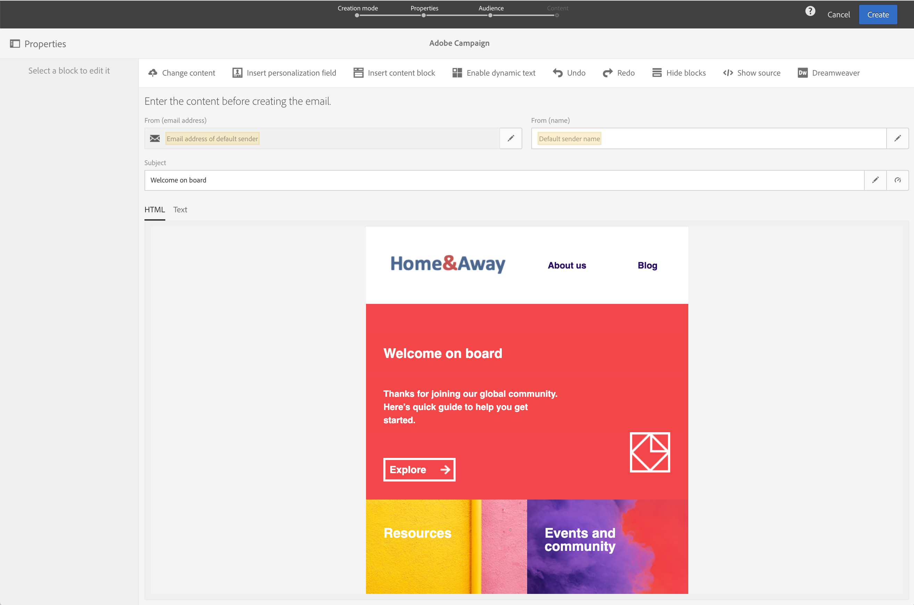
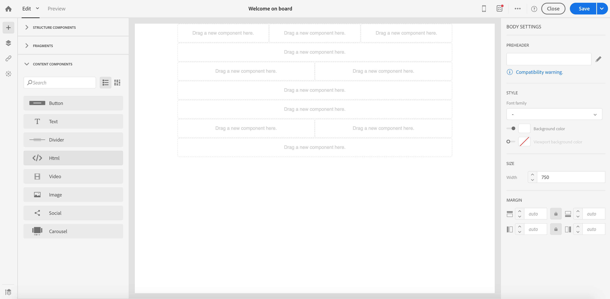
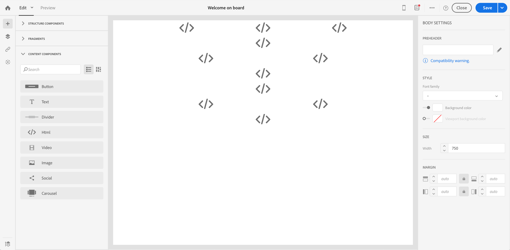
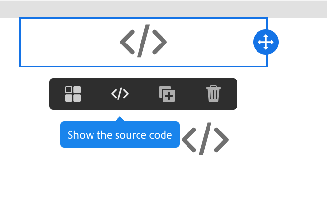
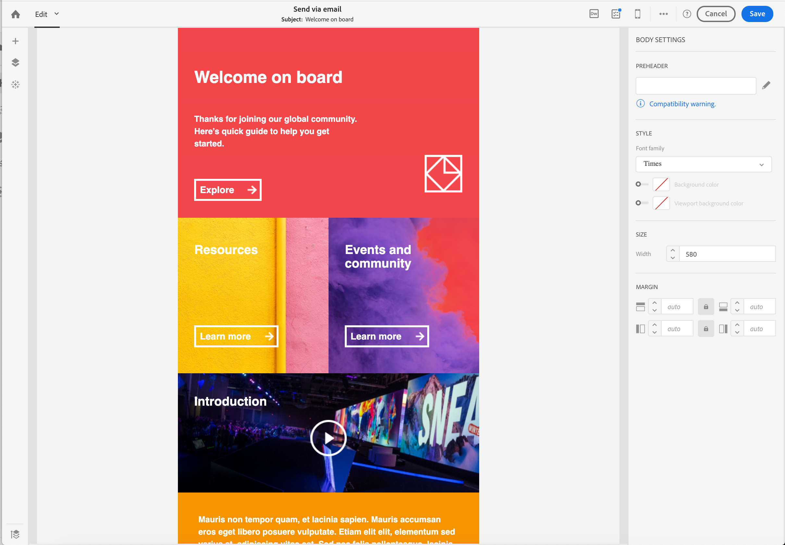

# 従来のエディターのメールコンテンツの変換 {#converting-an-html-content}

メールDesignerの作業を開始し、従来のエディターで作成したメールHTMLから再利用可能なテンプレートとフラグメントを作成します。

このユースケースでは、HTMLの電子メールを使用して、電子メールDesignerのHTML コンポーネントに分割することで、電子メールDesigner テンプレートを作成できます。

>[!NOTE]
>
>互換モードと同様に、HTML コンポーネントは限られたオプションで編集可能です。インプレースエディションのみ実行できます。

>[!IMPORTANT]
>
>この節は、HTML コードに精通している上級者向けです。

## メールコンテンツの準備

1. HTMLの電子メールを選択します。
1. HTMLのメールを分割するセクションを決める。
1. HTMLから様々なブロックを切り取ります。

## メール構造の作成

1. **[!UICONTROL Email Designer]**&#x200B;を開いて、空のメールコンテンツを作成します。
1. ボディレベルの属性（背景色、幅など）の設定詳しくは、[電子メールスタイルの編集](../../designing/using/styles.md)を参照してください。
1. 構造コンポーネントを追加する場合は、セクションがある場合と同じ数だけ追加します。 詳しくは、[メール構造の編集](../../designing/using/designing-from-scratch.md#defining-the-email-structure)を参照してください。

## HTML コンテンツを追加

1. 各構造コンポーネントにHTML コンポーネントを追加します。 詳しくは、[フラグメントとコンポーネントの追加](../../designing/using/designing-from-scratch.md#defining-the-email-structure)を参照してください。
1. HTMLを各コンポーネントにコピー&amp;ペーストします。

## メールのスタイルを管理 {#manage-the-style-of-your-email}

1. **[!UICONTROL Mobile view]**&#x200B;に切り替えます。 詳しくは、[この節](../../designing/using/plain-text-html-modes.md#switching-to-mobile-view)を参照してください。

1. これを修正するには、ソースコードモードに切り替え、スタイルセクションを新しいスタイルセクションにコピー&amp;ペーストします。 例：

   ```
   <style type="text/css">
   a {text-decoration:none;}
   body {min-width:100% !important; margin:0 auto !important; padding:0 !important;}
   img {line-height:100%; text-decoration:none; -ms-interpolation-mode:bicubic;}
   ...
   </style>
   ```

   >[!NOTE]
   >
   >この後に別のカスタムスタイルタグにスタイルを追加してください。
   >
   >電子メールDesignerで生成されたCSSを変更しないでください。
   >
   >* `<style data-name="default" type="text/css">(##)</style>`
   >* `<style data-name="supportIOS10" type="text/css">(##)</style>`
   >* `<style data-name="mediaIOS8" type="text/css">(##)</style>`
   >* `<style data-name="media-default-max-width-500px" type="text/css">(##)</style>`
   >* `<style data-name="media-default--webkit-min-device-pixel-ratio-0" type="text/css">(##)</style>`

1. モバイルビューに戻って、コンテンツが正しく表示されていることを確認し、変更を保存します。

## ユースケース

レガシーエディターで作成されたこのメールを&#x200B;**[!UICONTROL Email Designer]** テンプレートに変換してみましょう。

### メールのセクションの特定

このメールには11のセクションがあります。



HTMLのどのセクションであるかを特定するには、それを選択できます。


HTML版の電子メールを表示するには、**[!UICONTROL Show source]**&#x200B;をクリックします。

### メールテンプレートとその構造の作成

1. メールのレイアウトを反映した&#x200B;**[!UICONTROL Structure components]**&#x200B;をドラッグ&amp;ドロップします。

1. 必要に応じて何度でも繰り返します。 11の構成要素を作る必要があります。

   

### HTML コンテンツコンポーネントの挿入

1. 各&#x200B;**[!UICONTROL Structure component]**&#x200B;に&#x200B;**[!UICONTROL HTML component]**&#x200B;を挿入します。

   

1. 各セクションについて、「**[!UICONTROL Show source code]**」をクリックします。

   

1. 「HTML」セクションを挿入します。

1. 「**[!UICONTROL Save]**」をクリックします。

これで、メールのレンダリングを確認できます。



### モバイルビューに合わせたスタイルの管理

1. CSS要素を挿入して、電子メールがモバイルビューに適していることを確認します。

1. ソースコードに切り替え、スタイルセクションを新しいスタイルセクションにコピー&amp;ペーストします。

詳しくは、[電子メールのスタイルの管理](#manage-the-style-of-your-email)を参照してください。

従来の電子メールが電子メール Designerで使用できるようになりました。
