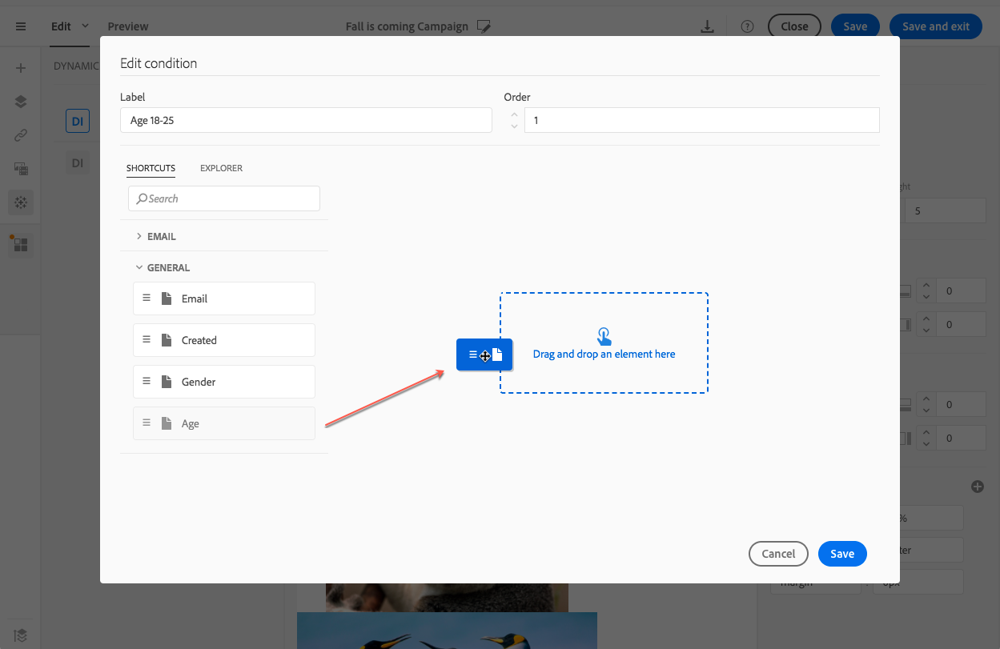

# Defining dynamic content in an email{#defining-dynamic-content-in-an-email}

電子メールでは、式エディターで定義されている条件に従って、受信者に動的に表示される異なるコンテンツを定義できます。例えば、同じ電子メールから、各プロファイルの年齢範囲に応じて異なるメッセージを受け取ることができます。

Defining dynamic content is different from [defining visibility conditions](../../designing/using/defining-a-visibility-condition.md).

1. フラグメント、コンポーネントまたは要素を選択します。この例では、画像を選択します。
1. Click the **[!UICONTROL Dynamic content]** icon from the contextual toolbar.

   

   **[!UICONTROL Dynamic content]** セクションが左側のパレットに表示されます。

   

   デフォルトでは、このセクションには2つの要素があります。デフォルトのバリアントと新しいバリアントです。

   >[!NOTE]
   >
   >コンテンツには常にデフォルトのバリアントを設定する必要があります。削除することはできません。

1. Click the **[!UICONTROL Edit]** button to define the display conditions for the first alternative variant.

   

1. ラベルを指定し、条件として設定するフィールドを選択します。**[!UICONTROL General]** 例えば、ノードから、フィールドを **[!UICONTROL Age]** 選択します

   

1. フィルタリング条件を設定します。例えば、18才から25才までの訪問者に異なるコンテンツを表示する場合などです。

   

1. すべての条件を設定したら、条件が適用される優先順位を定義し、変更を保存します。

   

   コンテンツは優先度順に上から下に表示されます。For more on priorities, refer to [this section](../../designing/using/defining-dynamic-content-in-an-email.md#order-of-priority).

1. 定義したバリアント用に新しい画像をアップロードします。

   

   18才から25才までの受信者には、新しい画像が表示されます。

   

1. Click **[!UICONTROL Add a condition]** to add a new content and its linked rule.

   

   例えば、26才から35才までの訪問者に表示される異なる画像を追加できます。

1. 動的に表示する電子メールの他の要素の場合も同様に続行します。テキスト、ボタン、フラグメントなどがあります。変更内容を保存します。

>[!CAUTION]
>
>メッセージを準備して送信する前に、配達確認を使用してテストします。これを行わないと、一部のエラーが検出されず、電子メールが送信されない場合があります。

**関連トピック:**

* [配達確認の送信](../../sending/using/managing-test-profiles-and-sending-proofs.md#sending-proofs)
* [詳細式の編集](../../automating/using/editing-queries.md#about-query-editor)

## Order of priority {#order-of-priority}

式エディターでは、動的コンテンツを定義するとき、優先順位は次のようになります。

1. You define two different dynamic contents with **two different conditions**, for example:

   **条件1:** プロファイルの性別は男性で、

   **条件2:** プロファイルは20~30才です。

   

   データベース内の一部のプロファイルは2つの条件に対応していますが、1つの動的コンテンツを持つ電子メールは1つだけ送信できます。

1. したがって、動的コンテンツの優先度を定義する必要があります。A condition with an order of priority of **1** (and therefore the corresponding dynamic content) will be sent to a profile even if another condition whose priority order is **2** or **3** is also met by this profile.

   

動的コンテンツごとに1つの優先順位のみを定義できます。
