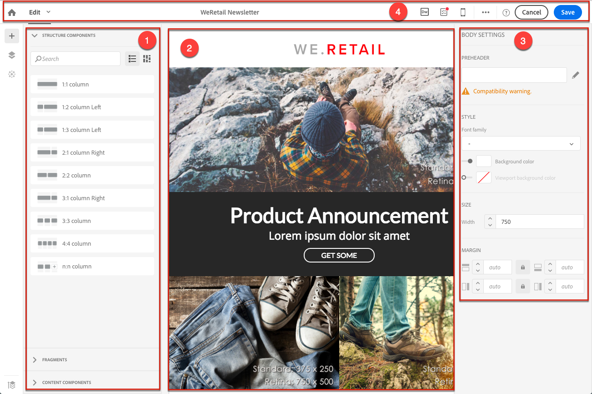
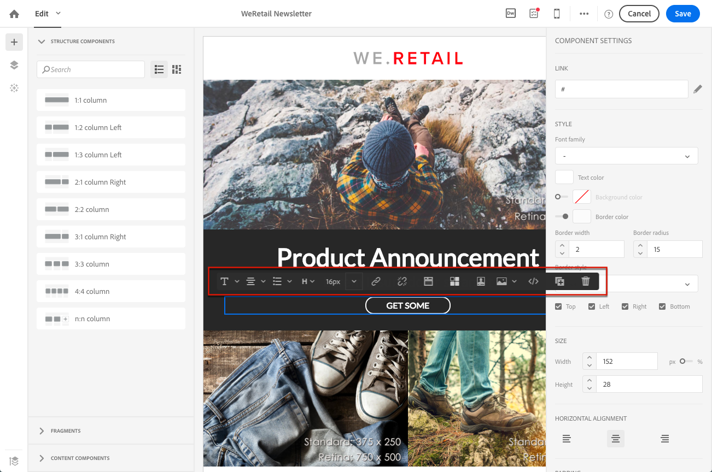
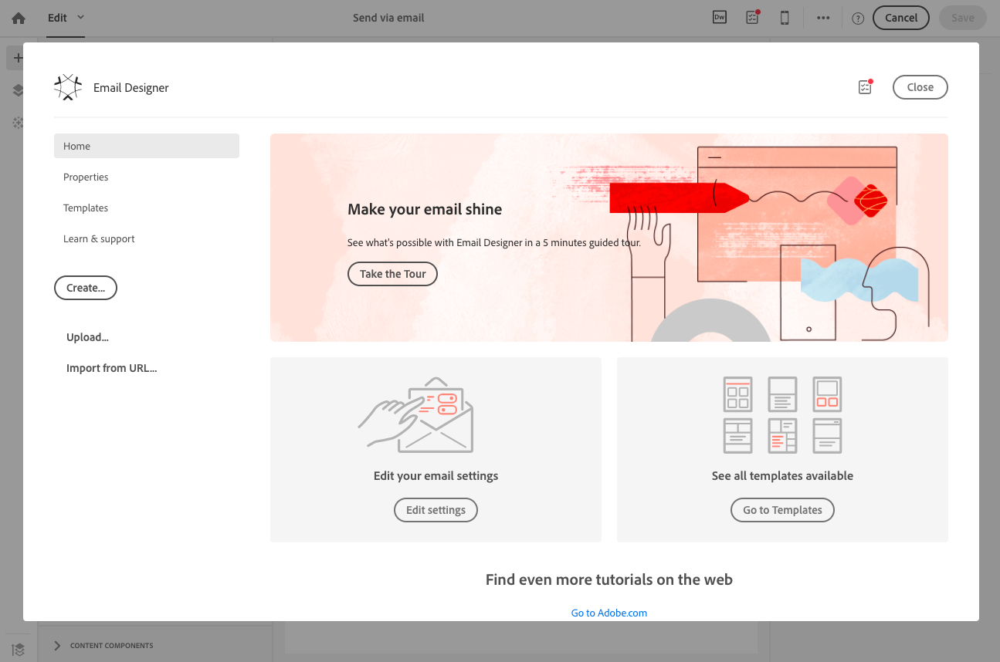
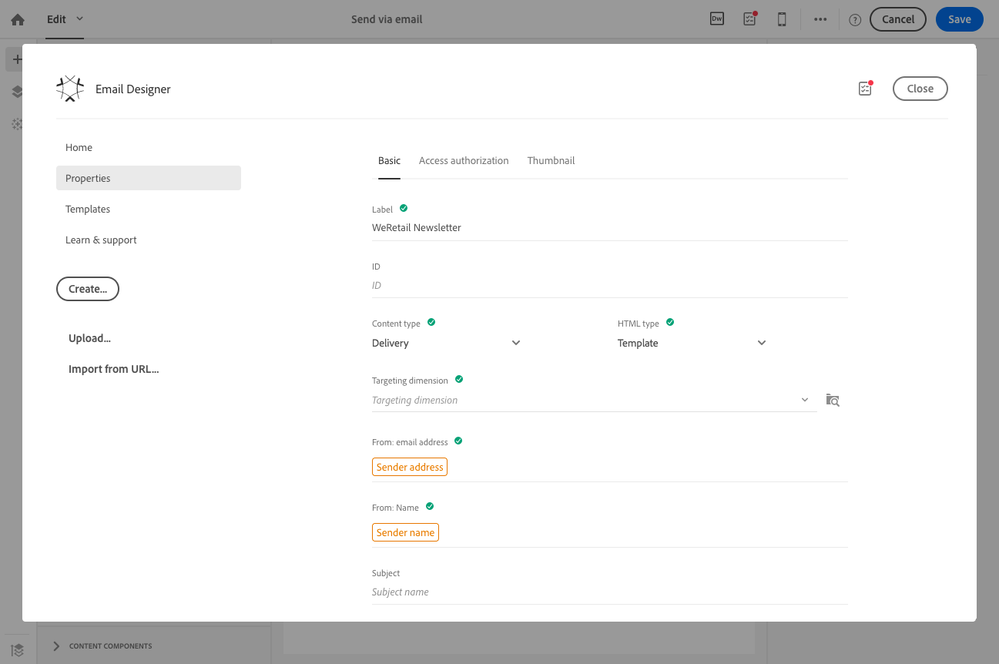
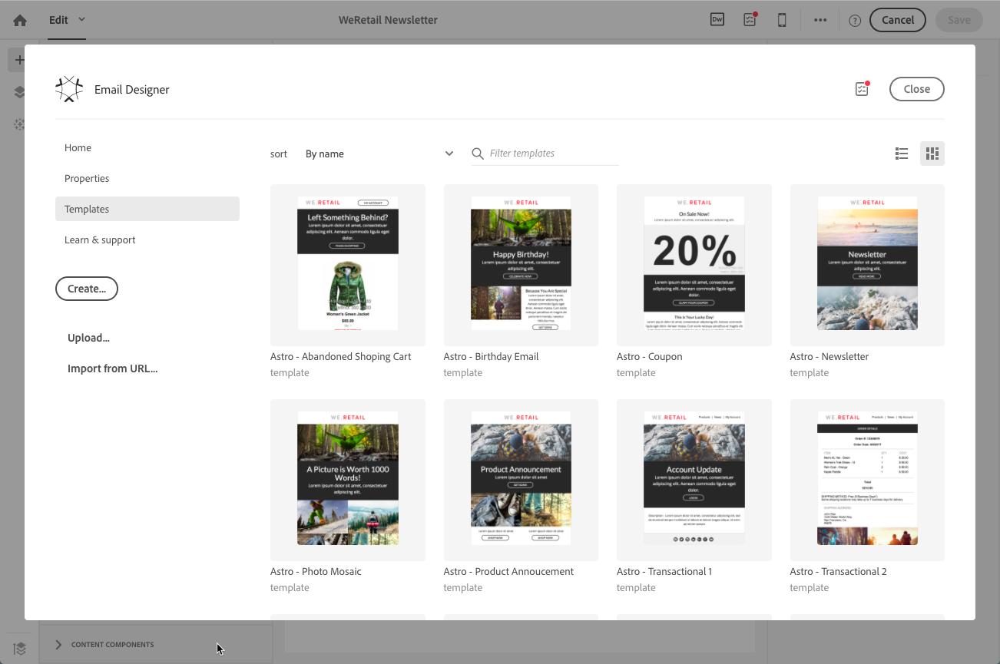
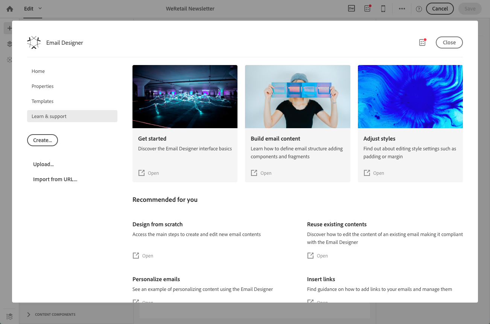
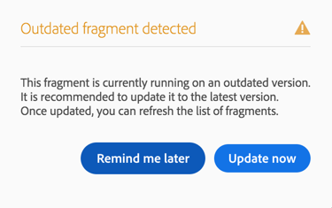

# Campaign E メールデザイナー{#designing-content-in-adobe-campaign}

Adobe Campaign でメールを作成したら、そのコンテンツを定義する必要があります。

メールDesignerでは、ドラッグ&amp;ドロップで魅力的な、個別にカスタマイズされたメールを作成することができます
インターフェイス： 新規のコンテンツを作成する場合でも、既存のコンテンツフラグメントやテンプレートを活用する場合でも、プロモーションやトランザクションなど、あらゆるメールコンテンツの設計と強化に対応します。

レスポンシブデザイン向けに最適化された HTML の配信に対応する E メールデザイナーを利用して、表示条件や動的コンテンツを容易に定義し、メール、テンプレートまたはフラグメントに適用できます。 ボタンをクリックするだけで、ドラッグ&amp;ドロップのインターフェイスとHTMLコードをシームレスに切り替えることができます。

E メールデザイナーでは、E メールコンテンツと E メールコンテンツテンプレートを作成できます。 シンプルなメール、トランザクションメール、A/B テスト用メール、多言語メール、繰り返しメールと互換性があります。

<!--The Email Designer has more features than the Legacy Editor and is backward compatible.-->

 [&#x200B; ビデオでの電子メール Designerの検索](#video)

* E メールコンテンツの作成方法について詳しくは、[E メールデザイナーの概要](../../designing/using/quick-start.md)を参照してください。
* E メールデザイナーの概要については、[E メールデザイナーの使用](../../designing/using/designing-content-in-adobe-campaign.md)を参照してください。
* コンテンツ作成の詳細：
   * コンテンツを新規に作成する場合は、[新規でのメールのデザイン](../../designing/using/designing-from-scratch.md)を参照してください。
   * 既存のコンテンツを使用する場合は、[既存のコンテンツを使用したデザイン](../../designing/using/using-existing-content.md)を参照してください。
   * Creative Cloud 統合の使用については、[マルチソリューションメールデザイン](../../designing/using/using-integrations.md)を参照してください。
* パーソナライゼーションについて詳しくは、[パーソナライゼーション](../../designing/using/personalization.md)を参照してください。

メールを作成する場合、定義済みのテンプレートを使用するか、別のソースから既存のコンテンツを読み込むかを選択できます。 詳しくは、[既存のコンテンツの選択](../../designing/using/using-existing-content.md#selecting-an-existing-content)を参照してください。

マーケティングキャンペーンの効率を高めるには、コンテンツをパーソナライズします。 詳しくは、[パーソナライゼーションフィールドの挿入](../../designing/using/personalization.md#inserting-a-personalization-field)および[コンテンツブロックの追加](../../designing/using/personalization.md#adding-a-content-block)を参照してください。

また、各プロファイルに応じて変化する動的コンテンツを定義することもできます。 詳しくは、[メールでの動的コンテンツの定義](../../designing/using/personalization.md#defining-dynamic-content-in-an-email)および[ランディングページでの動的コンテンツの定義](../../channels/using/designing-a-landing-page.md#defining-dynamic-content-in-a-landing-page)を参照してください。

リンクや画像を使用して、メッセージやランディングページを強化します。 詳しくは、[リンクの挿入](../../designing/using/links.md#inserting-a-link)および[画像の挿入](../../designing/using/images.md#inserting-images)を参照してください。

## メールDesignerインターフェイス {#email-designer-interface}

E メールデザイナーには、コンテンツのあらゆる要素を作成、編集、カスタマイズできる多くのオプションが用意されています。

インターフェイスは、様々な機能を提供する複数の領域で構成されています。

**パレット**（1）で使用可能な要素から、構造コンポーネントとコンテンツフラグメントをメインの&#x200B;**ワークスペース**（2）にドラッグ＆ドロップします。 **ワークスペース**（2）でコンポーネントまたは要素を選択し、**設定**&#x200B;ペイン（3）で主なスタイルおよび表示特性をカスタマイズします。

メインの&#x200B;**ツールバー**（4）から、より一般的なオプションや設定にアクセスできます。

>[!NOTE]
>
>**設定**&#x200B;ペインは、画面の解像度と表示に応じて左に移動できます。

エディターインターフェイスの&#x200B;**コンテキストツールバー**&#x200B;は、選択したゾーンに応じて様々な機能を提供します。 テキストのスタイルを変更するためのアクションボタンと各ボタンが含まれています。 実行された変更は、常に選択したゾーンに適用されます。

### Designer ホームページにメールを送信 {#email-designer-home-page}

[メールを作成する](../../channels/using/creating-an-email.md)場合、メールのコンテンツを選択すると、**[!UICONTROL Email Designer]** ホームページが自動的に表示されます。

「**[!UICONTROL Properties]**」タブでは、ラベル、送信者のアドレスと名前、件名などのメールの詳細を編集できます。 このタブは、画面上部のメールラベルをクリックしてアクセスすることもできます。

「**[!UICONTROL Templates]**」タブでは、標準搭載された HTML コンテンツまたは作成済みのテンプレートを選択して、メールのデザインをすばやく開始できます。 詳しくは、[コンテンツテンプレート](../../designing/using/using-reusable-content.md#content-templates)を参照してください。

「**[!UICONTROL Learn & support]**」タブから、関連するドキュメントやチュートリアルに容易にアクセスできます。

テンプレートを選択しない場合、E メールデザイナーのホームページでもコンテンツのデザインを開始する方法を選択できます。

* コンテンツを新規に作成するには、「**[!UICONTROL Create]**」ボタンをクリックします。 詳しくは、[新規でのメールコンテンツのデザイン](../../designing/using/designing-from-scratch.md#designing-an-email-content-from-scratch)を参照してください。
* 「**[!UICONTROL Upload]**」ボタンをクリックして、コンピューターからファイルをアップロードします。 詳しくは、[ファイルからのコンテンツの読み込み](../../designing/using/using-existing-content.md#importing-content-from-a-file)を参照してください。
* URL から既存のコンテンツを取得するには、「**[!UICONTROL Import from URL]**」ボタンをクリックします。 [URL からのコンテンツの読み込み](../../designing/using/using-existing-content.md#importing-content-from-a-url)を参照してください。

## 用語 {#terminology}

**テンプレート**：テンプレートは、複数の配信で作成および再利用できるメールの構造です。

**フラグメント**：フラグメントは、1 つ以上のメールで参照できる再利用可能なコンポーネントです。

**構造コンポーネント**：メールのレイアウトを定義する構造要素です。

**コンテンツコンポーネント**：コンテンツコンポーネントは生の空コンポーネントで、メールに配置すると編集できます。

## コンテンツデザインのベストプラクティス {#content-design-best-practices}

E メールデザイナーを適切に使用し、最適な E メールを容易に作成するには、次の原則に従うことをお勧めします。

* 個別の CSS や HTML の &lt;head> セクションでの CSS の代わりに、インラインスタイルを使用します。 インラインスタイルを使用すると、コンテンツフラグメントの保存と再利用を最適化できます。

  [インラインスタイル属性の追加](../../designing/using/styles.md#adding-inline-styling-attributes)を参照してください。

* HTML コンテンツを含む ZIP ファイルを読み込む場合は、通常の CSS を使用します。 SCSS スタイルシートはサポートされていません。

* コンテンツフラグメントを作成および再利用すると、マーケティングキャンペーンの一貫性を保ち、ブランディングを容易に確立できます。

  [コンテンツフラグメントの作成](../../designing/using/using-reusable-content.md#creating-a-content-fragment)を参照してください。

* **メールコンテンツ**&#x200B;の編集時：

  送信する前に、メッセージをプレビューします。 Adobe Campaign は、Litmus を使用したメールのレンダリングのテスト機能を備えています。 詳しくは、[メールのレンダリング](../../sending/using/email-rendering.md)を参照してください。

* リファラーのメタタグは、メールデザイナーではサポートされていません。

メッセージに関するデザインと一般的なベストプラクティスについて詳しくは、ステップバイステップ形式のガイド「[Adobe Campaign の配信のベストプラクティス](../../sending/using/delivery-best-practices.md)」を参照してください。

### フラグメントの更新 {#email-designer-updates}

E メールデザイナーの機能強化は継続的におこなわれています。 メールコンテンツを新規に作成した場合、標準テンプレートを利用した場合、またはフラグメントを作成した場合は、次回コンテンツを開いたときに次の更新メッセージが表示される場合があります。

CSS のコリジョンなどの問題を回避するために、コンテンツを最新バージョンに更新することをお勧めします。 「**[!UICONTROL Update now]**」をクリックします。

コンテンツの更新中にエラーが発生した場合は、HTML を確認して修正してから、この更新を再度実行してください。

フラグメントについては、次の点に注意してください。

* 新しいメールまたはテンプレートにフラグメントを追加する場合、このメッセージが表示されたら、最初にこのフラグメントを更新する必要があります。

* 複数のフラグメントがある場合は、メールコンテンツで使用する各フラグメントを更新する必要があります。

* まだ準備されていない現在のメールメッセージへの影響を回避するために、一部のフラグメントを更新しないように選択できます。

* 更新されていないフラグメントが既に使用されていて、そのフラグメントを編集できない場合でも、メールを送信できます。

* 既に準備済みのメールで使用されているフラグメントを更新しても、そのメールには影響しません。

## メールDesignerの制限 {#email-designer-limitations}

* フラグメント内でパーソナライゼーションフィールドを使用することはできません。 フラグメントについて詳しくは、[この節](../../designing/using/using-reusable-content.md#about-fragments)を参照してください。

<!--* You cannot save directly as a fragment some content of an email that you are editing within the Email Designer. You need to copy-paste the HTML corresponding to that content into a new fragment. For more on this, see [Saving content as a fragment](../../designing/using/using-reusable-content.md#saving-content-as-a-fragment).-->

* スタイルを編集する場合、ほとんどのメールクライアントで正式にサポートされている Web フォントのみを使用できます。
* スタイルは、後で再利用するためにテーマとして保存することはできません。 ただし、CSS スタイルは、コンテンツテンプレートまたはメールに保存できます。 スタイルについて詳しくは、[この節](../../designing/using/styles.md)を参照してください。
* リファラーのメタタグは、メールデザイナーではサポートされていません。
* サロゲート ペアは、Unicode文字セットの基本多言語面に含まれていない文字で、2 バイト（16 ビット）で保存できず、2 UTF-16文字にエンコードする必要があります。 これらのキャラクターには、いくつかのCJKのイデオグラフィック、ほとんどの絵文字、いくつかの言語が含まれています。 これらの文字は、動的テキストの互換性に関する問題を引き起こす可能性があります。 メッセージを送信する前に、強力なテストを実行する必要があります。

**関連トピック**

* [メールの作成](../../channels/using/creating-an-email.md)
* [ランディングページのデザイン](../../channels/using/designing-a-landing-page.md)
* [SMS メッセージの作成](../../channels/using/creating-an-sms-message.md)
* [プッシュ通知の作成と送信](../../channels/using/preparing-and-sending-a-push-notification.md)

## チュートリアルビデオ {#video}

このビデオでは、電子メール Designerの概要を説明します。

>[!VIDEO](https://video.tv.adobe.com/v/330102?captions=jpn&quality=12)

電子メールDesignerを使い始めるには、電子メールDesignerの一般的な機能と、ゼロから電子メールをデザインする方法やテンプレートを使用する方法について説明した[一連のビデオ &#x200B;](https://experienceleague.adobe.com/docs/campaign-learn/campaign-standard-tutorials/designing-content/email-designer/email-designer-overview.html?lang=ja#GettingStarted)をご覧ください
