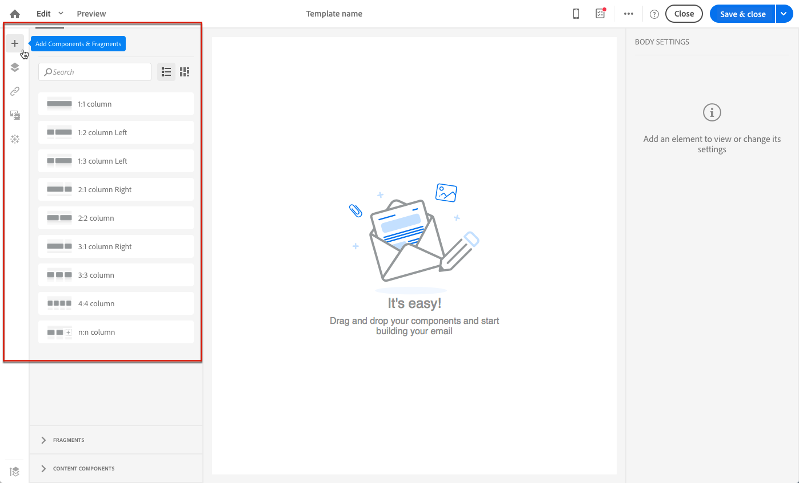
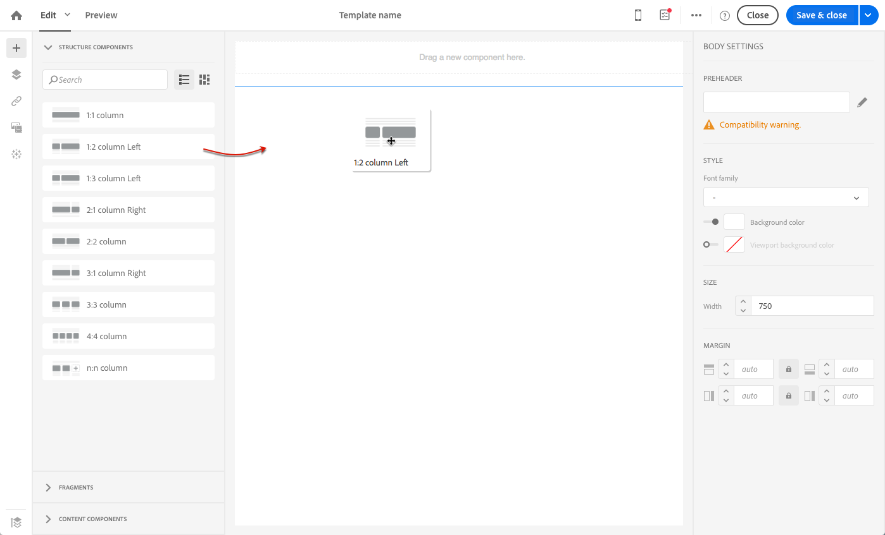
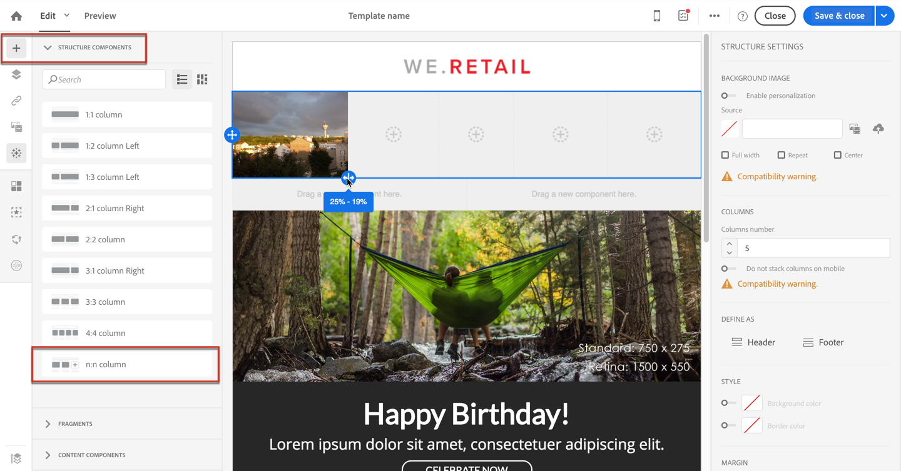
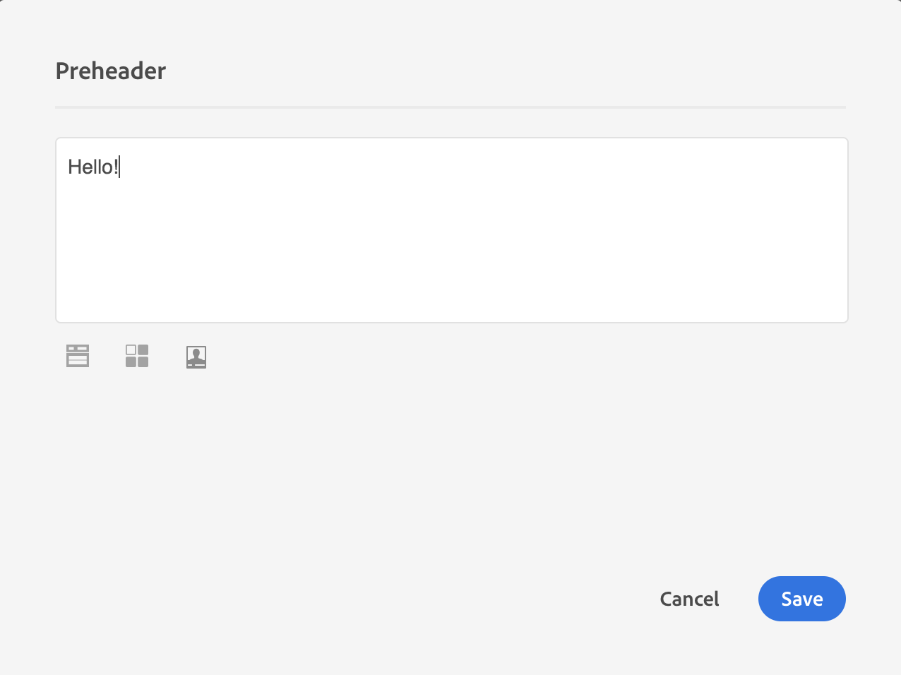
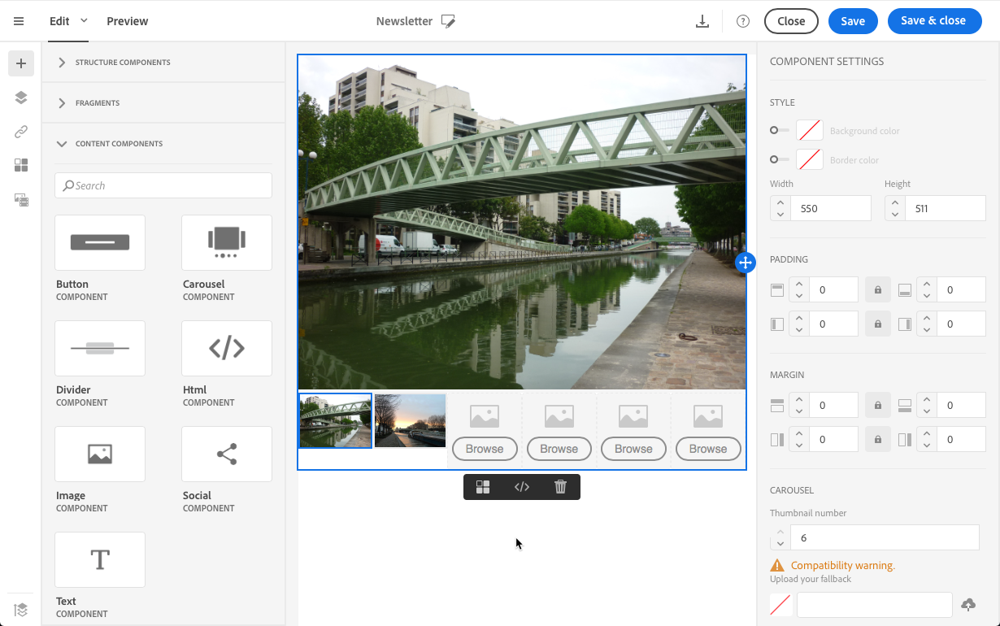
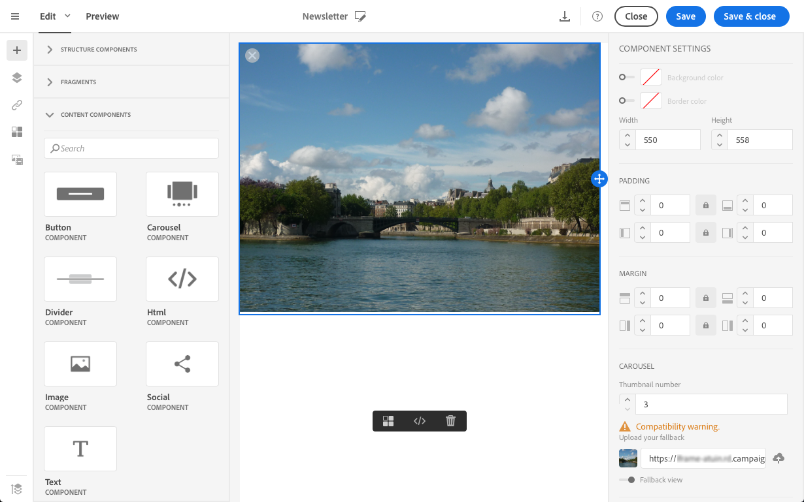

# 新規でのメールのデザイン {#designing-an-email-content-from-scratch}

メールコンテンツの編集方法を学びましょう。 メールDesignerでは、独自の定義済みコンテンツの有無にかかわらず、メールとテンプレートを作成できます。

E メール Designerを使用して、メールコンテンツをゼロから作成およびデザインする主な手順は次のとおりです。

1. メールを作成し、そのコンテンツを開きます。
1. 構造コンポーネントを追加してメールを作成します。 [&#x200B; メール構造の編集](#defining-the-email-structure)を参照してください。
1. コンテンツコンポーネントとフラグメントを構造コンポーネントに挿入します。 [&#x200B; フラグメントとコンテンツコンポーネントの追加](#defining-the-email-structure)を参照してください。
1. 画像を追加し、メールのテキストを編集します。 [画像の挿入](../../designing/using/images.md#inserting-images)を参照してください。
1. パーソナライゼーションフィールドやリンクなどを追加して、メールをパーソナライズできます。 [&#x200B; パーソナライゼーションフィールドの挿入](../../designing/using/personalization.md#inserting-a-personalization-field)、[&#x200B; リンクの挿入](../../designing/using/links.md#inserting-a-link)および[&#x200B; メールでの動的コンテンツの定義](../../designing/using/personalization.md#defining-dynamic-content-in-an-email)を参照してください。
1. メールの件名を定義。 [電子メールの件名のパーソナライズ &#x200B;](../../designing/using/subject-line.md#defining-the-subject-line-of-an-email)を参照してください。
1. メールのプレビュー。
1. コンテンツを保存し、オーディエンスを定義し、送信を適切にスケジュールしてからメッセージを続行します。

また、この[紹介ビデオ &#x200B;](https://video.tv.adobe.com/v/22771/?autoplay=true&hidetitle=true)も確認できます。

>[!NOTE]
>
>メールコンテンツをゼロから設計するのを避けるために、すぐに使用できるコンテンツテンプレートを利用できます。 詳しくは、[&#x200B; コンテンツテンプレート &#x200B;](../../designing/using/using-reusable-content.md#content-templates)を参照してください。

## メール構造の定義 {#defining-the-email-structure}

>[!CONTEXTUALHELP]
>id="ac_structure_components"
>title="構造コンポーネントについて"
>abstract="構造コンポーネントは、メールのレイアウトを定義します。"

>[!CONTEXTUALHELP]
>id="ac_edition_columns"
>title="メール列の定義"
>abstract="E メールデザイナーを使用すると、列構造を定義することで、メールのレイアウトを簡単に定義できます。"

E メールデザイナーを使用すると、メールの構造を簡単に定義できます。簡単なドラッグ＆ドロップ操作で構造要素を追加して移動することで、メールの形状を数秒でデザインできます。

メールの構造を編集するには：

1. 既存のコンテンツを開くか、新しいメールコンテンツを作成します。
1. 左側の&#x200B;**[!UICONTROL Structure components]**+**アイコンを選択して、**&#x200B;にアクセスします。

   

1. メールのシェイプに必要な構造コンポーネントをドラッグ&amp;ドロップします。

   

   青い線は、構造コンポーネントをドロップする前の正確な場所を表しています。 他のコンポーネントの上、間、または下にドロップできますが、内部にはドロップできません。

   >[!NOTE]
   >
   >列のスタックは、すべてのメールプログラムと互換性があるわけではないことに注意してください。サポートされていない場合、列はスタックされません。
   >
   >電子メールに配置した後は、コンテンツコンポーネントまたはフラグメントが既に内部に配置されていない限り、コンポーネントを移動または削除することはできません。

1. 1つ以上の列で構成される複数の構造コンポーネントを使用できます。

   **[!UICONTROL n:n列]** コンポーネントを選択して、選択した列数（3 ～ 10個）を定義します。 また、各列の下部にある矢印を移動して、各列の幅を定義することもできます。

   

   >[!NOTE]
   >
   >各列のサイズは、構造コンポーネントの全幅の 10％未満にすることはできません。空でない列は削除できません。

構造を定義したら、コンテンツフラグメントとコンポーネントをメールに追加できます。

## プリヘッダーの使用 {#preheader}

>[!CONTEXTUALHELP]
>id="ac_edition_preheader"
>title="プリヘッダーの使用"
>abstract="プリヘッダーを使用すると、メールの開封率を高める短い概要テキストを設定できます。"

プリヘッダーとは、受信トレイから電子メールを表示する際に、件名の後に続く短い要約テキストのことです。 プリヘッダーを使用すると、開封率が高くなります。

「**[!UICONTROL Preheader]**」編集ボックスを選択し、コンテンツを完成させます。

プリヘッダーコンテンツに&#x200B;**[!UICONTROL Content block]**、**[!UICONTROL Dynamic content]**&#x200B;または&#x200B;**[!UICONTROL Personalization fields]**&#x200B;を追加できます。

>[!NOTE]
>
>プリヘッダーは、すべてのメールプログラムと互換性があるわけではないことに注意してください。サポートされていない場合、プリヘッダーは表示されません。

## コンテンツコンポーネントの使用 {#about-content-components}

>[!CONTEXTUALHELP]
>id="ac_content_components"
>title="コンテンツコンポーネントについて"
>abstract="コンテンツコンポーネントは、メールの作成に編集できる空のコンテンツプレースホルダーです。"

コンテンツコンポーネントは未加工の空のコンポーネントで、電子メールに配置すると編集できます。

構造コンポーネントには、必要な数のコンテンツコンポーネントを追加できます。 構造コンポーネント内または別の構造コンポーネントに移動することもできます。

E メール Designerで使用可能なコンポーネントのリストを次に示します。

### **[!UICONTROL Button]**

各ボタンをゼロから編集するのではなく、複数のボタンを使用する必要がある場合は、コンテキストツールバーを使用して&#x200B;**[!UICONTROL Button]** コンポーネントを複製できます。

ボタンをフラグメントに保存して、再利用することもできます。 詳しくは、[&#x200B; コンテンツフラグメントの作成](../../designing/using/using-reusable-content.md#creating-a-content-fragment)および[&#x200B; コンテンツをフラグメントとして保存](../../designing/using/using-reusable-content.md#saving-content-as-a-fragment)を参照してください。

「**[!UICONTROL Fallback view]**」を選択して、電子メールDesignerにフォールバック画像を表示します。

### **[!UICONTROL Text]**

このコンポーネントを使用して、メールにテキストを挿入します。 **[!UICONTROL Component Settings]**&#x200B;でテキストの色、スタイル、サイズを調整できます。

### **[!UICONTROL Divider]**

このコンポーネントを使用して、メールに区切り線を挿入します。 破断線の色、スタイル、サイズは&#x200B;**[!UICONTROL Component Settings]**&#x200B;で選択できます。

### **[!UICONTROL HTML]**

このコンポーネントを使用して、既存のHTMLの様々な部分をコピー&amp;ペーストします。 これにより、無料のモジュラーHTML コンポーネントを作成できます。

>[!NOTE]
>
>無料のHTML コンポーネントは、限られたオプションで編集可能です。 すべてのスタイルがインライン化されていない場合は、HTML コードの&#x200B;**head** セクションに適切なCSSを必ず追加してください。そうしないと、電子メールがレスポンシブになりません。 **[!UICONTROL Preview]** ボタンを使用して、コンテンツの応答性をテストします（[&#x200B; メッセージのプレビュー](../../sending/using/previewing-messages.md)を参照）。

外部コンテンツを電子メールDesignerに準拠させるには、Adobeでは、メッセージをゼロから作成し、既存の電子メールからフラグメントやコンポーネントにコンテンツをコピーすることをお勧めします。

再作成できないコンテンツがある場合は、**[!UICONTROL Html]** コンテンツコンポーネントを使用して、元のメールからHTML コードをコピー&amp;ペーストできます。 先に進む前に、HTMLについてよく理解していることを確認してください。

>[!NOTE]
>
>新しいコンテンツは、元のメールの正確なコピーではありませんが、次の手順に従うことで、できるだけ近いメッセージを作成できます。

**コンテンツをコピーする前**

1. 元の電子メールでは、送信する各電子メールに固有のセクションから、再利用可能なセクションを特定します。
1. 使用するすべての画像とアセットを保存します。
1. HTMLに詳しい方は、元のHTML コンテンツを別の部分に分割してください。

### ビデオ {#video-settings}

>[!CONTEXTUALHELP]
>id="ac_edition_video"
>title="ビデオ設定"
>abstract="このコンポーネントを使用して、メールにビデオを挿入します。ただし、ビデオはすべてのメールクライアントで機能するわけではありません。フォールバック画像を設定することをお勧めします。"

ビデオコンポーネントをメールの構造コンポーネントに挿入し、**[!UICONTROL Component Settings]**&#x200B;にビデオリンクを入力します。

>[!NOTE]
>
>ビデオは、すべてのメールプログラムと互換性があるわけではないことに注意してください。サポートされていない場合、フォールバックが表示されます。

### 画像

このコンポーネントを使用して、メールに画像を挿入します。

画像コンポーネントを構造コンポーネントに挿入し、「参照」をクリックして、コンピューターから画像ファイルをアップロードします。

### **[!UICONTROL Social]**

このコンポーネントを使用して、メールにソーシャルメディアページへのリンクを挿入します。 表示するリンクとアイコンのサイズを&#x200B;**[!UICONTROL Component Settings]**&#x200B;で選択できます。

### カルーセル {#carousel-settings}

>[!CONTEXTUALHELP]
>id="ac_edition_carousel"
>title="カルーセル設定"
>abstract="コンテンツにカルーセルを挿入して設定する方法を説明します。カルーセルは、一部のメールクライアントで機能せず、サポートされていない場合はフォールバック画像が表示されます。"

1. 構造コンポーネント内の&#x200B;**[!UICONTROL Carousel]** コンポーネントをドラッグ&amp;ドロップします。
1. コンピューターから画像を参照して選択します。

   

1. **[!UICONTROL Settings]** ペインで、カルーセルに含めるサムネールの数を設定します。
1. コンピューターからフォールバック画像を選択します。

   

カルーセルコンポーネントは、すべてのメールプログラムと互換性があるわけではありません。メールにカルーセルがサポートされていない場合は、代わりに画像を表示するフォールバックをアップロードします。

>[!NOTE]
>
>カルーセルコンポーネントは、次のメールプラットフォームと互換性があります。Apple Mail 7、Apple Mail 8、Outlook 2011 Mac版、Outlook 2016 Mac版、Mozilla Thunderbird、iPadおよびiPad mini iOS、iPhone iOS、Android、AOL （Chrome、Firefox、Safari）。

**関連トピック**：

- [メールの作成](../../channels/using/creating-an-email.md)
- [メッセージ内のオーディエンスの選択](../../audiences/using/selecting-an-audience-in-a-message.md)
- [メッセージのスケジュール](../../sending/using/about-scheduling-messages.md)
- [メッセージのプレビュー](../../sending/using/previewing-messages.md)
- [メールのレンダリング](../../sending/using/email-rendering.md)
