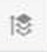

# メール Designerに関するよくある質問

## コンテンツブロックとコンテンツフラグメントの違いは何ですか？

コンテンツブロックとコンテンツフラグメントは、複数のメールで共通する、再利用可能なコンテンツの断片です。 これらは、メール間の一貫性を確保したり、メール作成を最適化および標準化したりするために使用されます。 コンテンツブロックとコンテンツフラグメントの違いは、可能な限り高度なカスタマイズをおこなうことができます。

* コンテンツブロックは、HTML コードを手動で挿入する純粋なHTMLです（ユーザーフレンドリーなUIではなく、直接ソースコードです）。 HTMLに関する知識を持つ人向けに作成されていますが、コンテンツフラグメントでは提供されていないレベルのパーソナライズが可能です。

* コンテンツフラグメントは、使いやすいUIを使用して、メールDesignerで作成されたビジュアルコンテンツです。 しかし、コンテンツをパーソナライズすることはできません。 パーソナライゼーションが必要な場合は、コンテンツブロックを介してのみ実行できます。

## HTML構造からエレメントにパディングを追加するにはどうすればよいですか？

HTMLのパンくずリストを使用すると、パディングを追加できます。

1. 画面の左下にあるHTML パンくずリストをクリックします。

   

1. パディングを追加するエレメントをクリックします。
1. HTML パンくずリストの親タグをクリックします。
この要素にパディングを追加できるようになりました。

## メールDesignerにHTML コンテンツを読み込むことはできますか？

独自のHTML コンテンツを電子メール Designerにアップロードできます。 電子メールDesignerで作成されていない場合は、元のHTMLを維持するように設計されていますが、UIを通じて特定のエディション機能を制限する互換モードで読み込まれます。

詳しくは、[互換性モード &#x200B;](../../designing/using/using-existing-content.md#compatibility-mode)を参照してください

## 最初のメールコンテンツを作成するにはどうすればよいですか？

まず、ホームページからメールを作成します。
次に、メールにコンテンツを追加するには、構造コンポーネントを追加し、その中にコンテンツコンポーネントを挿入する必要があります。

詳しくは、[最初からメールを作成](../../designing/using/quick-start.md#from-scratch-email)を参照してください。

## フラグメントを更新する必要があるのはなぜですか？

E メールデザイナーの機能強化は継続的におこなわれています。 メールコンテンツをゼロから作成した場合、すぐに使えるテンプレートから作成した場合、またはフラグメントを作成した場合は、CSSの競合の問題などの問題を回避するために、コンテンツを最新バージョンに更新する必要がある場合があります。

詳しくは、[&#x200B; フラグメントの更新](../../designing/using/designing-content-in-adobe-campaign.md#email-designer-updates)を参照してください

## テーマにスタイルを保存できますか？

スタイルは、後で再利用するためにテーマとして保存することはできません。 ただし、CSS スタイルは、コンテンツテンプレートまたはメールに保存できます。

詳しくは、[&#x200B; スタイル &#x200B;](../../designing/using/styles.md)を参照してください

## 使用できるフォントはどれですか？

スタイルを編集する場合、ほとんどのメールクライアントで正式にサポートされているweb フォントのみが、UIを通じてデフォルトで使用できます。 カスタムフォントを使用するには、HTML コードを更新する必要があります。
