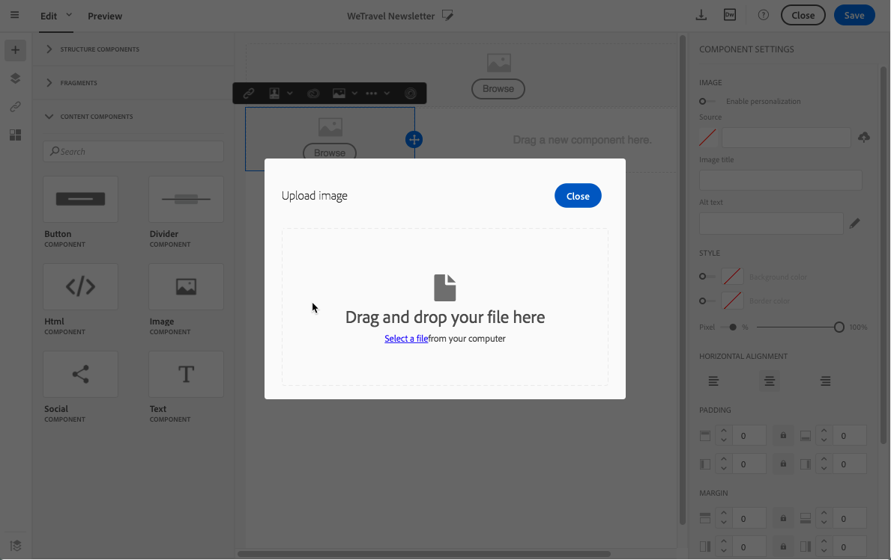

# 画像の操作 {#images}

## 画像の挿入{#inserting-images}

メールおよびランディングページに画像を挿入できます。

設定に応じて、次のタイプの画像を使用できます。

* ローカル画像
* Adobe Experience Cloudから共有される画像 – [Campaign とAssets コアサービスの使用 ](../../integrating/using/working-with-campaign-and-assets-core-service.md)/Assets On Demand を参照してください
* Adobe Targetからの動的画像 – [Campaign と Target の使用 ](../../integrating/using/about-campaign-target-integration.md) を参照してください。

>[!CAUTION]
>
>HTML版のメールに直接画像を追加する場合は、HTMLページで **外部ファイルを &lt;script> タグ** を呼び出さないでください。 これらのファイルは、Adobe Campaign サーバーにインポートされません。

### E メールへの画像の挿入 {#inserting-images-in-an-email}

1. 構造コンポーネントを追加します。 詳しくは、[メール構造の編集](../../designing/using/designing-from-scratch.md#defining-the-email-structure)を参照してください。
1. この構造コンポーネント内に、**[!UICONTROL Image]** コンテンツコンポーネントを追加します。

   

1. 「**[!UICONTROL Browse]**」をクリックします。画像をドラッグ&amp;ドロップするか、クリックしてコンピューターからファイルを選択します。

   

1. 追加したコンテンツコンポーネントを選択します。
1. 画像のプロパティを確認し、必要に応じて調整します。

   

## 画像プロパティの設定{#setting-up-image-properties}

イメージを含むブロックを選択すると、パレットに次のプロパティが表示されます。

* **パーソナライゼーションを有効にする** 画像ソースをカスタマイズできます。 [ 画像ソースのパーソナライズ ](../../designing/using/personalization.md#personalizing-an-image-source) を参照してください。
* **画像タイトル** 画像のタイトルを指定できます。
* **代替テキスト** （メール）または **キャプション** （ランディングページ）を使用すると、画像にリンクするキャプションを設定できます（「**alt**」HTML属性に対応）。
* メールの編集時に、画像のサイズ、背景、境界線を **スタイル** で指定できます。
* ランディングページの編集時に、**Dimension** 画像のサイズをピクセル単位で指定できます。

エディターを使用すると、ブラウザーと互換性のある形式の **すべての画像タイプ** を操作できます。 エディタとの互換性を保つには、**「Flash」タイプのアニメーションを** 次のようにHTMLページに挿入する必要があります。

```
<object type="application/x-shockwave-flash" data="http://www.mydomain.com/flash/your_animation.swf" width="200" height="400">
 <param name="movie" value="http://www.mydomain.com/flash/your_animation.swf" />
 <param name="quality" value="high" />
 <param name="play" value="true"/>
 <param name="loop" value="true"/> 
</object>
```

<!--
## Modifying images with the Adobe Creative SDK{#modifying-images-with-the-adobe-creative-sdk}

You can edit images and use a complete set of features powered by the Adobe Creative SDK to enhance your images directly in the content editor when editing emails or landing pages.

The image editor offers a powerful, full-featured image editing UI component that allows you to edit images and apply effects and frames, original high-quality stickers, beautiful overlays, fun features like tilt shift and color splash, pro-level adjustments and more.

To modify an image with the Adobe Creative SDK:

1. Select the image.
1. In the toolbar, click the Creative Cloud icon.

   

1. Select the tool you want to use through the icons on the top of the window to modify the image.

   

1. Click **[!UICONTROL Save]** when modifications are done. The updated image is saved on Adobe Campaign server and ready to be used.

>[!NOTE]
>
>Tools offered in the image editor cannot be customized.
-->
