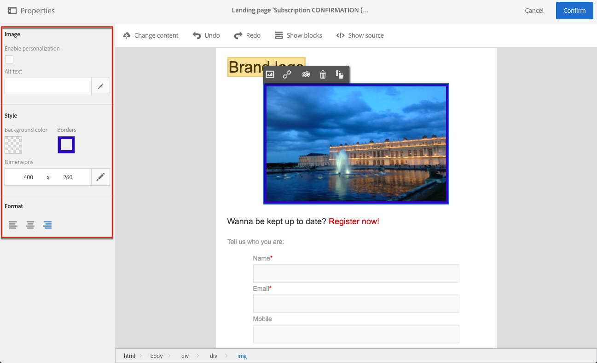

# Inserting images{#inserting-images}

電子メールおよびランディングページに画像を挿入できます。

設定に応じて、次のタイプの画像を使用できます。

* ローカル画像
* Images shared from Adobe Experience Cloud - refer to [Working with Campaign and Assets Core Service](../../integrating/using/working-with-campaign-and-assets-core-service.md) / Assets On Demand
* Dynamic images from Adobe Target - refer to [Working with Campaign and Target](../../integrating/using/about-campaign-target-integration.md)

有効にすると、Adobe Creative SDKで画像を変更できます。See [Modifying images with the Adobe Creative SDK](../../designing/using/modifying-images-with-the-adobe-creative-sdk.md).

>[!CAUTION]
>
>If you choose to add an image directly by editing the HTML version of the email, you must not call up **external files in a &lt;script&gt; tag** of the HTML page. これらのファイルはAdobe Campaignサーバーに読み込まれません。

## Inserting images in an email {#inserting-images-in-an-email}

1. 構造コンポーネントを追加します。For more on this, see [Editing the email structure](../../designing/using/defining-the-email-structure.md#editing-the-email-structure).
1. Inside this structure component, add an **[!UICONTROL Image]** content component.

   

1. **[!UICONTROL Browse]**&#x200B;をクリックします。画像をドラッグ&amp;ドロップして、コンピューターからファイルを選択します。

   

1. 追加したコンテンツコンポーネントを選択します。
1. 画像プロパティを確認し、必要に応じて調整します。

   

## Inserting images in a landing page {#inserting-images-in-a-landing-page}

1. ランディングページのコンテンツで、画像を含むブロックを選択します。
1. **[!UICONTROL Insert]** ボタンを選択します。

   

1. Choose **[!UICONTROL Local image]** from the contextual toolbar.

   

1. ファイルを選択します。

   

1. 必要に応じて画像プロパティを調整します。

   

