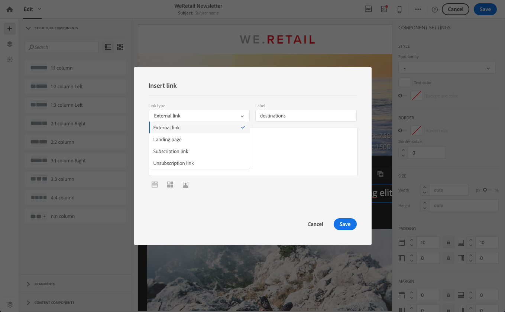
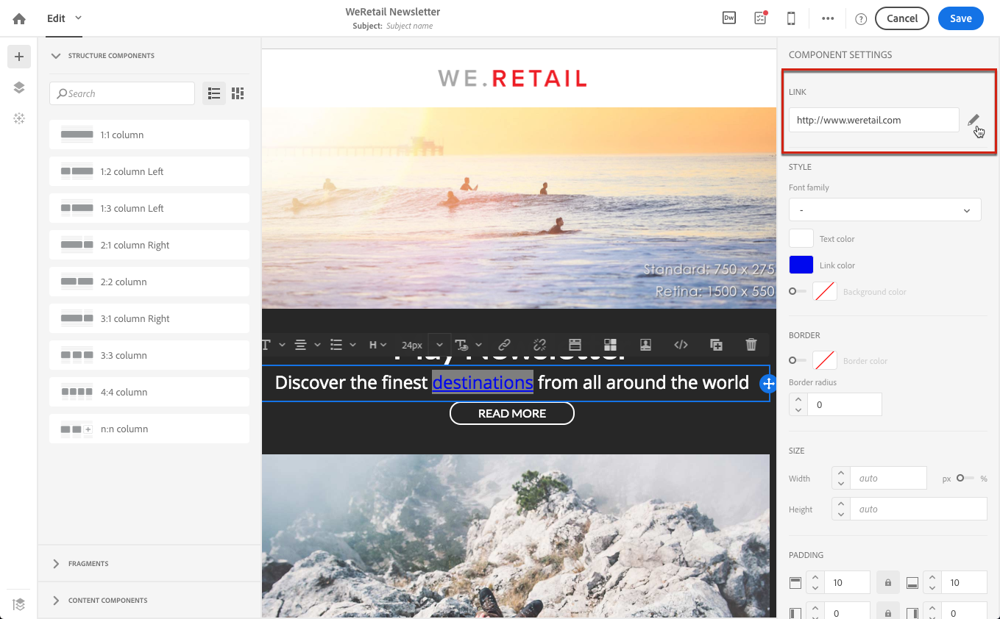

# リンクの追加 {#links}

## リンクの挿入 {#inserting-a-link}

エディターを使用すると、HTMLコンテンツ要素にリンクを挿入して、メールまたはランディングページをパーソナライズできます。

リンクを任意のページ要素（画像、単語、単語のグループ、テキストのブロックなど）に挿入できます。

>[!NOTE]
>
>以下の画像は、[&#x200B; メールDesigner](../../designing/using/designing-content-in-adobe-campaign.md) を使用してメールにリンクを挿入する方法を示しています。

1. 要素を選択し、コンテキストツールバーから **[!UICONTROL Insert link]** をクリックします。

   

1. 作成するリンクのタイプを選択します。

   * **外部リンク**：外部 URL へのリンクを挿入します。

     URL に対してパーソナライゼーションを定義できます。 [URL のパーソナライズ &#x200B;](personalization.md#personalizing-urls) を参照してください。

   * **ランディングページ**:Adobe Campaign ランディングページへのアクセス権を付与します。
   * **購読リンク**:Adobe Campaign サービスを購読するためのリンクを挿入します。
   * **登録解除リンク**:Adobe Campaign サービスを登録解除するリンクを挿入します。
   * **アクションを定義するリンク**：ランディングページ内の要素がクリックされたときにアクションを定義します。

     >[!NOTE]
     >
     >このタイプのリンクは、ランディングページでのみ使用できます。

1. 受信者に表示されるテキストを変更できます。
1. ユーザーがリンクをクリックしたときのブラウザーの動作を設定できます（例：新しいウィンドウを開く）。

   >[!NOTE]
   >
   >ブラウザー動作の定義は、ランディングページにのみ適用されます。

1. 変更内容を保存します。

リンクを作成したら、設定ペインから変更できます。 鉛筆アイコンをクリックして、パラメーターを編集します。

[&#x200B; メールDesigner](../../designing/using/designing-content-in-adobe-campaign.md) を使用してメールを編集する際に、メールに含まれるすべての URL をリストした表から、作成したリンクに簡単にアクセスして変更できます。 このリストを使用すると、一元表示が可能になり、メールコンテンツ内の各 URL を見つけることができます。 アクセスするには、[&#x200B; トラッキングされる URL について &#x200B;](#about-tracked-urls) を参照してください。

>[!NOTE]
>
>**ミラーページ URL** または **購読解除** リンクなどのパーソナライズされた URL は、このリストから変更できません。 その他のリンクはすべて編集可能です。

**関連トピック**：

* [パーソナライゼーションフィールドの挿入](../../designing/using/personalization.md#inserting-a-personalization-field)
* [コンテンツブロックの追加](../../designing/using/personalization.md#adding-a-content-block)
* [動的コンテンツの定義](../../designing/using/personalization.md#defining-dynamic-content-in-an-email)

## トラッキングする URL について {#about-tracked-urls}

Adobe Campaignを使用すると、メールに含まれる URL を受信者がクリックした際の行動をトラッキングできます。 トラッキングについて詳しくは、[この節](../../sending/using/tracking-messages.md#about-tracking)を参照してください。

アクションバーの **[!UICONTROL Links]** アイコンは、トラッキングするコンテンツのすべての URL のリストを自動的に表示します。

>[!NOTE]
>
>トラッキングはデフォルトで有効になっています。 この機能は、Adobe Campaignでトラッキングが有効化されている場合に、メールでのみ使用できます。 トラッキングパラメーターについて詳しくは、[&#x200B; この節 &#x200B;](../../administration/using/configuring-email-channel.md#tracking-parameters) を参照してください。

各リンクの URL、カテゴリ、ラベル、トラッキングタイプは、このリストから変更できます。 リンクを編集するには、対応する鉛筆アイコンをクリックします。

追跡する URL ごとに、トラッキングモードを次のいずれかの値に設定できます。

* **トラッキング対象**：この URL のトラッキングを有効化します。
* **ミラーページ**：この URL をミラーページの URL とみなします。
* **なし**：この URL のトラッキングをアクティブ化しません。 この情報は保存されます。今後のメッセージで URL が再び表示される場合、そのトラッキングは自動的に無効になります。
* **オプトアウト**：この URL をオプトアウトまたは購読解除 URL とみなします。

各 URL のトラッキングを無効または有効にすることもできます。

>[!NOTE]
>
>Adobe Campaignでは、デフォルトで、**ミラーページ URL** リンクと **購読解除** リンクを除くすべてのコンテンツ URL がトラッキングされます。

メッセージで使用される URL に応じて **[!UICONTROL Category]** フィールドを編集することで、URL を再グループ化できます。 これらのカテゴリは、例えば [URL とクリックストリーム &#x200B;](../../reporting/using/urls-and-click-streams.md) などのレポートを表示できます。

レポートを作成する場合は、「**[!UICONTROL Components]**」タブから **[!UICONTROL Dimension]** を選択し、リストを下にスクロールしてトラッキングコンポーネントにアクセスします。 例えば、**[!UICONTROL Tracking URL Category]** をワークスペースにドラッグ&amp;ドロップすると、クリックされた各 URL のトラッキングカテゴリに従って結果が表示されます。

カスタマイズされたレポートの作成について詳しくは、[&#x200B; この節 &#x200B;](../../reporting/using/about-dynamic-reports.md) を参照してください。
