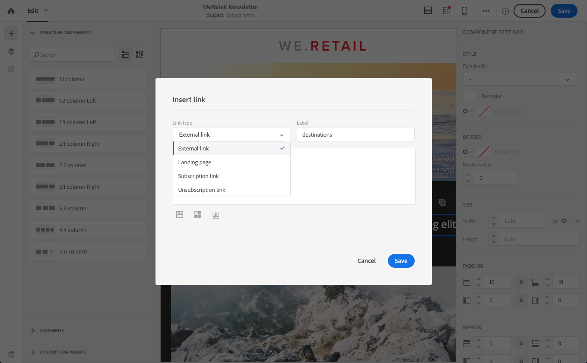
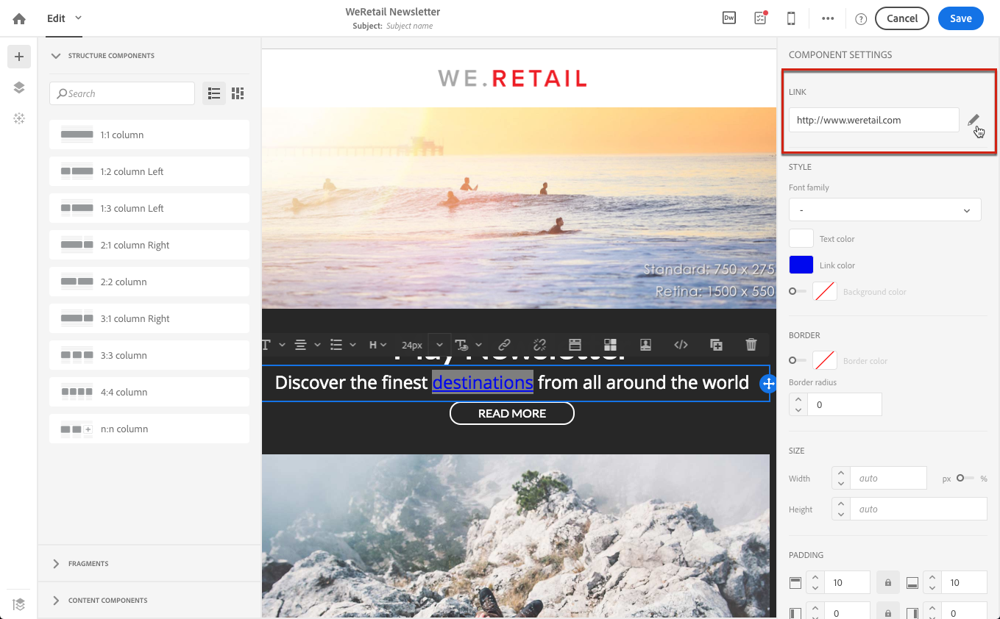
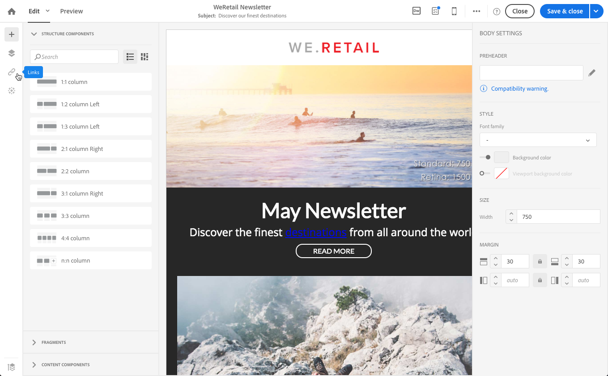
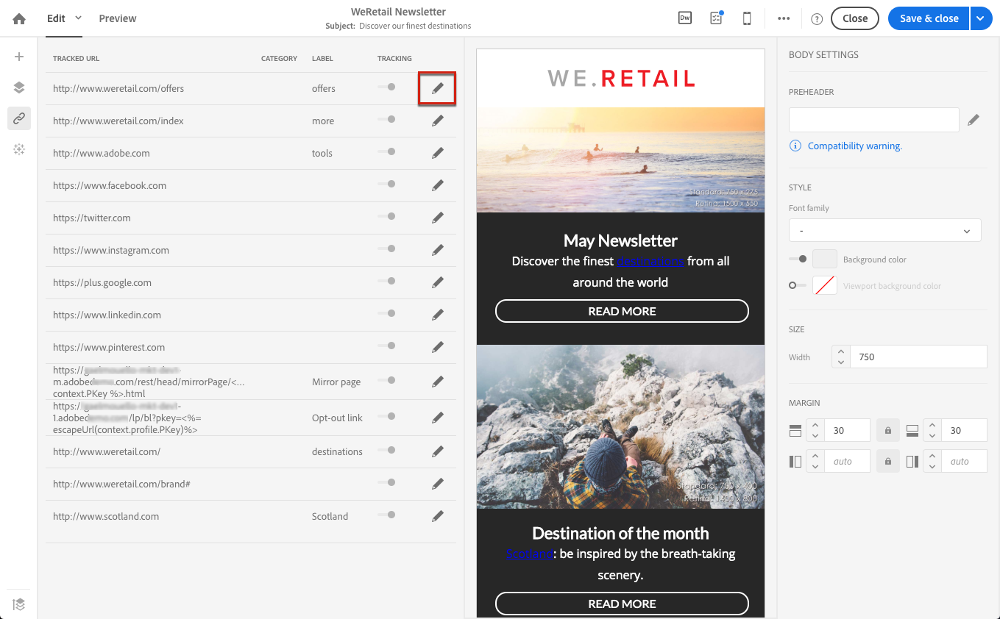
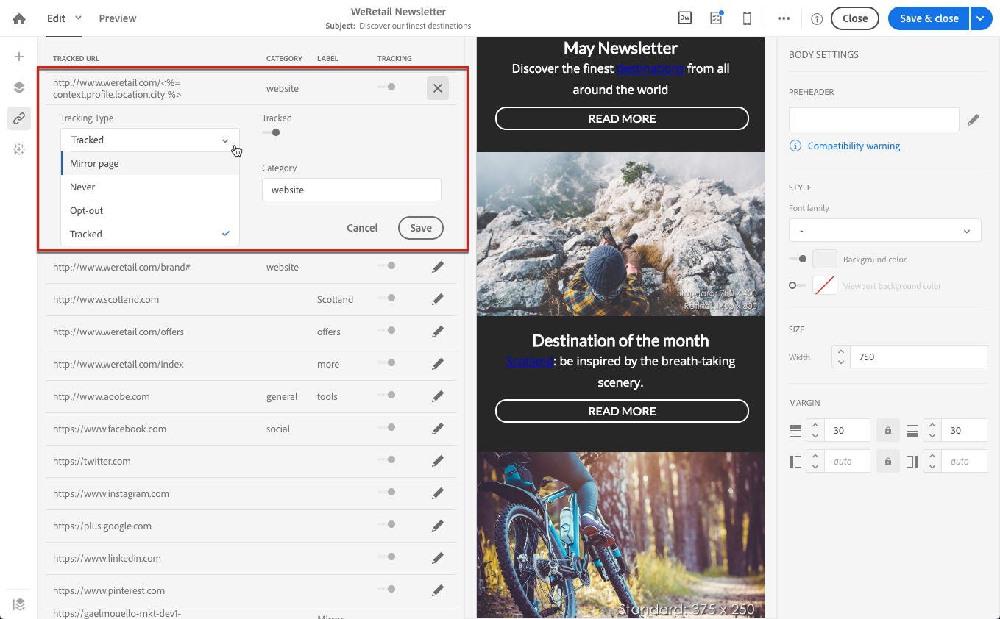
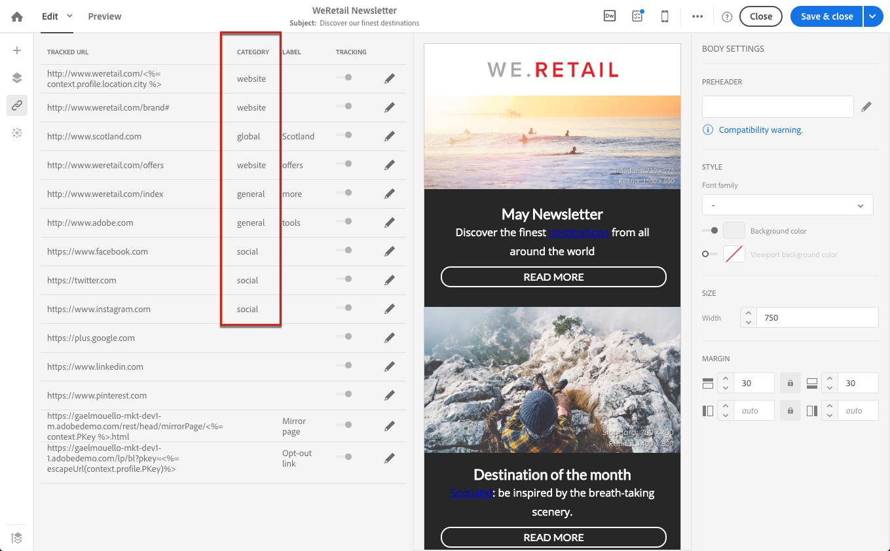
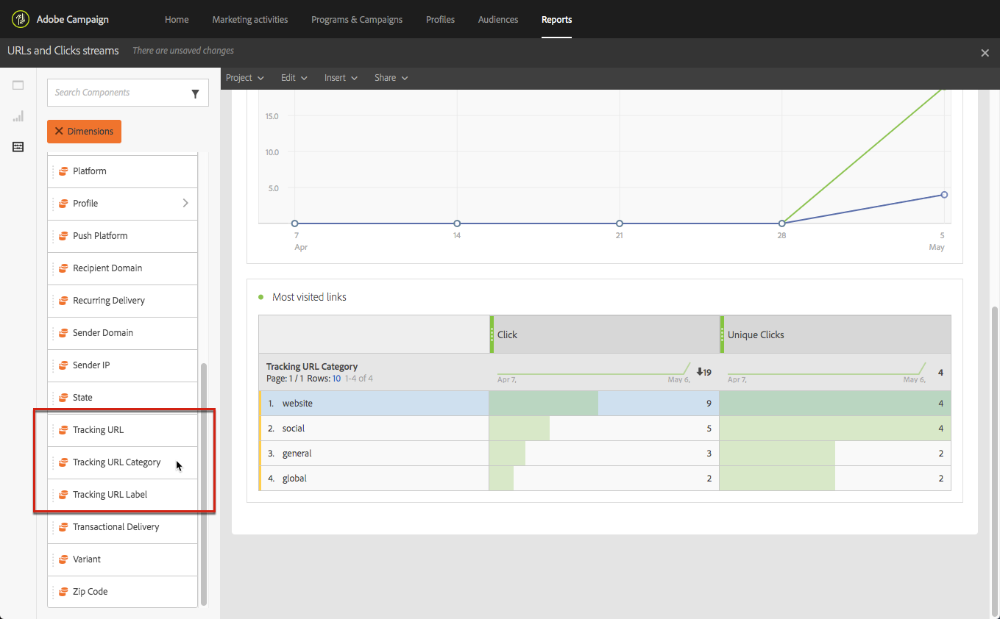

# リンクの追加 {#links}

## リンクの挿入 {#inserting-a-link}

このエディターを使用すると、HTMLのコンテンツ要素にリンクを挿入して、メールまたはランディングページをパーソナライズできます。

リンクを任意のページ要素（画像、単語、単語のグループ、テキストのブロックなど）に挿入できます。

>[!NOTE]
>
>以下の画像は、電子メールに[電子メール Designer](../../designing/using/designing-content-in-adobe-campaign.md)を使用してリンクを挿入する方法を示しています。

1. 要素を選択し、コンテキストツールバーから「**[!UICONTROL Insert link]**」をクリックします。

   

1. 作成するリンクのタイプを選択します。

   * **外部リンク**：外部URLへのリンクを挿入します。

     URLにパーソナライゼーションを定義できます。 [URLのパーソナライズ ](personalization.md#personalizing-urls)を参照してください。

   * **ランディングページ**: Adobe Campaign ランディングページへのアクセス権を付与します。
   * **購読リンク**:Adobe Campaign サービスを購読するためのリンクを挿入します。
   * **購読解除リンク**:Adobe Campaign サービスから購読解除するためのリンクを挿入します。
   * アクションを定義する&#x200B;**リンク**：ランディングページ内の要素がクリックされたときにアクションを定義します。

     >[!NOTE]
     >
     >この種類のリンクは、ランディングページでのみ使用できます。

1. 受信者に表示されるテキストを変更できます。
1. ユーザーがリンクをクリックしたときにブラウザーの動作を設定できます（例えば、新しいウィンドウを開くなど）。

   >[!NOTE]
   >
   >ブラウザー動作の定義は、ランディングページにのみ適用されます。

1. 変更内容を保存します。

リンクを作成した後も、設定ペインで変更できます。 鉛筆アイコンをクリックして、そのパラメーターを編集します。

[電子メール Designer](../../designing/using/designing-content-in-adobe-campaign.md)を使用して電子メールを編集する場合、電子メールに含まれているすべてのURLを一覧表示したテーブルから、作成したリンクに簡単にアクセスして変更できます。 このリストを使用すると、一元的に表示し、メールコンテンツ内の各URLを見つけることができます。 アクセスするには、[ トラッキング対象URLについて](#about-tracked-urls)を参照してください。

>[!NOTE]
>
>**ミラーページ URL**&#x200B;または&#x200B;**購読解除** リンクなどのパーソナライズされたURLは、このリストから変更できません。 その他のリンクはすべて編集可能です。

**関連トピック**：

* [パーソナライゼーションフィールドの挿入](../../designing/using/personalization.md#inserting-a-personalization-field)
* [コンテンツブロックの追加](../../designing/using/personalization.md#adding-a-content-block)
* [動的コンテンツの定義](../../designing/using/personalization.md#defining-dynamic-content-in-an-email)

## トラッキング対象URLについて {#about-tracked-urls}

Adobe Campaignを使用すると、受信者がメールに含まれるURLをクリックしたときに、受信者の行動を追跡できます。 トラッキングについて詳しくは、[この節](../../sending/using/tracking-messages.md#about-tracking)を参照してください。

アクションバーの&#x200B;**[!UICONTROL Links]** アイコンには、追跡されるコンテンツのすべてのURLのリストが自動的に表示されます。

>[!NOTE]
>
>トラッキングはデフォルトで有効になっています。 この機能は、Adobe Campaignでトラッキングがアクティブ化されている場合にのみ、メールでのみ使用できます。 トラッキングパラメーターについて詳しくは、[この節](../../administration/using/configuring-email-channel.md#tracking-parameters)を参照してください。

各リンクのURL、カテゴリ、ラベル、トラッキングタイプは、このリストから変更できます。 リンクを編集するには、対応する鉛筆アイコンをクリックします。

トラッキング対象URLごとに、トラッキングモードを次のいずれかの値に設定できます。

* **トラッキング済み**：このURLでトラッキングをアクティブ化します。
* **ミラーページ**：この URL をミラーページの URL とみなします。
* **なし**：このURLのトラッキングをアクティブにしません。 この情報は保存されます。URLが今後のメッセージに再度表示された場合、そのトラッキングは自動的に非アクティブ化されます。
* **オプトアウト**：この URL をオプトアウトまたは購読解除 URL とみなします。

また、各URLのトラッキングをディアクティベートまたはアクティベートすることもできます。

>[!NOTE]
>
>Adobe Campaignでは、デフォルトで、**ミラーページ URL**&#x200B;と&#x200B;**購読解除** リンクを除くすべてのコンテンツ URLが追跡されます。

メッセージで使用されているURLに応じて、**[!UICONTROL Category]** フィールドを編集することで、URLを再グループ化できます。 これらのカテゴリは、例えば[URLやクリックストリーム ](../../reporting/using/urls-and-click-streams.md)のように、レポートに表示できます。

レポートを作成する場合、「**[!UICONTROL Components]**」タブで「**[!UICONTROL Dimension]**」を選択し、リストを下にスクロールしてトラッキングコンポーネントにアクセスします。 例えば、**[!UICONTROL Tracking URL Category]**&#x200B;をワークスペースにドラッグ&amp;ドロップして、クリックした各URLのトラッキングカテゴリに従って結果を表示します。

カスタマイズされたレポートの作成について詳しくは、[この節](../../reporting/using/about-dynamic-reports.md)を参照してください。
