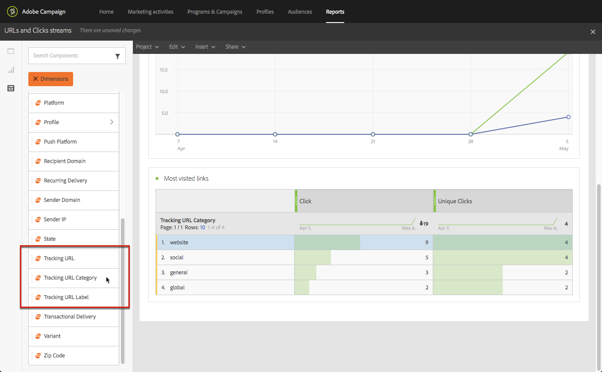

# リンク {#links}

## リンクの挿入 {#inserting-a-link}

エディタを使用すると、HTMLコンテンツ要素にリンクを挿入して、電子メールまたはランディング·ページをパーソナライズできます。

リンクは、任意のページ要素に挿入できます。画像、単語、単語群、テキストブロックなど

>[!NOTE]
>
>次の図は、電子メールの電子メールデザイナを使用してリ [ンクを挿入する](../../designing/using/overview.md) 方法を示しています。

1. 要素を選択し、コンテキストツー **[!UICONTROL Insert link]** ルバーからをクリックします。

   

1. 作成するリンクの種類を選択してください：

   * **外部リンク**:外部URLへのリンクを挿入します。

      URLの個人用設定を定義できます。 URLのパーソナ [ライズを参照してください](../../designing/using/using-reusable-content.md#creating-a-content-fragment)。

   * **ランディングページ**:adobe Campaignのランディング·ページにアクセスできます。
   * **サブスクリプション**:adobe Campaignサービスを購読するリンクを挿入します。
   * **サブスクリプション解除**:adobe Campaignサービスの購読を取り消すリンクを挿入します。
   * **アクションを定義するリンク**:ランディング·ページの要素をクリックしたときのアクションを定義します。

      >[!NOTE]
      >
      >この種類のリンクは、ランディング·ページに対してのみ使用できます。

1. 受信者に表示されるテキストを変更できます。
1. ユーザがリンクをクリックしたときのブラウザの動作を設定できます（たとえば、新しいウィンドウを開く）。

   >[!NOTE]
   >
   >ブラウザの動作の定義は、ランディング·ページにのみ適用されます。

1. 変更を保存します。

リンクを作成した後でも、[設定]ペインからリンクを変更できます。 鉛筆アイコンをクリックして、パラメータを編集します。

電子メールデザイナを使用して電子メ [ールを編集する場合](../../designing/using/overview.md)、電子メールに含まれるすべてのURLを一覧表示した表から、作成したリンクに簡単にアクセスして変更できます。 このリストを使用すると、一元的なビューを作成し、電子メールコンテンツ内の各URLを検索できます。 アクセスするには、「追跡URLにつ [いて」を参照してください](../../designing/using/links.md#about-tracked-urls)。

>[!NOTE]
>
>ミラーページのURL **、サブスクリプショ** ン解除リンクなどの個人用URLは **** 、このリストから変更できません。 その他のリンクはすべて編集可能です。

**関連トピック**:

* [個人用設定フィールドの挿入](../../designing/using/personalization.md#inserting-a-personalization-field)
* [コンテンツブロックを追加する](../../designing/using/personalization.md#adding-a-content-block)
* [動的コンテンツの定義](../../designing/using/personalization.md#defining-dynamic-content-in-an-email)

## 追跡URLについて {#about-tracked-urls}

Adobe Campaignでは、電子メールに含まれるURLをクリックした場合の受信者の動作を追跡できます。 追跡の詳細については、このセクションを参 [照してください](../../sending/using/tracking-messages.md#about-tracking)。

アクシ **[!UICONTROL Links]** ョンバーのアイコンには、追跡対象のコンテンツのすべてのURLの一覧が自動的に表示されます。

>[!NOTE]
>
>既定では、追跡が有効になっています。 この機能は、Adobe Campaignで追跡が有効になっている場合に、電子メールでのみ使用できます。 トラッキングパラメータの詳細については、このセクションを参 [照してください](../../administration/using/configuring-email-channel.md#tracking-parameters)。

各リンクのURL、カテゴリ、ラベル、および追跡の種類は、このリストから変更できます。 リンクを編集するには、対応する鉛筆アイコンをクリックします。

追跡するURLごとに、追跡モードを次のいずれかの値に設定できます。

* **追跡**:このURLの追跡を有効にします。
* **ミラーページ**:このURLはミラーページのURLと見なされます。
* **なし**:このURLの追跡をアクティブにしない。 次の情報が保存されます。urlが後で表示される場合は、その追跡は自動的に非アクティブ化されます。
* **オプトアウト**:このURLは、オプトアウトまたはサブスクリプション解除URLと見なされます。

また、各URLの追跡を非アクティブにしたり、アクティブにしたりすることもできます。

>[!NOTE]
>
>Adobe Campaignのデフォルトでは、ミラーページのURLと **Unsubscriptionリンクを除くすべてのコンテンツURLが** 追 **跡されます** 。

メッセージで使用するURLに応じて、フィー **[!UICONTROL Category]** ルドを編集して、URLを再グループ化できます。 これらのカテゴリは、URLやクリック·ストリームなど、レポ [ートを表示できます](../../reporting/using/urls-and-click-streams.md)。

レポートを作成する場合は、タブでリ **[!UICONTROL Components]** ストを選択して下にス **[!UICONTROL Dimension]** クロールし、追跡コンポーネントにアクセスします。 たとえば、ワークスペースにドラッ **[!UICONTROL Tracking URL Category]** グ·アンド·ドロップして、クリックした各URLの追跡カテゴリに従って結果を表示します。

カスタマイズされたレポートの作成の詳細については、このセクション [を参照してくださ](../../reporting/using/about-dynamic-reports.md)い。
