# メールコンテンツのパーソナライズ {#personalization}

Adobe Campaignが配信するメッセージの内容と表示は、様々な方法でパーソナライズできます。 プロファイルに応じて基準に従ってこれらの方法を組み合わせることができます。 Adobe Campaign には、全体として次のようなパーソナライゼーション機能が備わっています。

* 動的パーソナライゼーションフィールドを挿入します。 [パーソナライゼーションフィールドの挿入](#inserting-a-personalization-field)を参照してください。
* 定義済みパーソナライゼーションブロックの挿入： [コンテンツブロックの追加](#adding-a-content-block)を参照してください。
* 電子メールの送信者をパーソナライズ。 [送信者のパーソナライズ &#x200B;](#personalizing-the-sender)を参照してください。
* メールの件名をパーソナライズ： [電子メールの件名のパーソナライズ &#x200B;](../../designing/using/subject-line.md#subject-line)を参照してください。
* 条件付きコンテンツを作成します。 [&#x200B; メール内の動的コンテンツの定義](#defining-dynamic-content-in-an-email)を参照してください。

## 送信者のパーソナライズ {#personalizing-the-sender}

送信されたメッセージのヘッダーに表示される送信者の名前を定義するには、「メールDesigner」ホームページの「**[!UICONTROL Properties]**」タブに移動します（ホームアイコンからアクセスできます）。 詳しくは、[電子メールの送信者の定義](../../designing/using/subject-line.md#email-sender)を参照してください。

送信者の名前を変更するには、**送信者の名前** ブロックをクリックします。 その後、フィールドは編集可能になり、使用する名前を入力できます。

このフィールドはパーソナライズできます。 これには、送信者名の下のアイコンをクリックして、パーソナライゼーションフィールド、コンテンツブロック、動的コンテンツを追加できます。

>[!NOTE]
>
>ヘッダーパラメーターの値は省略できません。 送信者のアドレスは、メールを送信するための必須情報です（RFC 標準規格）。 入力したメールアドレスの形式はチェックされます。

## URLのパーソナライズ {#personalizing-urls}

Adobe Campaignでは、パーソナライゼーションフィールド、コンテンツブロック、動的コンテンツを追加することで、メッセージ内の1つまたは複数のURLをパーソナライズできます。 手順は次のとおりです。

1. 外部URLを挿入し、そのパラメーターを指定します。 「[&#x200B; リンクの挿入](../../designing/using/links.md#inserting-a-link)」を参照してください。
1. 表示されない場合は、設定ペインで選択したURLの横にある鉛筆をクリックして、パーソナライゼーションオプションにアクセスします。
1. 使用するパーソナライゼーションフィールド、コンテンツブロック、動的コンテンツを追加します。

   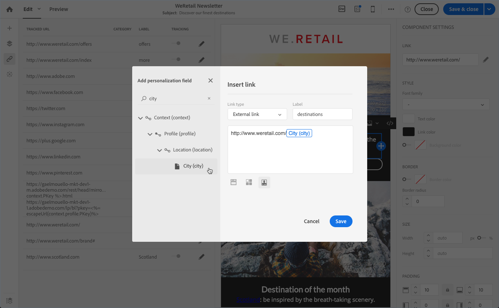

1. 変更内容を保存します。

>[!NOTE]
>
>トラッキングリンクのURL署名メカニズムが無効になっている場合、パーソナライズされたURLをドメイン名にもURL拡張機能にも適用できません。 パーソナライゼーションが正しくない場合、メッセージ分析中にエラーメッセージが表示されます。
>
>コンテンツブロックを選択する場合、**ミラーページへのリンク**&#x200B;などの要素を選択することはできません。 このタイプのブロックは、リンク内では禁止されています。

## パーソナライゼーションフィールドの挿入{#inserting-a-personalization-field}

Adobe Campaignでは、データベースのフィールドを、プロファイルの名前などのページに挿入できます。

>[!NOTE]
>
>次の画像は、電子メールに[電子メール Designer](../../designing/using/designing-content-in-adobe-campaign.md)を使用してパーソナライゼーションフィールドを挿入する方法を示しています。

パーソナライゼーションフィールドをコンテンツに追加するには：

1. テキストブロック内をクリックし、コンテキストツールバーの&#x200B;**[!UICONTROL Personalize]** アイコンをクリックして、**[!UICONTROL Insert personalization field]**&#x200B;を選択します。 メール Designer インターフェイスについて詳しくは、[この節](../../designing/using/designing-content-in-adobe-campaign.md#email-designer-interface)を参照してください。

   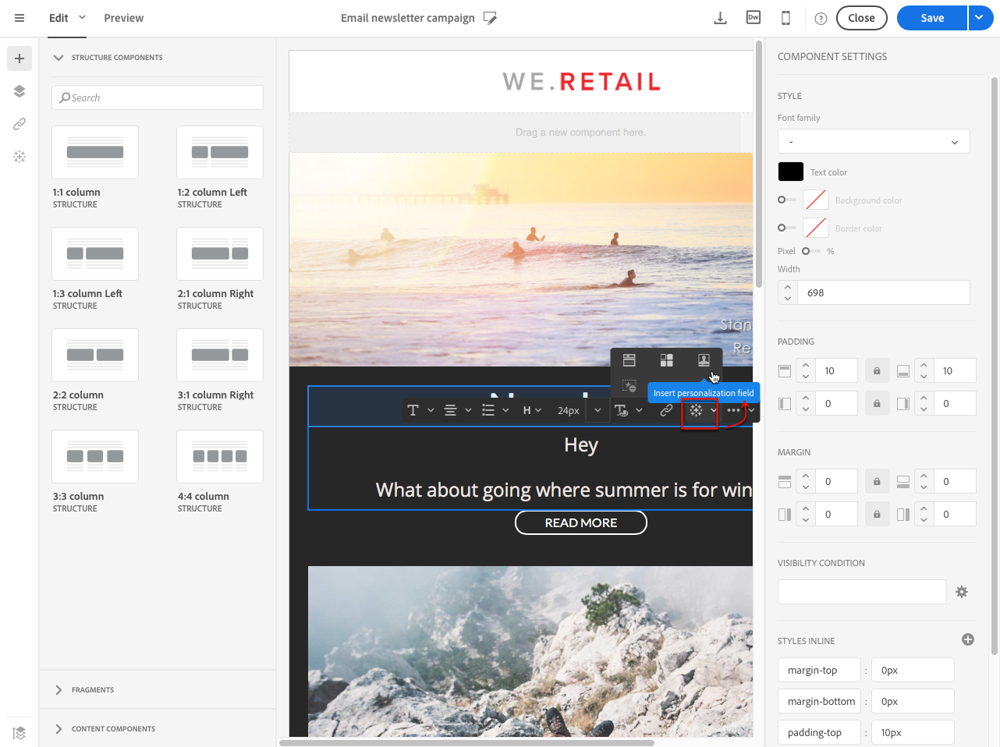

1. ページコンテンツに挿入するフィールドを選択します。

   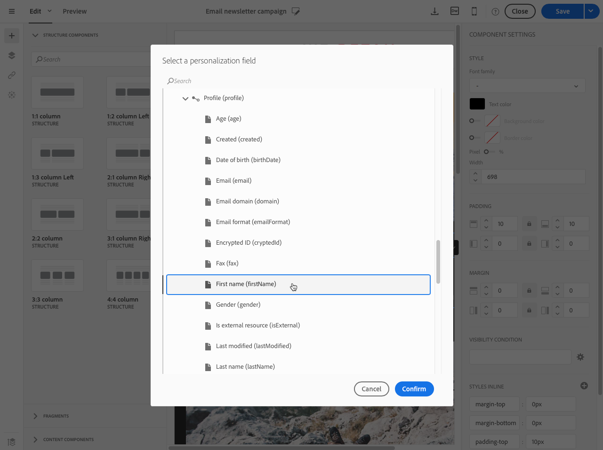

1. 「**[!UICONTROL Confirm]**」をクリックします。

フィールド名がエディターに表示され、ハイライト表示されます。

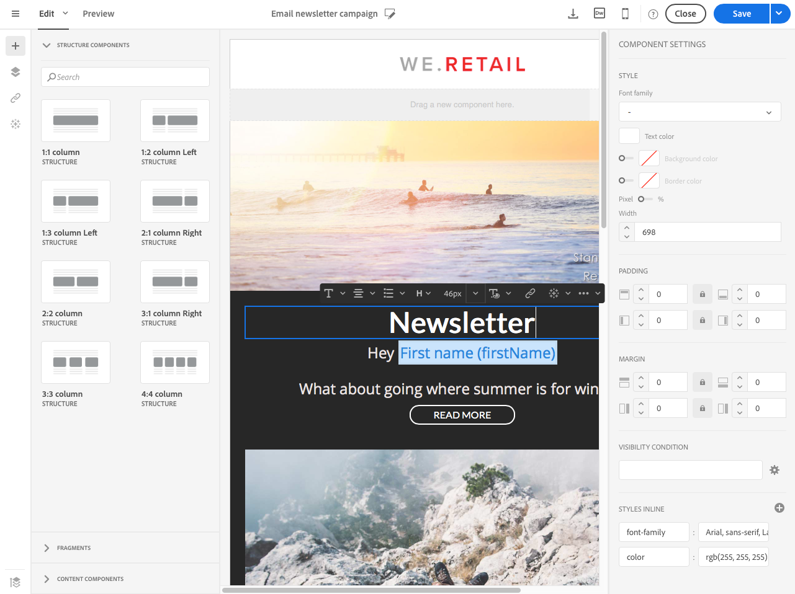

パーソナライゼーションが生成されると（例えば、電子メールをプレビューして準備する場合）、このフィールドはターゲットプロファイルに対応する値に置き換えられます。

>[!NOTE]
>
>メールがワークフローから作成された場合、ワークフローで計算された追加データは、パーソナライゼーション フィールドでも使用できます。 ワークフローから追加のデータを追加する方法について詳しくは、「[&#x200B; データの強化](../../automating/using/about-targeting-activities.md#enriching-data)」の節を参照してください。

## コンテンツブロックの追加 {#adding-a-content-block}

Adobe Campaign は、事前設定済みのコンテンツブロックのリストを提供します。 これらのコンテンツブロックは動的でパーソナライズされており、特定のレンダリングが可能です。 例えば、ミラーページに挨拶またはリンクを追加できます。

>[!NOTE]
>
>次の画像は、メールに[電子メール Designer](../../designing/using/designing-content-in-adobe-campaign.md)を使用してコンテンツブロックを挿入する方法を示しています。

コンテンツブロックを追加するには：

1. テキストブロック内をクリックし、コンテキストツールバーの&#x200B;**[!UICONTROL Personalize]** アイコンをクリックして、**[!UICONTROL Insert content block]**&#x200B;を選択します。 メール Designer インターフェイスについて詳しくは、[この節](../../designing/using/designing-content-in-adobe-campaign.md#email-designer-interface)を参照してください。

   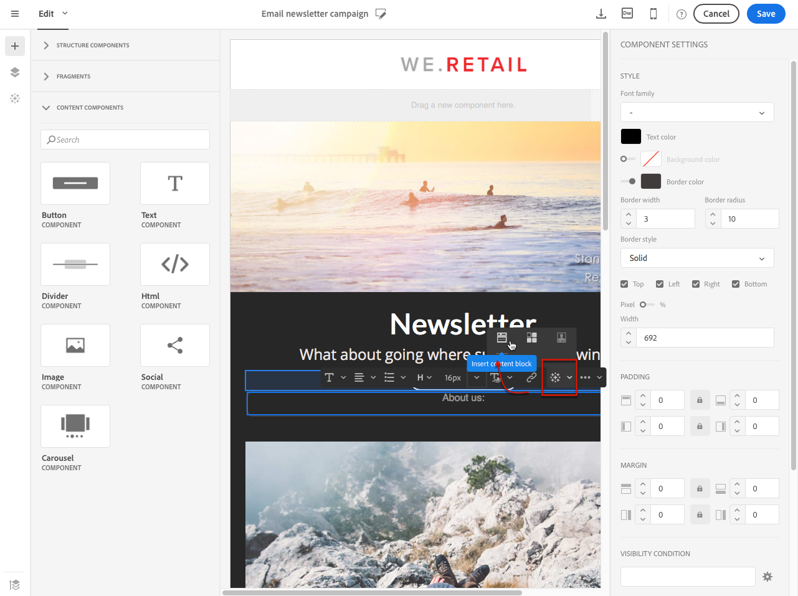

1. 挿入するコンテンツブロックを選択します。 利用できるブロックはコンテキスト（メールまたはランディングページ）によって異なります。

   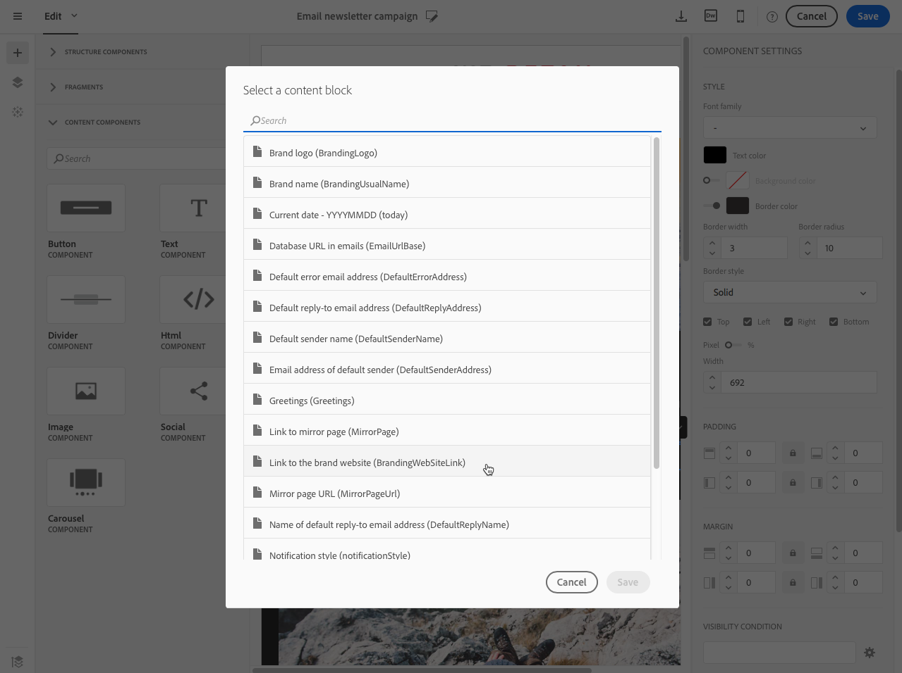

1. 「**[!UICONTROL Save]**」をクリックします。

コンテンツブロックの名前がエディターに表示され、黄色でハイライト表示されます。 パーソナライゼーションが生成されると、プロファイルに自動的に適応します。

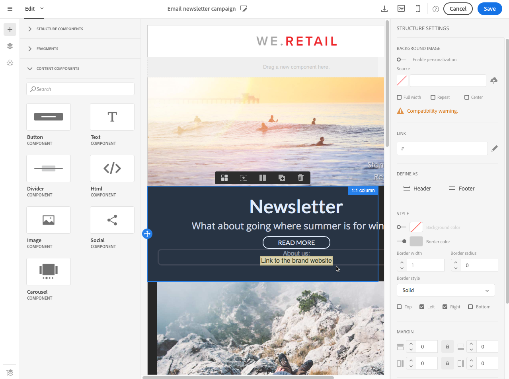

すぐに利用できるコンテンツブロックは次のとおりです。

* **[!UICONTROL Database URL in emails (EmailUrlBase)]**：このコンテンツブロックは&#x200B;**配信**&#x200B;でのみ使用できます。
* **[!UICONTROL Mirror page URL (MirrorPageUrl)]**：このコンテンツブロックは&#x200B;**配信**&#x200B;でのみ使用できます。
* **[!UICONTROL Link to mirror page (MirrorPage)]**：このコンテンツブロックは&#x200B;**配信**&#x200B;でのみ使用できます。
* **[!UICONTROL Greetings (Greetings)]**
* **[!UICONTROL Unsubscription link (UnsubscriptionLink)]**：このコンテンツブロックは&#x200B;**配信**&#x200B;でのみ使用できます。
* **[!UICONTROL Social network sharing links (LandingPageViralLinks)]**：このコンテンツブロックは&#x200B;**ランディングページ**&#x200B;でのみ使用できます。
* **[!UICONTROL Default sender name (DefaultSenderName)]**：このコンテンツブロックは&#x200B;**配信**&#x200B;でのみ使用できます。
* **[!UICONTROL Name of default reply-to email address (DefaultReplyName)]**：このコンテンツブロックは&#x200B;**配信**&#x200B;でのみ使用できます。
* **[!UICONTROL Email address of default sender (DefaultSenderAddress)]**：このコンテンツブロックは&#x200B;**配信**&#x200B;でのみ使用できます。
* **[!UICONTROL Default error email address (DefaultErrorAddress)]**：このコンテンツブロックは&#x200B;**配信**&#x200B;でのみ使用できます。
* **[!UICONTROL Default reply-to email address (DefaultReplyAddress)]**：このコンテンツブロックは&#x200B;**配信**&#x200B;でのみ使用できます。
* **[!UICONTROL Brand name (BrandingUsualName)]**
* **[!UICONTROL Link to the brand website (BrandingWebSiteLink)]**
* **[!UICONTROL Brand logo (BrandingLogo)]**
* **[!UICONTROL Notification style (notificationStyle)]**

### カスタムコンテンツブロックの作成 {#creating-custom-content-blocks}

メッセージやランディングページに挿入される新しいコンテンツブロックを定義できます。

コンテンツブロックを作成するには、次の手順に従います。

1. 詳細設定メニューの「**[!UICONTROL Resources > Content blocks]**」をクリックして、コンテンツブロックのリストにアクセスします。
1. **[!UICONTROL Create]** ボタンをクリックするか、既存のコンテンツブロックを複製します。

   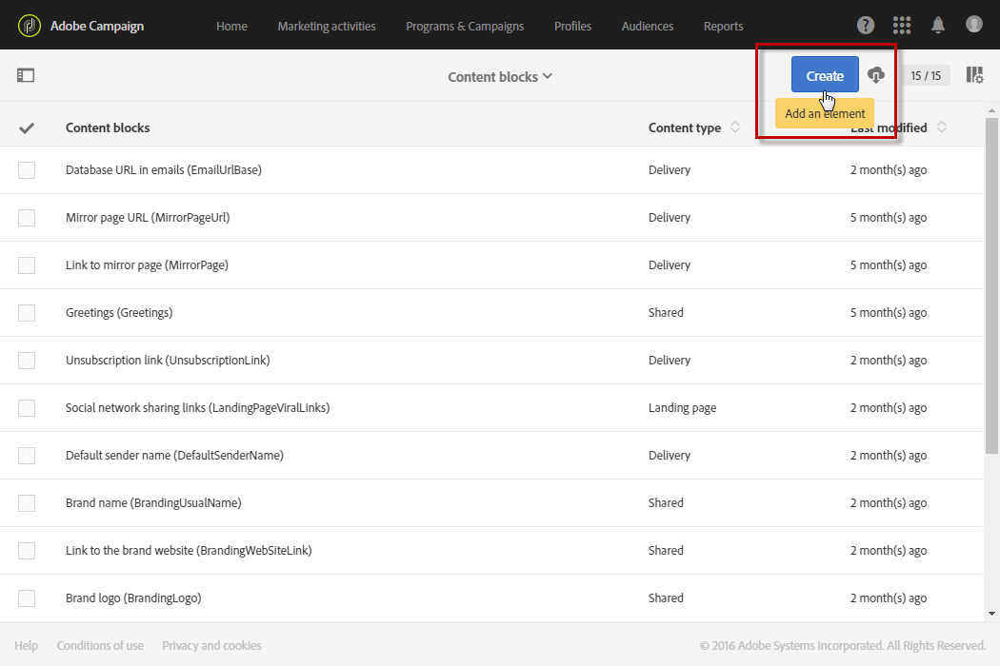

1. ラベルを入力します。
1. ブロックの&#x200B;**[!UICONTROL Content type]**&#x200B;を選択します。 次の 3 つのオプションを使用できます。

   * **[!UICONTROL Shared]**: コンテンツブロックは、配信またはランディングページで使用できます。
   * **[!UICONTROL Delivery]**: コンテンツブロックは、配信でのみ使用できます。
   * **[!UICONTROL Landing page]**: コンテンツブロックは、ランディングページでのみ使用できます。

   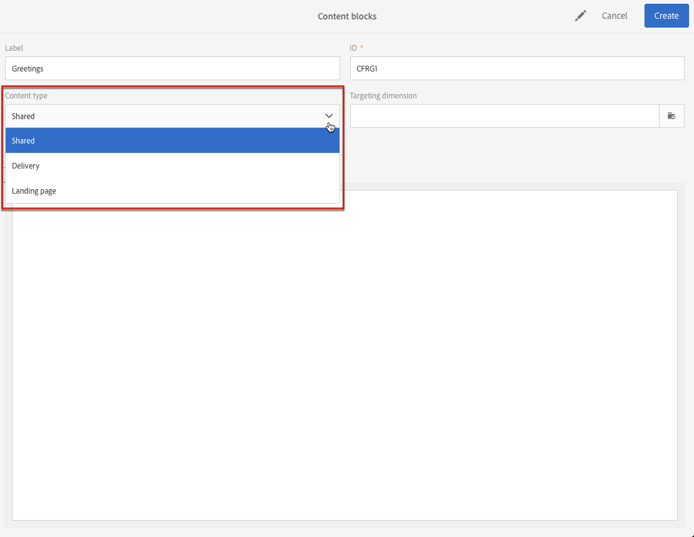

1. **[!UICONTROL Targeting dimension]**&#x200B;を選択できます。 詳しくは、「[&#x200B; ターゲティングディメンションについて](#about-targeting-dimension)」を参照してください。

   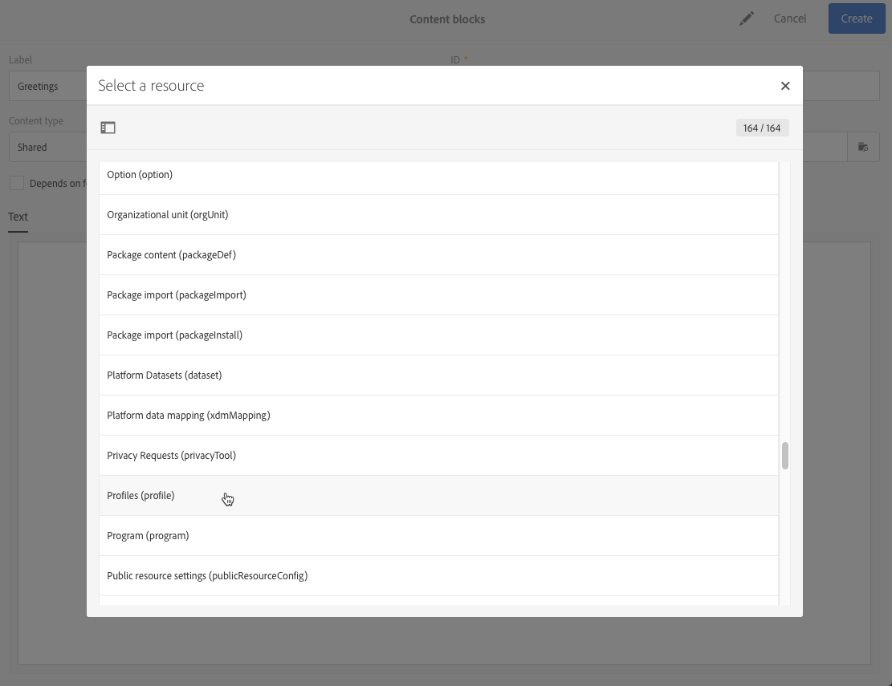

1. 「**[!UICONTROL Depends on format]**」オプションを選択して、2つの異なるブロックを定義できます。1つはHTML メール用で、もう1つはテキスト形式のメール用です。 次に、対応するコンテンツを定義するために、エディター（HTMLとテキスト）に2つのタブが表示されます。

   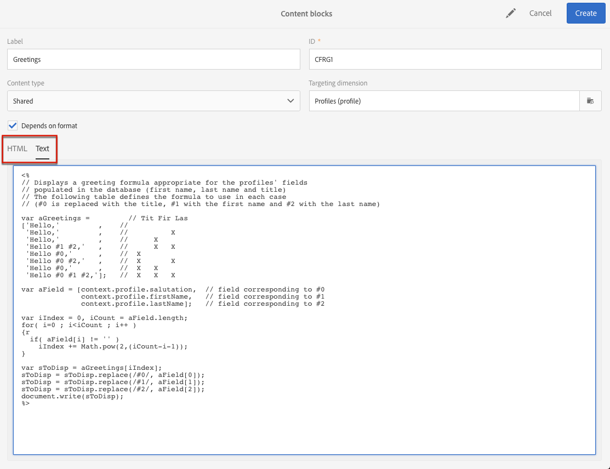

1. コンテンツブロックの内容を入力し、**[!UICONTROL Create]** ボタンをクリックします。

コンテンツブロックは、メッセージまたはランディングページのコンテンツエディターで使用できるようになりました。

>[!CAUTION]
>
>ブロックのコンテンツを編集するときは、*if* ステートメントの先頭と末尾の間に余白がないことを確認してください。 HTMLでは、画面上に空白が表示されるので、コンテンツのレイアウトに影響を与えます。

### ターゲティングディメンションについて {#about-targeting-dimension}

ターゲティングディメンションを使用すると、コンテンツブロックを使用できるメッセージのタイプを定義できます。 これは、メッセージ内で不適切なブロックを使用してエラーが発生するのを防ぐためです。

実際、メッセージを編集する場合、そのメッセージのターゲティングディメンションと互換性のあるターゲティングディメンションを持つコンテンツブロックのみを選択できます。

例えば、**[!UICONTROL Unsubscription link]** ブロックのターゲティングディメンションは、**[!UICONTROL Profiles]** リソースに固有のパーソナライゼーションフィールドが含まれているため、**[!UICONTROL Profiles]**&#x200B;です。 したがって、[&#x200B; イベントトランザクションメッセージ &#x200B;](../../channels/using/getting-started-with-transactional-msg.md#transactional-message-types)では、**[!UICONTROL Unsubscription link]** ブロックを使用できません。そのタイプのメッセージのターゲティングディメンションは&#x200B;**[!UICONTROL Real-time events]**&#x200B;であるためです。 ただし、メッセージのタイプのターゲティングディメンションが&#x200B;**プロファイル**&#x200B;であるため、[&#x200B; プロファイルのトランザクションメッセージ &#x200B;](../../channels/using/getting-started-with-transactional-msg.md#transactional-message-types)で&#x200B;**購読解除リンク** ブロックを使用できます。 最後に、**[!UICONTROL Link to mirror page]** ブロックにはターゲティングディメンションがないため、任意のメッセージで使用できます。

このフィールドを空のままにすると、ターゲティングディメンションにかかわらず、コンテンツブロックはすべてのメッセージと互換性があります。 ターゲティングディメンションを設定した場合、そのブロックは同じターゲティングディメンションを持つメッセージとのみ互換性があります。

詳しくは、[ターゲティングディメンションとリソース](../../automating/using/query.md#targeting-dimensions-and-resources)を参照してください。

**関連トピック：**

* [パーソナライゼーションフィールドの挿入](#inserting-a-personalization-field)
* [コンテンツブロックの追加](#adding-a-content-block)
* [メールでの動的コンテンツの定義](#defining-dynamic-content-in-an-email)

## 画像ソースのパーソナライズ{#personalizing-an-image-source}

Adobe Campaignを使用すると、特定の条件に従ってメッセージ内の1つまたは複数の画像をパーソナライズしたり、トラッキングを使用したりできます。 これは、パーソナライゼーションフィールド、コンテンツブロック、動的コンテンツを画像ソースに挿入することによって行われます。 手順は次のとおりです。

1. メッセージのコンテンツに画像を挿入するか、既に存在する画像を選択します。
1. 画像のプロパティ パレットで、**[!UICONTROL Enable personalization]** オプションをオンにします。

   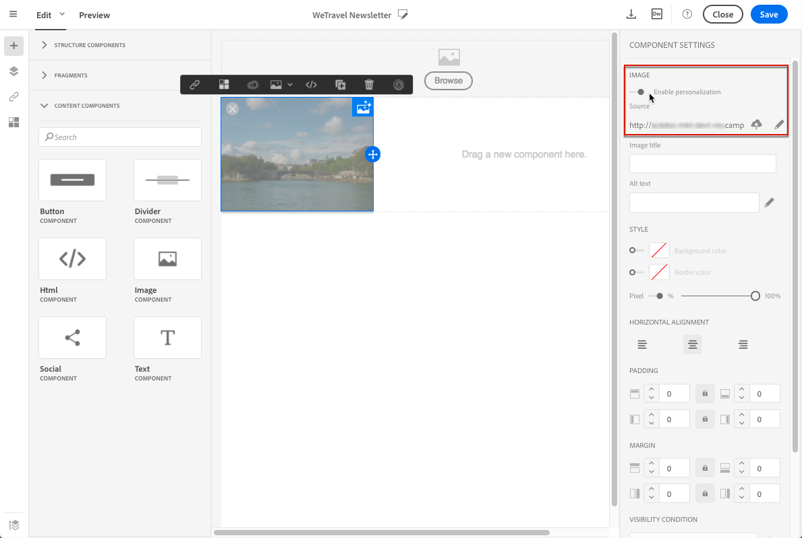

   **[!UICONTROL Source]** フィールドが表示され、選択された画像が&#x200B;**パーソナライズされた**&#x200B;としてエディターに表示されます。

1. **[!UICONTROL Source]** フィールドボタンの横にある鉛筆をクリックして、パーソナライゼーションオプションにアクセスします。
1. 画像ソースを追加したら、パーソナライゼーションフィールド、コンテンツブロック、および好きな動的コンテンツを追加します。

   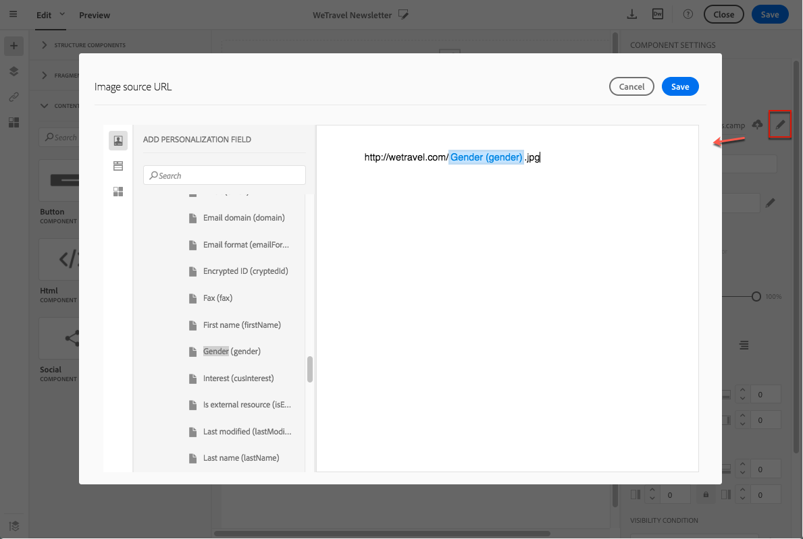

   >[!NOTE]
   >
   >ドメイン名（http://mydomain.com）はパーソナライズできません。手動で入力する必要があります。 残りのURLはパーソナライズできます。 例：http://mydomain.com/ `[Gender]` .jpg

1. 変更を確認します。

## 条件付きコンテンツ {#conditional-content}

### 表示条件の定義{#defining-a-visibility-condition}

任意の要素に対して表示条件を指定できます。 条件が尊重されている場合にのみ表示されます。

表示条件を追加するには、ブロックを選択し、その設定の&#x200B;**[!UICONTROL Visibility condition]** フィールドに適用する条件を入力します。

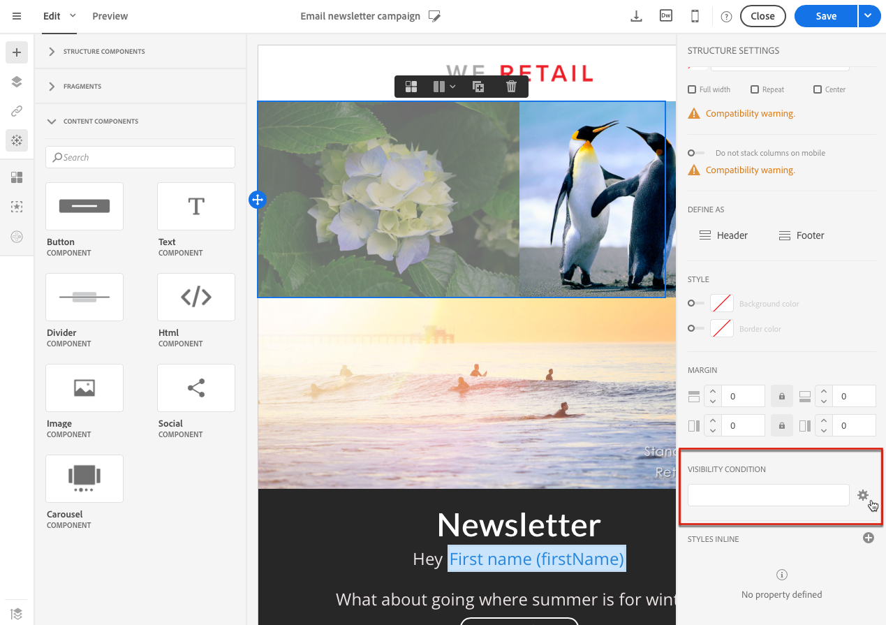

このオプションは、ADDRESS、BLOCKQUOTE、CENTER、DIR、DIV、DL、FIELDSET、FORM、H1、H2、H3、H4、H5、H6、NOSCRIPT、OL、P、PRE、UL、TR、TDの各要素でのみ使用できます。

式エディターは、[高度な式の編集](../../automating/using/editing-queries.md#about-query-editor) セクションに表示されます。

これらの条件は、XTK式の構文を採用します（例：**context.profile.email !=&quot;**&#x200B;または&#x200B;**context.profile.status=&#39;0&#39;**）。 デフォルトでは、すべてのファイルが表示されます。

>[!NOTE]
>
>動的コンテンツを含むサブ要素を既に含むブロックや、既に動的コンテンツを構成するブロックに対して、条件を定義することはできません。 ドロップダウンリストなどの非表示の動的ブロックは編集できません。

### メールでの動的コンテンツの定義{#defining-dynamic-content-in-an-email}

>[!CONTEXTUALHELP]
>id="ac_dynamic_content"
>title="動的コンテンツの定義"
>abstract="定義する条件に従ってのみ、一部のプロファイルに表示される様々なコンテンツを定義します。"

メールでは、式エディターで定義された条件に従って、受信者に動的に表示される様々なコンテンツを定義できます。 例えば、同じ電子メールから、各プロファイルの年齢範囲に応じて異なるメッセージを確実に受信できます。

動的コンテンツの定義は、表示条件の定義[とは異なります](#defining-a-visibility-condition)。

1. フラグメント、コンポーネントまたはエレメントを選択します。 この例では、画像を選択します。
1. コンテキストツールバーの&#x200B;**[!UICONTROL Dynamic content]** アイコンをクリックします。

   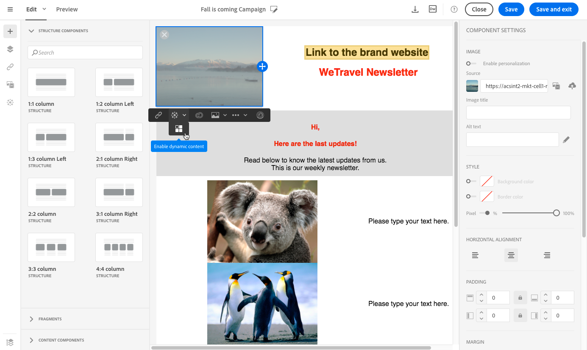

   **[!UICONTROL Dynamic content]** セクションが左側のパレットに表示されます。

   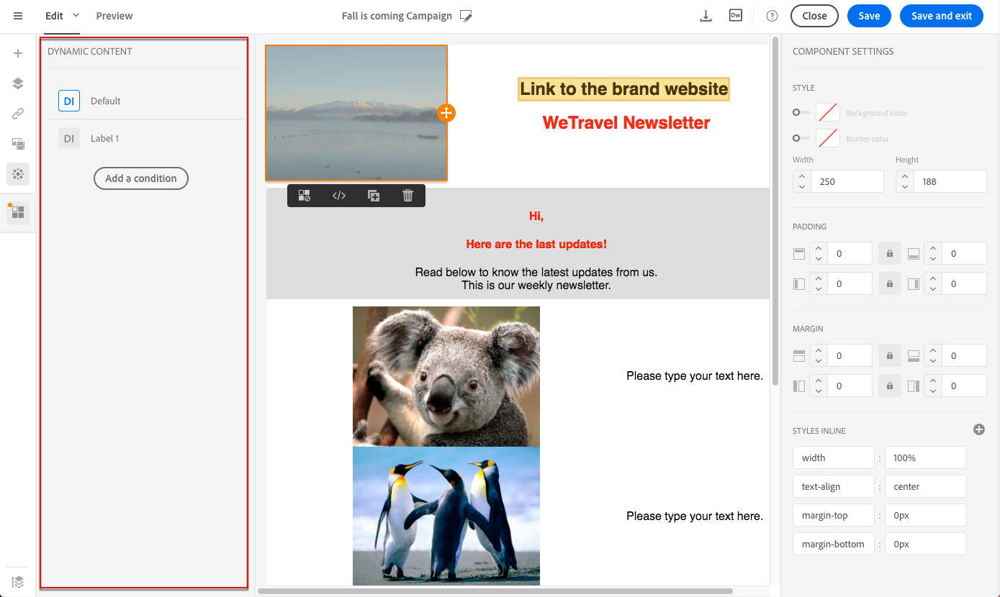

   デフォルトでは、このセクションには、デフォルトバリアントと新しいバリアントの2つの要素が含まれています。

   >[!NOTE]
   >
   >コンテンツには常にデフォルトのバリアントが必要です。 削除することはできません。

1. **[!UICONTROL Edit]** ボタンをクリックして、最初の代替バリアントの表示条件を定義します。

   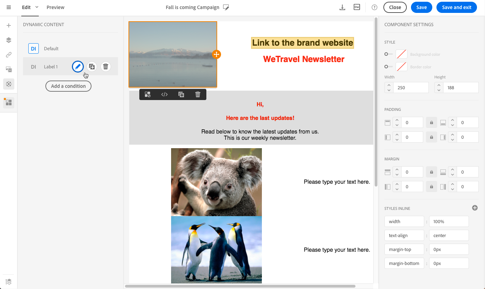

1. ラベルを指定し、条件として設定するフィールドを選択します。 例えば、**[!UICONTROL General]** ノードから、**[!UICONTROL Age]** フィールドを選択します

   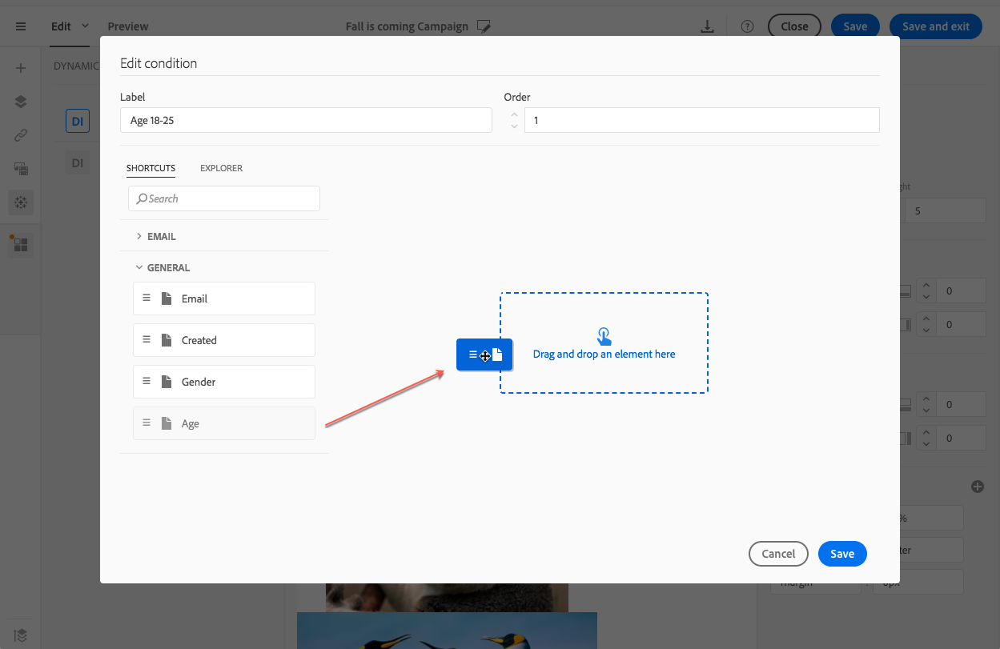

1. フィルタリング条件を設定します。 例えば、18歳から25歳までの人に別のコンテンツを表示する場合です。

   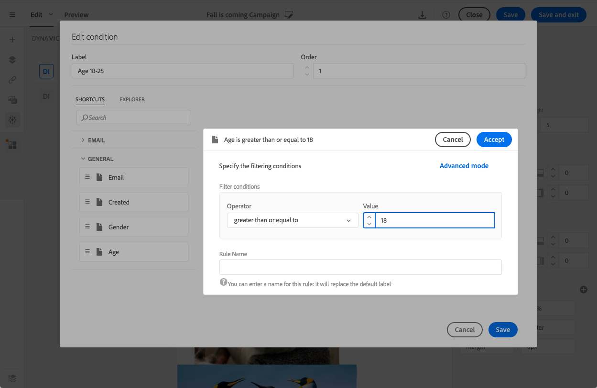

1. すべての条件が設定されたら、条件が適用される優先順位を定義し、変更を保存します。

   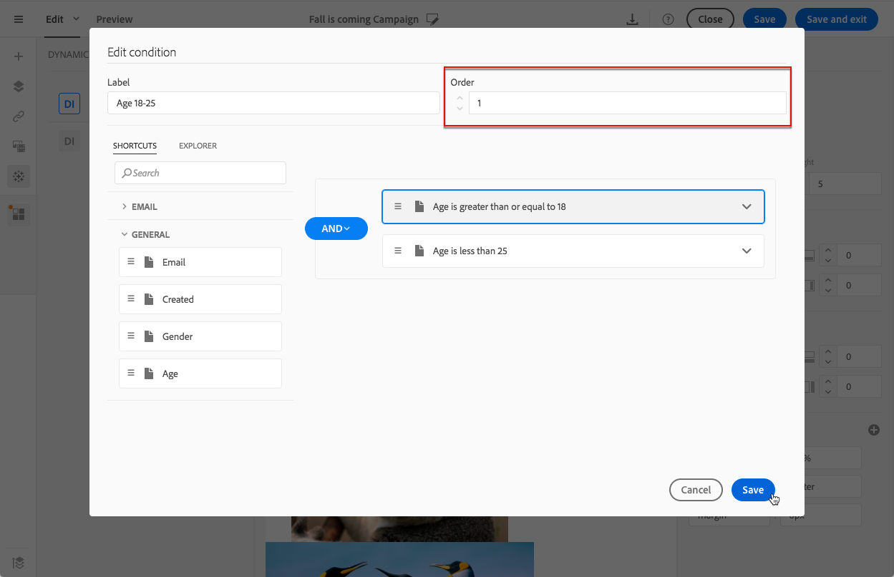

   コンテンツは、上から下の順にパレットに表示されます。 優先順位について詳しくは、[このセクション &#x200B;](#defining-dynamic-content-in-an-email)を参照してください。

1. 定義したバリエーションの新しい画像をアップロードします。

   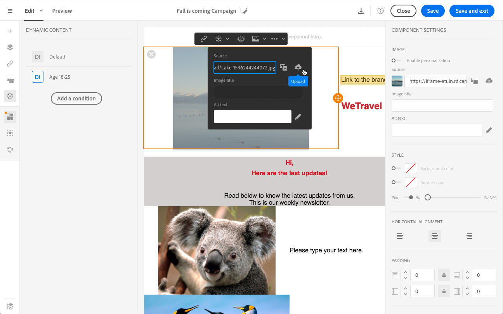

   18歳から25歳までの受信者には、新しい画像が表示されます。

   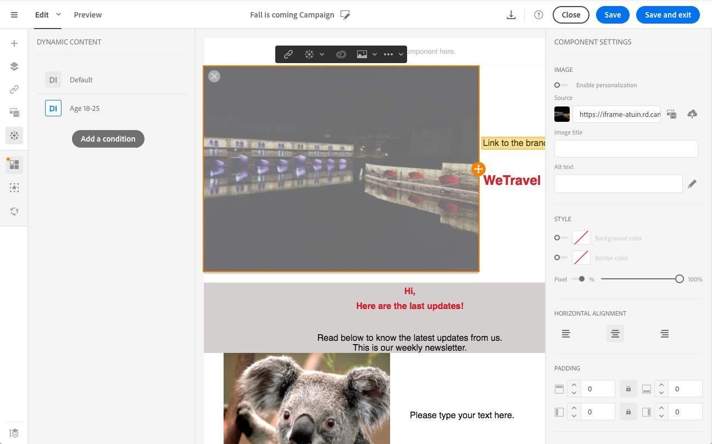

1. **[!UICONTROL Add a condition]**&#x200B;をクリックして、新しいコンテンツとそのリンクされたルールを追加します。

   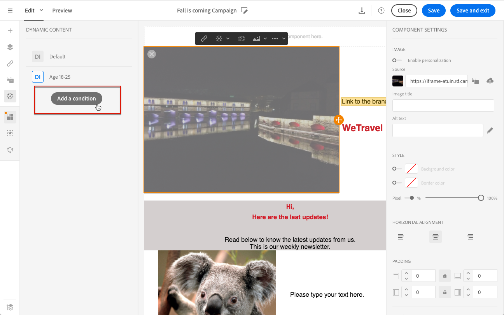

   例えば、26歳から35歳までの人に表示する別の画像を追加できます。

1. 動的に表示する電子メールの他の要素についても、同様に操作します。 テキスト、ボタン、フラグメントなどです。変更を保存します。

>[!CAUTION]
>
>メッセージを準備し、送信する前に、プルーフを使用してテストします。 これを行わない場合、一部のエラーが検出されず、メールが送信されない可能性があります。

**関連トピック：**

* [配達確認の送信](../../sending/using/sending-proofs.md)
* [高度な式の編集](../../automating/using/editing-queries.md#about-query-editor)

### 優先度 {#order-of-priority}

式エディターで動的コンテンツを定義する場合、優先度の順序は次のようになります。

1. 2つの異なる動的コンテンツを&#x200B;**2つの異なる条件**&#x200B;で定義します。例：

   **条件1:** プロファイルの性別が男性であること

   **条件2:** プロファイルは20 ～ 30歳です。

   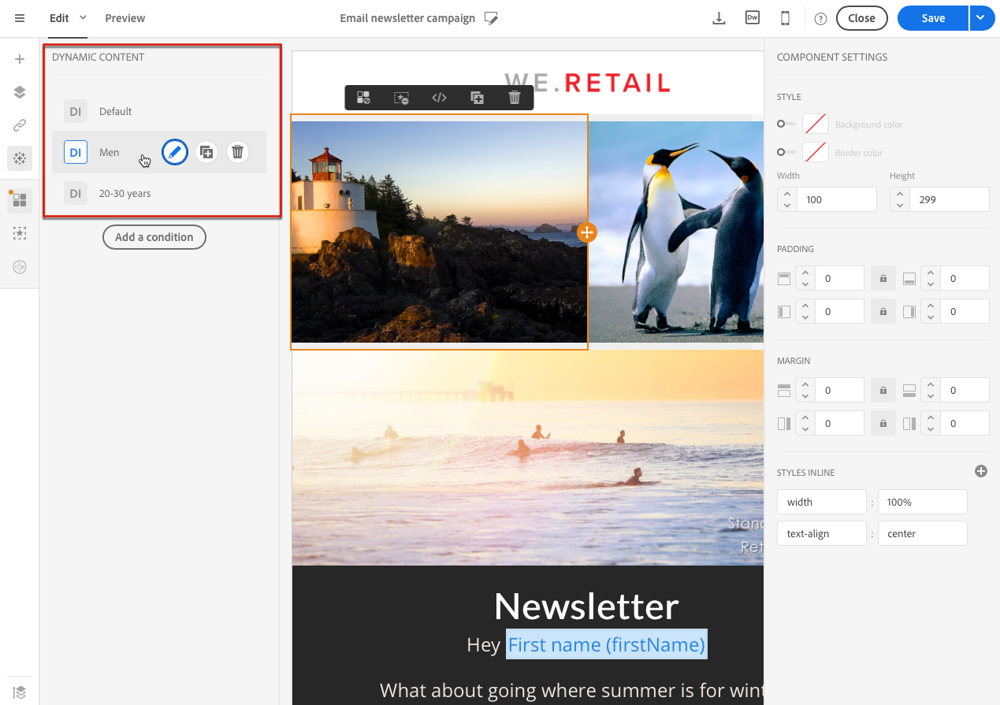

   データベース内の一部のプロファイルは2つの条件に対応していますが、1つの動的コンテンツを含む1つのメールのみを送信できます。

1. したがって、動的コンテンツの優先順位を定義する必要があります。 優先度が&#x200B;**1**&#x200B;の条件（したがって、対応する動的コンテンツ）は、優先度が&#x200B;**2**&#x200B;または&#x200B;**3**&#x200B;の別の条件がこのプロファイルで満たされている場合でも、プロファイルに送信されます。

   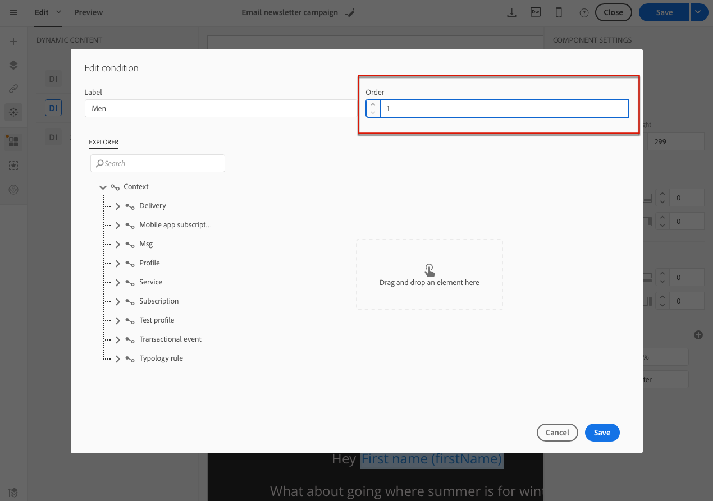

動的コンテンツごとに定義できる優先度は1つだけです。

## 例：電子メールのパーソナライゼーション{#example-email-personalization}

この例では、マーケティングサービスチームのメンバーが、一部の顧客に特別オファーがあることを知らせるメールを作成しました。 クライアントの各年齢に合わせて、メールをパーソナライズすることにしました。 18歳から27歳の顧客には、27歳以上の顧客に送る別の画像やスローガンを含むメールが届きます。

メールは次のように作成されます。

* 画像に動的コンテンツを適用し、これらの動的コンテンツを年齢範囲に応じて設定する。

  

  動的コンテンツの追加と設定について詳しくは、[電子メールでの動的コンテンツの定義](#defining-dynamic-content-in-an-email) セクションを参照してください。

* パーソナライゼーションフィールドと動的コンテンツがテキストに適用されます。 プロファイルの年齢範囲に応じて、メールはプロファイルの名、またはプロファイルのタイトルと姓のいずれかから始まります。

  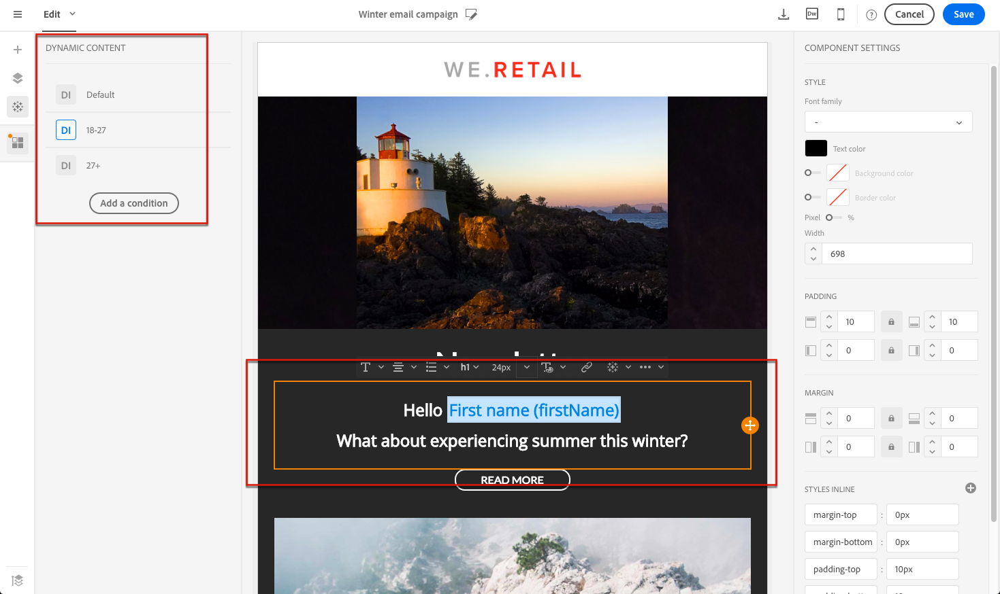

  パーソナライゼーションフィールドの追加と設定について詳しくは、[&#x200B; パーソナライゼーションフィールドの挿入](#inserting-a-personalization-field) セクションを参照してください。

### 画像の設定 {#configuring-images}

>[!CONTEXTUALHELP]
>id="ac_dynamic_image"
>title="動的画像の管理"
>abstract="定義する条件に従って、動的画像を含むメールをパーソナライズします。"

この例では、画像に適用される動的コンテンツは次のように設定されます。

**18 ～ 27歳のターゲット：**

1. **[!UICONTROL Properties]** パレットで動的コンテンツを選択し、**[!UICONTROL Edit]** ボタンをクリックします。

   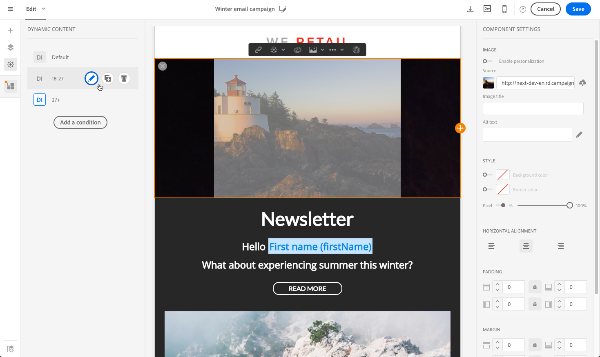

1. ラベルを編集し、**[!UICONTROL Profile]** ノードから&#x200B;**[!UICONTROL Age]** フィールドを選択します。

   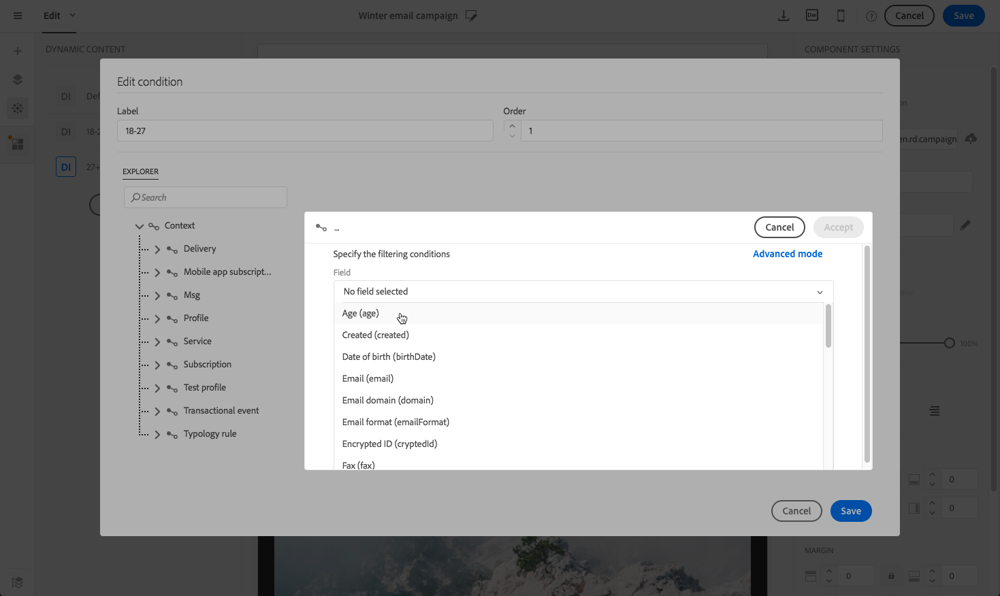

1. **以上**&#x200B;演算子を選択し、**18**&#x200B;と入力して、18 **より古い**&#x200B;式を作成します。

   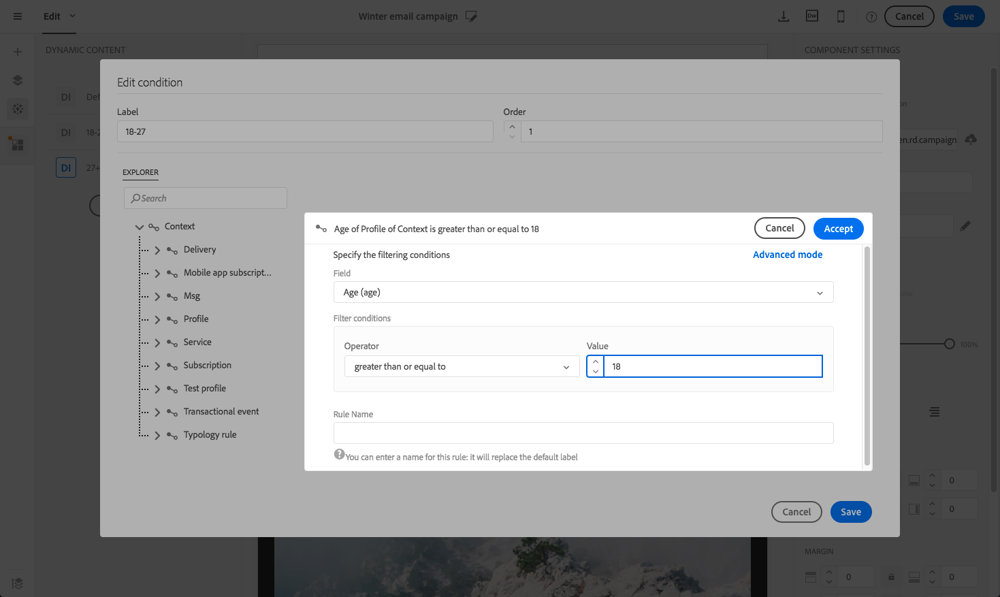

1. 新しい&#x200B;**[!UICONTROL Age]**&#x200B;条件を追加します。

   **次より小さい**&#x200B;演算子を選択し、「値」フィールドに27を続けて、**27**&#x200B;より小さい式を作成します。

   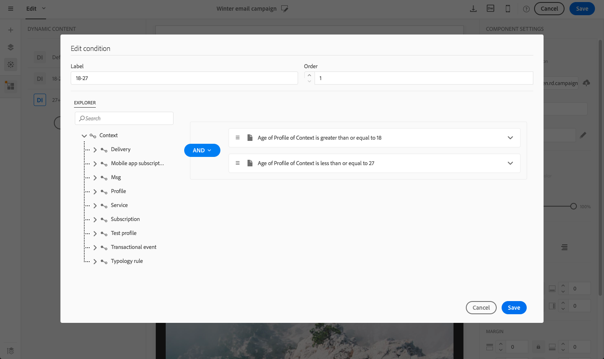

1. 変更を確認します。

**27歳以上のプロファイルをターゲットにする：**

1. パレットから動的コンテンツを選択して編集します。
1. ラベルを編集し、**[!UICONTROL Profile]** ノードから&#x200B;**[!UICONTROL Age]** フィールドを選択します。
1. 値フィールドに&#x200B;**1&rbrace;より大きい演算子の後に27を追加して、** 27 **より古い式を作成します。**

   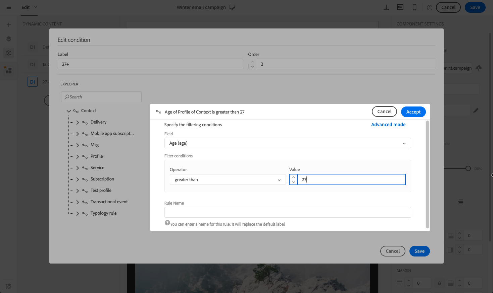

1. 変更を確認します。

動的コンテンツが正しく設定されています。

### テキストの設定 {#configuring-text}

この例では、テキストに適用される動的コンテンツは次のように設定されます。

**18 ～ 27歳のプロファイルをターゲットにする：**

1. 必要な構造コンポーネントを選択し、動的コンテンツを追加します。
1. 動的コンテンツを編集し、ターゲティング式を設定します。 [画像の設定](#configuring-images)を参照してください。
1. 構造コンポーネントで、目的の位置で、コンテキストツールバーの&#x200B;**[!UICONTROL Personalize]** アイコンをクリックし、**[!UICONTROL Insert personalization field]**&#x200B;を選択します。

   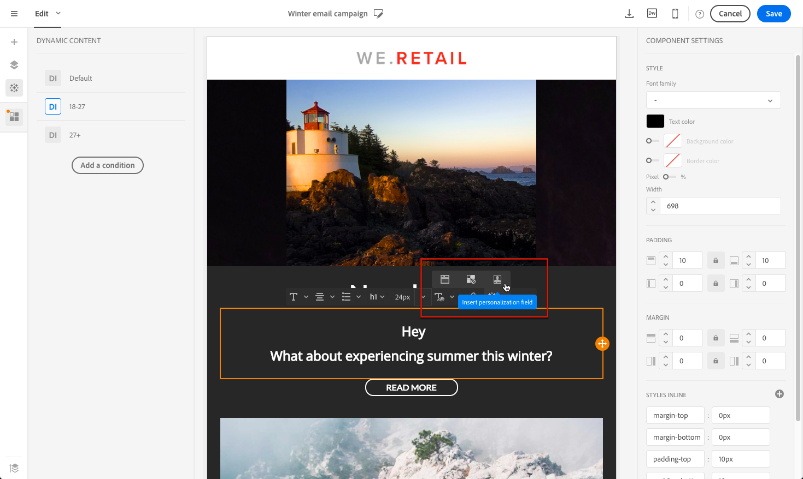

1. 表示されるリストで、**[!UICONTROL First name]** フィールドを選択して確認します。

   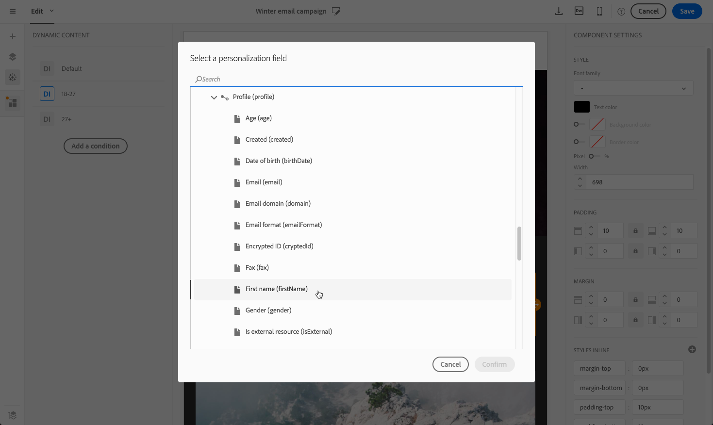

1. パーソナライゼーションフィールドは、選択した動的コンテンツに完全に挿入されます。

**27歳以上のプロファイルをターゲットにする：**

1. 必要な構造コンポーネントを選択し、動的コンテンツを追加します。
1. 動的コンテンツを編集し、ターゲティング式を設定します。 [画像の設定](#configuring-images)を参照してください。
1. 構造コンポーネントで、目的の位置で、コンテキストツールバーの&#x200B;**[!UICONTROL Personalize]** アイコンをクリックし、**[!UICONTROL Insert personalization field]**&#x200B;を選択します。
1. ドロップダウンリストから「**[!UICONTROL Title]**」を選択します。
1. 同様に、**[!UICONTROL Last name]** フィールドを追加します。

   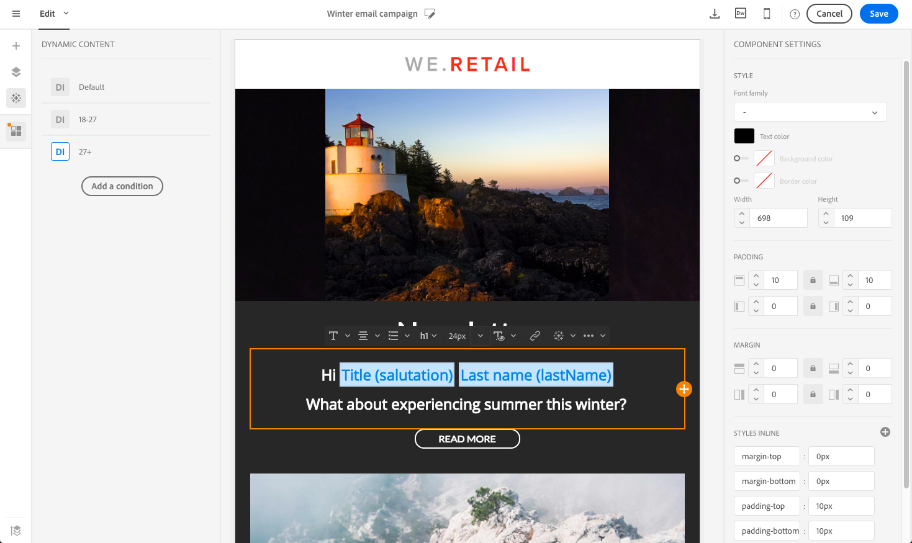

パーソナライゼーションフィールドを、選択した動的コンテンツに完全に挿入する必要があります。

### メールのプレビュー {#previewing-emails}

プレビューを使用すると、**[!UICONTROL Proofs]**&#x200B;を送信する前に、パーソナライゼーションフィールドと動的コンテンツが正しく設定されていることを確認できます。 プレビューでは、メールターゲットに対応する別のテストプロファイルを選択できます。

テストプロファイルを使用しない場合、デフォルトで表示されるメールは次のとおりです。

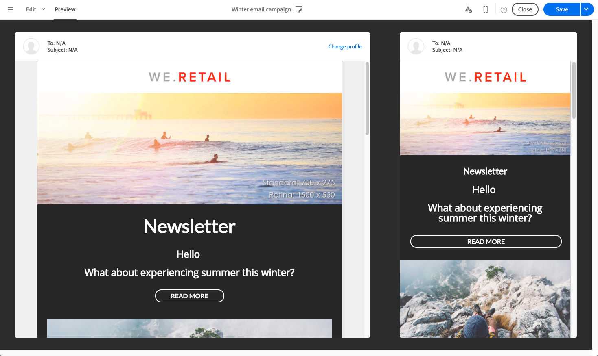

メールにはスローガンにパーソナライゼーションフィールドがなく、デフォルトの画像が使用されます。

最初のテストプロファイルは、18歳から27歳のクライアントに対応します。 このプロファイルを選択すると、次のメールが表示されます。

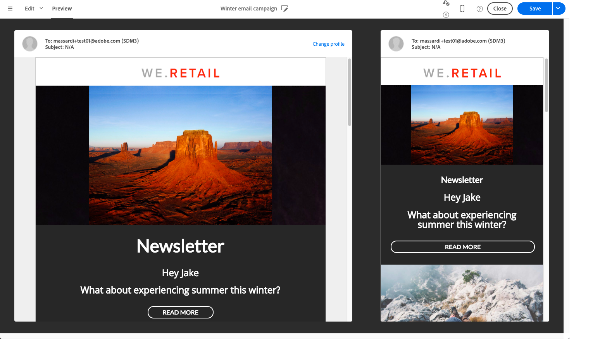

18 ～ 27歳の式、特にプロファイルの名前に対応するパーソナライゼーションフィールドが正しく設定され、プロファイルに応じて画像も変更されました。

2つ目のプロファイルは27歳以上の顧客に対応し、次のメールを生成します。

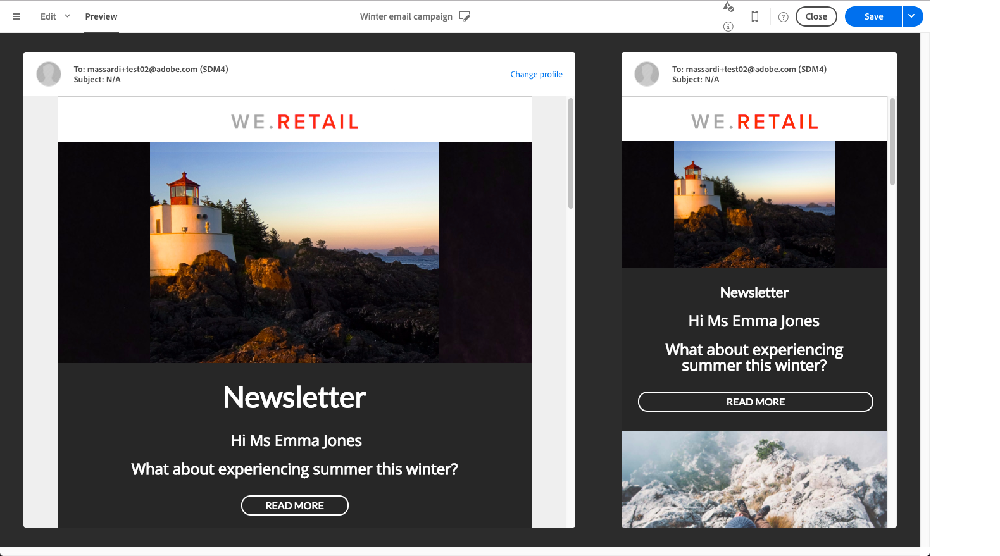

動的なコンテンツのおかげでイメージが変化し、表示されるスローガンは、このターゲット層に対して定義されたより正式なスローガンです。

**関連トピック：**

* [オーディエンスの作成](../../audiences/using/creating-audiences.md)
* [送信の準備](../../sending/using/preparing-the-send.md)
