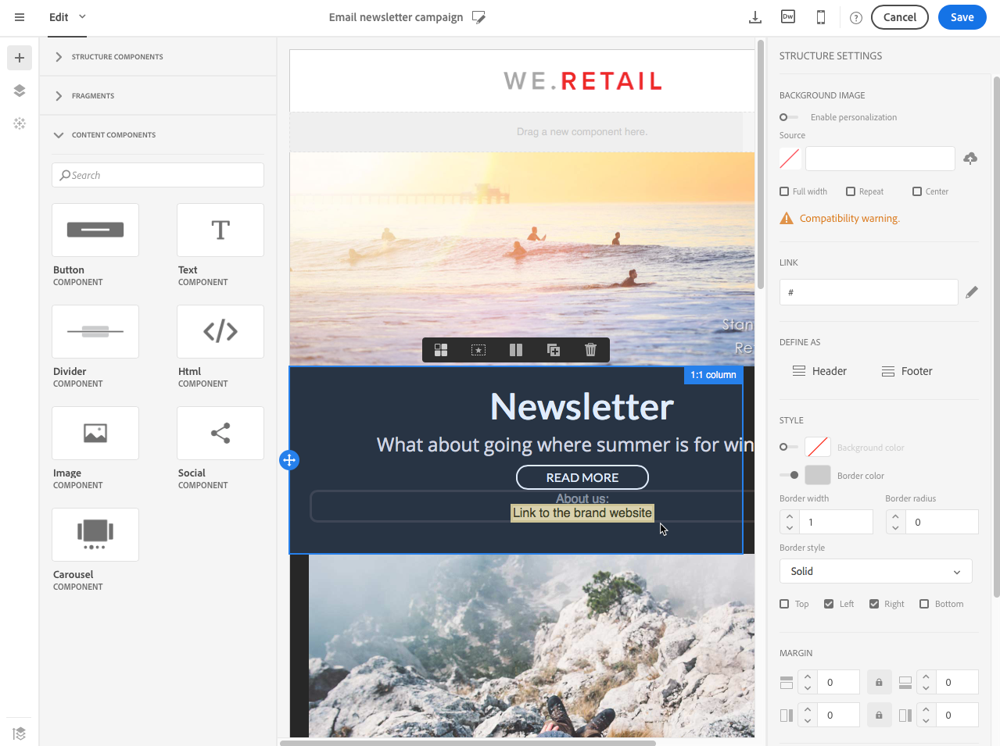
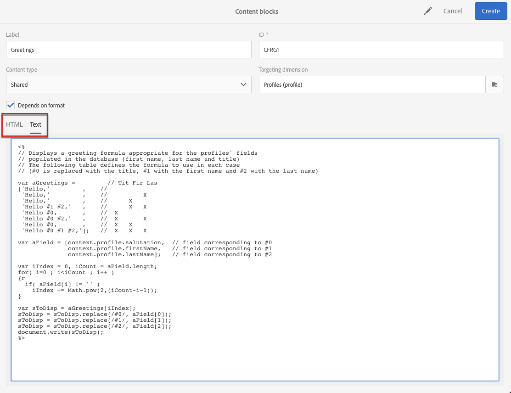
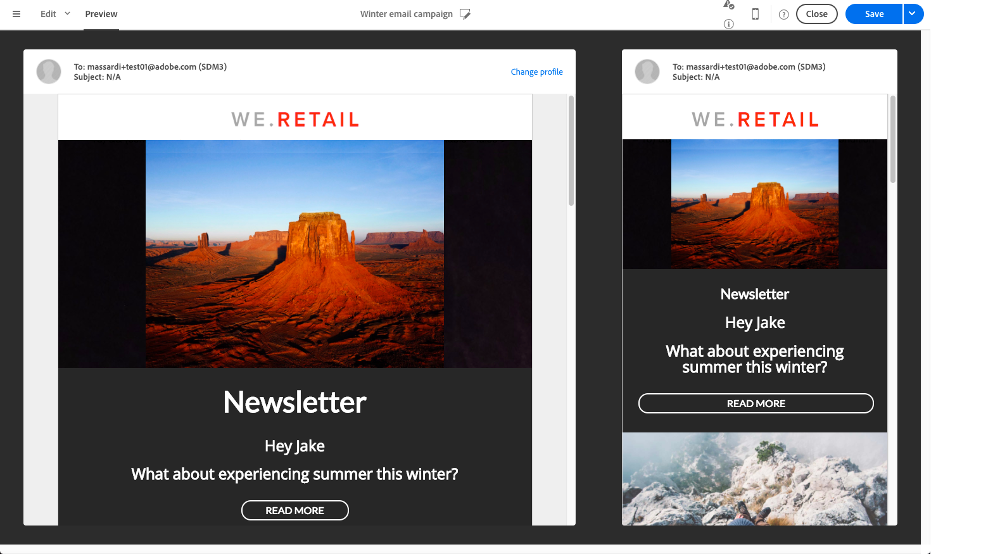

# メールコンテンツのパーソナライズ {#personalization}

Adobe Campaignが配信するメッセージの内容や表示は、様々な方法でパーソナライズできます。 これらの方法は、プロファイルに応じた条件に従って組み合わせることができます。 Adobe Campaign には、全体として次のようなパーソナライゼーション機能が備わっています。

* 動的パーソナライゼーションフィールドの挿入[パーソナライゼーションフィールドの挿入](#inserting-a-personalization-field)を参照してください。
* 定義済みパーソナライゼーションブロックの挿入：[コンテンツブロックの追加](#adding-a-content-block)を参照してください。
* メールの送信者をパーソナライズします。 [ 送信者のパーソナライズ ](#personalizing-the-sender) を参照してください。
* メールの件名をパーソナライズします。 [ メールの件名のパーソナライズ ](../../designing/using/subject-line.md#subject-line) を参照してください。
* 条件付きコンテンツの作成[ メールの動的コンテンツの定義 ](#defining-dynamic-content-in-an-email) を参照してください。

## 送信者のパーソナライズ {#personalizing-the-sender}

送信されるメッセージのヘッダーに表示される送信者名を定義するには、メールDesignerのホームページの「**[!UICONTROL Properties]**」タブ（「ホーム」アイコンからアクセスできます）に移動します。 詳しくは、[ メールの送信者の定義 ](../../designing/using/subject-line.md#email-sender) を参照してください。

送信者名を変更するには、「送信者名 **ブロックをクリックし** す。 その後、フィールドが編集可能になり、使用する名前を入力できます。

このフィールドはパーソナライズできます。 これを行うには、送信者名の下にあるアイコンをクリックして、パーソナライゼーションフィールド、コンテンツブロック、動的コンテンツを追加します。

>[!NOTE]
>
>ヘッダーパラメーターの値は省略できません。メールの送信を許可するには、送信者のアドレスが必須です（RFC 標準）。 入力したメールアドレスの形式はチェックされます。

## URL のパーソナライズ {#personalizing-urls}

Adobe Campaignでは、パーソナライゼーションフィールド、コンテンツブロック、動的コンテンツを追加して、メッセージに含まれる 1 つまたは複数の URL をパーソナライズできます。 手順は次のとおりです。

1. 外部 URL を挿入し、そのパラメーターを指定します。 [ リンクの挿入 ](../../designing/using/links.md#inserting-a-link) を参照してください。
1. 表示されない場合は、設定ペインで選択した URL の横にある鉛筆をクリックして、パーソナライゼーションオプションにアクセスします。
1. 使用するパーソナライゼーションフィールド、コンテンツブロック、動的コンテンツを追加します。

   

1. 変更内容を保存します。

>[!NOTE]
>
>トラッキングリンクの URL 署名メカニズムが無効な場合、パーソナライズ URL はドメイン名にも URL 拡張子にも適用できません。 パーソナライゼーションが正しくない場合は、メッセージ分析中にエラーメッセージが表示されます。
>
>コンテンツブロックを選択する場合、「**ミラーページにリンク** などの要素を選択することはできません。 このタイプのブロックは、リンク内では禁止されています。

## パーソナライゼーションフィールドの挿入{#inserting-a-personalization-field}

Adobe Campaignでは、データベースのフィールドをページに挿入できます（プロファイルの名など）。

>[!NOTE]
>
>以下の画像は、メールに [ メールDesigner](../../designing/using/designing-content-in-adobe-campaign.md) を使用してパーソナライゼーションフィールドを挿入する方法を示しています。

パーソナライゼーションフィールドをコンテンツに追加するには：

1. テキストブロック内をクリックし、コンテキストツールバーの **[!UICONTROL Personalize]** アイコンをクリックして、「**[!UICONTROL Insert personalization field]**」を選択します。 メールDesignerのインターフェイスについて詳しくは、[ この節 ](../../designing/using/designing-content-in-adobe-campaign.md#email-designer-interface) を参照してください。

   

1. ページコンテンツに挿入するフィールドを選択します。

   

1. 「**[!UICONTROL Confirm]**」をクリックします。

エディターにフィールド名が表示され、ハイライト表示されます。

パーソナライゼーションが生成されると（メールのプレビューと準備など）、このフィールドは、ターゲットプロファイルに対応する値に置き換えられます。

>[!NOTE]
>
>メールをワークフローから作成した場合は、ワークフローで計算された追加データをパーソナライゼーションフィールドでも使用できます。 ワークフローからの追加データの追加について詳しくは、[ データのエンリッチメント ](../../automating/using/about-targeting-activities.md#enriching-data) の節を参照してください。

## コンテンツブロックの追加 {#adding-a-content-block}

Adobe Campaign は、事前設定済みのコンテンツブロックのリストを提供します。これらのコンテンツブロックは動的で、パーソナライズされており、特定のレンダリングが可能です。 例えば、挨拶やリンクをミラーページに追加できます。

>[!NOTE]
>
>以下の画像は、メールに [ メールDesigner](../../designing/using/designing-content-in-adobe-campaign.md) を使用してコンテンツブロックを挿入する方法を示しています。

コンテンツブロックを追加するには：

1. テキストブロック内をクリックし、コンテキストツールバーの **[!UICONTROL Personalize]** アイコンをクリックして、「**[!UICONTROL Insert content block]**」を選択します。 メールDesignerのインターフェイスについて詳しくは、[ この節 ](../../designing/using/designing-content-in-adobe-campaign.md#email-designer-interface) を参照してください。

   

1. 挿入するコンテンツブロックを選択します。 使用できるブロックは、コンテキスト（メールまたはランディングページ）によって異なります。

   

1. 「**[!UICONTROL Save]**」をクリックします。

エディターにコンテンツブロックの名前が表示され、黄色でハイライト表示されます。 パーソナライゼーションが生成されると、プロファイルに自動的に適応します。

標準のコンテンツブロックを次に示します。

* **[!UICONTROL Database URL in emails (EmailUrlBase)]**：このコンテンツブロックは、**配信** でのみ使用できます。
* **[!UICONTROL Mirror page URL (MirrorPageUrl)]**：このコンテンツブロックは、**配信** でのみ使用できます。
* **[!UICONTROL Link to mirror page (MirrorPage)]**：このコンテンツブロックは、**配信** でのみ使用できます。
* **[!UICONTROL Greetings (Greetings)]**
* **[!UICONTROL Unsubscription link (UnsubscriptionLink)]**：このコンテンツブロックは、**配信** でのみ使用できます。
* **[!UICONTROL Social network sharing links (LandingPageViralLinks)]**：このコンテンツブロックは、**ランディングページ** でのみ使用できます。
* **[!UICONTROL Default sender name (DefaultSenderName)]**：このコンテンツブロックは、**配信** でのみ使用できます。
* **[!UICONTROL Name of default reply-to email address (DefaultReplyName)]**：このコンテンツブロックは、**配信** でのみ使用できます。
* **[!UICONTROL Email address of default sender (DefaultSenderAddress)]**：このコンテンツブロックは、**配信** でのみ使用できます。
* **[!UICONTROL Default error email address (DefaultErrorAddress)]**：このコンテンツブロックは、**配信** でのみ使用できます。
* **[!UICONTROL Default reply-to email address (DefaultReplyAddress)]**：このコンテンツブロックは、**配信** でのみ使用できます。
* **[!UICONTROL Brand name (BrandingUsualName)]**
* **[!UICONTROL Link to the brand website (BrandingWebSiteLink)]**
* **[!UICONTROL Brand logo (BrandingLogo)]**
* **[!UICONTROL Notification style (notificationStyle)]**

### カスタムコンテンツブロックの作成 {#creating-custom-content-blocks}

メッセージまたはランディングページに挿入する新しいコンテンツブロックを定義できます。

コンテンツブロックを作成するには、次の手順に従います。

1. 詳細メニューの「**[!UICONTROL Resources > Content blocks]**」をクリックして、コンテンツブロックのリストにアクセスします。
1. 「**[!UICONTROL Create]**」ボタンをクリックするか、既存のコンテンツブロックを複製します。

   

1. ラベルを入力します。
1. ブロックの **[!UICONTROL Content type]** を選択します。 次の 3 つのオプションを使用できます。

   * **[!UICONTROL Shared]**：コンテンツブロックは、配信またはランディングページで使用できます。
   * **[!UICONTROL Delivery]**：コンテンツブロックは、配信でのみ使用できます。
   * **[!UICONTROL Landing page]**：コンテンツブロックは、ランディングページでのみ使用できます。

   

1. **[!UICONTROL Targeting dimension]** を選択できます。 詳しくは、[ ターゲティングディメンションについて ](#about-targeting-dimension) を参照してください。

   

1. 「**[!UICONTROL Depends on format]**」オプションを選択して、HTML メール用とテキスト形式のメール用の 2 つの異なるブロックを定義できます。 2 つのタブ（HTMLとテキスト）がエディターに表示され、対応するコンテンツを定義します。

   

1. コンテンツブロックの内容を入力し、「**[!UICONTROL Create]**」ボタンをクリックします。

コンテンツブロックを、メッセージまたはランディングページのコンテンツエディターで使用できるようになりました。

>[!CAUTION]
>
>ブロックの内容を編集する場合は、*if* ステートメントの先頭と末尾に余分な空白がないことを確認します。 HTMLでは、空白は画面上に表示されるため、コンテンツのレイアウトに影響を与えます。

### ターゲティングディメンションについて {#about-targeting-dimension}

ターゲティングディメンションを使用すると、コンテンツブロックを使用できるメッセージのタイプを定義できます。 これは、メッセージ内で不適切なブロックを使用して、エラーが発生するのを防ぐためです。

実際、メッセージを編集する場合に選択できるのは、そのメッセージのターゲティングディメンションと互換性のあるターゲティングディメンションを持つコンテンツブロックのみです。

例えば、**[!UICONTROL Unsubscription link]** ブロックは、**[!UICONTROL Profiles]** リソースに固有のパーソナライゼーションフィールドを含んでいるので、ターゲティングディメンションは **[!UICONTROL Profiles]** になります。 したがって、[ イベントトランザクションメッセージ ](../../channels/using/getting-started-with-transactional-msg.md#transactional-message-types) では **[!UICONTROL Unsubscription link]** ブロックを使用できません。これは、そのタイプのメッセージのターゲティングディメンションが **[!UICONTROL Real-time events]** であるためです。 ただし、そのタイプのメッセージのターゲティングディメンションは **プロファイル** なので、[ プロファイルトランザクションメッセージ ](../../channels/using/getting-started-with-transactional-msg.md#transactional-message-types) 内で **購読解除リンク** ブロックを使用できます。 最後に、**[!UICONTROL Link to mirror page]** ブロックにはターゲティングディメンションがないので、任意のメッセージで使用できます。

このフィールドを空のままにすると、ターゲティングディメンションに関係なく、コンテンツブロックはすべてのメッセージと互換性を持ちます。 ターゲティングディメンションを設定した場合、そのブロックは、同じターゲティングディメンションを持つメッセージとのみ互換性があります。

詳しくは、[ターゲティングディメンションとリソース](../../automating/using/query.md#targeting-dimensions-and-resources)を参照してください。

**関連トピック：**

* [パーソナライゼーションフィールドの挿入](#inserting-a-personalization-field)
* [コンテンツブロックの追加](#adding-a-content-block)
* [メールでの動的コンテンツの定義](#defining-dynamic-content-in-an-email)

## 画像ソースのパーソナライズ{#personalizing-an-image-source}

Adobe Campaignでは、特定の条件に従ってメッセージ内の 1 つまたは複数の画像をパーソナライズしたり、トラッキングを使用したりできます。 これを行うには、パーソナライゼーションフィールド、コンテンツブロック、動的コンテンツを画像ソースに挿入します。 手順は次のとおりです。

1. メッセージのコンテンツに画像を挿入するか、既に存在する画像を選択します。
1. 画像のプロパティパレットで、「**[!UICONTROL Enable personalization]**」オプションをオンにします。

   

   **[!UICONTROL Source]** フィールドが表示され、選択した画像がエディターに **パーソナライズ** されて表示されます。

1. パーソナライゼーションオプションにアクセスするには、**[!UICONTROL Source]** のフィールド ボタンの横にある鉛筆をクリックします。
1. 画像ソースを追加したら、パーソナライゼーションフィールド、コンテンツブロック、動的コンテンツを追加します。

   

   >[!NOTE]
   >
   >ドメイン名（http://mydomain.com）をパーソナライズできません。手動で入力する必要があります。 URL の残りの部分はパーソナライズできます。 例：http://mydomain.com/ `[Gender]` .jpg

1. 変更を確認します。

## 条件付きコンテンツ {#conditional-content}

### 表示条件の定義{#defining-a-visibility-condition}

表示条件は、任意の要素に対して指定できます。 条件が考慮される場合にのみ表示されます。

表示条件を追加するには、ブロックを選択し、その設定の **[!UICONTROL Visibility condition]** フィールドに考慮する条件を入力します。

このオプションは、ADDRESS、BLOCKQUOTE、CENTER、DIR、DIV、DL、FIELDSET、FORM、H1、H2、H3、H4、H5、H6、NOSCRIPT、OL、P、PRE、UL、TR、TD 要素でのみ使用できます。

式エディターは、「高度な式編集 [ セクションに表示さ ](../../automating/using/editing-queries.md#about-query-editor) ます。

これらの条件は、XTK 式構文（例：**context.profile.email !=&quot;** または **context.profile.status=&#39;0&#39;**）。 デフォルトでは、すべてのファイルが表示されます。

>[!NOTE]
>
>動的コンテンツを含むサブ要素が既に含まれているブロック、または動的コンテンツを既に構成しているブロックには、条件を定義できません。 ドロップダウン リストなど、非表示のダイナミック ブロックは編集できません。

### メールでの動的コンテンツの定義{#defining-dynamic-content-in-an-email}

>[!CONTEXTUALHELP]
>id="ac_dynamic_content"
>title="動的コンテンツの定義"
>abstract="定義する条件に従ってのみ、一部のプロファイルに表示される様々なコンテンツを定義します。"

メールには、式エディターで定義した条件に従って受信者に動的に表示される様々なコンテンツを定義できます。 例えば、同じメールから、各プロファイルが年齢層に応じて異なるメッセージを確実に受け取るようにできます。

動的コンテンツの定義は、[ 表示条件の定義 ](#defining-a-visibility-condition) とは異なります。

1. フラグメント、コンポーネントまたは要素を選択します。 この例では、画像を選択します。
1. コンテキストツールバーの「**[!UICONTROL Dynamic content]**」アイコンをクリックします。

   

   左側のパレットに「**[!UICONTROL Dynamic content]**」セクションが表示されます。

   

   既定では、このセクションには、既定のバリアントと新しいバリアントの 2 つの要素が含まれています。

   >[!NOTE]
   >
   >コンテンツには、常にデフォルトのバリアントが必要です。 削除することはできません。

1. 「**[!UICONTROL Edit]**」ボタンをクリックして、最初の代替バリアントの表示条件を定義します。

   

1. ラベルを指定し、条件として設定するフィールドを選択します。 例えば、**[!UICONTROL General]** ノードから、**[!UICONTROL Age]** フィールドを選択します

   

1. フィルター条件を設定します。 例えば、18～25 歳のユーザーに別のコンテンツを表示するとします。

   

1. すべての条件を設定したら、条件が適用される優先順位を定義し、変更を保存します。

   

   コンテンツは、優先順位の高い順（上から下へ）にパレットに表示されます。 優先度の詳細については、[ この節 ](#defining-dynamic-content-in-an-email) を参照してください。

1. 定義したバリアントの新しい画像をアップロードします。

   

   18～25 歳の受信者には、新しい画像が表示されます。

   

1. 「**[!UICONTROL Add a condition]**」をクリックすると、新しいコンテンツとリンクされたルールが追加されます。

   

   例えば、26～35 歳のユーザーに表示する別の画像を追加できます。

1. 動的に表示するメールのその他の要素についても、同様に手順を進めます。 テキスト、ボタン、フラグメントなどを指定できます。 変更内容を保存します。

>[!CAUTION]
>
>メッセージの準備が整ったら、送信する前に、配達確認を使用してテストします。 これを行わないと、一部のエラーが検出されず、メールが送信されない場合があります。

**関連トピック：**

* [配達確認の送信](../../sending/using/sending-proofs.md)
* [高度な式の編集](../../automating/using/editing-queries.md#about-query-editor)

### 優先順位 {#order-of-priority}

式エディターで動的コンテンツを定義する場合、優先度は次のようになります。

1. 例えば、次のような 2 つの異なる動的コンテンツを **2 つの異なる条件** で定義します。

   **条件 1:** プロフィールの性別が男性である。

   **条件 2:** プロファイルは 20～30 歳です。

   

   データベース内の一部のプロファイルは 2 つの条件に対応していますが、送信できる動的コンテンツは 1 つのメールのみです。

1. したがって、動的コンテンツの優先度を定義する必要があります。 優先順位が **1** の条件（したがって対応する動的コンテンツ）は、優先順位が **2** または **3** である別の条件もこのプロファイルが満たされる場合でも、プロファイルに送信されます。

   

動的コンテンツごとに 1 つの優先度のみを定義できます。

## 例：電子メールのパーソナライゼーション{#example-email-personalization}

この例では、マーケティングサービスチームのメンバーが、顧客向けの特別なオファーがあることを一部の顧客に通知するメールを作成しました。 チームメンバーは、クライアントの年齢に応じてメールをパーソナライズすることにしました。 18 歳から 27 歳の顧客には、27 歳を超える顧客には、異なる画像とスローガンを含むメールが届きます。

メールは次のように作成されます。

* 画像には動的コンテンツが適用され、これらの動的コンテンツは年齢範囲に応じて構成される。

  

  動的コンテンツの追加と設定について詳しくは、[ メールでの動的コンテンツの定義 ](#defining-dynamic-content-in-an-email) の節を参照してください。

* パーソナライゼーションフィールドと動的コンテンツがテキストに適用されます。 プロファイルの年齢の範囲に応じて、メールはプロファイルの名またはプロファイルのタイトルと姓で始まります。

  

  パーソナライゼーションフィールドの追加と設定について詳しくは、[ パーソナライゼーションフィールドの挿入 ](#inserting-a-personalization-field) の節を参照してください。

### 画像の設定 {#configuring-images}

>[!CONTEXTUALHELP]
>id="ac_dynamic_image"
>title="動的画像の管理"
>abstract="定義する条件に従って、動的画像を含むメールをパーソナライズします。"

この例では、画像に適用される動的コンテンツは次のように設定されます。

**18～27 歳をターゲットにする：**

1. **[!UICONTROL Properties]** パレットで動的コンテンツを選択し、「**[!UICONTROL Edit]**」ボタンをクリックします。

   

1. ラベルを編集し、**[!UICONTROL Profile]** ノードから **[!UICONTROL Age]** フィールドを選択します。

   

1. **次よりも大きいまたは等しい** 演算子を選択し、「**18**」と入力して **18 より古い** 式を作成します。

   

1. 新しい **[!UICONTROL Age]** 条件を追加します。

   値フィールドで **次よりも小さいか等しい** 演算子に続いて 27 を選択し、**27 より若い** 式を作成します。

   

1. 変更を確認します。

**27 歳以上のプロファイルをターゲットにするには：**

1. パレットから動的コンテンツを選択して編集します。
1. ラベルを編集し、**[!UICONTROL Profile]** ノードから **[!UICONTROL Age]** フィールドを選択します。
1. **次より大きい** 演算子を追加し、値フィールドに 27 を続けて **27 より古い** 式を作成します。

   

1. 変更を確認します。

動的コンテンツが正しく設定されている。

### テキストの設定 {#configuring-text}

この例では、テキストに適用される動的コンテンツを次のように設定します。

**18～27 歳のプロファイルをターゲットにするには：**

1. 必要な構造コンポーネントを選択し、動的コンテンツを追加します。
1. 動的コンテンツを編集し、ターゲティング式を設定します。 [ 画像の設定 ](#configuring-images) を参照してください。
1. 構造コンポーネントの目的の位置で、コンテキストツールバーの「**[!UICONTROL Personalize]**」アイコンをクリックして「**[!UICONTROL Insert personalization field]**」を選択します。

   

1. 表示されるリストで、「**[!UICONTROL First name]**」フィールドを選択し、確定します。

   

1. パーソナライゼーションフィールドは、選択した動的コンテンツに完全に挿入されます。

**27 歳以上のプロファイルをターゲットにするには：**

1. 必要な構造コンポーネントを選択し、動的コンテンツを追加します。
1. 動的コンテンツを編集し、ターゲティング式を設定します。 [ 画像の設定 ](#configuring-images) を参照してください。
1. 構造コンポーネントの目的の位置で、コンテキストツールバーの「**[!UICONTROL Personalize]**」アイコンをクリックして「**[!UICONTROL Insert personalization field]**」を選択します。
1. ドロップダウンリストから「**[!UICONTROL Title]**」を選択します。
1. 同じように進めて、「**[!UICONTROL Last name]**」フィールドを追加します。

   

これで、パーソナライゼーションフィールドが、選択した動的コンテンツに完全に挿入されます。

### メールのプレビュー {#previewing-emails}

プレビューを使用すると、パーソナライゼーションフィールドと動的コンテンツが正しく設定されていることを、**[!UICONTROL Proofs]** 信を送信する前に確認できます。 プレビュー中に、メールのターゲットに対応する別のテストプロファイルを選択できます。

テストプロファイルを使用しない場合、デフォルトで表示されるメールは次のとおりです。

メールのスローガンにパーソナライゼーションフィールドが含まれておらず、デフォルトの画像が使用されている。

最初のテストプロファイルは、18～27 歳のクライアントに対応しています。 このプロファイルを選択すると、次のメールが表示されます。

18 ～ 27 歳の式、特にプロファイルの名に対応するパーソナライゼーションフィールドが正しく設定され、プロファイルに従って画像も変更されました。

2 つ目のプロファイルは、27 歳以上のクライアントに対応し、次のメールを生成します。

画像は動的コンテンツによって変更されており、表示されるスローガンは、このターゲットの一般向けに定義されたより正式なスローガンです。

**関連トピック：**

* [オーディエンスの作成](../../audiences/using/creating-audiences.md)
* [送信の準備](../../sending/using/preparing-the-send.md)
