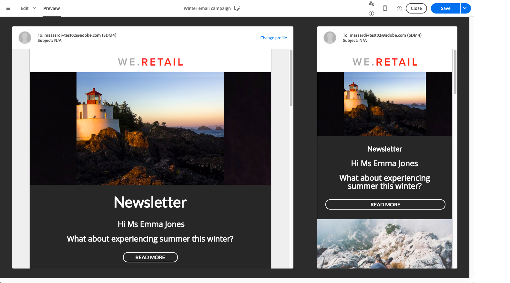

# 電子メールコンテンツのパーソナライズ {#personalization}

メッセージによって配信される内容とAdobe Campaignの表示は、様々な方法でパーソナライズできます。 これらの方法は、条件に応じて組み合わせることができます。プロファイルによって、 Adobe Campaign には、全体として次のようなパーソナライゼーション機能が備わっています。

* パーソナライゼーションフィールドの動的な挿入：See [Inserting a personalization field](#inserting-a-personalization-field).
* 定義済みパーソナライゼーションブロックの挿入：詳しくは、コ [ンテンツブロックの追加を参照してくださ](#adding-a-content-block)い。
* 電子メールの送信者をパーソナライズします。 詳しくは、送 [信者の個人設定を参照してくださ](#personalizing-the-sender)い。
* 電子メールの件名をパーソナライズします。 See [Personalizing the subject line of an email](../../designing/using/subject-line.md#subject-line).
* 条件付きコンテンツの作成：詳しくは、電 [子メール内の動的コンテンツの定義を参照してくださ](#defining-dynamic-content-in-an-email)い。

## 送信者の個人設定 {#personalizing-the-sender}

送信するメッセージのヘッダーに表示される送信者の名前を定義するには、電子メールデザイナーホームページのタブに移動します( **[!UICONTROL Properties]** ホームアイコンからアクセスできます)。 詳しくは、「電子メールの送 [信者の定義」を参照してください](../../designing/using/subject-line.md#email-sender)。

送信者名は、[送信者名]ブロックをクリックし **て変更できます** 。 フィールドが編集可能になり、使用する名前を入力できます。

このフィールドはパーソナライズできます。 これを行うには、送信者名の下のパーソナライゼーションフィールドをクリックして、アイコン、コンテンツブロック、動的コンテンツを追加します。

>[!NOTE]
>
>ヘッダーパラメーターの値は省略できません。送信者のアドレスは、E メールを送信するための必須情報です（RFC 標準規格）。入力した E メールアドレスの形式はチェックされます。

## URLのパーソナライズ{#personalizing-urls}

Adobe Campaignを使用すると、メッセージ、コンテンツブロックまたは動的コンテンツをメッセージに追加して、1つまたは複数のURLをパーソナライズできます。 手順は次のとおりです。

1. 外部URLを挿入し、そのパラメーターを指定します。 See [Inserting a link](../../designing/using/links.md#inserting-a-link).
1. 表示されない場合は、設定パネルで選択したURLの横にある鉛筆をクリックして、パーソナライゼーションオプションにアクセスします。
1. 使追加用するパーソナライゼーションフィールド、コンテンツブロック、動的コンテンツ。

   

1. 変更を保存します。

>[!NOTE]
>
>パーソナライズするURLは、ドメイン名やURL拡張子に適用できません。 パーソナライゼーションが正しくない場合、メッセージ分析中にエラーメッセージが表示されます。 コンテンツブロックを選択する場合、「要素にリンク」などの要素を選択するこ **とはできません**。 このタイプのブロックは、リンク内では禁止されています。

## パーソナライゼーションフィールドの挿入{#inserting-a-personalization-field}

Adobe Campaignを使用すると、プロファイルの名など、データベースのフィールドをページに挿入できます。

>[!NOTE]
>
>次の画像は、電子メール用に電子メールデザイナーを使用してパーソナライゼーションフィ [ールドを挿入する](../../designing/using/designing-content-in-adobe-campaign.md) 方法を示しています。

コンテンツにパーソナライゼーションフィールドを追加するには：

1. テキストブロック内をクリックし、コンテキストツ **[!UICONTROL Personalize]** ールバーのアイコンをクリックしてを選択しま **[!UICONTROL Insert personalization field]**&#x200B;す。 電子メールデザイナーのインターフェイスについて詳しくは、この節を [参照してくださ](../../designing/using/designing-content-in-adobe-campaign.md#email-designer-interface)い。

   

1. ページのコンテンツに挿入するフィールドを選択します。

   

1. クリック **[!UICONTROL Confirm]** .

フィールド名がエディターに表示され、ハイライト表示されます。

パーソナライゼーションが生成され（例えば、電子メールをプレビューし、準備する場合）、このフィールドはターゲットプロファイルに対応する値に置き換えられます。

>[!NOTE]
>
>電子メールがワークフローから作成された場合は、ワークフローで計算された追加のデータもワークフローで使用できます。パーソナライゼーションフィールド ワークフローから追加のデータを追加する方法について詳しくは、データの強化の節を参 [照してくだ](../../automating/using/targeting-data.md#enriching-data) さい。

## コンテンツブロックの追加{#adding-a-content-block}

Adobe Campaignオファーは、事前設定済みのコンテンツブロックのリストです。 これらのコンテンツブロックは動的でパーソナライズされ、特定のレンダリングを持ちます。 例えば、案内応答やリンクをミラーページに追加できます。

>[!NOTE]
>
>次の画像は、電子メール用に電子メールデザイナを使用してコンテンツブロ [ックを挿入する](../../designing/using/designing-content-in-adobe-campaign.md) 方法を示しています。

コンテンツブロックを追加するには：

1. テキストブロック内をクリックし、コンテキストツ **[!UICONTROL Personalize]** ールバーのアイコンをクリックしてを選択しま **[!UICONTROL Insert content block]**&#x200B;す。 電子メールデザイナーのインターフェイスについて詳しくは、この節を [参照してくださ](../../designing/using/designing-content-in-adobe-campaign.md#email-designer-interface)い。

   

1. 挿入するコンテンツブロックを選択します。 使用できるブロックは、コンテキスト(電子メールまたはランディングページ)によって異なります。

   

1. クリック **[!UICONTROL Save]** .

コンテンツブロックの名前がエディタに表示され、黄色でハイライト表示されます。 パーソナライゼーションが生成されると、プロファイルに自動的に適合します。

標準搭載のコンテンツブロックは次のとおりです。

標準搭載のコンテンツブロックは次のとおりです。

* **[!UICONTROL Database URL in emails (EmailUrlBase)]**:このコンテンツブロックは、 **配信でのみ**。
* **[!UICONTROL Mirror page URL (MirrorPageUrl)]**:このコンテンツブロックは、 **配信でのみ**。
* **[!UICONTROL Link to mirror page (MirrorPage)]**:このコンテンツブロックは、 **配信でのみ**。
* **[!UICONTROL Greetings (Greetings)]**
* **[!UICONTROL Unsubscription link (UnsubscriptionLink)]**:このコンテンツブロックは、 **配信でのみ**。
* **[!UICONTROL Social network sharing links (LandingPageViralLinks)]**:このコンテンツブロックは、 **ランディングページでのみ**。
* **[!UICONTROL Default sender name (DefaultSenderName)]**:このコンテンツブロックは、 **配信でのみ**。
* **[!UICONTROL Name of default reply-to email address (DefaultReplyName)]**:このコンテンツブロックは、 **配信でのみ**。
* **[!UICONTROL Email address of default sender (DefaultSenderAddress)]**:このコンテンツブロックは、 **配信でのみ**。
* **[!UICONTROL Default error email address (DefaultErrorAddress)]**:このコンテンツブロックは、 **配信でのみ**。
* **[!UICONTROL Default reply-to email address (DefaultReplyAddress)]**:このコンテンツブロックは、 **配信でのみ**。
* **[!UICONTROL Brand name (BrandingUsualName)]**
* **[!UICONTROL Link to the brand website (BrandingWebSiteLink)]**
* **[!UICONTROL Brand logo (BrandingLogo)]**
* **[!UICONTROL Notification style (notificationStyle)]**

### カスタムコンテンツブロックの作成 {#creating-custom-content-blocks}

メッセージまたはメッセージに挿入される新しいコンテンツブロックを定義できます。ランディングページ

コンテンツブロックを作成するには、次の手順に従います。

1. コンテンツ **[!UICONTROL Resources > Content blocks]** ブロックのリストにアクセスするには、詳細メニューからをクリックします。
1. 既存のコンテンツブ **[!UICONTROL Create]** ロックのボタンまたは重複をクリックします。

   

1. ラベルを入力します。
1. ブロックのを選択しま **[!UICONTROL Content type]**&#x200B;す。 次の3つのオプションを使用できます。

   * **[!UICONTROL Shared]**:コンテンツブロックは、配信またはランディングページで使用できます。
   * **[!UICONTROL Delivery]**:コンテンツブロックは、1つの配信でのみ使用できます。
   * **[!UICONTROL Landing page]**:コンテンツブロックは、1つのランディングページでのみ使用できます。
   

1. を選択できます **[!UICONTROL Targeting dimension]**。 For more on this, see [About targeting dimension](#about-targeting-dimension).

   

1. 次の2つの異なるブロックを定 **[!UICONTROL Depends on format]** 義するオプションを選択できます。1つはHTML電子メール用、もう1つはテキスト形式の電子メール用です。 エディター（HTMLとテキスト）に2つのタブが表示され、対応するコンテンツが定義されます。

   

1. コンテンツブロックのコンテンツを入力し、ボタンをクリックし **[!UICONTROL Create]** ます。

これで、コンテンツブロックをメッセージやメッセージのコンテンツエディターで使用できるようになりました。ランディングページ

>[!CAUTION]
>
>ブロックのコンテンツを編集する場合は、ifステートメントの先頭と末尾の間に余分な空白がないことを確認 *しま* す。 HTMLでは、空白が画面に表示されるので、コンテンツのレイアウトに影響します。

### ターゲティングディメンション {#about-targeting-dimension}

ターゲティングディメンションを使用すると、コンテンツブロックを使用できるメッセージのタイプを定義できます。 これは、エラーを引き起こす可能性のある、メッセージ内の不適切なブロックを使用しないようにするためです。

実際、メッセージを編集する場合は、そのメッセージのターゲティングディメンションと互換性のあるメッセージを持つコンテンツブロックのみをターゲティングディメンションできます。

たとえば、ブロックの **[!UICONTROL Unsubscription link]** ターゲティングディメンションは、リソ **[!UICONTROL Profiles]** ースに固有のパーソナライゼーションフィールドが含まれているた **[!UICONTROL Profiles]** めです。 したがって、イベントトランザクションメッセージで **[!UICONTROL Unsubscription link]** はブロックを使 [用できません](../../channels/using/event-transactional-messages.md)。これは、そのタイプのメッセージのターゲティングディメンションがです **[!UICONTROL Real-time events]**。 ただし、 **購読解除リンクブロックは** 、 [プロファイルトランザクションメッセージで使用できます](../../channels/using/profile-transactional-messages.md)。これは、そのタイプのメッセージのターゲティングディメンションがプロファイルであ **るからです**。 最後に、ブロッ **[!UICONTROL Link to mirror page]** クにはターゲティングディメンションがないので、任意のメッセージで使用できます。

このフィールドを空のままにすると、コンテンツブロックは、メッセージが何であっても、すべてのターゲティングディメンションと互換性があります。 ターゲティングディメンションを設定した場合、そのブロックは同じメッセージを持つメッセージとのみ互換性があります。ターゲティングディメンション

詳しくは、 [ターゲティングディメンションとリソース](../../automating/using/query.md#targeting-dimensions-and-resources)。

**関連トピック：**

* [パーソナライゼーションフィールドの挿入](#inserting-a-personalization-field)
* [コンテンツブロックの追加](#adding-a-content-block)
* [電子メールでの動的コンテンツの定義](#defining-dynamic-content-in-an-email)

## 画像ソースのパーソナライズ{#personalizing-an-image-source}

Adobe Campaignを使用すると、特定の条件に従ってメッセージ内の1つまたは複数の画像をパーソナライズしたり、追跡を使用したりできます。 これは、イメージ、コンテンツブロック、またはパーソナライゼーションフィールドソースに動的コンテンツを挿入することで行われます。 手順は次のとおりです。

1. メッセージの内容に画像を挿入するか、既に存在する画像を選択します。
1. 画像プロパティパレットで、オプションをオンに **[!UICONTROL Enable personalization]** します。

   

   フィー **[!UICONTROL Source]** ルドが表示され、選択した画像がパーソナライズされた画 **像として** 、エディターに表示されます。

1. フィールドボタンの横にある鉛筆をクリッ **[!UICONTROL Source]** クして、パーソナライゼーションオプションを表示します。
1. 画像ソースを追加したら、必要なパーソナライゼーションフィールド、コンテンツブロック、動的コンテンツを追加します。

   

   >[!NOTE]
   >
   >ドメイン名(http://mydomain.com)をパーソナライズできないので、手動で入力する必要があります。 残りのURLはパーソナライズできます。 例：http://mydomain.com/`[Gender]`.jpg

1. 変更を確認します。

## 条件付きコンテンツ {#conditional-content}

### 表示条件の定義{#defining-a-visibility-condition}

任意の要素に対して表示条件を指定できます。 条件が考慮された場合にのみ表示されます。

表示条件を追加するには、ブロックを選択し、設定のフィールドに考慮する **[!UICONTROL Visibility condition]** 条件を入力します。

このオプションは、次の要素でのみ使用できます。住所、BLOCKQUOTE、CENTER、DIR、DIV、DL、FIELDSET、FORM、H1、H2、H3、H4、H5、H6、NOSCRIPT、OL、P、PRE、UL、TR、TD。

式エディターは、詳細な [式編集](../../automating/using/editing-queries.md#about-query-editor) 。

これらの条件はXTK式構文(例： **context.プロファイル.email !=&quot;** ま **たはcontext.プロファイル.status=&#39;0&#39;**)。 デフォルトでは、すべてのファイルが表示されます。

>[!NOTE]
>
>動的コンテンツを含むサブ要素を既に含むブロック、または既に動的コンテンツを構成するブロックに対しては、条件を定義できません。 ドロップダウンリストのような非表示のダイナミックブロックは編集できません。

### 電子メールでの動的コンテンツの定義{#defining-dynamic-content-in-an-email}

電子メールでは、受信者エディターで定義された条件に従って、式に対して動的に表示される様々なコンテンツを定義できます。 例えば、同じ電子メールから、各プロファイルが年齢の範囲に応じて異なるメッセージを受け取るようにできます。

動的コンテンツの定義は、表示条件の [定義とは異なります](#defining-a-visibility-condition)。

1. フラグメント、コンポーネントまたは要素を選択します。 この例では、画像を選択します。
1. コンテキストツ **[!UICONTROL Dynamic content]** ールバーのアイコンをクリックします。

   

   左側の **[!UICONTROL Dynamic content]** パレットにセクションが表示されます。

   

   デフォルトでは、このセクションには2つの要素が含まれています。デフォルトのバリアントおよび新しいバリアント。

   >[!NOTE]
   >
   >コンテンツには常にデフォルトのバリアントが含まれている必要があります。 削除することはできません。

1. ボタンをクリ **[!UICONTROL Edit]** ックして、最初の代替バリアントの表示条件を定義します。

   

1. ラベルを指定し、条件として設定するフィールドを選択します。 例えば、ノードから **[!UICONTROL General]** フィールドを選択し **[!UICONTROL Age]** ます

   

1. フィルタリング条件を設定します。 例えば、18歳から25歳の間の訪問者に異なるコンテンツを表示するとします。

   

1. すべての条件を設定したら、条件を適用する優先順位を定義し、変更を保存します。

   

   コンテンツは、上から下の順にパレットに表示されます。 For more on priorities, refer to [this section](#defining-dynamic-content-in-an-email).

1. 先ほど定義したバリアントの新しい画像をアップロードします。

   

   18歳から25歳の受信者は、新しいイメージを見る。

   

1. をクリック **[!UICONTROL Add a condition]** して、新しいコンテンツとそのリンクされたルールを追加します。

   

   例えば、26歳から35歳の間の年齢の人に表示する別の画像を追加できます。

1. 動的に表示する電子メールの他の要素についても同様に続行します。 テキスト、ボタン、フラグメントなどがあります。 変更を保存します。

>[!CAUTION]
>
>メッセージの準備が整ったら、送信する前に、メッセージを使用してテストを行います。配達確認 この操作を行わないと、一部のエラーが検出されず、電子メールが送信されない場合があります。

**関連トピック：**

* [配達確認の送信](../../sending/using/sending-proofs.md)
* [高度な式の編集](../../automating/using/editing-queries.md#about-query-editor)

### 優先順位 {#order-of-priority}

式エディターで動的コンテンツを定義する場合の優先順位は次のとおりです。

1. 例えば、2つの異なる条件で2つの異なる動 **的コンテンツを定義し**、次のようにします。

   **条件1:** 男らしいプロファイルだ

   **条件2:** そのプロファイルは20歳から30歳の間だ。

   

   データベース内のプロファイルの中には、2つの条件に対応するものもありますが、1つの動的コンテンツを持つ1つの電子メールのみを送信できます。

1. したがって、動的コンテンツの優先順位を定義する必要があります。 優先順位が **1** （したがって、対応する動的コンテンツ）の条件は、優先順位が **2** または **** 3の別の条件がこのプロファイルで満たされた場合でもプロファイルに送信されます。

   

動的コンテンツごとに定義できる優先順位は1つだけです。

## 例：電子メールのパーソナライゼーション{#example-email-personalization}

この例では、マーケティングサービスチームのメンバーが、顧客に対してのみ特別なオファーがあることを通知する電子メールを作成しています。 チームのメンバーは、顧客のそれぞれの年齢に応じて電子メールをパーソナライズすることを決定しました。 18歳から27歳のクライアントには、異なる画像と27歳より前のクライアントが受け取るスローガンを含む電子メールが届きます。

電子メールは次のように作成されます。

* 動的コンテンツを画像に適用し、これら動的コンテンツを年齢範囲に応じて構成する。

   

   動的コンテンツの追加と設定について詳しくは、「電子メ [ールでの動的コンテンツの定義](#defining-dynamic-content-in-an-email) 」の節を参照してください。

* パーソナライゼーションフィールドと動的コンテンツがテキストに適用されます。 プロファイルの年齢範囲に応じて、プロファイルの名、またはプロファイルの役職と姓を持つ電子メール開始。

   

   パーソナライゼーションフィールドの追加と設定について詳しくは、「パーソナライゼ [ーションフィールドの挿入](#inserting-a-personalization-field) 」を参照してください。

### 画像の設定 {#configuring-images}

この例では、画像に適用される動的コンテンツは次のように設定されます。

**ターゲット18～27歳。**

1. パレットで動的コンテンツを選択 **[!UICONTROL Properties]** し、ボタンをクリック **[!UICONTROL Edit]** します。

   

1. ラベルを編集し、ノードからフ **[!UICONTROL Age]** ィールドを選択 **[!UICONTROL Profile]** します。

   

1. 「次の値よ **り大きいか等しい** 」演算子を選択し、「 **18** 」と入力して18 **** 式より古い文字を作成します。

   

1. 新し追加い条 **[!UICONTROL Age]** 件。

   「次より小さ **いか等しい** 」演算子を選択し、「値」フィールドに27を入力すると、27より小さい **式が作成されます** 。

   

1. 変更を確認します。

**27歳以上のターゲットプロファイルを次の手順に従います。**

1. パレットから動的コンテンツを選択し、編集します。
1. ラベルを編集し、ノードからフ **[!UICONTROL Age]** ィールドを選択 **[!UICONTROL Profile]** します。
1. 27よ追加り古い **式を作成するには、値フィールドに27を後に付けた** Greater than演 **算子を使用します** 。

   

1. 変更を確認します。

動的なコンテンツが正しく設定されている。

### テキストの設定 {#configuring-text}

この例では、テキストに適用される動的コンテンツは次のように設定されます。

**18 ～ 27才のターゲットプロファイルへの移行：**

1. 必要な構造コンポーネントを選択し、動的コンテンツを追加します。
1. 動的コンテンツを編集し、ターゲット設定式を設定 詳しくは、画像の設 [定を参照してくださ](#configuring-images)い。
1. 構造コンポーネントで、目的の位置にあるコンテキストツールバ **[!UICONTROL Personalize]** ーのアイコンをクリックし、を選択しま **[!UICONTROL Insert personalization field]**&#x200B;す。

   

1. 表示されるリストで、フィールドを選 **[!UICONTROL First name]** 択し、確認します。

   

1. その後、選択した動的コンテンツにパーソナライゼーションフィールドが完全に挿入されます。

**27歳以上のターゲットプロファイルを次の手順に従います。**

1. 必要な構造コンポーネントを選択し、動的コンテンツを追加します。
1. 動的コンテンツを編集し、ターゲット設定式を設定 詳しくは、画像の設 [定を参照してくださ](#configuring-images)い。
1. 構造コンポーネントで、目的の位置にあるコンテキストツールバ **[!UICONTROL Personalize]** ーのアイコンをクリックし、を選択しま **[!UICONTROL Insert personalization field]**&#x200B;す。
1. ドロップ **[!UICONTROL Title]** ダウン・リストから選択します。
1. 同様にフィールドを追加 **[!UICONTROL Last name]** します。

   

これで、パーソナライゼーションフィールドは、選択した動的コンテンツに完全に挿入されます。

### 電子メールのプレビュー {#previewing-emails}

プレビューを使用すると、を送信する前に、パーソナライゼーションフィールドと動的なコンテンツが正しく設定されていることを確認できま **[!UICONTROL Proofs]**&#x200B;す。 プレビュー中に、電子メールプロファイルに対応する様々なテストターゲットを選択できます。

テストプロファイルを使用しない場合、デフォルトで表示される電子メールは次のとおりです。

電子メールにはスローガンにパーソナライゼーションフィールドが含まれておらず、デフォルトの画像が使用されます。

最初のテストプロファイルは、18歳から27歳のクライアントに対応します。 このオプションをプロファイルすると、次の電子メールが表示されます。

18 ～ 27歳の式(特にプロファイルの名)に対応するパーソナライゼーションフィールドが正しく設定され、プロファイルに応じて画像も変更されました。

2番目のプロファイルは、27歳以上のクライアントに対応し、次の電子メールを生成します。

動的なコンテンツのおかげで画像が変わり、表示されるスローガンが、このターゲットを絞った一般向けのより正式なスローガンとなっています。

**関連トピック：**

* [オーディエンスの作成](../../audiences/using/creating-audiences.md)
* [送信の準備](../../sending/using/preparing-the-send.md)

