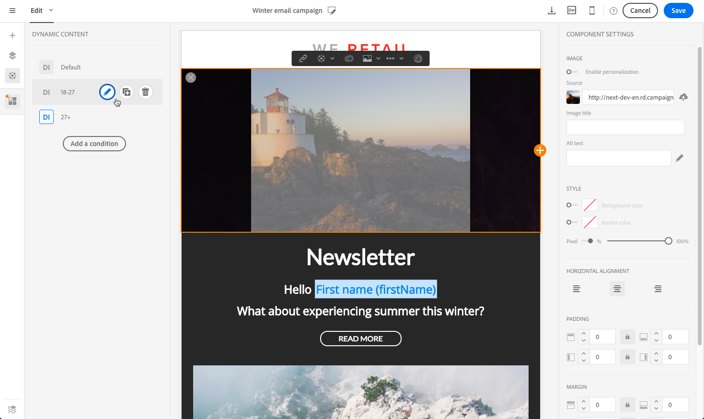

# E メールコンテンツのパーソナライズ {#personalization}

Adobe Campaignが配信するメッセージのコンテンツと表示は、複数の方法でパーソナライズできます。 これらの方法は、プロファイルに応じて、条件に従って組み合わせることができます。 Adobe Campaign には、全体として次のようなパーソナライゼーション機能が備わっています。

* パーソナライゼーションフィールドの動的な挿入：[パーソナライゼーションフィールドの挿入](#inserting-a-personalization-field)を参照してください。
* 定義済みパーソナライゼーションブロックの挿入：[コンテンツブロックの追加](#adding-a-content-block)を参照してください。
* Eメールの送信者をパーソナライズします。 [送信者のパーソナライズ](#personalizing-the-sender)を参照してください。
* Eメールの件名をパーソナライズします。 [Eメールの件名行のパーソナライズ](../../designing/using/subject-line.md#subject-line)を参照してください。
* 条件付きコンテンツの作成：[Eメールでの動的コンテンツの定義](#defining-dynamic-content-in-an-email)を参照してください。

## 送信者のパーソナライズ {#personalizing-the-sender}

送信するメッセージのヘッダーに表示される送信者の名前を定義するには、Eメールデザイナーホームページ（ホームアイコンからアクセス可能）の「**[!UICONTROL Properties]**」タブに移動します。 詳しくは、[Eメールの送信者の定義](../../designing/using/subject-line.md#email-sender)を参照してください。

送信者名は、**送信者名**&#x200B;ブロックをクリックして変更できます。 フィールドが編集可能になり、使用する名前を入力できます。

このフィールドはパーソナライズできます。 これをおこなうには、送信者名の下のアイコンをクリックして、パーソナライゼーションフィールド、コンテンツブロックおよび動的コンテンツを追加します。

>[!NOTE]
>
>ヘッダーパラメーターの値は省略できません。送信者のアドレスは、E メールを送信するための必須情報です（RFC 標準規格）。入力した E メールアドレスの形式はチェックされます。

## URLのパーソナライズ{#personalizing-urls}

Adobe Campaignでは、パーソナライゼーションフィールド、コンテンツブロックまたは動的コンテンツを追加することで、メッセージ内の1つまたは複数のURLをパーソナライズできます。 手順は次のとおりです。

1. 外部URLを挿入し、そのパラメーターを指定します。 [リンクの挿入](../../designing/using/links.md#inserting-a-link)を参照してください。
1. 表示されない場合は、設定パネルで選択したURLの横にある鉛筆アイコンをクリックして、パーソナライゼーションオプションにアクセスします。
1. 使用するパーソナライゼーションフィールド、コンテンツブロックおよび動的コンテンツを追加します。

   

1. 変更を保存します。

>[!NOTE]
>
>トラッキングリンクのURL署名メカニズムが無効になっている場合、パーソナライズするURLをドメイン名やURL拡張に適用することはできません。 パーソナライゼーションが正しくない場合、メッセージの分析中にエラーメッセージが表示されます。
>
>コンテンツブロックを選択する場合、「**ミラーページへのリンク**」などの要素を選択することはできません。 このタイプのブロックは、リンク内では禁止されています。

## パーソナライゼーションフィールドの挿入{#inserting-a-personalization-field}

Adobe Campaignでは、データベースからページにプロファイルの名などのフィールドを挿入できます。

>[!NOTE]
>
>以下の画像では、Eメールに[Eメールデザイナー](../../designing/using/designing-content-in-adobe-campaign.md)を使用してパーソナライゼーションフィールドを挿入する方法を示します。

パーソナライゼーションフィールドをコンテンツに追加するには：

1. テキストブロック内をクリックし、コンテキストツールバーの&#x200B;**[!UICONTROL Personalize]**&#x200B;アイコンをクリックして、「**[!UICONTROL Insert personalization field]**」を選択します。 Eメールデザイナーインターフェイスについて詳しくは、[この節](../../designing/using/designing-content-in-adobe-campaign.md#email-designer-interface)を参照してください。

   

1. ページコンテンツに挿入するフィールドを選択します。

   

1. 「**[!UICONTROL Confirm]**」をクリックします。

フィールド名がエディターに表示され、ハイライト表示されます。

パーソナライゼーションが生成されると（例えば、Eメールのプレビューや準備をする際）、このフィールドはターゲットプロファイルに対応する値に置き換えられます。

>[!NOTE]
>
>Eメールがワークフローから作成された場合は、ワークフローで計算された追加データもパーソナライゼーションフィールドで使用できます。 ワークフローから追加データを追加する方法について詳しくは、[データのエンリッチメント](../../automating/using/about-targeting-activities.md#enriching-data)の節を参照してください。

## コンテンツブロックの追加{#adding-a-content-block}

Adobe Campaignは、事前設定済みのコンテンツブロックのリストを提供します。 これらのコンテンツブロックは、動的でパーソナライズされ、特定のレンダリングを持ちます。 例えば、挨拶文やリンクをミラーページに追加できます。

>[!NOTE]
>
>以下の画像は、Eメール用に[Eメールデザイナー](../../designing/using/designing-content-in-adobe-campaign.md)を使用してコンテンツブロックを挿入する方法を示しています。

コンテンツブロックを追加するには：

1. テキストブロック内をクリックし、コンテキストツールバーの&#x200B;**[!UICONTROL Personalize]**&#x200B;アイコンをクリックして、「**[!UICONTROL Insert content block]**」を選択します。 Eメールデザイナーインターフェイスについて詳しくは、[この節](../../designing/using/designing-content-in-adobe-campaign.md#email-designer-interface)を参照してください。

   

1. 挿入するコンテンツブロックを選択します。 使用できるブロックは、コンテキスト（Eメールまたはランディングページ）によって異なります。

   

1. 「**[!UICONTROL Save]**」をクリックします。

コンテンツブロックの名前がエディターに表示され、黄色でハイライト表示されます。 パーソナライゼーションが生成されると、プロファイルに自動的に適応します。

標準のコンテンツブロックは次のとおりです。

* **[!UICONTROL Database URL in emails (EmailUrlBase)]**:このコンテンツブロックは、配信でのみ使 **用できます**。
* **[!UICONTROL Mirror page URL (MirrorPageUrl)]**:このコンテンツブロックは、配信でのみ使 **用できます**。
* **[!UICONTROL Link to mirror page (MirrorPage)]**:このコンテンツブロックは、配信でのみ使 **用できます**。
* **[!UICONTROL Greetings (Greetings)]**
* **[!UICONTROL Unsubscription link (UnsubscriptionLink)]**:このコンテンツブロックは、配信でのみ使 **用できます**。
* **[!UICONTROL Social network sharing links (LandingPageViralLinks)]**:このコンテンツブロックは、ランディングページでの **み使用できます**。
* **[!UICONTROL Default sender name (DefaultSenderName)]**:このコンテンツブロックは、配信でのみ使 **用できます**。
* **[!UICONTROL Name of default reply-to email address (DefaultReplyName)]**:このコンテンツブロックは、配信でのみ使 **用できます**。
* **[!UICONTROL Email address of default sender (DefaultSenderAddress)]**:このコンテンツブロックは、配信でのみ使 **用できます**。
* **[!UICONTROL Default error email address (DefaultErrorAddress)]**:このコンテンツブロックは、配信でのみ使 **用できます**。
* **[!UICONTROL Default reply-to email address (DefaultReplyAddress)]**:このコンテンツブロックは、配信でのみ使 **用できます**。
* **[!UICONTROL Brand name (BrandingUsualName)]**
* **[!UICONTROL Link to the brand website (BrandingWebSiteLink)]**
* **[!UICONTROL Brand logo (BrandingLogo)]**
* **[!UICONTROL Notification style (notificationStyle)]**

### カスタムコンテンツブロックの作成 {#creating-custom-content-blocks}

メッセージまたはランディングページに挿入される新しいコンテンツブロックを定義できます。

コンテンツブロックを作成するには、次の手順に従います。

1. 詳細メニューの&#x200B;**[!UICONTROL Resources > Content blocks]**&#x200B;をクリックして、コンテンツブロックのリストにアクセスします。
1. 「**[!UICONTROL Create]**」ボタンをクリックするか、既存のコンテンツブロックを複製します。

   

1. ラベルを入力します。
1. ブロックの&#x200B;**[!UICONTROL Content type]**&#x200B;を選択します。 次の 3 つのオプションを使用できます。

   * **[!UICONTROL Shared]**:コンテンツブロックは、配信またはランディングページで使用できます。
   * **[!UICONTROL Delivery]**:コンテンツブロックは、配信でのみ使用できます。
   * **[!UICONTROL Landing page]**:コンテンツブロックは、ランディングページでのみ使用できます。

   

1. **[!UICONTROL Targeting dimension]**&#x200B;を選択できます。 詳しくは、[ターゲティングディメンション](#about-targeting-dimension)についてを参照してください。

   

1. **[!UICONTROL Depends on format]**&#x200B;オプションを選択して、2つの異なるブロックを定義できます。1つはHTML電子メール用、もう1つはテキスト形式の電子メール用です。 エディターに2つのタブが表示され（「HTML」と「テキスト」）、対応するコンテンツが定義されます。

   

1. コンテンツブロックのコンテンツを入力し、**[!UICONTROL Create]**&#x200B;ボタンをクリックします。

これで、コンテンツブロックをメッセージやランディングページのコンテンツエディターで使用できます。

>[!CAUTION]
>
>ブロックのコンテンツを編集する際は、*if*&#x200B;ステートメントの開始と終了の間に余分な空白がないことを確認します。 HTMLでは、空白が画面に表示されるので、コンテンツのレイアウトに影響します。

### ターゲティングディメンションについて {#about-targeting-dimension}

ターゲティングディメンションを使用すると、コンテンツブロックを使用できるメッセージのタイプを定義できます。 これは、エラーの原因となる可能性のある、メッセージ内で不適切なブロックが使用されないようにするためです。

実際、メッセージを編集する際に選択できるのは、そのメッセージのターゲティングディメンションと互換性のあるターゲティングディメンションを持つコンテンツブロックのみです。

例えば、**[!UICONTROL Unsubscription link]**&#x200B;ブロックのターゲティングディメンションは&#x200B;**[!UICONTROL Profiles]**&#x200B;です。これは、**[!UICONTROL Profiles]**&#x200B;リソースに固有のパーソナライゼーションフィールドが含まれているからです。 したがって、[イベントトランザクションメッセージ](../../channels/using/getting-started-with-transactional-msg.md#transactional-message-types)では&#x200B;**[!UICONTROL Unsubscription link]**&#x200B;ブロックを使用できません。これは、そのタイプのメッセージのターゲティングディメンションが&#x200B;**[!UICONTROL Real-time events]**&#x200B;であるためです。 ただし、**Unsubscription link**&#x200B;ブロックは、[プロファイルトランザクションメッセージ](../../channels/using/getting-started-with-transactional-msg.md#transactional-message-types)で使用できます。これは、そのタイプのメッセージのターゲティングディメンションが&#x200B;**プロファイル**&#x200B;であるためです。 最後に、**[!UICONTROL Link to mirror page]**&#x200B;ブロックにはターゲティングディメンションがないので、任意のメッセージで使用できます。

このフィールドを空のままにすると、ターゲティングディメンションに関係なく、コンテンツブロックはすべてのメッセージと互換性があります。 ターゲティングディメンションを設定した場合、そのブロックは同じターゲティングディメンションを持つメッセージとのみ互換性があります。

詳しくは、[ターゲティングディメンションとリソース](../../automating/using/query.md#targeting-dimensions-and-resources)を参照してください。

**関連トピック：**

* [パーソナライゼーションフィールドの挿入](#inserting-a-personalization-field)
* [コンテンツブロックの追加](#adding-a-content-block)
* [Eメールでの動的コンテンツの定義](#defining-dynamic-content-in-an-email)

## 画像ソースのパーソナライズ{#personalizing-an-image-source}

Adobe Campaignでは、特定の条件に従ってメッセージ内の1つまたは複数の画像をパーソナライズしたり、トラッキングを使用したりできます。 これは、パーソナライゼーションフィールド、コンテンツブロックまたは動的コンテンツを画像ソースに挿入することでおこなわれます。 手順は次のとおりです。

1. メッセージのコンテンツに画像を挿入するか、既に存在する画像を選択します。
1. 画像プロパティパレットで、「**[!UICONTROL Enable personalization]**」オプションをオンにします。

   

   **[!UICONTROL Source]**&#x200B;フィールドが表示され、選択した画像がエディターに&#x200B;**パーソナライズされた**&#x200B;として表示されます。

1. 「 **[!UICONTROL Source]** 」フィールドボタンの横にある鉛筆アイコンをクリックして、パーソナライゼーションオプションにアクセスします。
1. 画像ソースを追加したら、必要なパーソナライゼーションフィールド、コンテンツブロックおよび動的コンテンツを追加します。

   

   >[!NOTE]
   >
   >ドメイン名(http://mydomain.com)はパーソナライズできないので、手動で入力する必要があります。 残りのURLはパーソナライズできます。 例：http://mydomain.com/ `[Gender]` .jpg

1. 変更を確認します。

## 条件付きコンテンツ {#conditional-content}

### 表示条件の定義{#defining-a-visibility-condition}

任意の要素に対して表示条件を指定できます。 条件が遵守されている場合にのみ表示されます。

表示条件を追加するには、ブロックを選択し、適用する条件を設定の&#x200B;**[!UICONTROL Visibility condition]**&#x200B;フィールドに入力します。

このオプションは、次の要素に対してのみ使用できます。アドレス、BLOCKQUOTE、CENTER、DIR、DIV、DL、FIELDSET、FORM、H1、H2、H3、H4、H6、NOSCRIPT、OL、P、PRE、UL、TR、TD。

式エディターについては、「[高度な式の編集](../../automating/using/editing-queries.md#about-query-editor)」の節で説明しています。

これらの条件は、XTK式の構文を採用しています(例：**context.profile.email !=&quot;**&#x200B;または&#x200B;**context.profile.status=&#39;0&#39;**)。 デフォルトでは、すべてのファイルが表示されます。

>[!NOTE]
>
>動的コンテンツを含むサブ要素が既に含まれるブロックまたは既に動的コンテンツを構成するブロックに対しては、条件を定義できません。 ドロップダウンリストなど、非表示の動的ブロックは編集できません。

### Eメールでの動的コンテンツの定義{#defining-dynamic-content-in-an-email}

>[!CONTEXTUALHELP]
>id="ac_dynamic_content"
>title="動的コンテンツの定義"
>abstract="定義する条件に従ってのみ、一部のプロファイルに表示される様々なコンテンツを定義します。"

Eメールでは、式エディターで定義した条件に従って、受信者に動的に表示される様々なコンテンツを定義できます。 例えば、同じEメールから、年齢の範囲に応じて各プロファイルが異なるメッセージを受け取るようにできます。

動的コンテンツの定義は、表示条件](#defining-a-visibility-condition)を定義する[とは異なります。

1. フラグメント、コンポーネントまたは要素を選択します。 この例では、画像を選択します。
1. コンテキストツールバーの「**[!UICONTROL Dynamic content]**」アイコンをクリックします。

   

   左側のパレットに&#x200B;**[!UICONTROL Dynamic content]**&#x200B;セクションが表示されます。

   

   デフォルトでは、このセクションには次の2つの要素が含まれています。デフォルトのバリアントと新しいバリアント。

   >[!NOTE]
   >
   >コンテンツには常にデフォルトバリアントが必要です。 削除することはできません。

1. **[!UICONTROL Edit]**&#x200B;ボタンをクリックして、1つ目の代替バリアントの表示条件を定義します。

   

1. ラベルを指定し、条件として設定するフィールドを選択します。 例えば、**[!UICONTROL General]**&#x200B;ノードから&#x200B;**[!UICONTROL Age]**&#x200B;フィールドを選択します。

   

1. フィルター条件を設定します。 例えば、18歳から25歳の人に異なるコンテンツを表示するとします。

   

1. すべての条件を設定したら、条件が適用される優先順位を定義し、変更を保存します。

   

   コンテンツは、上から下の順にパレットに表示されます。 優先度について詳しくは、[この節](#defining-dynamic-content-in-an-email)を参照してください。

1. 定義したバリアントの新しい画像をアップロードします。

   

   18歳から25歳の受信者に新しい画像が表示されます。

   

1. **[!UICONTROL Add a condition]**&#x200B;をクリックして、新しいコンテンツとそのリンクされたルールを追加します。

   

   例えば、26歳から35歳の人に表示する別の画像を追加できます。

1. 動的に表示する電子メールのその他の要素についても、同様の手順を繰り返します。 テキスト、ボタン、フラグメントなどがあります。 変更を保存します。

>[!CAUTION]
>
>メッセージを準備し、送信する前に、配達確認を使用してテストします。 これをおこなわないと、一部のエラーが検出されず、Eメールが送信されない可能性があります。

**関連トピック：**

* [配達確認の送信](../../sending/using/sending-proofs.md)
* [高度な式の編集](../../automating/using/editing-queries.md#about-query-editor)

### 優先順位 {#order-of-priority}

式エディターで動的コンテンツを定義する場合の優先順位は次のとおりです。

1. **2つの異なる条件**&#x200B;を使用して、2つの異なる動的コンテンツを定義します。次に例を示します。

   **条件1：プロ** ファイルの性別は男性です。

   **条件2：プ** ロファイルは20歳から30歳の間。

   

   データベース内の一部のプロファイルは、2つの条件に対応していますが、1つの動的コンテンツを持つ1つのEメールのみ送信できます。

1. したがって、動的コンテンツの優先度を定義する必要があります。 優先順位が&#x200B;**1**（したがって、対応する動的コンテンツ）の条件は、優先順位が&#x200B;**2**&#x200B;または&#x200B;**3**&#x200B;の別の条件がこのプロファイルで満たされた場合でも、プロファイルに送信されます。

   

動的コンテンツごとに優先度を1つだけ定義できます。

## 例：Eメールのパーソナライゼーション{#example-email-personalization}

この例では、マーケティングサービスチームのメンバーが、顧客に対してのみ特別オファーがあることを知らせる電子メールを作成しました。 チームメンバーは、顧客の年齢に応じてEメールをパーソナライズすることを決定しました。 18歳から27歳のクライアントには、異なる画像と、27歳より上のクライアントが受け取るスローガンを含むEメールが届きます。

Eメールは次のように作成されます。

* 画像に動的コンテンツを適用し、これらの動的コンテンツを年齢範囲に応じて構成する。

   

   動的コンテンツの追加と設定について詳しくは、 Eメールでの動的コンテンツの定義[の節を参照してください。](#defining-dynamic-content-in-an-email)

* パーソナライゼーションフィールドと動的コンテンツがテキストに適用されます。 Eメールは、プロファイルの年齢範囲に応じて、プロファイルの名、またはプロファイルのタイトルと姓で始まります。

   

   パーソナライゼーションフィールドの追加と設定について詳しくは、 [パーソナライゼーションフィールドの挿入](#inserting-a-personalization-field)の節を参照してください。

### 画像の設定 {#configuring-images}

>[!CONTEXTUALHELP]
>id="ac_dynamic_image"
>title="動的画像の管理"
>abstract="定義する条件に従って、動的な画像を使用してEメールをパーソナライズします。"

この例では、画像に適用される動的コンテンツは次のように設定されます。

**ターゲット設定18-27-year-old:**

1. **[!UICONTROL Properties]**&#x200B;パレットで動的コンテンツを選択し、「**[!UICONTROL Edit]**」ボタンをクリックします。

   

1. ラベルを編集し、**[!UICONTROL Profile]**&#x200B;ノードから&#x200B;**[!UICONTROL Age]**&#x200B;フィールドを選択します。

   

1. 「**次よりも大きいか等しい**」演算子を選択してから、「**18**」と入力して、18 **より古い式「**」を作成します。

   

1. 新しい&#x200B;**[!UICONTROL Age]**&#x200B;条件を追加します。

   「**次よりも小さいか等しい**」演算子の後に「27」が続く値フィールドを選択し、式「**27**」より小さいを作成します。

   

1. 変更を確認します。

**27歳以上のプロファイルをターゲットにするには：**

1. パレットから動的コンテンツを選択し、編集します。
1. ラベルを編集し、**[!UICONTROL Profile]**&#x200B;ノードから&#x200B;**[!UICONTROL Age]**&#x200B;フィールドを選択します。
1. 値フィールドに&#x200B;**次よりも大きい**&#x200B;演算子の後に27を追加し、式&#x200B;**が27**&#x200B;より古いものを作成します。

   

1. 変更を確認します。

動的コンテンツが正しく設定されている。

### テキストの設定 {#configuring-text}

この例では、テキストに適用される動的コンテンツは次のように設定されます。

**18～27歳のプロファイルをターゲットにするには：**

1. 必要な構造コンポーネントを選択し、動的コンテンツを追加します。
1. 動的コンテンツを編集し、ターゲティング式を設定します。 [画像の設定](#configuring-images)を参照してください。
1. 構造コンポーネントの目的の位置で、コンテキストツールバーの&#x200B;**[!UICONTROL Personalize]**&#x200B;アイコンをクリックし、「**[!UICONTROL Insert personalization field]**」を選択します。

   

1. 表示されるリストで、**[!UICONTROL First name]**&#x200B;フィールドを選択して確定します。

   

1. 選択した動的コンテンツに、パーソナライゼーションフィールドが完全に挿入されます。

**27歳以上のプロファイルをターゲットにするには：**

1. 必要な構造コンポーネントを選択し、動的コンテンツを追加します。
1. 動的コンテンツを編集し、ターゲティング式を設定します。 [画像の設定](#configuring-images)を参照してください。
1. 構造コンポーネントの目的の位置で、コンテキストツールバーの&#x200B;**[!UICONTROL Personalize]**&#x200B;アイコンをクリックし、「**[!UICONTROL Insert personalization field]**」を選択します。
1. ドロップダウンリストから&#x200B;**[!UICONTROL Title]**&#x200B;を選択します。
1. 同様に、**[!UICONTROL Last name]**&#x200B;フィールドを追加します。

   

これで、パーソナライゼーションフィールドが、選択した動的コンテンツに完全に挿入されます。

### Eメールのプレビュー {#previewing-emails}

プレビューを使用すると、**[!UICONTROL Proofs]**&#x200B;を送信する前に、パーソナライゼーションフィールドと動的コンテンツが正しく設定されていることを確認できます。 プレビュー中に、Eメールターゲットに応じて異なるテストプロファイルを選択できます。

テストプロファイルがない場合、デフォルトで表示されるEメールは次のようになります。

Eメールのスローガンにはパーソナライゼーションフィールドがなく、デフォルト画像が使用されます。

最初のテストプロファイルは、18歳から27歳のクライアントに対応します。 このプロファイルを選択すると、次のEメールが表示されます。

18-27-year-old式（特にプロファイルの名）に対応するパーソナライゼーションフィールドが正しく設定され、プロファイルに応じて画像も変更されています。

2つ目のプロファイルは、27歳以上のクライアントに対応し、次のEメールを生成します。

動的なコンテンツによって画像が変化し、表示されるスローガンは、このターゲットを絞った公開用に定義されたより正式なスローガンです。

**関連トピック：**

* [オーディエンスの作成](../../audiences/using/creating-audiences.md)
* [送信の準備](../../sending/using/preparing-the-send.md)
