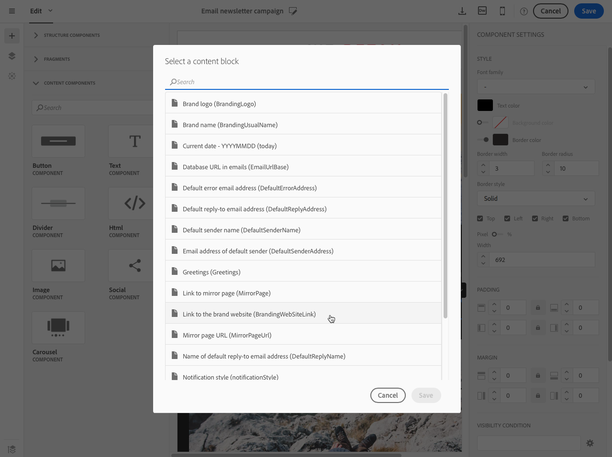
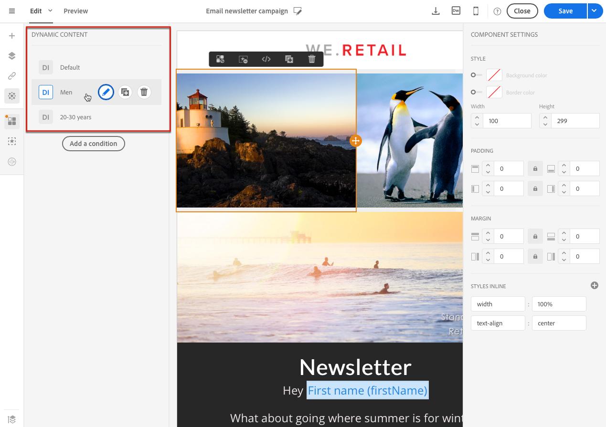
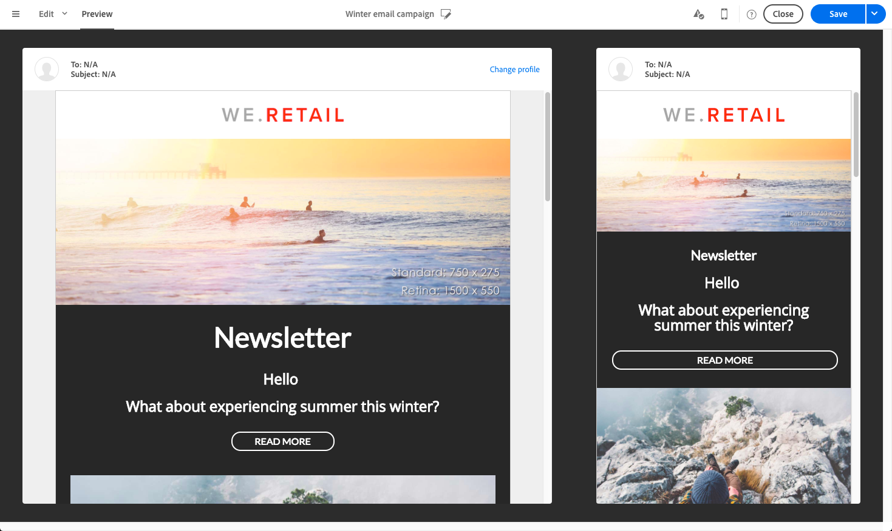

# 電子メールコンテンツのパーソナライズ {#personalization}

Adobe Campaignが配信するメッセージのコンテンツと表示は、様々な方法でパーソナライズできます。 これらの方法は、プロファイルに応じて条件に従って組み合わせることができます。 一般に、Adobe Campaignでは次のことが可能です。

* 動的パーソナライゼーションフィールドを挿入します。 詳しくは、パー [ソナライゼーションフィールドの挿入を参照してくださ](#inserting-a-personalization-field)い。
* 定義済みパーソナライゼーションブロックを挿入します。 詳しくは、コ [ンテンツブロックの追加を参照してくださ](#adding-a-content-block)い。
* 電子メールの送信者をパーソナライズします。 詳しくは、送 [信者の個人設定を参照してください](#personalizing-the-sender)。
* 電子メールの件名をパーソナライズします。 See [Personalizing the subject line of an email](../../designing/using/subject-line.md#defining-the-subject-line-of-an-email).
* 条件付きコンテンツを作成します。 詳しくは、電 [子メールでの動的コンテンツの定義を参照してください。](#defining-dynamic-content-in-an-email)

## 送信者の個人設定 {#personalizing-the-sender}

送信するメッセージのヘッダーに表示される送信者の名前を定義するには、電子メールデザイナーのホームページのタブに移動します( **[!UICONTROL Properties]** ホームアイコンからアクセスできます)。 詳しくは、「電子メールの送 [信者の定義」を参照してください。](../../designing/using/subject-line.md#email-sender)

送信者名は、[送信者名]ブロックをクリックして **変更できます** 。 フィールドが編集可能になり、使用する名前を入力できます。

このフィールドはパーソナライズできます。 これを行うには、送信者名の下のアイコンをクリックして、パーソナライゼーションフィールド、コンテンツブロックおよび動的コンテンツを追加します。

>[!NOTE]
>
>ヘッダーパラメーターは空にできません。 送信者のアドレスは、電子メールの送信を許可するために必須です（RFC標準）。 Adobe Campaignは、入力された電子メールアドレスの構文を確認します。

## URLのパーソナライズ{#personalizing-urls}

Adobe Campaignでは、パーソナライゼーションフィールド、コンテンツブロックまたは動的コンテンツをメッセージに追加して、URLをパーソナライズできます。 これを行うには：

1. 外部URLを挿入し、そのパラメーターを指定します。 詳しくは、 [リンクの挿入を参照してください](../../designing/using/links.md#inserting-a-link)。
1. 表示されない場合は、設定パネルで選択したURLの横にある鉛筆をクリックして、パーソナライゼーションオプションにアクセスします。
1. 使用するパーソナライゼーションフィールド、コンテンツブロックおよび動的コンテンツを追加します。

   

1. 変更を保存します。

>[!NOTE]
>
>URLのパーソナライズは、ドメイン名やURL拡張子に適用できません。 パーソナライゼーションが正しくない場合、メッセージ分析中にエラーメッセージが表示されます。 コンテンツブロックを選択する場合、「ミラーページにリンク」などの要素を選 **択することはできません**。 このタイプのブロックは、リンク内では禁止されています。

## パーソナライゼーションフィールドの挿入{#inserting-a-personalization-field}

Adobe Campaignでは、データベースからプロファイルの名などのフィールドをページに挿入できます。

>[!NOTE]
>
>次の画像は、電子メール用の電子メールデザイナーを使用してパーソナライゼーションフィ [ールドを挿入する](../../designing/using/overview.md) 方法を示しています。

コンテンツにパーソナライゼーションフィールドを追加するには：

1. テキストブロック内をクリックし、コンテキストツ **[!UICONTROL Personalize]** ールバーからアイコンをクリックしてを選択しま **[!UICONTROL Insert personalization field]**&#x200B;す。 電子メールデザイナーインターフェイスについて詳しくは、この節を [参照してくださ](../../designing/using/overview.md#email-designer-interface)い。

   

1. ページコンテンツに挿入するフィールドを選択します。

   

1. Click **[!UICONTROL Confirm]**.

フィールド名がエディターに表示され、ハイライト表示されます。

パーソナライゼーションが生成されると（例えば、電子メールをプレビューして準備する場合）、このフィールドはターゲットプロファイルに対応する値に置き換えられます。

>[!NOTE]
>
>電子メールがワークフローから作成された場合は、ワークフローで計算された追加のデータもパーソナライゼーションフィールドで使用できます。 ワークフローから追加のデータを追加する方法の詳細については、「データの強化」の節を [参照してくださ](../../automating/using/targeting-data.md#enriching-data) い。

## コンテンツブロックの追加{#adding-a-content-block}

Adobe Campaignには、事前設定済みのコンテンツブロックのリストが用意されています。 これらのコンテンツブロックは動的でパーソナライズされ、特定のレンダリングを持ちます。 例えば、ミラーページに挨拶やリンクを追加できます。

>[!NOTE]
>
>次の画像は、電子メール用に電子メールデザイナーを使用してコンテンツブロ [ックを挿入する](../../designing/using/overview.md) 方法を示しています。

コンテンツブロックを追加するには：

1. テキストブロック内をクリックし、コンテキストツ **[!UICONTROL Personalize]** ールバーからアイコンをクリックしてを選択しま **[!UICONTROL Insert content block]**&#x200B;す。 電子メールデザイナーインターフェイスについて詳しくは、この節を [参照してくださ](../../designing/using/overview.md#email-designer-interface)い。

   

1. 挿入するコンテンツブロックを選択します。 使用できるブロックは、コンテキスト（電子メールまたはランディングページ）によって異なります。

   

1. Click **[!UICONTROL Save]**.

コンテンツブロックの名前がエディタに表示され、黄色でハイライト表示されます。 パーソナライゼーションが生成されると、プロファイルに自動的に適合します。

そのまま使用できるコンテンツブロックは次のとおりです。

* **[!UICONTROL Database URL in emails (EmailUrlBase)]**:このコンテンツブロックは配信でのみ使用で **きます**。
* **[!UICONTROL Mirror page URL (MirrorPageUrl)]**:このコンテンツブロックは配信でのみ使用で **きます**。
* **[!UICONTROL Link to mirror page (MirrorPage)]**:このコンテンツブロックは配信でのみ使用で **きます**。
* **[!UICONTROL Greetings (Greetings)]**
* **[!UICONTROL Unsubscription link (UnsubscriptionLink)]**:このコンテンツブロックは配信でのみ使用で **きます**。
* **[!UICONTROL Social network sharing links (LandingPageViralLinks)]**:このコンテンツブロックはランディングページでのみ使 **用できます**。
* **[!UICONTROL Default sender name (DefaultSenderName)]**:このコンテンツブロックは配信でのみ使用で **きます**。
* **[!UICONTROL Name of default reply-to email address (DefaultReplyName)]**:このコンテンツブロックは配信でのみ使用で **きます**。
* **[!UICONTROL Email address of default sender (DefaultSenderAddress)]**:このコンテンツブロックは配信でのみ使用で **きます**。
* **[!UICONTROL Default error email address (DefaultErrorAddress)]**:このコンテンツブロックは配信でのみ使用で **きます**。
* **[!UICONTROL Default reply-to email address (DefaultReplyAddress)]**:このコンテンツブロックは配信でのみ使用で **きます**。
* **[!UICONTROL Brand name (BrandingUsualName)]**
* **[!UICONTROL Link to the brand website (BrandingWebSiteLink)]**
* **[!UICONTROL Brand logo (BrandingLogo)]**
* **[!UICONTROL Notification style (notificationStyle)]**

### カスタムコンテンツブロックの作成 {#creating-custom-content-blocks}

メッセージまたはランディングページに挿入される新しいコンテンツブロックを定義できます。

コンテンツブロックを作成するには、次の手順に従います。

1. コンテン **[!UICONTROL Resources > Content blocks]** ツブロックのリストにアクセスするには、詳細メニューからをクリックします。
1. ボタンをクリ **[!UICONTROL Create]** ックするか、既存のコンテンツブロックを複製します。

   

1. ラベルを入力します。
1. ブロックのを選択しま **[!UICONTROL Content type]**&#x200B;す。 次の3つのオプションを使用できます。

   * **[!UICONTROL Shared]**:コンテンツブロックは、配信またはランディングページで使用できます。
   * **[!UICONTROL Delivery]**:コンテンツブロックは、配信でのみ使用できます。
   * **[!UICONTROL Landing page]**:コンテンツブロックはランディングページでのみ使用できます。
   

1. を選択できます **[!UICONTROL Targeting dimension]**。 詳しくは、ターゲットディメンションにつ [いてを参照してくださ](#about-targeting-dimension)い。

   

1. 次の2つの異なるブロックを定 **[!UICONTROL Depends on format]** 義するオプションを選択できます。1つはHTML電子メール用、もう1つはテキスト形式の電子メール用です。 エディターに2つのタブ（HTMLとテキスト）が表示され、対応するコンテンツが定義されます。

   

1. コンテンツブロックのコンテンツを入力し、ボタンをクリックし **[!UICONTROL Create]** ます。

これで、メッセージやランディングページのコンテンツエディターでコンテンツブロックを使用できるようになりました。

>[!CAUTION]
>
>ブロックのコンテンツを編集する場合は、ifステートメントの先頭と末尾の間に余分な空白がないことを確認 *します* 。 HTMLでは、空白が画面に表示されるので、コンテンツのレイアウトに影響を与えます。

### ターゲットディメンションについて {#about-targeting-dimension}

ターゲットディメンションを使用すると、コンテンツブロックを使用できるメッセージのタイプを定義できます。 これは、エラーを引き起こす可能性のある、メッセージ内で不適切なブロックを使用するのを防ぐためです。

実際に、メッセージを編集する場合は、そのメッセージのターゲットディメンションと互換性のあるターゲットディメンションを持つコンテンツブロックのみを選択できます。

例えば、ブロックのターゲ **[!UICONTROL Unsubscription link]** ットディメンションは、リソースに固有の **[!UICONTROL Profiles]** パーソナライゼーションフィールドが含まれているた **[!UICONTROL Profiles]** めです。 したがって、イベントトランザクションメ **[!UICONTROL Unsubscription link]** ッセージではブ [ロックを使用できません](../../channels/using/event-transactional-messages.md)。これは、そのタイプのメッセージのターゲットディメンションが **[!UICONTROL Real-time events]**、 ただし、プロファイルトランザクションメッセージで **Unsubscription** リンクブロック [を使用できるのは、そのタイプのメッセージのターゲットディメンションが](../../channels/using/profile-transactional-messages.md)Profilesであるためです ****。 最後に、ブロックに **[!UICONTROL Link to mirror page]** はターゲットディメンションがないので、任意のメッセージで使用できます。

このフィールドを空のままにすると、ターゲットディメンションが何であっても、コンテンツブロックはすべてのメッセージと互換性があります。 ターゲットディメンションを設定した場合、そのブロックは、同じターゲットディメンションを持つメッセージとのみ互換性があります。

詳しくは、ディメンションとリソースのターゲ [ット設定を参照してください](../../automating/using/query.md#targeting-dimensions-and-resources)。

**関連トピック：**

* [パーソナライゼーションフィールドの挿入](#inserting-a-personalization-field)
* [コンテンツブロックの追加](#adding-a-content-block)
* [電子メールでの動的コンテンツの定義](#defining-dynamic-content-in-an-email)

## 画像ソースのパーソナライズ{#personalizing-an-image-source}

Adobe Campaignでは、特定の条件に従ってメッセージ内の1つまたは複数の画像をパーソナライズしたり、追跡を使用したりできます。 これは、パーソナライゼーションフィールド、コンテンツブロックまたは動的コンテンツを画像ソースに挿入することで行います。 これを行うには：

1. メッセージの内容に画像を挿入するか、既に存在する画像を選択します。
1. 画像プロパティパレットで、このオプションをオンに **[!UICONTROL Enable personalization]** します。

   

   フィー **[!UICONTROL Source]** ルドが表示され、選択した画像がパーソナライズされ **た画像** としてエディターに表示されます。

1. フィールドボタンの横にある鉛筆をクリッ **[!UICONTROL Source]** クして、パーソナライゼーションオプションを表示します。
1. 画像ソースを追加したら、好みのパーソナライゼーションフィールド、コンテンツブロックおよび動的コンテンツを追加します。

   

   >[!NOTE]
   >
   >ドメイン名(http://mydomain.com)をパーソナライズできないので、手動で入力する必要があります。 残りのURLはパーソナライズできます。 例：http://mydomain.com/`[Gender]`.jpg

1. 変更を確認します。

## 条件付きコンテンツ {#conditional-content}

### 表示条件の定義{#defining-a-visibility-condition}

任意の要素に対して表示条件を指定できます。 条件が考慮される場合にのみ表示されます。

表示条件を追加するには、ブロックを選択し、設定のフィールドに考慮する条 **[!UICONTROL Visibility condition]** 件を入力します。

このオプションは、次の要素でのみ使用できます。住所、BLOCKQUOTE、CENTER、DIR、DIV、DL、FIELDSET、FORM、H1、H2、H3、H4、H5、H6、NOSCRIPT、OL、P、PRE、UL、TR、TD。

式エディターは、「式の詳細編集」セク [ションに表示されます](../../automating/using/editing-queries.md#about-query-editor) 。

これらの条件はXTK式の構文(例： **context.profile.email !="** ま **たはcontext.profile.status='0'**)。 デフォルトでは、すべてのフィールドが表示されます。

>[!NOTE]
>
>動的コンテンツを含むサブ要素を既に含むブロック、または既に動的コンテンツを構成するブロックに対しては、条件を定義できません。 ドロップダウンリストのような非表示のダイナミックブロックは編集できません。

### 電子メールでの動的コンテンツの定義{#defining-dynamic-content-in-an-email}

電子メールでは、式エディターで定義した条件に従って、受信者に動的に表示される様々なコンテンツを定義できます。 例えば、同じ電子メールから、年齢の範囲に応じて各プロファイルが異なるメッセージを受け取るようにできます。

動的コンテンツの定義は、表示条件の [定義とは異なります](#defining-a-visibility-condition)。

1. フラグメント、コンポーネントまたは要素を選択します。 この例では、画像を選択します。
1. コンテキストツー **[!UICONTROL Dynamic content]** ルバーからアイコンをクリックします。

   

   左側の **[!UICONTROL Dynamic content]** パレットにセクションが表示されます。

   

   デフォルトでは、このセクションには2つの要素が含まれます。デフォルトのバリアントと新しいバリアント。

   >[!NOTE]
   >
   >コンテンツには常にデフォルトのバリアントが必要です。 削除することはできません。

1. ボタンをクリ **[!UICONTROL Edit]** ックして、最初の代替バリアントの表示条件を定義します。

   

1. ラベルを指定し、条件として設定するフィールドを選択します。 例えば、ノードから **[!UICONTROL General]** フィールドを選択しま **[!UICONTROL Age]** す

   

1. フィルター条件を設定します。 例えば、18歳から25歳の年齢の人に異なるコンテンツを表示するとします。

   

1. すべての条件を設定したら、条件を適用する優先順位を定義し、変更を保存します。

   

   コンテンツは、上から下に順にパレットに表示されます。 For more on priorities, refer to [this section](#defining-dynamic-content-in-an-email).

1. 先ほど定義したバリアントの新しい画像をアップロードします。

   

   18歳から25歳の受信者に新しい画像が表示されます。

   

1. をクリック **[!UICONTROL Add a condition]** して、新しいコンテンツとそのリンクされたルールを追加します。

   

   例えば、26歳から35歳の年齢の人に別の画像を表示するように追加できます。

1. 動的に表示する電子メールのその他の要素についても同様に続行します。 テキスト、ボタン、フラグメントなどがあります。 変更を保存します。

>[!CAUTION]
>
>メッセージを準備し、送信する前に、証明書を使用してテストします。 この操作を行わないと、一部のエラーが検出されず、電子メールが送信されない場合があります。

**関連トピック：**

* [校正の送信](../../sending/using/managing-test-profiles-and-sending-proofs.md#sending-proofs)
* [高度な式の編集](../../automating/using/editing-queries.md#about-query-editor)

### 優先順位 {#order-of-priority}

エクスプレッションエディターで動的コンテンツを定義する場合の優先順位は次のとおりです。

1. 例えば、2つの異なる条件を持つ2つの異な **る動的コンテンツを**、次のように定義します。

   **** 条件1:プロフィールの性別は男らしい

   **** 条件2:そのプロフィールは20歳から30歳の間だ。

   

   データベース内の一部のプロファイルは2つの条件に対応しますが、1つの動的コンテンツを持つ1つの電子メールのみを送信できます。

1. したがって、動的コンテンツの優先順位を定義する必要があります。 優先順位が **1** （したがって、対応する動的コンテンツ）の条件は、優先順位が **2** または **3** の別の条件がこのプロファイルで満たされた場合でも、プロファイルに送信されます。

   

動的コンテンツごとに定義できる優先順位は1つだけです。

## 例：電子メールのパーソナライゼーション{#example-email-personalization}

この例では、マーケティングサービスチームのメンバーが、顧客に対してのみ特別オファーがあることを通知する電子メールを作成しています。 チームメンバーは、顧客の各年齢に応じて電子メールをパーソナライズすることを決定した。 18歳から27歳のクライアントには、異なる画像と27歳より前のクライアントが受け取るスローガンを含む電子メールが届きます。

電子メールは次のように作成されます。

* 動的コンテンツを画像に適用し、これら動的コンテンツを年齢範囲に応じて構成する。

   

   動的コンテンツの追加と設定について詳しくは、「電子メ [ールでの動的コンテンツの定義](#defining-dynamic-content-in-an-email) 」を参照してください。

* パーソナライゼーションフィールドと動的コンテンツがテキストに適用されます。 プロファイルの年齢範囲に応じて、電子メールはプロファイルの名、またはプロファイルのタイトルと姓で始まります。

   

   パーソナライゼーションフィールドの追加と設定について詳しくは、「パーソナライゼ [ーションフィールドの挿入](#inserting-a-personalization-field) 」の節を参照してください。

### 画像の設定 {#configuring-images}

この例では、画像に適用される動的コンテンツを次のように設定します。

**18～27歳をターゲットにするには：**

1. パレットで動的コンテンツを選択 **[!UICONTROL Properties]** し、ボタンをクリック **[!UICONTROL Edit]** します。

   

1. ラベルを編集し、ノードからフ **[!UICONTROL Age]** ィールドを選択 **[!UICONTROL Profile]** します。

   

1. 「次の値よ **り大きいか等しい** 」演算子を選択し、「 **18** 」と入力して18より **古い式を作成します** 。

   

1. 新しい条件を追加 **[!UICONTROL Age]** します。

   「次の値よ **り小さいか等しい」演算子を選択し** 、「27」より小さい数値を「27」と入力して、27より **小さい数値を作成します** 。

   

1. 変更を確認します。

**27才以上のプロファイルをターゲットにするには：**

1. パレットから動的コンテンツを選択し、編集します。
1. ラベルを編集し、ノードからフ **[!UICONTROL Age]** ィールドを選択 **[!UICONTROL Profile]** します。
1. 「次の値よ **りも大きい** 」演算子の後に「27」を追加して、27よりも古い式 **を作成します** 。

   

1. 変更を確認します。

動的なコンテンツが正しく設定されている。

### テキストの設定 {#configuring-text}

この例では、テキストに適用される動的コンテンツは次のように設定します。

**18 ～ 27才のプロファイルをターゲットにするには：**

1. 必要な構造コンポーネントを選択し、動的コンテンツを追加します。
1. 動的コンテンツを編集し、ターゲット式を設定します。 詳しくは、イメー [ジの設定を参照](#configuring-images)。
1. 構造コンポーネントで、目的の位置にあるコンテキストツールバーから **[!UICONTROL Personalize]** アイコンをクリックし、を選択しま **[!UICONTROL Insert personalization field]**&#x200B;す。

   

1. 表示されるリストで、フィールドを選択し **[!UICONTROL First name]** て確認します。

   

1. 次に、選択した動的コンテンツにパーソナライゼーションフィールドが完全に挿入されます。

**27才以上のプロファイルをターゲットにするには：**

1. 必要な構造コンポーネントを選択し、動的コンテンツを追加します。
1. 動的コンテンツを編集し、ターゲット式を設定します。 詳しくは、イメー [ジの設定を参照](#configuring-images)。
1. 構造コンポーネントで、目的の位置にあるコンテキストツールバーから **[!UICONTROL Personalize]** アイコンをクリックし、を選択しま **[!UICONTROL Insert personalization field]**&#x200B;す。
1. ドロッ **[!UICONTROL Title]** プダウンリストから選択します。
1. 同様にフィールドを追加 **[!UICONTROL Last name]** します。

   

これで、選択した動的コンテンツにパーソナライゼーションフィールドが完全に挿入されます。

### 電子メールのプレビュー {#previewing-emails}

プレビューを使用すると、パーソナライゼーションフィールドと動的コンテンツが正しく設定されていることを確認してから、コンテンツを送信できま **[!UICONTROL Proofs]**&#x200B;す。 プレビュー中に、電子メールターゲットに対応する様々なテストプロファイルを選択できます。

テストプロファイルがない場合、デフォルトで表示される電子メールは次のとおりです。

電子メールにはスローガン内にパーソナライゼーションフィールドがなく、デフォルトの画像が使用されます。

最初のテストプロファイルは、18歳から27歳のクライアントに対応します。 このプロファイルを選択すると、次の電子メールが表示されます。

18 ～ 27年の式（特にプロファイルの名に相当）に対応するパーソナライゼーションフィールドが正しく設定され、プロファイルに従って画像も変更されました。

2つ目のプロファイルは27才以上のクライアントに対応し、次の電子メールを生成します。

動的なコンテンツのおかげで画像が変わり、表示されるスローガンが、このターゲットを絞った一般向けに定義されたより正式なスローガンになりました。

**関連トピック：**

* [オーディエンスの作成](../../audiences/using/creating-audiences.md)
* [送信の準備](../../sending/using/preparing-the-send.md)

