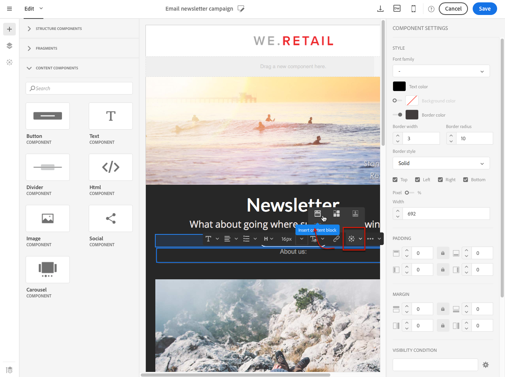
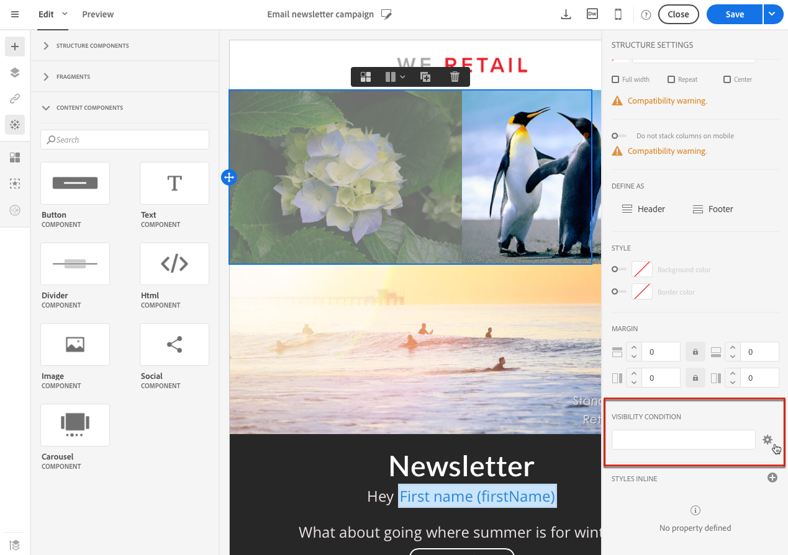

# メールコンテンツのパーソナライズ {#personalization}

Adobe Campaignが配信するメッセージのコンテンツと表示は、様々な方法でパーソナライズできます。 これらの方法は、プロファイルに応じた条件に従って組み合わせることができます。 Adobe Campaign には、全体として次のようなパーソナライゼーション機能が備わっています。

* 動的パーソナライゼーションフィールドの挿入[パーソナライゼーションフィールドの挿入](#inserting-a-personalization-field)を参照してください。
* 定義済みパーソナライゼーションブロックの挿入：[コンテンツブロックの追加](#adding-a-content-block)を参照してください。
* E メールの送信者をパーソナライズします。 詳しくは、 [送信者のパーソナライズ](#personalizing-the-sender).
* E メールの件名をパーソナライズします。 詳しくは、 [E メールの件名行のパーソナライズ](../../designing/using/subject-line.md#subject-line).
* 条件付きコンテンツの作成詳しくは、 [E メールでの動的コンテンツの定義](#defining-dynamic-content-in-an-email).

## 送信者のパーソナライズ {#personalizing-the-sender}

送信するメッセージのヘッダーに表示される送信者の名前を定義するには、 **[!UICONTROL Properties]** Email Designer ホームページの「 」タブ（ホームアイコンからアクセス可能） 詳しくは、 [E メールの送信者の定義](../../designing/using/subject-line.md#email-sender).

送信者名を変更するには、 **送信者名** ブロック。 フィールドが編集可能になり、使用する名前を入力できます。

このフィールドはパーソナライズできます。 これをおこなうには、送信者名の下のアイコンをクリックして、パーソナライゼーションフィールド、コンテンツブロック、動的コンテンツを追加します。

>[!NOTE]
>
>ヘッダーパラメーターの値は省略できません。送信者のアドレスは、メールを送信するための必須情報です（RFC 標準規格）。入力したメールアドレスの形式はチェックされます。

## パーソナライズされた URL{#personalizing-urls}

Adobe Campaignでは、パーソナライゼーションフィールド、コンテンツブロック、動的コンテンツを追加することで、メッセージ内の 1 つまたは複数の URL をパーソナライズできます。 手順は次のとおりです。

1. 外部 URL を挿入し、そのパラメーターを指定します。 詳しくは、 [リンクの挿入](../../designing/using/links.md#inserting-a-link).
1. 表示されない場合は、設定パネルで選択した URL の横にある鉛筆アイコンをクリックして、パーソナライゼーションオプションにアクセスします。
1. 使用するパーソナライゼーションフィールド、コンテンツブロック、動的コンテンツを追加します。

   

1. 変更内容を保存します。

>[!NOTE]
>
>トラッキングリンクの URL 署名メカニズムが無効になっている場合、パーソナライズした URL をドメイン名や URL 拡張に適用することはできません。 パーソナライゼーションが正しくない場合、メッセージの分析中にエラーメッセージが表示されます。
>
>コンテンツブロックを選択する際、次のような要素を選択することはできません。 **ミラーページへのリンク**. このタイプのブロックは、リンク内では禁止されています。

## パーソナライゼーションフィールドの挿入{#inserting-a-personalization-field}

Adobe Campaignでは、データベースからページにプロファイルの名などのフィールドを挿入できます。

>[!NOTE]
>
>次の画像は、 [E メールデザイナー](../../designing/using/designing-content-in-adobe-campaign.md) 電子メールの。

パーソナライゼーションフィールドをコンテンツに追加するには：

1. テキストブロック内をクリックし、 **[!UICONTROL Personalize]** コンテキストツールバーのアイコンをクリックし、「 」を選択します。 **[!UICONTROL Insert personalization field]**. E メールデザイナーのインターフェイスについて詳しくは、 [この節](../../designing/using/designing-content-in-adobe-campaign.md#email-designer-interface).

   

1. ページコンテンツに挿入するフィールドを選択します。

   

1. 「**[!UICONTROL Confirm]**」をクリックします。

フィールド名がエディターに表示され、ハイライト表示されます。

パーソナライゼーションが生成されると（例えば、E メールのプレビューおよび準備時）、このフィールドはターゲットプロファイルに対応する値に置き換えられます。

>[!NOTE]
>
>E メールがワークフローから作成された場合は、ワークフローで計算された追加データもパーソナライゼーションフィールドで使用できます。 ワークフローからの追加データの追加について詳しくは、 [データのエンリッチメント](../../automating/using/about-targeting-activities.md#enriching-data) 」セクションに入力します。

## コンテンツブロックの追加{#adding-a-content-block}

Adobe Campaign は、事前設定済みのコンテンツブロックのリストを提供します。これらのコンテンツブロックは、動的で、パーソナライズされ、特定のレンダリングを持ちます。 例えば、断り書きやリンクをミラーページに追加できます。

>[!NOTE]
>
>次の画像は、 [E メールデザイナー](../../designing/using/designing-content-in-adobe-campaign.md) 電子メールの。

コンテンツブロックを追加するには：

1. テキストブロック内をクリックし、 **[!UICONTROL Personalize]** コンテキストツールバーのアイコンをクリックし、「 」を選択します。 **[!UICONTROL Insert content block]**. E メールデザイナーのインターフェイスについて詳しくは、 [この節](../../designing/using/designing-content-in-adobe-campaign.md#email-designer-interface).

   

1. 挿入するコンテンツブロックを選択します。 使用できるブロックは、コンテキスト（E メールまたはランディングページ）によって異なります。

   

1. 「**[!UICONTROL Save]**」をクリックします。

コンテンツブロックの名前がエディターに表示され、黄色でハイライト表示されます。 パーソナライゼーションが生成されると、プロファイルに自動的に適応します。

標準のコンテンツブロックは次のとおりです。

* **[!UICONTROL Database URL in emails (EmailUrlBase)]**：このコンテンツブロックは、 **配信**.
* **[!UICONTROL Mirror page URL (MirrorPageUrl)]**：このコンテンツブロックは、 **配信**.
* **[!UICONTROL Link to mirror page (MirrorPage)]**：このコンテンツブロックは、 **配信**.
* **[!UICONTROL Greetings (Greetings)]**
* **[!UICONTROL Unsubscription link (UnsubscriptionLink)]**：このコンテンツブロックは、 **配信**.
* **[!UICONTROL Social network sharing links (LandingPageViralLinks)]**：このコンテンツブロックは、 **ランディングページ**.
* **[!UICONTROL Default sender name (DefaultSenderName)]**：このコンテンツブロックは、 **配信**.
* **[!UICONTROL Name of default reply-to email address (DefaultReplyName)]**：このコンテンツブロックは、 **配信**.
* **[!UICONTROL Email address of default sender (DefaultSenderAddress)]**：このコンテンツブロックは、 **配信**.
* **[!UICONTROL Default error email address (DefaultErrorAddress)]**：このコンテンツブロックは、 **配信**.
* **[!UICONTROL Default reply-to email address (DefaultReplyAddress)]**：このコンテンツブロックは、 **配信**.
* **[!UICONTROL Brand name (BrandingUsualName)]**
* **[!UICONTROL Link to the brand website (BrandingWebSiteLink)]**
* **[!UICONTROL Brand logo (BrandingLogo)]**
* **[!UICONTROL Notification style (notificationStyle)]**

### カスタムコンテンツブロックの作成 {#creating-custom-content-blocks}

メッセージやランディングページに挿入される新しいコンテンツブロックを定義できます。

コンテンツブロックを作成するには、次の手順に従います。

1. クリック **[!UICONTROL Resources > Content blocks]** 詳細設定メニューから、コンテンツブロックのリストにアクセスします。
1. 次をクリック： **[!UICONTROL Create]** ボタンをクリックするか、既存のコンテンツブロックを複製します。

   

1. ラベルを入力します。
1. ブロックの **[!UICONTROL Content type]**. 次の 3 つのオプションを使用できます。

   * **[!UICONTROL Shared]**：コンテンツブロックは、配信またはランディングページで使用できます。
   * **[!UICONTROL Delivery]**：コンテンツブロックは配信でのみ使用できます。
   * **[!UICONTROL Landing page]**：コンテンツブロックは、ランディングページでのみ使用できます。

   

1. 次の項目を選択できます。 **[!UICONTROL Targeting dimension]**. 詳しくは、 [ターゲティングディメンションについて](#about-targeting-dimension).

   

1. 次の項目を選択できます。 **[!UICONTROL Depends on format]** オプションを使用して、2 つの異なるブロックを定義します。1 つはHTMLe メール用、もう 1 つはテキスト形式の e メール用です。 次に、エディターに 2 つのタブ (「HTML」と「テキスト」) が表示され、対応するコンテンツを定義します。

   

1. コンテンツブロックのコンテンツを入力し、 **[!UICONTROL Create]** 」ボタンをクリックします。

これで、メッセージやランディングページのコンテンツエディターでコンテンツブロックを使用できるようになりました。

>[!CAUTION]
>
>ブロックのコンテンツを編集する際は、 *if* ステートメント。 HTMLでは、空白が画面に表示されるので、コンテンツのレイアウトに影響します。

### ターゲティングディメンションについて {#about-targeting-dimension}

ターゲティングディメンションを使用すると、コンテンツブロックを使用できるメッセージのタイプを定義できます。 これは、メッセージ内で不適切なブロックを使用してエラーを引き起こす可能性を防ぐためです。

実際に、メッセージを編集する際は、そのメッセージのターゲティングディメンションと互換性のあるターゲティングディメンションを持つコンテンツブロックのみを選択できます。

例えば、 **[!UICONTROL Unsubscription link]** ブロックのターゲティングディメンションは次のとおりです。 **[!UICONTROL Profiles]** これは、 **[!UICONTROL Profiles]** リソース。 したがって、 **[!UICONTROL Unsubscription link]** ブロックインする [イベントトランザクションメッセージ](../../channels/using/getting-started-with-transactional-msg.md#transactional-message-types)( このタイプのメッセージのターゲティングディメンションは **[!UICONTROL Real-time events]**. ただし、 **購読解除リンク** ブロックインする [プロファイルトランザクションメッセージ](../../channels/using/getting-started-with-transactional-msg.md#transactional-message-types)( このタイプのメッセージのターゲティングディメンションは **プロファイル**. 最後に、 **[!UICONTROL Link to mirror page]** ブロックにはターゲティングディメンションがないので、任意のメッセージで使用できます。

このフィールドを空のままにすると、ターゲティングディメンションが何であっても、コンテンツブロックはすべてのメッセージと互換性があります。 ターゲティングディメンションを設定した場合、そのブロックは、同じターゲティングディメンションを持つメッセージとのみ互換性があります。

詳しくは、[ターゲティングディメンションとリソース](../../automating/using/query.md#targeting-dimensions-and-resources)を参照してください。

**関連トピック：**

* [パーソナライゼーションフィールドの挿入](#inserting-a-personalization-field)
* [コンテンツブロックの追加](#adding-a-content-block)
* [E メールでの動的コンテンツの定義](#defining-dynamic-content-in-an-email)

## 画像ソースのパーソナライズ{#personalizing-an-image-source}

Adobe Campaignでは、特定の条件に従ってメッセージに含まれる 1 つまたは複数の画像をパーソナライズしたり、トラッキングを使用したりできます。 これは、パーソナライゼーションフィールド、コンテンツブロック、動的コンテンツを画像ソースに挿入することでおこなわれます。 手順は次のとおりです。

1. メッセージのコンテンツに画像を挿入するか、既に存在する画像を選択します。
1. 画像プロパティパレットで、 **[!UICONTROL Enable personalization]** オプション。

   

   The **[!UICONTROL Source]** フィールドが表示され、選択した画像が次のように表示されます。 **パーソナライズ** 」と入力します。

1. 横の鉛筆アイコンをクリックします。 **[!UICONTROL Source]** フィールドボタンを使用して、パーソナライゼーションオプションにアクセスします。
1. 画像ソースを追加したら、必要なパーソナライゼーションフィールド、コンテンツブロック、動的コンテンツを追加します。

   

   >[!NOTE]
   >
   >ドメイン名 (http://mydomain.com) はパーソナライズできません。手動で入力する必要があります。 残りの URL はパーソナライズできます。 例： http://mydomain.com/ `[Gender]` .jpg

1. 変更を確認します。

## 条件付きコンテンツ {#conditional-content}

### 表示条件の定義{#defining-a-visibility-condition}

任意の要素に対して表示条件を指定できます。 条件が遵守されている場合にのみ表示されます。

表示条件を追加するには、ブロックを選択し、 **[!UICONTROL Visibility condition]** フィールドの設定に含める必要があります。

このオプションは、ADDRESS、BLOCKQUOTE、CENTER、DIR、DIV、DIV、DL、FIELDSET、FORM、H1、H2、H3、H4、H6、NOSCRIPT、OL、P、UL、TR、TD の各要素でのみ使用できます。

式エディターは、 [高度な式の編集](../../automating/using/editing-queries.md#about-query-editor) 」セクションに入力します。

これらの条件は、XTK 式の構文を採用しています ( 例： **context.profile.email !=&quot;** または **context.profile.status=&#39;0&#39;**) をクリックします。 デフォルトでは、すべてのファイルが表示されます。

>[!NOTE]
>
>動的コンテンツを含むサブ要素が既に含まれているブロックまたは既に動的コンテンツを構成しているブロックに対して、条件を定義することはできません。 非表示の動的ブロック（コンボボックスなど）は編集できません。

### E メールでの動的コンテンツの定義{#defining-dynamic-content-in-an-email}

>[!CONTEXTUALHELP]
>id="ac_dynamic_content"
>title="動的コンテンツの定義"
>abstract="定義する条件に従ってのみ、一部のプロファイルに表示される様々なコンテンツを定義します。"

E メールでは、式エディターで定義した条件に従って、受信者に動的に表示される様々なコンテンツを定義できます。 例えば、同じ E メールから、年齢の範囲に応じて各プロファイルが異なるメッセージを受け取るようにできます。

動的コンテンツの定義は、次とは異なります： [表示条件の定義](#defining-a-visibility-condition).

1. フラグメント、コンポーネントまたは要素を選択します。 この例では、画像を選択します。
1. 次をクリック： **[!UICONTROL Dynamic content]** アイコンを使用します。

   

   The **[!UICONTROL Dynamic content]** セクションが左側のパレットに表示されます。

   

   デフォルトでは、このセクションには、デフォルトバリアントと新しいバリアントの 2 つの要素が含まれています。

   >[!NOTE]
   >
   >コンテンツには常にデフォルトバリアントが必要です。 削除することはできません。

1. 次をクリック： **[!UICONTROL Edit]** ボタンを使用して、1 つ目の代替バリアントの表示条件を定義します。

   

1. ラベルを指定し、条件として設定するフィールドを選択します。 例えば、 **[!UICONTROL General]** ノード、 **[!UICONTROL Age]** フィールド

   

1. フィルター条件を設定します。 例えば、18 歳から 25 歳の人に異なるコンテンツを表示するとします。

   

1. すべての条件を設定したら、条件を適用する優先順位を定義し、変更を保存します。

   

   コンテンツは、上から下の順に、優先順にパレットに表示されます。 優先度について詳しくは、 [この節](#defining-dynamic-content-in-an-email).

1. 定義したバリアント用の新しい画像をアップロードします。

   

   18 歳から 25 歳の受信者には、新しい画像が表示されます。

   

1. クリック **[!UICONTROL Add a condition]** をクリックして、新しいコンテンツとそのリンクされたルールを追加します。

   

   例えば、26 歳から 35 歳の人に表示する別の画像を追加できます。

1. 動的に表示する電子メールの他の要素についても同様に処理を進めます。 テキスト、ボタン、フラグメントなどを指定できます。 変更内容を保存します。

>[!CAUTION]
>
>メッセージを準備し、送信する前に、配達確認を使用してテストします。 これをおこなわないと、一部のエラーが検出されず、E メールが送信されない場合があります。

**関連トピック：**

* [配達確認の送信](../../sending/using/sending-proofs.md)
* [高度な式の編集](../../automating/using/editing-queries.md#about-query-editor)

### 優先順位 {#order-of-priority}

式エディターで動的コンテンツを定義する場合の優先順位は次のとおりです。

1. を使用して、2 つの異なる動的コンテンツを定義します。 **二つの異なる条件**&#x200B;例：

   **条件 1:** プロフィールの性別は男らしい

   **条件 2:** 20 歳から 30 歳の間のプロフィール。

   

   データベース内の一部のプロファイルは、2 つの条件に対応していますが、送信できる E メールの数は、動的コンテンツが 1 つだけです。

1. したがって、動的コンテンツの優先度を定義する必要があります。 優先順位がの条件 **1** ( したがって、優先順位が **2** または **3** は、このプロファイルでも満たされます。

   

動的コンテンツごとに定義できる優先順位は 1 つだけです。

## 例：電子メールのパーソナライゼーション{#example-email-personalization}

この例では、マーケティングサービスチームのメンバーが、一部の顧客に対して、自分だけに特別オファーがあることを通知する電子メールを作成しました。 チームメンバーは、顧客の年齢に応じてメールをパーソナライズすることを決定しました。 18 歳から 27 歳のクライアントには、異なる画像と、27 歳より上のクライアントが受け取るスローガンを含む E メールが届きます。

E メールは次のように作成されます。

* 動的コンテンツを画像に適用し、これらの動的コンテンツを年齢範囲に応じて構成する。

  

  動的コンテンツの追加と設定について詳しくは、 [E メールでの動的コンテンツの定義](#defining-dynamic-content-in-an-email) 」セクションに入力します。

* パーソナライゼーションフィールドと動的コンテンツがテキストに適用されます。 プロファイルの年齢範囲に応じて、E メールはプロファイルの名か、プロファイルのタイトルと姓で始まります。

  

  パーソナライゼーションフィールドの追加と設定について詳しくは、 [パーソナライゼーションフィールドの挿入](#inserting-a-personalization-field) 」セクションに入力します。

### 画像の設定 {#configuring-images}

>[!CONTEXTUALHELP]
>id="ac_dynamic_image"
>title="動的画像の管理"
>abstract="定義する条件に従って、動的画像を含むメールをパーソナライズします。"

この例では、画像に適用される動的コンテンツは次のように設定されます。

**ターゲットに18-27-year-oldるには：**

1. 動的コンテンツを **[!UICONTROL Properties]** パレットを開き、 **[!UICONTROL Edit]** 」ボタンをクリックします。

   

1. ラベルを編集し、 **[!UICONTROL Age]** フィールド **[!UICONTROL Profile]** ノード。

   

1. を選択します。 **次よりも大きいか等しい** 演算子を入力してから、 **18** を作成します。 **18 歳を超える** 式。

   

1. 新しい **[!UICONTROL Age]** 条件。

   を選択します。 **次よりも小さいか等しい** 演算子の後に値フィールドに 27 が続き、 **27 歳未満** 式。

   

1. 変更を確認します。

**27 歳以上のプロファイルをターゲットにするには：**

1. パレットから動的コンテンツを選択し、編集します。
1. ラベルを編集し、 **[!UICONTROL Age]** フィールド **[!UICONTROL Profile]** ノード。
1. 次を追加： **より大きい** 演算子の後に値フィールドに 27 が続き、 **27 歳を超える** 式。

   

1. 変更を確認します。

動的コンテンツが正しく設定されている。

### テキストの設定 {#configuring-text}

この例では、テキストに適用される動的コンテンツは次のように設定されます。

**18～27 歳のプロファイルをターゲットにするには：**

1. 必要な構造コンポーネントを選択し、動的コンテンツを追加します。
1. 動的コンテンツを編集し、ターゲティング式を設定します。 参照： [画像の設定](#configuring-images).
1. 構造コンポーネントで、目的の位置で、 **[!UICONTROL Personalize]** コンテキストツールバーのアイコンをクリックし、「 」を選択します。 **[!UICONTROL Insert personalization field]**.

   

1. 表示されるリストで、 **[!UICONTROL First name]** フィールドに入力して確定します。

   

1. パーソナライゼーションフィールドが、選択した動的コンテンツに完全に挿入されます。

**27 歳以上のプロファイルをターゲットにするには：**

1. 必要な構造コンポーネントを選択し、動的コンテンツを追加します。
1. 動的コンテンツを編集し、ターゲティング式を設定します。 参照： [画像の設定](#configuring-images).
1. 構造コンポーネントで、目的の位置で、 **[!UICONTROL Personalize]** コンテキストツールバーのアイコンをクリックし、「 」を選択します。 **[!UICONTROL Insert personalization field]**.
1. 選択 **[!UICONTROL Title]** 」をドロップダウンリストから選択します。
1. 同様に、 **[!UICONTROL Last name]** フィールドに入力します。

   

これで、パーソナライゼーションフィールドが、選択した動的コンテンツに完全に挿入されます。

### E メールのプレビュー {#previewing-emails}

プレビューを使用すると、 **[!UICONTROL Proofs]**. プレビュー中に、E メールターゲットに対応する様々なテストプロファイルを選択できます。

テストプロファイルがない場合、デフォルトで表示される E メールは次のようになります。

E メールのスローガンにパーソナライゼーションフィールドがなく、デフォルト画像が使用されます。

最初のテストプロファイルは、18 歳から 27 歳のクライアントに対応しています。 このプロファイルを選択すると、次の電子メールが表示されます。

18-27-year-old式（特にプロファイルの名）に対応するパーソナライゼーションフィールドが正しく設定され、プロファイルに応じて画像も変更されています。

2 つ目のプロファイルは、27 歳以上のクライアントに対応し、次の E メールを生成します。

動的コンテンツによって画像が変化し、表示されるスローガンは、このターゲットを絞った公開用に定義されたより正式なスローガンです。

**関連トピック：**

* [オーディエンスの作成](../../audiences/using/creating-audiences.md)
* [送信の準備](../../sending/using/preparing-the-send.md)
